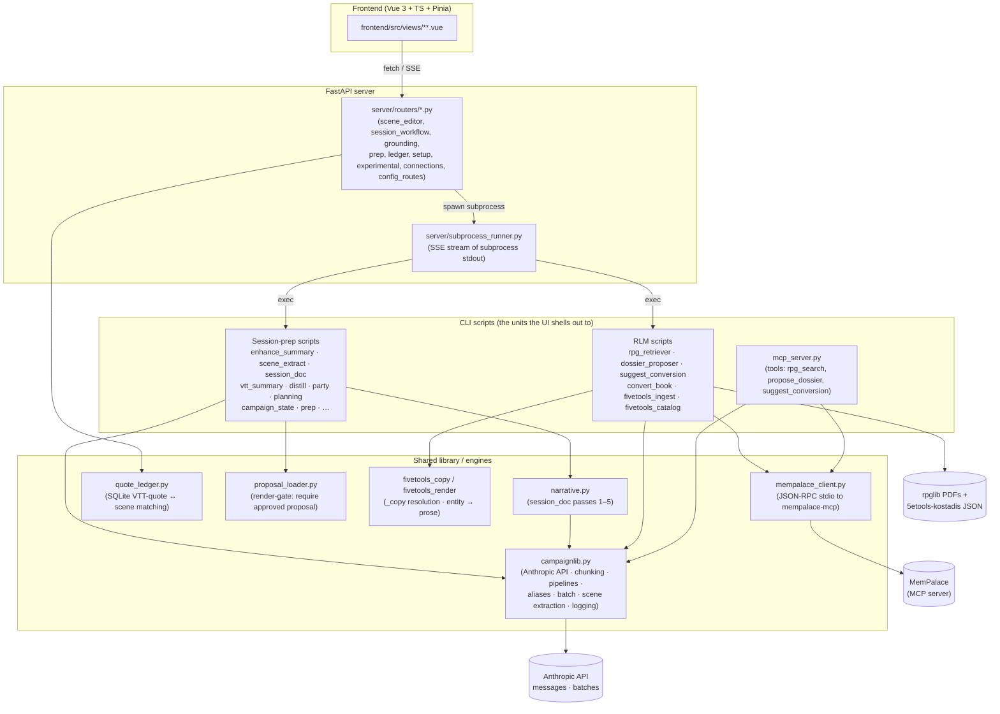
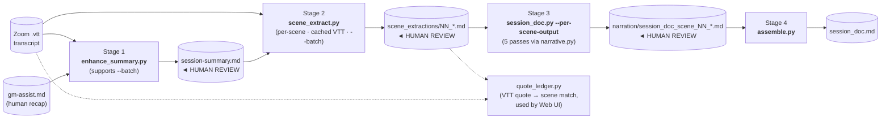
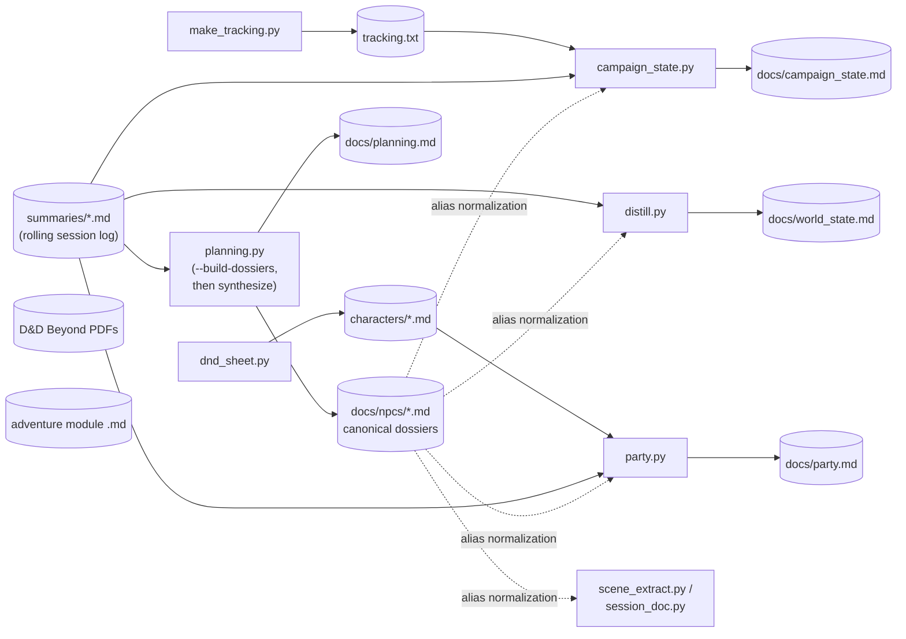
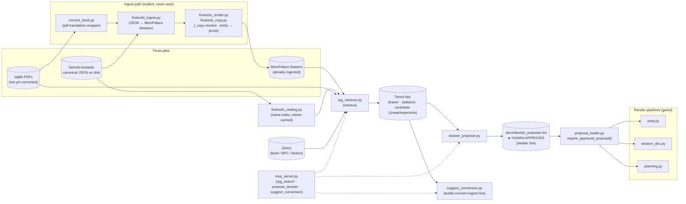

# Architecture map

A fast-orientation document for humans and Claude. **Goal: get to the right
file in seconds, not perfectly describe what it does.** When in doubt,
follow a link and read the module docstring at the top of the file —
almost every file has one.

This is the *map*. [`CLAUDE.md`](CLAUDE.md) is the *manual* (rules,
conventions, critical do/don't). The `docs/*.md` files are the *deep
dives* — read them only when you need precision. Don't duplicate them
here.

---

## What this repo is

Two pipelines, one CLI/UI surface:

1. **Session prep & narration** — turn raw artefacts (Zoom VTTs, GM recap
   notes, character PDFs, adventure modules) into structured grounding
   docs and per-session narrative writeups. Human review checkpoints
   between every LLM stage.

2. **RLM retrieval** — Retrieval-Library-MemPalace. A query (a beat, a
   character, a faction) returns a tiered hit list across already-ingested
   MemPalace drawers, on-disk 5etools JSON, and rpglib PDFs. Output is a
   *proposal* file that a human approves before render pipelines (prep,
   session_doc, planning) will consume it.

Two ways to drive both: a **CLI** (every script is standalone) or a **Web
UI** (FastAPI subprocess-runs the CLI scripts and streams stdout over
SSE). The CLI is the source of truth.

---

## Layered architecture



**Key invariant:** prompts live in the CLI scripts (next to their argparse
help). Orchestration lives in `campaignlib.py`. **Never import `anthropic`
directly** from a script — go through `make_client()` / `stream_api()` /
`call_api()` / `submit_batch()` so retries and prompt caching behave
consistently. Never import `mempalace-mcp` directly — use
[`mempalace_client.py`](mempalace_client.py).

---

## Data-flow 1: post-session pipeline

The four-stage flow that turns raw recordings into a finished session
narrative document. **Every arrow that crosses a HUMAN REVIEW box is a
gating checkpoint** — that's where the LLM has done its rendering pass and
a human imposes structure before the next call (see global "LLM pipeline"
rule in `~/.claude/CLAUDE.md`).



Side-pipelines that build the grounding docs the above and `prep.py`
consume (run periodically, not per-session):



Detail: [`docs/session_doc_pipeline.md`](docs/session_doc_pipeline.md),
[`docs/session_prep_workflow.md`](docs/session_prep_workflow.md),
[`docs/dossier_aliases.md`](docs/dossier_aliases.md).

---

## Data-flow 2: RLM retrieval (rpglib + 5etools + MemPalace)

Three-state retrieval feeds a human-approved proposal file; render
pipelines refuse to run without it.



Detail: [`docs/rlm_pipeline.md`](docs/rlm_pipeline.md),
[`docs/rlm_architecture.md`](docs/rlm_architecture.md),
[`docs/retrieval_architecture.md`](docs/retrieval_architecture.md).

---

## Where things live

### Top-level CLI scripts — session prep

| File | Role |
|---|---|
| [`prep.py`](prep.py) | Pre-session encounter design (single beat or full arc) |
| [`enhance_summary.py`](enhance_summary.py) | Stage 1: enrich gm-assist with VTT detail (`--batch`) |
| [`scene_extract.py`](scene_extract.py) | Stage 2: per-scene verbatim quote extraction (`--batch`) |
| [`session_doc.py`](session_doc.py) | Stage 3: per-scene first-person narration (5-pass) |
| [`narrative.py`](narrative.py) | Pass implementations called by `session_doc.py` |
| [`assemble.py`](assemble.py) | Stage 4: concat per-scene narration |
| [`vtt_summary.py`](vtt_summary.py) | Convert raw VTT → structured session summary (alt to Stages 1–2) |
| [`distill.py`](distill.py) | Session summaries → `world_state.md` |
| [`campaign_state.py`](campaign_state.py) | Session summaries → "what's been completed" doc |
| [`party.py`](party.py) | Character sheets + summaries → `party.md` |
| [`planning.py`](planning.py) | NPC dossiers + arc scores → `planning.md`; `--build-dossiers` |
| [`make_tracking.py`](make_tracking.py) | Adventure module → tracking checklist |
| [`dnd_sheet.py`](dnd_sheet.py) | D&D Beyond PDF → markdown via Claude vision |
| [`npc_table.py`](npc_table.py) | NPC reference table from grounding docs |
| [`query.py`](query.py) | Ad-hoc search across session summaries |
| [`quote_ledger.py`](quote_ledger.py) | SQLite VTT quote ↔ scene matching |
| [`new_workspace.py`](new_workspace.py) | Bootstrap a campaign workspace |
| [`transform.py`](transform.py) | NotebookLLM dossier → prep input |
| [`split_chapters.py`](split_chapters.py) | Split markdown by chapter heading |
| [`enhance_recap.py`](enhance_recap.py) · [`polish.py`](polish.py) · [`scabard_sync.py`](scabard_sync.py) | Experimental / external sync |

### Top-level CLI scripts — RLM

| File | Role |
|---|---|
| [`rpg_retriever.py`](rpg_retriever.py) | Tiered retrieval over MemPalace + 5etools + rpglib |
| [`fivetools_catalog.py`](fivetools_catalog.py) | Mtime-cached name index over 5etools JSON tree |
| [`fivetools_ingest.py`](fivetools_ingest.py) | 5etools JSON → MemPalace drawers (explicit step) |
| [`fivetools_copy.py`](fivetools_copy.py) | Python port of 5etools `copyApplier` (resolves `_copy`) |
| [`fivetools_render.py`](fivetools_render.py) | Render 5etools entities → searchable plaintext |
| [`convert_book.py`](convert_book.py) | Wrapper around pdf-translators' `pdf_to_5etools_v2` |
| [`dossier_proposer.py`](dossier_proposer.py) | Slot retrieval hits → `docs/dossier_proposal.md` |
| [`suggest_conversion.py`](suggest_conversion.py) | Build convert+ingest hint for pointer hits |
| [`proposal_loader.py`](proposal_loader.py) | Render-pipeline gate; `require_approved_proposal` |
| [`mempalace_client.py`](mempalace_client.py) | JSON-RPC stdio client for `mempalace-mcp` |
| [`mcp_server.py`](mcp_server.py) | MCP tools: `rpg_search`, `propose_dossier`, `suggest_conversion` |

### `campaignlib.py` (sectioned engine)

| Section | What's in it | Key entry points |
|---|---|---|
| Text cleaning + chunking | strip base64, paragraph-boundary chunking | `chunk_text`, `prepare_chunks` |
| Extract / synthesize pipeline | canonical chunk → extract → synthesize used by distill / campaign_state / party / planning / vtt_summary | `run_extract_pipeline`, `run_synthesize_pipeline` |
| Scene-anchored extraction | shared by Stage 2 live + batch + session_doc | `parse_gmassist_scenes`, `run_scene_extraction`, `format_scene_output`, `build_scene_extraction_system_prompt`, `plan_scene_extraction` |
| NPC alias machinery | dossier frontmatter → canonical-name rewriting | `parse_dossier`, `load_alias_map`, `build_alias_normalizer`, `format_npc_roster` |
| Config / file I/O | `config.yaml` discovery, doc assembly | `find_default_config`, `load_config`, `assemble_docs`, `load_file` |
| API | retry-aware Anthropic wrappers (use these, never `anthropic`) | `make_client`, `stream_api`, `call_api`, `call_api_with_tools` |
| Batch API | Message Batches: 50% off, 24 h SLA | `build_batch_request`, `submit_batch`, `poll_batch`, `collect_batch`, `write_batch_sidecar`, `read_batch_sidecar`, `format_batch_progress` |
| Misc | clipboard, timestamped log writer | `copy_to_clipboard`, `save_log` |

When a `# ── ... ──` section header in [`campaignlib.py`](campaignlib.py)
matches what you need, you almost certainly want to *use* what's there
rather than reimplement it.

### Web UI

```
server/
  main.py              ← FastAPI app, CORS, static, init_*_config()
  config.py            ← ui_config.yaml load/save + path derivation
  subprocess_runner.py ← async subprocess + SSE event stream of stdout
  routers/
    config_routes.py   ← /api/config — load/save, models, status
    session_workflow.py← /api/workflow — VTT summary, scene extraction wizard
    scene_editor.py    ← /api/editor — Stage 1/2/3/4; per-scene editor + diff view
    ledger.py          ← /api/ledger — quote sync + scene assignment
    grounding.py       ← /api/grounding — campaign_state, distill, party, planning
    prep.py            ← /api/prep — session_prep, npc_table, query
    setup.py           ← /api/setup — dnd_sheet, make_tracking
    experimental.py    ← /api/experimental — enhance_recap, narrative, polish
    connections.py     ← /api/connections — entity/relationship graph

frontend/src/
  views/               ← page-level (one per section)
    session/           ← SessionConfig · SessionDocEditor (the big one)
    grounding/         ← CampaignState · WorldState · PartyDocument · …
    prep/              ← SessionPrep · NpcTable · QuerySummaries · ConnectionGraph
    setup/             ← DndSheet · MakeTracking
    experimental/      ← EnhanceRecap · SessionNarrative
    Settings.vue       ← raw ui_config.yaml editor
  components/          ← shared widgets + scene-editor sub-panels
  api/                 ← apiFetch, apiPost, apiPut + connectSSE helper
  stores/config.ts     ← Pinia store mirroring ui_config.yaml
  utils/paths.ts       ← resolvePath / resolvePathList against session_dir
```

Router pattern (uniform): an endpoint either returns JSON
(`apiFetch`/`apiPut`) or builds a CLI command and pipes its stdout through
`StreamingResponse(stream_subprocess(cmd))`. Canonical example:
[`server/routers/scene_editor.py`](server/routers/scene_editor.py) —
`_build_enhance_cmd` + `api_enhance`.

Detail: [`docs/web_ui.md`](docs/web_ui.md),
[`docs/web_ui_config_persistence.md`](docs/web_ui_config_persistence.md).

### Tests

[`tests/`](tests/) — pytest. One file per top-level concern. Most tests
mock `campaignlib.stream_api` rather than hitting the API. Cleanest
end-to-end mocking examples:
[`tests/test_batch_api.py`](tests/test_batch_api.py) for batches,
[`tests/test_rpg_retriever.py`](tests/test_rpg_retriever.py) and
[`tests/test_fivetools_ingest.py`](tests/test_fivetools_ingest.py) for RLM.
RLM gate-2 benchmarks live in [`tests/benchmarks/`](tests/benchmarks/).

---

## Common task → start here

| If you want to… | Open this first |
|---|---|
| Add a new CLI tool | [`campaignlib.py`](campaignlib.py) intro + a small existing script like [`npc_table.py`](npc_table.py) |
| Change Stage 1/2 prompts | `ENHANCE_SYSTEM_PREFIX` in [`enhance_summary.py`](enhance_summary.py); `SCENE_EXTRACT_SYSTEM_PREFIX` in [`scene_extract.py`](scene_extract.py) |
| Add `--batch` to another script | Copy the pattern from [`enhance_summary.py`](enhance_summary.py) (`_submit`, `_collect_and_write`, sidecar). Helpers already exist in [`campaignlib.py`](campaignlib.py). |
| Touch retry / cache wiring | [`campaignlib.py`](campaignlib.py) `# ── API ──` and `# ── Batch API ──` sections (`_is_retryable`, `stream_api`, `build_batch_request`) |
| Add a new Web UI page | A small existing view like [`frontend/src/views/setup/MakeTracking.vue`](frontend/src/views/setup/MakeTracking.vue) and its router [`server/routers/setup.py`](server/routers/setup.py) |
| Stream a long-running script to the UI | [`server/subprocess_runner.py`](server/subprocess_runner.py) + a `StreamingResponse` endpoint in [`server/routers/scene_editor.py`](server/routers/scene_editor.py) |
| Persist a new UI setting | [`frontend/src/stores/config.ts`](frontend/src/stores/config.ts); use a `sd_*` / `prep_*` / etc. prefix listed in CLAUDE.md |
| Change scene-extraction file format | [`campaignlib.py:format_scene_output`](campaignlib.py) (live + batch share it) and [`session_doc.py:load_scene_extractions`](session_doc.py) |
| Resolve NPC name variants | [`campaignlib.py`](campaignlib.py) NPC alias section + [`docs/dossier_aliases.md`](docs/dossier_aliases.md) |
| Understand the 5-pass narration | [`session_doc.py`](session_doc.py) docstring + [`narrative.py`](narrative.py) |
| Match VTT quotes to scenes | [`quote_ledger.py`](quote_ledger.py) + [`server/routers/ledger.py`](server/routers/ledger.py) |
| Add an MCP tool | [`mcp_server.py`](mcp_server.py); for MemPalace I/O use [`mempalace_client.py`](mempalace_client.py) only |
| Change retrieval ranking / tiering | [`rpg_retriever.py`](rpg_retriever.py) (`retrieve`); name-index changes in [`fivetools_catalog.py`](fivetools_catalog.py) |
| Touch the proposal-gate | [`proposal_loader.py`](proposal_loader.py) — `require_approved_proposal` is the choke point |
| Render a 5etools entity to prose | [`fivetools_render.py`](fivetools_render.py) (`render_<type>` family); resolve `_copy` first via [`fivetools_copy.py`](fivetools_copy.py) |
| Convert a new RPG PDF | [`convert_book.py`](convert_book.py) (wraps pdf-translators); then [`fivetools_ingest.py`](fivetools_ingest.py) — keep the steps explicit |

---

## Recurring concepts (read once, recognize forever)

- **Two-pass extract → synthesize**: nearly every grounding-doc generator
  (distill, campaign_state, party, planning, vtt_summary) chunks the
  input, asks the LLM to extract per chunk, then synthesizes one document
  from the pile of extractions. Re-runs reuse cached extractions on disk.
  Implementation: `run_extract_pipeline` + `run_synthesize_pipeline` in
  [`campaignlib.py`](campaignlib.py).

- **Scene-anchored extraction**: Stage 2 caches the full VTT in the system
  prompt and asks for one scene's quotes per call. Live (`run_scene_extraction`)
  and batch (`scene_extract.py:_submit_pending`) paths share the cache
  breakpoint so the prompt cache stays warm.

- **Alias normalization**: a single source of truth — frontmatter in
  `docs/npcs/*.md` — feeds an `{canonical: [aliases]}` map into every
  extractor that crosses pipelines. Variants get rewritten *before the LLM
  sees them*; a "Known NPCs" roster is appended to the system prompt.
  Empty map = identity / no-op.

- **Batch mode (`--batch`)**: `enhance_summary.py` and `scene_extract.py`
  submit via Anthropic Message Batches API for 50% off, prompt caching
  honoured. Three sub-modes: block-and-poll (default), `--submit-only`
  (sidecar, exit), `--collect` (read sidecar, retrieve). Sidecars live
  next to the output: `<output>.batch.json` or `<output-dir>/.batch.json`.

- **Three-state RLM retrieval**: every hit is a *drawer* (already
  ingested), a *statblock* (already ingested), or a *candidate* — and
  candidates are tagged `cost="cheap"` (5etools JSON on disk, ready for
  `fivetools_ingest.py`) or `cost="expensive"` (rpglib PDF needing
  `convert_book.py` first). The retriever never fetches; it suggests.

- **Proposal-gate**: render pipelines (`prep.py`, `session_doc.py`,
  `planning.py`) refuse to use retrieval results unless a human has
  flipped the status line in `docs/dossier_proposal.md` to "approved".
  Enforced in [`proposal_loader.py`](proposal_loader.py); the rule is
  documented in [`docs/rlm_pipeline.md`](docs/rlm_pipeline.md).

- **Human-in-the-loop checkpoints**: see global `~/.claude/CLAUDE.md`
  ("LLMs render, humans decide"). Any stage that does scope/structure
  decisions emits a reviewable artefact before feeding the next LLM call.
  Both pipelines above are designed around this rule.

- **CLI ↔ UI symmetry**: the FastAPI server never reimplements logic — it
  shells out to CLI scripts. Fixing a bug in a script fixes it in the UI;
  exposing a CLI flag means adding it to the corresponding `_build_*_cmd()`
  in the router.

- **MCP boundary**: anything that touches MemPalace goes through
  [`mempalace_client.py`](mempalace_client.py). Anything that exposes
  CampaignGenerator capability *outward* to other Claude sessions goes
  through [`mcp_server.py`](mcp_server.py). One file, one direction each.
