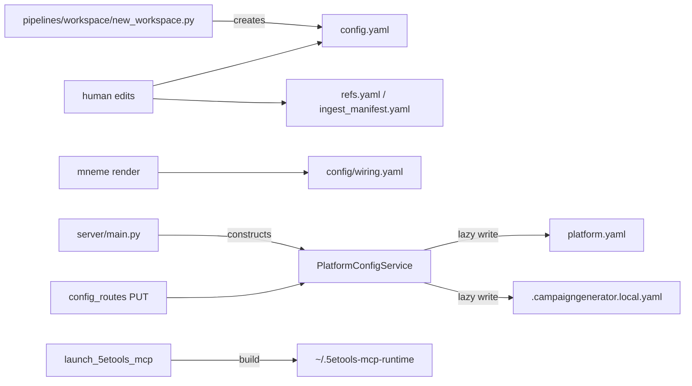

# CampaignGenerator Configuration — Create / Read / Update Map

Every config surface reachable from CampaignGenerator, with the exact code paths that create,
read, and update it. Read from source across `server/`, `campaignlib/`, `pipelines/rlm/resolve_refs.py`,
`pipelines/rlm/apply_ingest_manifest.py`, `pipelines/rlm/launch_5etools_mcp.py`, and `pipelines/workspace/new_workspace.py`.

## Per-config CRUD

| Config | What it is | Created by | Read by | Updated by |
|---|---|---|---|---|
| `config.yaml` | tracked, human-only internal config | `pipelines/workspace/new_workspace.py` (CONFIG_TEMPLATE); else hand | `campaignlib.load_config`; `PlatformConfigService._load_tracked` (required, `ConfigError` if missing); `pipelines/session_prep/prep.py`, `pipelines/rlm/mcp_server.py`, `session_doc/check_consistency.py`, `pipelines/rlm/apply_ingest_manifest.py`, `assemble_docs` | NONE by app — human edits only |
| `platform.yaml` | tracked, `PlatformDocument` (strict), owned outright by `PlatformConfigService` | Lazily on first `update_runtime` | `_load_platform_doc` (missing → all-defaults `PlatformDocument()`; malformed → `ConfigError`, unlike the local file below); loaded during `__init__`; the "must load before `UIStateService`" ordering constraint went with that class | `update_runtime` (PUT `/runtime`). Atomic, write-lock serialized |
| ~~`ui_state.yaml`~~ | **retired** ([ui-state-retirement.md](./ui-state-retirement.md)) | nothing creates it | **nothing in the server reads it.** The four `server/migrate_*.py` CLIs read it RAW — that is the whole remaining relationship | nothing writes it. `UIStateService`, `UIState` and `PUT /section/{name}` are deleted |
| `grounding.yaml` | tracked, `GroundingConfig` (strict), owned outright by `GroundingConfigService` | Lazily on first `PUT /api/grounding/config` | `load_grounding_config` (missing or empty → all-defaults; malformed YAML → 400); every `/api/grounding/run/*` route via `resolved()` | `update_config` (PUT `/api/grounding/config`). Atomic |
| `ensemble.yaml` | tracked, `EnsembleConfig` (strict), owned outright by `EnsembleConfigService` | Lazily on first `PUT /api/ensemble/config` | `load_ensemble_config` (missing or empty → all-defaults `EnsembleConfig()`; malformed YAML → 400, never a crash); every `/api/ensemble/*` route via `resolved()` | `update_config` (PUT `/api/ensemble/config`). Atomic (`campaignlib.util.atomic_write_text`) |
| `projections.yaml` | tracked, `ProjectionConfig` (strict), owned outright by `ProjectionConfigService`, modelled in `campaignlib/projection_config.py` (not `server/` — the CLI engines need the same shape, and `test_layering.py` forbids them importing `server`) | Lazily on first `PUT /api/projections/config` | `load_projection_config` (missing or empty → all-defaults `ProjectionConfig()`; malformed YAML → `ValueError`, surfaced as 400 by the route); the three State Projection CLIs (`event_spine`/`thread_registry`/`grounding_sections`) plus `build_recent_events` each load it once at the top of `main()`; every `/api/projections/*` route via `resolved()` | `update_config` (PUT `/api/projections/config`). Atomic (`campaignlib.util.atomic_write_text`). See [projection-isolation.md](./projection-isolation.md) |
| `.campaigngenerator.local.yaml` | gitignored `PlatformLocalConfig` (strict), owned by `PlatformConfigService` | Lazily on first `update_local` | `load_local_config` (bad → default, warns, non-fatal) | `update_local` (PUT `/local`) |
| `config/wiring.yaml` | external, mneme-rendered | mneme (do-not-edit, hash-stamped) | `campaignlib.wiring.*` (lru-cached); resolve_refs; launch_5etools_mcp | mneme only. Does **not** yet supply the model registry — `server/config.py::MODELS` stays a hardcoded list until Phase 5b ([issue #177](https://github.com/kostadis/CampaignGenerator/issues/177)) |
| `refs.yaml` | tracked per-campaign content refs | human | `resolve_refs.load_refs`/`resolve`; fivetools_ingest, fivetools_catalog, launch | human |
| `refs.local.yaml` | gitignored per-machine root mappings | `launch_5etools_mcp --init-local` (non-destructive); else human | `resolve_refs.load_local`/`resolve_roots` | human |
| `ingest_manifest.yaml` | per-campaign ingest curation | human | `apply_ingest_manifest.load_manifest`/`resolve_palace`/`check_status` | human (replay writes no config; spawns `pipelines/content_ingest/fivetools_ingest.py`) |
| `~/.5etools-mcp-runtime/<slug>/` + `.sources.sha256` | generated 5etools symlink farm + rebuild hash | `launch_5etools_mcp.build_runtime_tree` + `_write_sidecar` | 5etools MCP server via `DATA_DIRS`; `_is_up_to_date` | rebuilt when `sha256(refs+refs.local)` changes |
| fivetools_ingest sidecars | per-(source,palace,filter) idempotence state | `fivetools_ingest` on ingest | `apply_ingest_manifest.check_status` | rewritten on re-ingest |
| `boot_overrides` (in-memory) | CLI flags to `server.main` | `_boot_overrides_from_args(args)` at boot | `resolved()` (win over persisted for process life) | never persisted. Phase 0 (O1) deleted the twelve dead `session_doc.*` flags this table used to route into a phantom key — only `--campaign-dir`/`--session-dir`/`--config-dir`/`--host`/`--port` remain, and `test_main_boot_overrides.py` now asserts each reaches a real consumer, not just that a mapping dict is produced |

## HTTP surface (`config_routes.py`)

All routes reach `app.state.platform` (a `PlatformConfigService`) via the shared
`require_platform(request)` accessor — the one implementation that replaced three independent
"getattr app.state.platform, 503 if missing" copies in Phase 4.

| Endpoint | Handler → service | Effect |
|---|---|---|
| `GET /api/config/` | `get_config` | `platform.resolved()` (`{campaign_dir, runtime, server, nav}`) + tracked + local + paths. `ui_state_path` and `schema_version` left this body with the document they described |
| ~~`PUT /api/config/section/{name}`~~ | — | **deleted.** The generic `ui.<section>` write door had no client; every service writes its own document through its own typed route |
| `GET`/`PUT /api/grounding/config` | `get_grounding_config`/`put_grounding_config` → `GroundingConfigService` | reads/writes `<config>/grounding.yaml`; PUT body is the grouped partial itself (no `{"values": …}` envelope), 400 on an unknown key |
| `GET`/`PUT /api/ensemble/config` | `get_ensemble_config`/`put_ensemble_config` → `EnsembleConfigService` | reads/writes `<config>/ensemble.yaml`; PUT body is the grouped partial itself (no `{"values": …}` envelope), 400 on an unknown key |
| `GET`/`PUT /api/projections/config` | `get_projection_config`/`put_projection_config` → `ProjectionConfigService` | reads/writes `<config>/projections.yaml`; PUT body is the grouped partial itself, 400 on an unknown key or an `output.draft` missing `{doc}` |
| `GET /api/projections/sections?doc=` | `get_sections` → shells to `grounding_sections list --doc <doc> --json` | read-only staleness table, one row per section, with the FR-024a `provenance` column; no route writes it |
| `GET /api/projections/run/build` | `run_build` → `grounding_sections build` (SSE) | `sections` is required and rejected when empty — `400`, never "all" (Constitution X) |
| `GET /api/projections/run/recent-events` | `run_recent_events` → `build_recent_events` (SSE) | **moved from `/api/ensemble/run/recent-events`** — [projection-isolation.md](./projection-isolation.md) research D15 |
| `GET`/`PUT`/`DELETE /api/projections/selection` | `ProjectionConfigService.get_selection`/`set_selection` | this service's own model/backend override (feature 003); `DELETE` clears it back to platform inheritance |
| `PUT /api/config/runtime` | `put_config_runtime` → `platform.update_runtime` | writes `platform.yaml` `runtime` (Phase 3, O3 moved it out of the old shared document, which no longer exists) |
| `PUT /api/config/local` | `put_config_local` → `platform.update_local` | writes `.campaigngenerator.local.yaml` |
| `GET campaign-paths` | `get_campaign_paths` → `PlatformConfigService.discover_campaign_paths` (`@staticmethod`) | read-only filesystem **discovery** only (gm-assist/recap sniff, summaries sniff, `docs/npcs/*.md` glob, `docs/*.md` exist-checks; the VTT glob went with the retired VTT Summary page) — narrowed in Phase 4 (O2); the old **derivation** half (`output_dir`, `DERIVED_SUBDIRS`) was deleted, not migrated, because it duplicated `_PATH_FIELDS` and had already drifted |
| `GET session-paths` | — | **deleted** in Phase 4 — a one-line wrapper with no caller |
| `GET path-status` | `get_path_status` → `path_exists` | read-only existence check |
| `GET/POST/PUT/DELETE /api/party/characters[/{name}]` | party_routes | isolated `party.yaml` CRUD. Replaced `GET/PUT /api/config/party-yaml`, which took the target file as a browser-supplied `path` parameter and re-implemented the 3-state `arc_score` encoding in raw YAML |
| `GET/POST/PUT/DELETE /api/planning/{npcs,factions}[/{name}]` | planning_routes | isolated `planning.yaml` CRUD (see planning-isolation doc) |
| `GET models` | `get_models` → `server.config.MODELS` / `DEFAULT_MODEL` | read-only; refreshed in Phase 5a to the current model family (still a hardcoded list — Phase 5b, deferred, would source it from wiring) |
| `GET status` | `get_status` | read-only |

## Invariants enforced in code

- `config.yaml` read-only to the app; `PlatformConfigService._load_tracked` reads it, no writer exists; missing is fatal.
- `platform.yaml`/`local` created lazily; first update materializes them via atomic temp+`os.replace`.
- A boot override targeting a section with no consumer is a **`ConfigError` at construction**, not a
  silent drop — `resolved()`'s old catch-all `else` branch is where twelve dead `session_doc.*`
  flags hid (O1), and it went with the `ui` key it swept them into.
- Boot flags never persist — live only in `resolved()` for the process. Phase 0 (O1) deleted the
  twelve dead `session_doc.*` boot flags; the five that remain (`--campaign-dir`, `--session-dir`,
  `--config-dir`, `--host`, `--port`) all reach a real consumer.
- Each owning service relativizes its own path fields at write time, delegating to the platform's `relativize_path` rather than re-implementing it.
- Per-section last-writer-wins under `_write_lock`; readers never see a torn file. `PlatformConfigService`
  holds its own lock, guarding its own file(s).
- External vs internal: `wiring.yaml` (mneme) holds endpoints/roots; `config.yaml` (human) holds
  prompts/agents/docs. The model registry (`server/config.py::MODELS`) has NOT crossed that line
  yet — it's still internal/hardcoded pending Phase 5b.
- A `/run/*` request that omits `model`/`backend` resolves through `resolve_selection` —
  see [values.md § The model/backend resolution rule](./values.md#the-modelbackend-resolution-rule-feature-003--the-single-statement) — not a
  hardcoded per-router default — Phase 5a, closing the gap where the sidebar model picker was
  silently bypassed on fourteen endpoints.

## Boot path

`server/main.py::main` resolves campaign_dir (`--campaign-dir` / `--session-dir` / CWD
`config.yaml`), then constructs `PlatformConfigService(campaign_dir,
boot_overrides=_boot_overrides_from_args(args))`. Init validates the boot-override keys, then
loads tracked (required), `platform.yaml` (default if absent, `ConfigError` if malformed —
load-bearing, since `runtime.session_dir` must be correct before anything else resolves a
session-scoped path), and local (bad → warns, non-fatal). A malformed `config.yaml` or
`platform.yaml` is fatal; a bad local file only warns.

There is no fourth step. `self.uis = UIStateService(self)` used to be the last one, and its
`_normalize_stored_paths` pass is why `platform.yaml` had to be loaded first — see
[ui-state-retirement.md](./ui-state-retirement.md).
