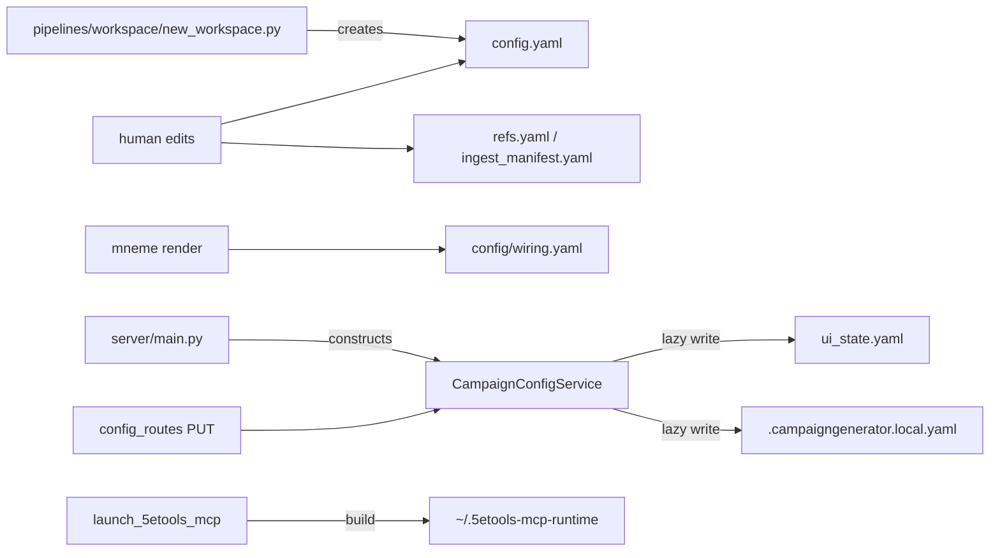

# CampaignGenerator Configuration — Create / Read / Update Map

Every config surface reachable from CampaignGenerator, with the exact code paths that create,
read, and update it. Read from source across `server/`, `campaignlib/`, `pipelines/rlm/resolve_refs.py`,
`pipelines/rlm/apply_ingest_manifest.py`, `pipelines/rlm/launch_5etools_mcp.py`, and `pipelines/workspace/new_workspace.py`.

## Per-config CRUD

| Config | What it is | Created by | Read by | Updated by |
|---|---|---|---|---|
| `config.yaml` | tracked, human-only internal config | `pipelines/workspace/new_workspace.py` (CONFIG_TEMPLATE); else hand | `campaignlib.load_config`; `CampaignConfigService._load_tracked` (required, `ConfigError` if missing); `pipelines/session_prep/prep.py`, `pipelines/rlm/mcp_server.py`, `session_doc/check_consistency.py`, `pipelines/rlm/apply_ingest_manifest.py`, `assemble_docs` | NONE by app — human edits only |
| `ui_state.yaml` | tracked, server-owned `UIState` v2 | Lazily on first `_persist_ui_state` (`_atomic_write`); boot `_normalize_stored_paths` may write | `_load_ui_state` (missing → `UIState()`); routers via `service.ui_state` / `resolved()` | `update_section` (PUT `/section/{name}`), `update_runtime` (PUT `/runtime`), boot self-heal. Atomic, write-lock serialized |
| `.campaigngenerator.local.yaml` | gitignored `LocalConfig` | Lazily on first `update_local` | `_load_local` (bad → default, warns, non-fatal) | `update_local` (PUT `/local`) |
| `config/wiring.yaml` | external, mneme-rendered | mneme (do-not-edit, hash-stamped) | `campaignlib.wiring.*` (lru-cached); resolve_refs; launch_5etools_mcp | mneme only |
| `refs.yaml` | tracked per-campaign content refs | human | `resolve_refs.load_refs`/`resolve`; fivetools_ingest, fivetools_catalog, launch | human |
| `refs.local.yaml` | gitignored per-machine root mappings | `launch_5etools_mcp --init-local` (non-destructive); else human | `resolve_refs.load_local`/`resolve_roots` | human |
| `ingest_manifest.yaml` | per-campaign ingest curation | human | `apply_ingest_manifest.load_manifest`/`resolve_palace`/`check_status` | human (replay writes no config; spawns `pipelines/content_ingest/fivetools_ingest.py`) |
| `~/.5etools-mcp-runtime/<slug>/` + `.sources.sha256` | generated 5etools symlink farm + rebuild hash | `launch_5etools_mcp.build_runtime_tree` + `_write_sidecar` | 5etools MCP server via `DATA_DIRS`; `_is_up_to_date` | rebuilt when `sha256(refs+refs.local)` changes |
| fivetools_ingest sidecars | per-(source,palace,filter) idempotence state | `fivetools_ingest` on ingest | `apply_ingest_manifest.check_status` | rewritten on re-ingest |
| `boot_overrides` (in-memory) | CLI flags to `server.main` | `_boot_overrides_from_args(args)` at boot | `resolved()` (win over persisted for process life) | never persisted |

## HTTP surface (`config_routes.py`)

| Endpoint | Handler → service | Effect |
|---|---|---|
| `GET /api/config/` | `get_config` | resolved view + flat legacy overlay + tracked + local + paths |
| `PUT /api/config/section/{name}` | `put_config_section` → `update_section` | writes `ui_state.yaml` `ui.<name>` |
| `PUT /api/config/runtime` | `put_config_runtime` → `update_runtime` | writes `ui_state.yaml` `runtime` |
| `PUT /api/config/local` | `put_config_local` → `update_local` | writes `.campaigngenerator.local.yaml` |
| `GET campaign-paths / session-paths / path-status` | `derive_*` + `path_exists` | read-only derivations |
| `GET/PUT party-yaml` | config_routes | read/write `party.yaml` (see subsystems doc) |
| `GET/POST/PUT/DELETE /api/planning/{npcs,factions}[/{name}]` | planning_routes | isolated `planning.yaml` CRUD (see planning-isolation doc) |
| `GET models / status` | `get_models` / `get_status` | read-only |

## Invariants enforced in code

- `config.yaml` read-only to the app; `_load_tracked` reads it, no writer exists; missing is fatal.
- `ui_state`/`local` created lazily; first update materializes them via atomic temp+`os.replace`.
- Boot flags never persist — live only in `resolved()` for the process (`main.py` marks the old persist path as a fixed bug).
- Write-time relativization (`update_section`) + load-time `_normalize_stored_paths` heal legacy absolute values.
- Per-section last-writer-wins under `_write_lock`; readers never see a torn file.
- External vs internal: `wiring.yaml` (mneme) holds endpoints/roots; `config.yaml` (human) holds prompts/agents/docs.

## Boot path

`server/main.py::main` resolves campaign_dir (`--campaign-dir` / `--session-dir` / CWD `config.yaml`),
then constructs `CampaignConfigService(campaign_dir, boot_overrides=_boot_overrides_from_args(args))`.
Init loads tracked (required), ui_state (default if absent), runs `_normalize_stored_paths`, loads
local. A malformed `config.yaml` or `ui_state.yaml` is fatal; a bad local file only warns.
