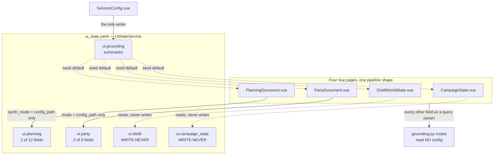

# Grounding Configuration Isolation Design

> **Status: ✅ Done (2026-07-24).** All eleven phases shipped on
> `worktree-config-isolation`. Verified against a pristine baseline worktree at `7a58c99`:
> 6 failed / 5 errors before, 6 failed / 5 errors after, same IDs (missing `dgxlib`, a live
> mempalace test, two env-dependent `resolve_roots` tests) — **zero regressions**, +96 tests.
> `vue-tsc` and `vite build` clean. See [Implementation notes](#implementation-notes-as-shipped)
> for what the work turned up that the plan didn't predict.
>
> This is the fourth
> service-isolation effort, after [session-editor-isolation.md](./session-editor-isolation.md),
> [planning-isolation.md](./planning-isolation.md) and
> [ensemble-isolation.md](./ensemble-isolation.md), and it closes the three services
> [service-cut.md](./service-cut.md) names as open: **Grounding/Search**, **Party's UI
> slice**, and **Campaign State**. Every "current state" claim below is code-verified
> against `main` at `7a58c99` with a file:line citation.
>
> The five open design questions were **decided by the GM on 2026-07-24** — see
> [Decisions](#decisions-settled-2026-07-24). D5 in particular widened the effort: it
> pulls path-base unification (issues [#145](https://github.com/kostadis/CampaignGenerator/issues/145)/[#146](https://github.com/kostadis/CampaignGenerator/issues/146), Option 3)
> into scope for `party.yaml` and `planning.yaml`.

## Overview

`service-cut.md:85` states the remaining work plainly: *"The remaining ~5 services
(Grounding/Search, Party's UI slice, Campaign State, the loose pages) still share one
`ui_state.yaml`."* This document proposes closing it — but **not** by running the
Planning isolation three more times.

`campaign_state`, `distill`, `party` and `planning` are not four services. They are one
pipeline — extract → human review → synthesize — run four times over four different
inputs, through one router (`server/routers/grounding.py`), with a near-identical
parameter block each time. Giving each its own service and its own file would produce
four copies of the same schema and four migration CLIs to maintain. The proposal is
therefore **two new owned documents, not three**:

| New document | Owner | Holds | Replaces |
|---|---|---|---|
| `<config>/grounding.yaml` | `GroundingConfigService` | the shared `summaries` pointer + a per-doc run profile for each of the four grounding docs | `ui.grounding`, `ui.campaign_state`, `ui.distill`, `ui.party`, `ui.planning` |
| `<config>/party.yaml` *(exists; gains an owner)* | `PartyConfigService` | the PC roster — name, sheet, backstory, dossier, 3-state `arc_score` | the two rival implementations described in Problem 3 |

The split between them follows the rule already established for Planning: the **domain
document** (`planning.yaml`, `party.yaml` — human-authored campaign content) is separate
from the **run configuration** (which paths this pipeline reads and writes). Two files is
not the defect. As the platform-rearchitecture decision of 2026-06-24 puts it: *the sin is
multiple authorities — places you can edit and be believed — not multiple physical files.*

## Current state (code-verified)



| Surface | Model | Reality |
|---|---|---|
| `ui.grounding` | `GroundingSection` (`config_models.py:75`) | one field, `summaries` |
| `ui.campaign_state` | `_LooseSection` | read at `CampaignState.vue:19-33`, **never written** |
| `ui.distill` | `_LooseSection` | read at `DistillWorldState.vue:16-28`, **never written** |
| `ui.party` | `_LooseSection` | 9 keys read (`PartyDocument.vue:35-50`), 2 written (`:61`) |
| `ui.planning` | `_LooseSection` | 12 keys read (`PlanningDocument.vue:38-60`), 2 written (`:75`) |
| `party.yaml` | *(none)* | two rival readers/writers — see Problem 3 |
| `grounding.py` routes | *(none)* | every default is a Python literal in a route signature |

## Problems

### 1. Campaign State and Distill persist nothing at all

`grep -rn updateSection frontend/src` returns exactly four writers: `planning` ×2, `party`,
`grounding`. There is no `updateSection('campaign_state', …)` and no
`updateSection('distill', …)` anywhere in the frontend.

Both pages read their section on mount (`CampaignState.vue:25`, `DistillWorldState.vue:23`)
and neither ever writes it. `ui.campaign_state` and `ui.distill` are **write-never
sections**: every value the GM types — input, output, tracking files, extract dir, split
prefix — is lost on reload, and the only way to populate them is to hand-edit
`ui_state.yaml`. The typed-section machinery is present, wired, and dead.

### 2. Party and Planning persist a token fraction of their state

`PartyDocument.vue:61` writes `mode` and `config_path`. Lines 35-50 read `chars`,
`summaries`, `backstory`, `arc_scores`, `context`, `output`, `extract_dir` and
`split_chapters` — **seven dead reads** against keys nothing writes. `PlanningDocument.vue`
is the same shape at larger scale: two written (`:75`), twelve read (`:38-60`), including
the entire `build_dossiers` sub-form (`build_summaries`, `dossier_dir`,
`build_extract_dir`, `build_split_chapters`).

This is what an unmodelled `extra="allow"` section buys: the read side and the write side
drift apart silently, because nothing validates that a key read is a key written.

### 3. `party.yaml` has two independent implementations

| | `server/party_config_shared.py:29` | `config_routes.py:140-234` |
|---|---|---|
| Validates shape | yes (`ValueError` on missing `name`/`sheet`) | partially (PUT only) |
| Resolves child paths vs the YAML's dir | yes | no |
| Requires referenced files to exist | yes | **no** |
| 3-state `arc_score` encode/decode | yes | **re-implemented from scratch** |
| Write is atomic | n/a (read-only) | **no** — bare `write_text` (`:232`) |
| Path source | caller-supplied, CLI-validated | **client-supplied query/body param** |

Two encoders of the same three-state invariant is a drift bug waiting for its first
divergent edit. And the consumers are already split across them: the CLI
(`pipelines/grounding/party.py:242`) and the ensemble PC-exclusion path
(`server/routers/ensemble.py:276`) both use the validating loader; the UI
(`PartyConfigEditor.vue:55,76`) writes exclusively through the non-validating one. A roster
saved in the UI can reference a file that does not exist, and the failure surfaces later as
a CLI crash mid-run.

Separately, both routes take the target file as a **parameter from the browser**
(`get_party_yaml(path: str)`, `PartyYamlSave.path`). Every isolated sibling derives its own
path from `platform.config_path_base` (`PlanningConfigService:22`,
`EnsembleConfigService:79`, `PlatformConfigService:195`). This one is an
arbitrary-path read/write endpoint with no owner. On a localhost single-user app that is
a low-severity finding, but it is the exact inverse of the ownership property this whole
effort exists to establish.

### 4. `ui.grounding`'s documented consumer does not exist

`values.md:52` claims `ui.grounding.summaries` is read by `pipelines/rlm/mcp_server.py`
(`_find_summaries_file`, `query_lore`, `grounded_search`).

It is not. `pipelines/rlm/mcp_server.py:531-542` probes three hardcoded paths
(`summaries.md`, `summaries/summaries.md`, `docs/summaries.md`) and never touches config.
More generally: **no file outside `server/` reads `ui_state.yaml`** — `grep -rln ui_state
--include=*.py` returns thirteen files, all under `server/`.

The real consumers are three Vue pages using it as a seed default. So "Grounding/Search" as
drawn in `service-cut.md` is not a service with configuration; it is one campaign-wide
input pointer filed in the service tier, plus a doc entry describing a call that was never
written.

### 5. The routes read no configuration at all

`grounding.py`'s five run endpoints take every value as a query parameter, with defaults as
Python literals in the signatures (`chunk_size: int = 60000` appears five times;
`split_chapters` defaults to `""` in Python and `'# Chapter'` in all four Vue pages). This
is the same defect Phase 3 of `ensemble-isolation.md` fixed for the ensemble router:
*"`paths` and `tuning` were Python literals in route signatures — unreachable without
editing code."* Until the routes read a config, any config we add is decorative.

### 6. `party.yaml` resolves to three different locations, in two different orders

Four code paths probe for `party.yaml`. They do not agree — not on the candidate set, and
not on the precedence:

| Probe site | Order |
|---|---|
| `campaignlib/party.py:44` (`load_pc_names`) | `docs/party.yaml` → `config/party.yaml` |
| `server/platform_config_service.py:535` (`discover_campaign_paths`) | `config/party.yaml` → `party.yaml` |
| `server/routers/ensemble.py:195` (`_default_party_config`) | `config/party.yaml` → `party.yaml` |
| `server/routers/ensemble.py:206` (`_default_planning_config`) | `config/planning.yaml` → `planning.yaml` |

`docs/party.yaml` appears in exactly one probe; the campaign root appears in the other
three; nothing checks all three locations. **This is live, not theoretical.** Current state
of `~/campaigns`:

| Campaign | `party.yaml` location | `load_pc_names` | UI + ensemble |
|---|---|---|---|
| out-of-the-abyss | `config/party.yaml` | ✓ found | ✓ found |
| Phandalin | `config/party.yaml` | ✓ found | ✓ found |
| **obelisk** | **`docs/party.yaml`** | **✓ found** | **✗ empty** |

In obelisk, the PC-filtering path sees a roster and the Party page and ensemble
PC-exclusion both see nothing. A campaign holding *both* `docs/party.yaml` and
`config/party.yaml` would have two subsystems reading two different files and neither
reporting a problem — multiple authorities in the precise sense the 2026-06-24
platform decision rules out.

Two more config files live outside `config/` entirely: `refs.yaml` and `refs.local.yaml`
resolve as `campaign_dir / REFS_FILENAME` (`resolve_refs.py:128,142`) and sit at the
campaign root in all three live campaigns; `ingest_manifest.yaml` likewise.

### 7. Layering inversion: the CLI engine imports the web server

`pipelines/grounding/party.py:76` and `pipelines/grounding/planning.py:84` both
`from server.… import …`. The architecture is "disk is truth, CLI is the engine, the server
is a thin router" (`subsystems.md:13`) — here the engine depends on the web app. Any
headless use of the pipelines drags in FastAPI's import graph, and the dependency arrow
points the wrong way for the two shared modules this effort touches most.

## Proposed solution

### Track 0 — one config location, no probes (GM directive, 2026-07-24)

> *"As the only user of this tool, I would like to have one place for config files, in
> `config`."*

Single-user, so there is no installed base to keep compatible and no reason to carry
fallback probes for legacy layouts. `<campaign>/config/` is **the** location; a config file
found anywhere else is a migration input, not a supported alternative.

**Delete all four probes** from Problem 6 and replace each with a declared path off
`platform.config_path_base`. `campaignlib.load_pc_names` takes the path from its caller
rather than sniffing; `discover_campaign_paths` stops reporting `party_config` as a
discovery result (it becomes a declared path, so it is not a probe's business);
`ensemble.py`'s two `_default_*_config` helpers go away entirely — `PartyConfigService`
and `PlanningConfigService` already know where their own documents live, which was the
point of isolating them.

**In scope for the move:** `party.yaml` (from `docs/` or the campaign root), `planning.yaml`
(from the campaign root), `refs.yaml`, `refs.local.yaml`, `ingest_manifest.yaml`. All become
`config/`-resident, all resolved by declaration.

**The line, stated once so it stops being re-litigated (D7):** `config/` holds *how a
pipeline runs*; `docs/` holds *what the pipelines operate on*. `party.yaml` is config —
it declares which sheets and dossiers feed the party doc. `docs/entity_registry.yaml` is
not — it is 900+ entities of campaign data, produced by importers and queried by an MCP
server, and it belongs beside `docs/npcs/` and the chapter bible. Being YAML is not the
test.

**Not moving:** `docs/entity_registry.yaml` (per the line above — it already has exactly
one location and one authority, so the directive's problem does not apply to it);
`.mcp.json` (Claude Code requires it at the workspace root), `.gitignore`,
`.mempalaceignore`, `.claude/`, `.mneme/` — tool-owned root files, not CampaignGenerator
config. `merge.yaml` stays a per-run ensemble artifact in its workdir.

**Orphaning is explicitly not a concern (GM directive, 2026-07-24).** With probes gone, a
config file left behind in an old location becomes invisible. No stray-file boot check is
built, and the phases are not ordered to protect against it — three campaigns, one user, a
`mv` fixes it. The only campaign affected is **obelisk** (`docs/party.yaml`); move it to
`config/party.yaml` by hand. This also removes what would otherwise be a real ordering
constraint between the file move and the probe deletion.

**`migrate_config.sh`** grows the new names in `CONFIG_NAMES` (`migrate_config.sh:39`,
currently `config.yaml`, `ui_state.yaml`, `.campaigngenerator.local.yaml`, `planning.yaml`)
and gains `docs/` as a search location for `party.yaml`, which today it does not look in at
all. Its existing recurse + version-on-collision logic handles the rest.

### Track A — `PartyConfigService` owns `party.yaml`

Party first: it is the smallest track, it has a shipped template to copy
(`PlanningConfigService`), and it performs the `campaignlib` lift that Track B also wants.

1. **Move the models and I/O into `campaignlib/party_config.py`** — `PartyCharacter`,
   `PartyConfig`, `load_party_config`, and a new `save_party_config` (atomic, via
   `campaignlib.util.atomic_write_text`). `server/party_config_shared.py` becomes a
   re-export shim or is deleted outright. This inverts the dependency in Problem 7:
   `server/` and `pipelines/` both import `campaignlib`, neither imports the other. Do the
   same for `planning_config_shared` in the same pass — it is the identical two-line fix
   and leaving it behind means the guard test can't be written as a blanket rule.
2. **Convert the dataclasses to strict pydantic** (`extra="forbid"`), matching
   `PlanningConfig`/`EnsembleConfig`/`SessionEditorConfig`. This is what lets one
   implementation serve both the validating CLI path and the API.
3. **Add `server/party_config_service.py`** — `PartyConfigService(platform)`, path
   `platform.config_path_base / "party.yaml"`, mirroring `PlanningConfigService` including
   its two hard-won bug fixes: an empty file reads back as an empty roster rather than 400,
   and the router carries no prefix of its own.
4. **Add `server/routers/party_routes.py`** — `GET/POST/PUT/DELETE
   /api/party/characters[/{name}]`, mounted by `main.py` with
   `prefix="/api/party"`. Same status-code contract as planning: 404 unknown, 409 duplicate
   name, 400 URL/body mismatch or malformed YAML.
5. **Delete `get_party_yaml`/`put_party_yaml`** from `config_routes.py:140-234` and rewire
   `PartyConfigEditor.vue` to the resource API. The `configPath` prop goes away — the
   service knows where the file lives.

**Validation policy (D4, settled).** The CLI loader hard-fails when a referenced
sheet/backstory/dossier/arc_score file is missing. The API does **not** adopt that rule
verbatim, or the GM could not save a roster naming a sheet they are about to write.

- **Save succeeds** on a shape-valid entry, and the `200` response carries per-character
  `missing_files: ["sheet"]`. The editor renders it as an amber marker on that row — the
  GM finds out at save time, not on the next reload.
- **Read** returns the same field, so the warning survives a reload.
- **The CLI stays strict** at run time, where a missing file actually breaks something.

This is the read-strict/write-lenient split `PlanningConfigService._load` already lives
with, made explicit and surfaced instead of silent. It is the only user-visible behavior
change in Track A.

### Track A′ — unify the path-resolution base (D5, settled)

`load_party_config` resolves every child path against **the config file's own parent
directory** (`party_config_shared.py:66`, `base = path.parent`); `load_planning_config`
does the same (`planning_config_shared.py:64`). So the meaning of `sheet:
docs/party/soma.md` changes when the file it sits in moves — which is exactly why
[#145](https://github.com/kostadis/CampaignGenerator/issues/145) and
[#146](https://github.com/kostadis/CampaignGenerator/issues/146) are open, and why
[#144](https://github.com/kostadis/CampaignGenerator/issues/144)'s move is unsafe today.

`grounding.yaml` will resolve against the **campaign root**, because that is where the CLI
engines already run (`cwd == campaign_dir` — see `EnsembleConfigService.get_config`'s
docstring and `server/subprocess_runner.py`). Shipping `party.yaml` config-parent-relative
next to `grounding.yaml` campaign-root-relative would introduce a new inconsistency in
adjacent files as a *side effect* of an effort whose whole point is single authority.

**Both loaders switch to campaign-root resolution**, taking an explicit `base` argument
rather than deriving it from `path.parent`. This is Option 3 in both issues, scoped to the
two documents this effort already touches — `config.yaml`'s `documents:` (#145's other half)
is out of scope and stays open.

**Ordering constraint: Track A′ lands _before_ #144's file move.** Moving `party.yaml` into
`config/` under the old convention breaks its paths; moving it after the base is
campaign-root makes the move path-neutral. Do it the other way round and the migration has
to rewrite paths it is about to stop caring about.

**Migration is existence-disambiguated, not assumed.** For each relative reference, try
campaign-root then config-parent and adopt whichever resolves to a file that exists. Report
— never silently pick — when both resolve or neither does. A campaign whose `party.yaml`
already sits in `config/` with hand-written `../docs/...` paths is the case that must not be
silently mangled.

Consequences to carry: `PlanningConfigEditor.vue:206,226` help text ("Path relative to
`planning.yaml`") becomes "relative to the campaign root", the same for the party editor,
and `planning_config_shared.py:56-57`'s docstring contract is rewritten rather than left
describing the old rule.

### Track B — `GroundingConfigService` owns `<config>/grounding.yaml`

One strict document for the whole grounding-run subsystem, replacing five loose sections.

```yaml
# <config>/grounding.yaml — GroundingConfig (strict, extra="forbid")
summaries: docs/summaries.md          # the shared canonical-timeline pointer

campaign_state:                       # GroundingRun + track fields
  input: ""                           # "" means: fall back to root `summaries`
  output: docs/campaign_state.md
  extract_dir: docs/state_extractions
  split_chapters: "# Chapter"
  chunk_size: 60000
  context: []
  no_log: false
  track_files: []                     # was track_file + track_files_extra
  track_items: []                     # was the inline `track` textarea

distill:                              # GroundingRun
  output: docs/world_state.md
  extract_dir: docs/distill_extractions
  # … same shape

party:                                # GroundingRun + mode
  mode: config                        # config | flat
  config_path: config/party.yaml      # → Track A's document
  output: docs/party.md
  extract_dir: docs/party_extractions
  characters: []                      # flat-mode only
  backstory: []                       # flat-mode only
  arc_scores: []                      # flat-mode only

planning:                             # GroundingRun + mode + dossier sub-run
  synth_mode: config
  config_path: config/planning.yaml   # → PlanningConfigService's document
  npc: []
  arc_scores: []
  output: docs/planning.md
  dossiers:                           # the build-dossiers sub-form
    summaries: ""
    dossier_dir: docs/npcs/
    extract_dir: ""
    split_chapters: "# Chapter"
    since: 0
```

Shared base model `GroundingRun` (`input`/`output`/`extract_dir`/`split_chapters`/
`chunk_size`/`context`/`no_log`), one subclass per doc adding only what is genuinely
specific. `summaries` sits at the root because all four runs consume it; a per-doc `input`
left empty inherits it, which is the precedence the Vue pages already implement by hand
(`r.input || g.summaries || v.summaries`) — moved server-side, where it can be tested.

Service and routes mirror `EnsembleConfigService` exactly: `_deep_merge` for grouped
partial writes, `resolved()` as the single read seam, `GET/PUT /api/grounding/config` with
the grouped partial as the body (no `{"values": …}` envelope), 400 on an unknown key.

**Then make it load-bearing.** Rewrite `grounding.py`'s five run endpoints to build their
commands from `GroundingConfigService.resolved()`, with an explicit request parameter
winning over the stored value — the precedence Phase 3 of `ensemble-isolation.md`
established. Delete the duplicated literals from the route signatures and the four Vue
copies of `'# Chapter'`. Without this step the new document is just a nicer place to store
values nobody reads.

**Two consolidations to review, both behavior changes rather than refactors:**

- `track_file` (singular) + `track_file_extra` (list) + `track` (inline items) collapse to
  `track_files: []` + `track_items: []`. The CLI already takes `--track-file` as
  `action="append"` (`campaign_state.py:158`), so the split only ever existed in the UI.
- `chunk_size` and `split_chapters` are mutually exclusive at the router
  (`grounding.py:102-105`, and three more copies). Model that as it is, or keep both
  fields and preserve the precedence — either is fine, but it should be a decision rather
  than four copies of an `elif`.

### Track C — migration, docs, tests

1. **`server/migrate_grounding_config.py`** — one-shot, modelled on
   `migrate_ensemble_config.py`: raw `yaml.safe_load` (not the typed `UIState`, whose
   `UISection` will no longer declare these fields), `--campaign-dir`/`--config-dir`/
   `--force`, "nothing to migrate" + exit 0 when clean, and unknown keys **reported as
   skipped, never silently dropped**. For most campaigns this will migrate very little,
   precisely because of Problems 1 and 2 — which is worth saying out loud in its output so
   nobody reads the empty result as a bug.
2. **`UISection` shrinks from 11 fields to 6** (`prep`, `npc`, `query`, `workflow`,
   `connections`, `experimental`). `SCHEMA_VERSION` 4 → 5. `GroundingSection` is deleted
   from `config_models.py`. `UIState` stays `extra="allow"`, so an unmigrated campaign
   boots and ignores the stale blocks — the precedent set three times now.
3. **`_PATH_FIELDS` becomes empty.** `config_service.py:64-66` contains exactly one entry,
   `grounding.summaries`. When grounding leaves, `UIStateService`'s entire path
   normalization/relativization machinery has no rows to act on. Do **not** delete it in
   this effort — flag it, and let the next isolation that empties `UISection` remove it
   together with the class. Noting it is the point; a table that silently does nothing is
   how `derive_campaign_paths` drifted (`schema.md:204-212`).
4. **Docs:** correct the false claim at `values.md:52`; update `schema.md`, `crud.md`,
   `subsystems.md`, `service-cut.md`, `master.md`; mark this doc's phase table as it lands.

## Phases

All eleven shipped 2026-07-24; commit per row-group.

| Phase | Track | Deliverable | Status |
|---|---|---|---|
| 1 | A | `campaignlib/party_config.py` + `campaignlib/planning_config.py` — models lifted, dataclasses → strict pydantic, `save_party_config` added; `pipelines/` and `server/` both import down | ✅ |
| 2 | A′ | Both loaders take an explicit campaign-root `base`; `PlanningConfigService` updated; existence-disambiguating migration; editor help text + docstring contracts rewritten | ✅ |
| 3 | 0 | `migrate_config.sh` gains `party.yaml` (searching `docs/` **and** the root), `refs.yaml`, `refs.local.yaml`, `ingest_manifest.yaml`; campaigns migrated — **#144** | ✅ |
| 4 | 0 | All four probes deleted; paths declared off `config_path_base` via `campaignlib.constants.config_path`; `_default_party_config`/`_default_planning_config` retired; `refs.yaml`/`refs.local.yaml`/`ingest_manifest.yaml` readers moved to `config/`. **No** stray-file boot check — orphaning is out of scope per the GM directive | ✅ |
| 5 | A | `PartyConfigService` + `party_routes.py`; delete `config_routes.py:140-234`; rewire `PartyConfigEditor.vue` | ✅ |
| 6 | B | `server/grounding_config_shared.py` — `GroundingConfig` + load/save | ✅ |
| 7 | B | `GroundingConfigService` + `GET/PUT /api/grounding/config` | ✅ |
| 8 | B | `grounding.py` routes read `resolved()`; delete route-signature literals | ✅ |
| 9 | B | Four Vue pages read/write `grounding.yaml`; `SessionConfig.vue`'s `summaries` write moves here | ✅ |
| 10 | C | `migrate_grounding_config.py`; `UISection` 11 → 6; `SCHEMA_VERSION` 5 | ✅ |
| 11 | C | Docs reconciled; this doc's status table completed | ✅ |

**Phase 2 must precede Phase 3.** Moving `party.yaml`/`planning.yaml` into `config/` under
the current config-parent-relative convention breaks every path inside them — #146
documents this failing *hard* for `planning.yaml`, because references are validated eagerly
at load. After Phase 2 the move is a rename with no semantic content. (`refs.yaml` needs no
such care: `resolve_refs.py:388` already resolves against `campaign_dir`.)

Phase 4 (probe deletion) has **no** ordering constraint against Phase 3 — per the GM
directive above, orphaning is not defended against.

**Note:** #144, #145 and #146 are all still **open** — there is no prior fix to copy. Phase 2
closes #146 and the `planning.yaml`/`party.yaml` half of #145; Phase 3 closes #144. #145's
`config.yaml`-`documents:` half stays open.

Track B (Phases 6-9) is independent of Tracks 0/A/A′ and can run in parallel from the start.

## Tests

| Test | Asserts |
|---|---|
| `test_party_config_service.py` | CRUD; 404/409/400 contract; 3-state `arc_score` round-trip through the **one** implementation; delete-last-character reads back empty, not 400; **D4:** a save naming a nonexistent sheet returns `200` with `missing_files: ["sheet"]`, and a later read reports the same |
| `test_config_path_base.py` *(new)* | **D5:** both loaders resolve child paths against the campaign root, not the config file's parent; the migration adopts whichever reading resolves to existing files; a tie or a total miss is **reported, not guessed**; a `config/`-resident campaign with `../docs/…` paths survives untouched |
| `test_party_routes.py` | routes mount at `/api/party/*`, not the double-prefixed path (the bug `planning-isolation.md` shipped and had to fix) |
| `test_grounding_config_shared.py` | strict schema rejects unknown keys; missing/empty file → all-defaults; malformed YAML → `ValueError` |
| `test_grounding_config_service.py` | grouped partial merge; lists replaced not concatenated; **a `ui.<section>` write cannot touch `grounding.yaml`** (mirroring `test_ui_section_write_cannot_touch_platform_yaml`) |
| `test_grounding_routes.py` | explicit request param beats stored config beats default; the `input` → root-`summaries` fallback |
| `test_migrate_grounding_config.py` | round-trip; unknown keys reported not dropped; idempotent; exit 0 when clean |
| `test_config_location.py` *(new guard)* | **Track 0:** no source file probes a second location for a config document — a guard over `("config/…", "…")`-style tuple literals, so a fifth probe cannot be added later. (No stray-file warning test: orphaning is out of scope per the GM directive.) |
| `test_layering.py` *(new guard)* | nothing under `pipelines/`, `session_doc/`, `campaignlib/` imports `server.*` — locks Problem 7 shut |

Existing tests that must be updated, not deleted: `test_party_yaml_route.py` (the whole
file retargets to the new API), `test_config_routes.py:99,155`, `test_config_models.py:96-118`,
`test_config_service.py` (the `ui.grounding` probe fixtures at `:75-100`, `:274`, `:314`,
`:615`).

## Invariants this must not break

- **`.candidate` non-clobber stays.** `party.py:380-395` writes `party.candidate.md` when
  `party.md` already exists. That is a human checkpoint, not an implementation detail —
  the LLM renders, the GM decides what becomes canon.
- **No silent "all".** `ensemble.yaml`'s `chapters_selected` precedent: an empty grounding
  profile refuses to run rather than guessing an input.
- **No secrets in config.** Backend selection keeps coming from `session_doc.yaml`'s
  `backends.active` via `_backend_flags` (`grounding.py:29-46`); keys stay in env.
- **Atomic writes, lazy creation.** Both new documents via `atomic_write_text`, created on
  first write, missing-file → all-defaults.
- **`config.yaml` is never machine-written.**

## Explicitly out of scope

- **Gap #3, unified backend selection.** Four independent selectors survive this effort
  (`service-cut.md:88` defers it deliberately). `_backend_flags` is untouched.
- **The six remaining loose sections** — `prep`, `npc`, `query`, `workflow`, `connections`,
  `experimental`.
- **Deleting `UIStateService`.** After Phase 7 it holds six sections and an empty
  `_PATH_FIELDS`; retiring it is the *next* effort's payoff, not this one's.
- **`config.yaml`'s `documents:` path base** — the other half of
  [#145](https://github.com/kostadis/CampaignGenerator/issues/145). Track A′ unifies
  `party.yaml` and `planning.yaml` only. `config.yaml` is human-only, has a different
  consumer set (`assemble_docs`, `prep`, `mcp_server`), and changing its base is a wider
  blast radius than this effort should carry. #145 stays open, narrowed.
- **Issue #137** (content-derived freshness stamps in grounding docs) and **#128**
  (transient artifacts vs canonical outputs). Both touch these files; neither is a config
  ownership question.

## Implementation notes (as shipped)

Five things the work turned up that the plan above did not predict.

**A round-trip bug in `save_planning_config`.** It wrote back the *absolute* paths its own
loader had resolved (`str(entry.dossier)` where `dossier` was already resolved), so every
edit through `PlanningConfigService` silently rewrote the GM's relative references as
machine-specific ones. Fixed by the authored-vs-resolved split in Phase 1: the models hold
paths as written, and resolution is an explicit step the save path cannot reach.

**`planning.py` had three copies of its own models.** It declared `PlanningEntry`/
`PlanningConfig` as local dataclasses *and* imported the server's — so the imports were
shadowed and dead. Both copies are gone.

**A worktree can silently import the main checkout.** `_editable_impl_campaigngenerator.pth`
puts `/home/kroussos/src/CampaignGenerator` on `sys.path`, so inside a git worktree
`import campaignlib` may resolve to the *other* tree depending on import order. This
surfaced as a phantom test failure that passed in isolation and failed in a suite run. The
`test_config_location.py` guard therefore reads `constants.py` off `REPO_ROOT` rather than
importing it. Relevant to any worktree work in this repo: a green run is not automatically
a run against the branch's code.

**A TDZ error the typechecker cannot see.** `groundingConfig` is a `const` in the Pinia
store referenced from `load()`. Declared after `load()` it type-checks fine and throws at
runtime; it now sits beside `editorConfig`.

**`_PATH_FIELDS` is now empty.** `grounding.summaries` was its last row. The table is kept
and flagged rather than deleted — retiring it belongs with retiring `UIStateService` itself,
and a table that silently does nothing is exactly how `derive_campaign_paths` drifted.

**On the migration returning almost nothing:** running it against `out-of-the-abyss`
migrated one field total (`party`), with `campaign_state`, `distill` and `planning` at zero.
That is the write-never finding confirmed on real data, not a broken migrator — which is
why the CLI says so in its own output.

## Decisions (settled 2026-07-24)

| # | Question | Decision |
|---|---|---|
| D1 | Two documents, or fold the roster into `grounding.yaml`? | **Two.** `party.yaml` is hand-authored campaign content with a CLI consumer and git-meaningful diffs; run knobs are machine-written state that churns on every UI edit. One authority each, one kind of editor each. |
| D2 | Where does `summaries` live? | **`grounding.yaml` root.** All four consumers are grounding runs; a per-doc `input` left empty inherits it, moving a precedence rule the Vue pages hand-code into a place it can be tested. `SessionConfig.vue` keeps writing it, via `PUT /api/grounding/config`. |
| D3 | Does `tracking.txt` deserve a typed document? | **No.** Flat line list, generated by `make_tracking`, hand-edited, no structure worth modelling. It collapses to `track_files[]` + `track_items[]` in `grounding.yaml`; the file stays plain text. |
| D4 | Party API validation policy | **Save succeeds and reports `missing_files`;** read reports it too; the CLI stays strict at run time. See [Track A](#track-a--partyconfigservice-owns-partyyaml). |
| D5 | How much of the path-base mismatch does this fix? | **Unify on campaign-root** for `party.yaml` and `planning.yaml` — Option 3 of #145/#146, scoped to the two documents this effort touches. See [Track A′](#track-a--unify-the-path-resolution-base-d5-settled). Widens the effort by two phases and closes #146 outright. |
| D6 | Where do config files live? | **One place: `<campaign>/config/`.** GM directive — single user, no installed base, so fallback probes for legacy layouts buy nothing and currently cost a live Split-Brain (Problem 6). All four probes deleted, paths declared. See [Track 0](#track-0--one-config-location-no-probes-gm-directive-2026-07-24). |
| D7 | Does `docs/entity_registry.yaml` move too? | **No.** `config/` = how a pipeline runs; `docs/` = what the pipelines operate on. The registry is 900+ entities of campaign data with one location and one authority already — the directive's problem does not apply to it, and moving it would touch 115 references for no ownership gain. |
