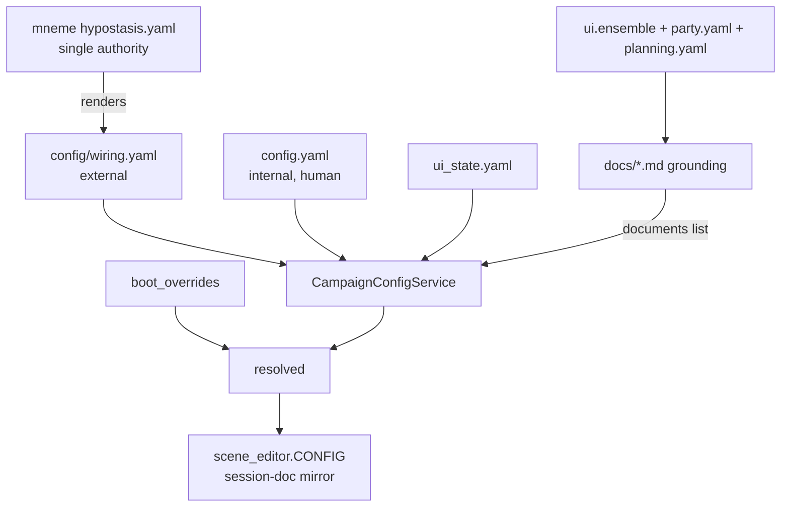

# CampaignGenerator Configuration — Master Map

Every configuration layer for CampaignGenerator, from mneme's host authority down to the
generated grounding docs. Stitches together the schema, value-level map, editor mirror, and the
ensemble + grounding subsystems.

## Authority & flow chain

| Layer | Surface(s) | Owner | Format / persistence | Holds |
|---|---|---|---|---|
| 1. External wiring | `config/wiring.yaml` | mneme (rendered) | YAML, do-not-edit, hash-stamped | endpoints + roots |
| 2. Internal tracked | `config.yaml` | human | YAML, read-only to app | system_prompt, log_dir, agents, documents[], mempalace.* |
| 3. Server-owned UI state | `ui_state.yaml` | server (config service) | YAML, UIState v2, atomic writes | ui.<15 sections> + runtime + legacy |
| 3b. Editor mirror | `scene_editor.CONFIG` | server (in-memory) | flat dict, per-request refresh | back-compat mirror of ui.session_doc + model + work_dir + vtt |
| 4. Machine-local | `.campaigngenerator.local.yaml` | server | YAML, gitignored | server.{host,port}, nav.last_page |
| 5. Boot overrides | CLI flags to `server.main` | operator | in-memory only | session/campaign dirs + session_doc knobs |
| 6. Content / refs | `refs.yaml`, `refs.local.yaml`, `ingest_manifest.yaml`, `~/.5etools-mcp-runtime/` | human (+ `launch --init-local`) | YAML + generated symlink farm | 5e content scope, roots, ingest list, built MCP tree |
| 7. Ensemble subsystem | `ui.ensemble`, `manifest.json`, `merge.yaml`, `docs/*_draft.md` | server + ensemble CLI | persisted section + per-run artifacts | chapters/known_names/aliases/backends |
| 8. Grounding docs | `party.yaml`, `planning.yaml`, `tracking.txt`, `docs/*.md` | human + generators | YAML config + generated md | rosters/dossiers → world/campaign/party/planning docs |

## Who writes what

| Surface | Writer path | Notes |
|---|---|---|
| `config.yaml` | none (human-only) | `new_workspace.py` creates; hand-edit |
| `ui_state.yaml` | `PUT /section/{name}`, `PUT /runtime`, boot `_normalize_stored_paths` | lazy on first write; atomic + write-lock |
| `.campaigngenerator.local.yaml` | `PUT /local` | lazy on first write |
| `scene_editor.CONFIG` | `PUT /api/editor/config` (+ writes session_doc) | in-memory; refreshed per request |
| `config/wiring.yaml` | mneme render only | not written by CampaignGenerator |
| `refs.yaml` / `ingest_manifest.yaml` | hand-authored | refs.local.yaml seedable via `launch --init-local` |
| ensemble artifacts | ensemble_extract (manifest+facts), synthesize (drafts), promote (live) | per-run workdir; disk is truth |
| `party.yaml` / `planning.yaml` | `PUT /party-yaml`, `PUT /planning-yaml` | UI editors or hand |
| `docs/*.md` grounding | `party.py` / `campaign_state.py` / `planning.py` (+ ensemble) | non-clobbering `.candidate` on conflict |

## Mental model

Two owners, three persistence classes.

- **Owners:** the human (`config.yaml`, refs, `party`/`planning.yaml`, grounding docs) and the
  server (`ui_state.yaml`, `local.yaml`, editor mirror) — with mneme owning the external
  `wiring.yaml` above them.
- **Persistence classes:** tracked+portable (`config.yaml`, `refs.yaml`, `ui_state.yaml`),
  machine-local (`refs.local.yaml`, `.local.yaml`), and generated/derived (`wiring.yaml`, 5etools
  runtime, ensemble manifests+drafts, `resolved()`, `scene_editor.CONFIG`).
- **Invariant:** `config.yaml` is never machine-written, boot flags never persist, external
  endpoints live only in mneme-rendered wiring, and disk is the source of truth for the content
  pipelines.

See also [service-cut.md](./service-cut.md) for the multi-service reading of this same map.
