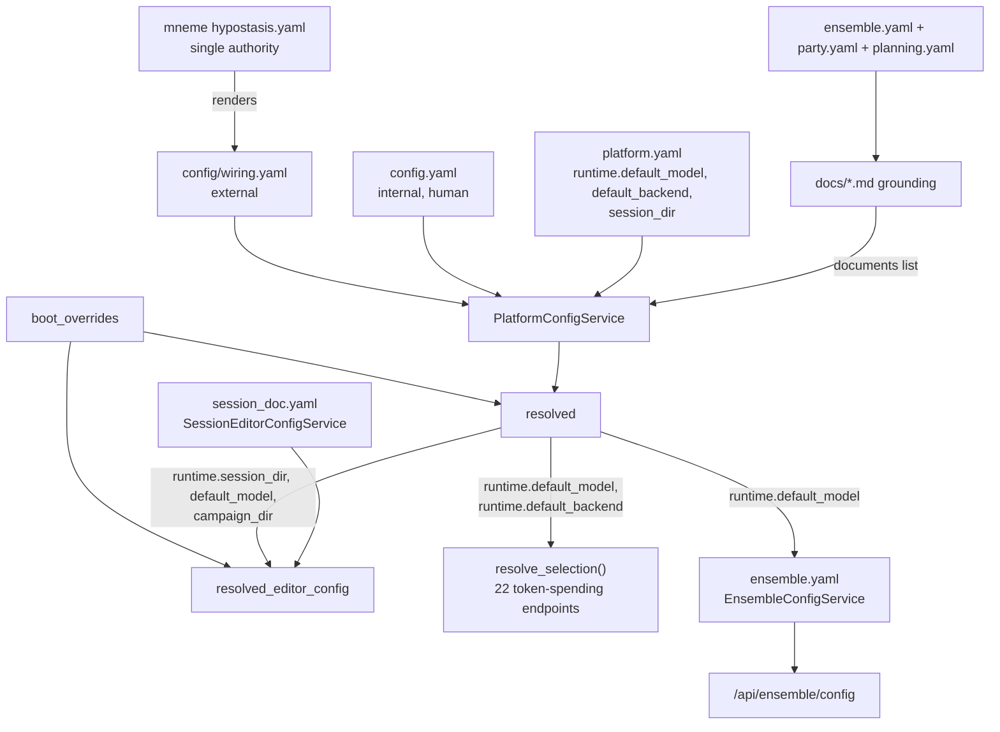

# CampaignGenerator Configuration — Master Map

Every configuration layer for CampaignGenerator, from mneme's host authority down to the
generated grounding docs. Stitches together the schema, value-level map, the Session Doc Editor's
own `session_doc.yaml`, and the ensemble + grounding subsystems.

## Authority & flow chain

`scene_editor.CONFIG` — the old in-memory session-doc mirror — no longer exists; the Session Doc
Editor's own `SessionEditorConfigService` composes `PlatformConfigService` (platform reads only,
via `resolved()`) rather than being mirrored into it. See
[session-editor-isolation.md](./session-editor-isolation.md). The old fused
`CampaignConfigService` itself no longer exists either — `docs/config/platform-isolation.md`
(Phases 0–5a) split it into `PlatformConfigService` (layer 1's consumer + layers 2/3b below) and
the renamed `UIStateService` (the residual `ui.<section>` landlord) — and
[ui-state-retirement.md](./ui-state-retirement.md) then deleted that residual half outright, along
with `ui_state.yaml`, its models and its route. What is left is one owner per document.

| Layer | Surface(s) | Owner | Format / persistence | Holds |
|---|---|---|---|---|
| 1. External wiring | `config/wiring.yaml` | mneme (rendered) | YAML, do-not-edit, hash-stamped | endpoints + roots. Does **not** yet include the model registry — Phase 5b, deferred ([issue #177](https://github.com/kostadis/CampaignGenerator/issues/177)) |
| 2. Internal tracked | `config.yaml` | human | YAML, read-only to app | system_prompt, log_dir, agents, documents[], mempalace.* |
| 2b. Platform runtime | `platform.yaml` | server (`PlatformConfigService`, exclusively) | YAML, `PlatformDocument`, strict (`extra="forbid"`), atomic writes | `runtime.{default_model, session_dir}` — the sidebar model picker and the session-resolution anchor every session-scoped path resolves against. New in Phase 3 (O3); previously lived inside `ui_state.yaml` |
| ~~3. Server-owned UI state~~ | ~~`ui_state.yaml`~~ | **retired** | — | **Layer deleted** ([ui-state-retirement.md](./ui-state-retirement.md)). Its tenants had all moved to layers 2b/3b–3e; the six sections left behind were empty, unwritten and unread, so the document, `UIStateService`, `UIState`/`UISection`, `SCHEMA_VERSION` and `PUT /section/{name}` went together. Any file still on disk is inert — only the `migrate_*` CLIs read it |
| 3b. Session Doc Editor | `<config>/session_doc.yaml` | server (`SessionEditorConfigService`) | YAML, `SessionEditorConfig`, strict (`extra="forbid"`), atomic writes | `paths`/`narrate`/`scrub`/`roster`/`backends`/`session_name`/`profiles`/`active_profile` — its own document. Also now home to `ProfileEntry`/`BackendProfile`, which were declared beside `UIState` until D2 of the retirement moved each symbol to its owner |
| 3d. Grounding | `<config>/grounding.yaml` | server (`GroundingConfigService`) | YAML, `GroundingConfig`, strict (`extra="forbid"`), atomic writes | the shared `summaries` pointer + a run profile per grounding doc (`campaign_state`/`distill`/`party`/`planning`). Replaces five `ui.<section>` blobs, two of which were **write-never** ([grounding-isolation.md](./grounding-isolation.md)) |
| 3e. Party roster | `<config>/party.yaml` | server (`PartyConfigService`) + human | YAML, `PartyConfig`, strict, atomic writes | `characters[]` — name, sheet, backstory, dossier, 3-state `arc_score`. Had **two** independent implementations before this |
| 3c. Ensemble | `<config>/ensemble.yaml` | server (`EnsembleConfigService`) | YAML, `EnsembleConfig`, strict (`extra="forbid"`), atomic writes | `chapters_selected`/`known_names`/`aliases_path`/`extract`/`synthesize`/`paths`/`tuning`/`planning` — its own document. `paths`+`tuning` were route-signature literals before this; the six `planning_*` keys were undeclared `ui.ensemble` overflow ([ensemble-isolation.md](./ensemble-isolation.md)) |
| 4. Machine-local | `.campaigngenerator.local.yaml` | server (`PlatformConfigService`) | YAML, `PlatformLocalConfig`, strict, gitignored | server.{host,port}, nav.last_page |
| 5. Boot overrides | CLI flags to `server.main` | operator | in-memory only | `--campaign-dir`/`--session-dir`/`--config-dir`/`--host`/`--port` — the five survivors of Phase 0 (O1), which deleted twelve dead `session_doc.*` flags that reached no consumer; reach both `resolved()` and `resolved_editor_config()` from the same `boot_overrides` derivation |
| 6. Content / refs | `refs.yaml`, `refs.local.yaml`, `ingest_manifest.yaml`, `~/.5etools-mcp-runtime/` | human (+ `launch --init-local`) | YAML + generated symlink farm | 5e content scope, roots, ingest list, built MCP tree |
| 7. Ensemble subsystem | `manifest.json`, `merge.yaml`, `docs/*_draft.md` | ensemble CLI | per-run artifacts | the run outputs; its *config* moved up to layer 3c |
| 8. Planning subsystem | `planning.yaml` | human + planning service | YAML, planning service owned | npcs[], factions[] |
| 9. Grounding docs | `party.yaml`, `tracking.txt`, `docs/*.md` | human + generators | YAML config + generated md | rosters/dossiers → world/campaign/party docs |
| 10. Router model/backend selection | all 22 token-spending endpoints (`grounding.py` ×5, `ensemble.py` ×5, `scene_editor.py` ×6, `prep.py` ×3, `setup.py` ×2, `connections.py` ×1) | server (`resolve_selection`, `server/platform_config_service.py`) | in-memory, per-request | resolves model **and** backend per run: request → service override → platform → literal, with the pairing rule and a 409 refusal instead of substitution. Feature 003 — closes the five independent spellings this row used to describe as one. see [values.md § The model/backend resolution rule](./values.md#the-modelbackend-resolution-rule-feature-003--the-single-statement) |

## Who writes what

| Surface | Writer path | Notes |
|---|---|---|
| `config.yaml` | none (human-only) | `pipelines/workspace/new_workspace.py` creates; hand-edit |
| `platform.yaml` | `PUT /runtime` → `PlatformConfigService.update_runtime` | lazy on first write; atomic + write-lock; owned outright — no other service's write can touch this file (Phase 3, O3) |
| ~~`ui_state.yaml`~~ | **no writer** — `PUT /section/{name}` and `UIStateService` are deleted | Retired ([ui-state-retirement.md](./ui-state-retirement.md)). Read only by the four `migrate_*` CLIs, which drain it into the documents above |
| `session_doc.yaml` | `PUT /api/editor/config`, `/api/editor/profiles` CRUD + `/activate` | lazy on first editor write; atomic write, own file — cannot corrupt a sibling service's document |
| `.campaigngenerator.local.yaml` | `PUT /local` → `PlatformConfigService.update_local` | lazy on first write |
| `ensemble.yaml` | `PUT /api/ensemble/config` → `EnsembleConfigService.update_config` | lazy on first ensemble write; atomic, own file — cannot corrupt `platform.yaml` or `grounding.yaml` |
| `config/wiring.yaml` | mneme render only | not written by CampaignGenerator |
| `refs.yaml` / `ingest_manifest.yaml` | hand-authored | refs.local.yaml seedable via `launch --init-local` |
| ensemble artifacts | ensemble_extract (manifest+facts), synthesize (drafts), promote (live) | per-run workdir; disk is truth |
| `grounding.yaml` | `PUT /api/grounding/config` → `GroundingConfigService.update_config` | lazy on first grounding write; atomic, own file |
| `party.yaml` | `/api/party/characters` CRUD (`PartyConfigService`) | UI editor or hand; one validating implementation |
| `planning.yaml` | `/api/planning/*` CRUD (`PlanningConfigService`) | UI editor or hand |
| `docs/*.md` grounding | `pipelines/grounding/party.py` / `pipelines/grounding/campaign_state.py` / `pipelines/grounding/planning.py` (+ ensemble) | non-clobbering `.candidate` on conflict |

An existing campaign drains its pre-isolation `ui_state.yaml` with **four** one-shot CLIs — run
them all, in any order, before deleting the file:

| CLI | Recovers |
|---|---|
| `python -m server.migrate_platform_config --campaign-dir DIR` | `runtime.{default_model, session_dir}` → `platform.yaml`. **The one that usually matters** — a missing `platform.yaml` loads as all-defaults, so an unmigrated campaign silently boots on the literal default model with no session anchor |
| `python -m server.migrate_session_doc --campaign-dir DIR` | `ui.session_doc`/`ui.profiles` → `session_doc.yaml` ([session-editor-isolation.md](./session-editor-isolation.md#migrating-an-existing-campaign)) |
| `python -m server.migrate_ensemble_config --campaign-dir DIR` | `ui.ensemble` → `ensemble.yaml` ([ensemble-isolation.md](./ensemble-isolation.md)) |
| `python -m server.migrate_grounding_config --campaign-dir DIR` | the five grounding sections → `grounding.yaml` ([grounding-isolation.md](./grounding-isolation.md)) — expect it to move very little, since two of those sections were never written by the UI at all |

Each is idempotent, refuses to overwrite an existing destination without `--force`, prints
`nothing to migrate` and exits 0 when clean, and reports unrecognised keys as skipped rather than
dropping them silently. They read `ui_state.yaml` **raw**, never through a typed model, so they can
rescue fields no live schema declares — which is why they outlived the document's reader (see
[ui-state-retirement.md](./ui-state-retirement.md)).

Skipping them no longer fails safe the way it used to. While `UIStateService` existed, an
unmigrated block loaded through an `extra="allow"` model and was ignored; now the file is not
opened at all, so unmigrated data is simply invisible until a CLI drains it.

## Mental model

Two owners, three persistence classes, and (new as of `docs/config/platform-isolation.md`) two
kinds of server ownership: the **permanent platform tier** and the **transitional residual
landlord**.

- **Owners:** the human (`config.yaml`, refs, `party`/`planning.yaml`, grounding docs) and the
  server. The server half was split in Phase 2 into `PlatformConfigService` (the permanent
  platform role — `platform.yaml`, `.campaigngenerator.local.yaml`, plus read-only access to
  `config.yaml`/wiring/paths) and `UIStateService` (the transitional landlord of `ui_state.yaml`'s
  remaining blobs). **That transitional role is finished** — not by the last tenants moving out,
  but by [ui-state-retirement.md](./ui-state-retirement.md) establishing there were no tenants
  left to move: the six remaining sections were empty reservations. `UIStateService` and its
  document are deleted; every service owns its own file. Mneme owns the external `wiring.yaml`
  above all of it.
- **Persistence classes:** tracked+portable (`config.yaml`, `refs.yaml`, `platform.yaml`,
  `session_doc.yaml`, `ensemble.yaml`, `grounding.yaml`, `party.yaml`, `planning.yaml`), machine-local (`refs.local.yaml`,
  `.campaigngenerator.local.yaml`), and generated/derived (`wiring.yaml`, 5etools runtime,
  ensemble manifests+drafts, `resolved()`, `resolved_editor_config()`).
- **Invariant:** `config.yaml` is never machine-written, boot flags never persist, external
  endpoints live only in mneme-rendered wiring, disk is the source of truth for the content
  pipelines, and (Phase 3, O3) a write to any `ui.<section>` cannot reach `platform.yaml` even by
  accident — they are two separate files with two separate locks, not two views onto one document.

See [platform-isolation.md](./platform-isolation.md) for the full before/after of this split
(Phases 0–5a shipped; Phase 5b — moving the model registry's source into `wiring.yaml` — deferred,
tracked as [issue #177](https://github.com/kostadis/CampaignGenerator/issues/177)).

See also [service-cut.md](./service-cut.md) for the multi-service reading of this same map.
