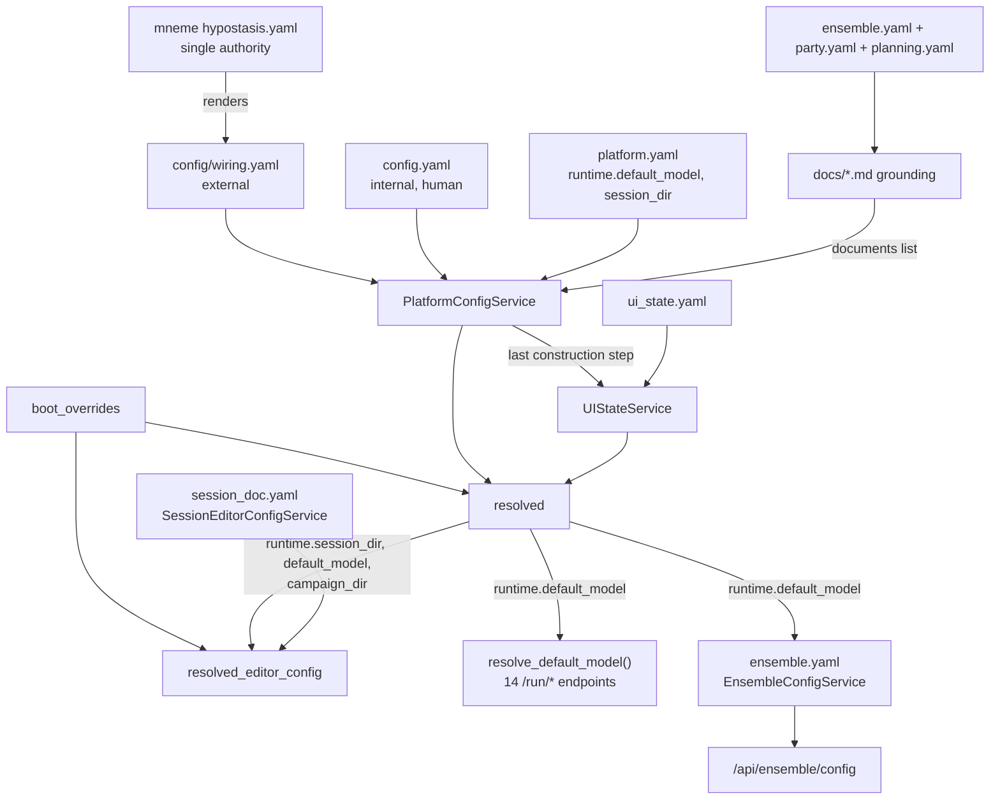

# CampaignGenerator Configuration — Master Map

Every configuration layer for CampaignGenerator, from mneme's host authority down to the
generated grounding docs. Stitches together the schema, value-level map, the Session Doc Editor's
own `session_doc.yaml`, and the ensemble + grounding subsystems.

## Authority & flow chain

`scene_editor.CONFIG` — the old in-memory session-doc mirror — no longer exists; the Session Doc
Editor's own `SessionEditorConfigService` composes `PlatformConfigService` (platform reads only,
via `resolved()`) rather than being mirrored into it. See
[session-editor-isolation.md](./session-editor-isolation.md). The old fused
`CampaignConfigService` itself no longer exists either — `docs/config/platform-isolation.md`
(Phases 0–5a) split it into `PlatformConfigService` (layer 1's consumer + layers 2/3b below) and
the renamed `UIStateService` (layer 3, the residual `ui.<section>` landlord).

| Layer | Surface(s) | Owner | Format / persistence | Holds |
|---|---|---|---|---|
| 1. External wiring | `config/wiring.yaml` | mneme (rendered) | YAML, do-not-edit, hash-stamped | endpoints + roots. Does **not** yet include the model registry — Phase 5b, deferred ([issue #177](https://github.com/kostadis/CampaignGenerator/issues/177)) |
| 2. Internal tracked | `config.yaml` | human | YAML, read-only to app | system_prompt, log_dir, agents, documents[], mempalace.* |
| 2b. Platform runtime | `platform.yaml` | server (`PlatformConfigService`, exclusively — no delegation) | YAML, `PlatformDocument`, strict (`extra="forbid"`), atomic writes | `runtime.{default_model, session_dir}` — the sidebar model picker and the session-resolution anchor every session-scoped path resolves against. New in Phase 3 (O3); previously lived inside `ui_state.yaml` |
| 3. Server-owned UI state | `ui_state.yaml` | server (`UIStateService` — Phase 2's rename of the config-service's residual role) | YAML, UIState v4, atomic writes | ui.<12 sections> + legacy — `session_doc`/`profiles` (Phase 5 of session-editor isolation), `runtime` (Phase 3 here) and `ensemble` (Phase 5 of ensemble isolation) no longer live here (see layers 2b/3b/3c) |
| 3b. Session Doc Editor | `<config>/session_doc.yaml` | server (`SessionEditorConfigService`) | YAML, `SessionEditorConfig`, strict (`extra="forbid"`), atomic writes | `paths`/`narrate`/`scrub`/`roster`/`backends`/`session_name`/`profiles`/`active_profile` — its own document, not a `ui_state.yaml` section or an in-memory mirror |
| 3c. Ensemble | `<config>/ensemble.yaml` | server (`EnsembleConfigService`) | YAML, `EnsembleConfig`, strict (`extra="forbid"`), atomic writes | `chapters_selected`/`known_names`/`aliases_path`/`extract`/`synthesize`/`paths`/`tuning`/`planning` — its own document. `paths`+`tuning` were route-signature literals before this; the six `planning_*` keys were undeclared `ui.ensemble` overflow ([ensemble-isolation.md](./ensemble-isolation.md)) |
| 4. Machine-local | `.campaigngenerator.local.yaml` | server (`PlatformConfigService`) | YAML, `PlatformLocalConfig`, strict, gitignored | server.{host,port}, nav.last_page |
| 5. Boot overrides | CLI flags to `server.main` | operator | in-memory only | `--campaign-dir`/`--session-dir`/`--config-dir`/`--host`/`--port` — the five survivors of Phase 0 (O1), which deleted twelve dead `session_doc.*` flags that reached no consumer; reach both `resolved()` and `resolved_editor_config()` from the same `boot_overrides` derivation |
| 6. Content / refs | `refs.yaml`, `refs.local.yaml`, `ingest_manifest.yaml`, `~/.5etools-mcp-runtime/` | human (+ `launch --init-local`) | YAML + generated symlink farm | 5e content scope, roots, ingest list, built MCP tree |
| 7. Ensemble subsystem | `manifest.json`, `merge.yaml`, `docs/*_draft.md` | ensemble CLI | per-run artifacts | the run outputs; its *config* moved up to layer 3c |
| 8. Planning subsystem | `planning.yaml` | human + planning service | YAML, planning service owned | npcs[], factions[] |
| 9. Grounding docs | `party.yaml`, `tracking.txt`, `docs/*.md` | human + generators | YAML config + generated md | rosters/dossiers → world/campaign/party docs |
| 10. Router model defaults | eleven `/run/*` request fields (`grounding.py` ×5, `prep.py` ×3, `connections.py` ×1, `setup.py` ×2 — `experimental.py` ×2 and `session_workflow.py` ×1 went with the retired VTT Summary chain) | server (`resolve_default_model`, `server/platform_config_service.py`) | in-memory, per-request | resolves `model` per request: explicit value → layer 2b's `runtime.default_model` → `campaignlib.constants.DEFAULT_MODEL` literal. Phase 5a — closes the gap where a request omitting `model` silently got a hardcoded literal instead of the sidebar's pick |

## Who writes what

| Surface | Writer path | Notes |
|---|---|---|
| `config.yaml` | none (human-only) | `pipelines/workspace/new_workspace.py` creates; hand-edit |
| `platform.yaml` | `PUT /runtime` → `PlatformConfigService.update_runtime` | lazy on first write; atomic + write-lock; owned outright, no delegation to `UIStateService` — a `ui.<section>` write physically cannot touch this file (Phase 3, O3) |
| `ui_state.yaml` | `PUT /section/{name}` → `UIStateService.update_section`, boot `_normalize_stored_paths` | lazy on first write; atomic + write-lock; `PUT /section/session_doc` and `/section/ensemble` 404 (unknown sections); no longer holds `runtime` |
| `session_doc.yaml` | `PUT /api/editor/config`, `/api/editor/profiles` CRUD + `/activate` | lazy on first editor write; atomic write, own file — cannot corrupt `ui_state.yaml` |
| `.campaigngenerator.local.yaml` | `PUT /local` → `PlatformConfigService.update_local` | lazy on first write |
| `ensemble.yaml` | `PUT /api/ensemble/config` → `EnsembleConfigService.update_config` | lazy on first ensemble write; atomic, own file — cannot corrupt `ui_state.yaml` or `platform.yaml` |
| `config/wiring.yaml` | mneme render only | not written by CampaignGenerator |
| `refs.yaml` / `ingest_manifest.yaml` | hand-authored | refs.local.yaml seedable via `launch --init-local` |
| ensemble artifacts | ensemble_extract (manifest+facts), synthesize (drafts), promote (live) | per-run workdir; disk is truth |
| `party.yaml` | `PUT /party-yaml` | UI editor or hand |
| `planning.yaml` | `/api/planning/*` CRUD (`PlanningConfigService`) | UI editor or hand |
| `docs/*.md` grounding | `pipelines/grounding/party.py` / `pipelines/grounding/campaign_state.py` / `pipelines/grounding/planning.py` (+ ensemble) | non-clobbering `.candidate` on conflict |

An existing campaign migrates its pre-isolation data with two one-shot CLIs:
`python -m server.migrate_session_doc --campaign-dir DIR` for `ui.session_doc`/`ui.profiles`
(see [session-editor-isolation.md § Migrating an existing
campaign](./session-editor-isolation.md#migrating-an-existing-campaign)) and
`python -m server.migrate_ensemble_config --campaign-dir DIR` for `ui.ensemble`
(see [ensemble-isolation.md](./ensemble-isolation.md)). Both are safe to skip: `UIState` is
`extra="allow"`, so an unmigrated block loads and is ignored rather than breaking boot.

## Mental model

Two owners, three persistence classes, and (new as of `docs/config/platform-isolation.md`) two
kinds of server ownership: the **permanent platform tier** and the **transitional residual
landlord**.

- **Owners:** the human (`config.yaml`, refs, `party`/`planning.yaml`, grounding docs) and the
  server — split, since Phase 2, into `PlatformConfigService` (`platform.yaml`,
  `.campaigngenerator.local.yaml`, plus read-only access to `config.yaml`/wiring/paths — the
  permanent role) and `UIStateService` (`ui_state.yaml`'s ten remaining `ui.<section>` blobs —
  the transitional role every other service will eventually take back, one at a time, the way
  Session Doc Editor, Planning and Ensemble already did). Mneme owns the external `wiring.yaml` above both.
- **Persistence classes:** tracked+portable (`config.yaml`, `refs.yaml`, `platform.yaml`,
  `ui_state.yaml`, `session_doc.yaml`, `ensemble.yaml`, `planning.yaml`), machine-local (`refs.local.yaml`,
  `.campaigngenerator.local.yaml`), and generated/derived (`wiring.yaml`, 5etools runtime,
  ensemble manifests+drafts, `resolved()`, `resolved_editor_config()`).
- **Invariant:** `config.yaml` is never machine-written, boot flags never persist, external
  endpoints live only in mneme-rendered wiring, disk is the source of truth for the content
  pipelines, and (Phase 3, O3) a write to any `ui.<section>` cannot reach `platform.yaml` even by
  accident — they are two separate files with two separate locks, not two views onto one document.

See [platform-isolation.md](./platform-isolation.md) for the full before/after of this split
(Phases 0–5a shipped; Phase 5b — moving the model registry's source into `wiring.yaml` — deferred,
tracked as [issue #177](https://github.com/kostadis/CampaignGenerator/issues/177)).

See also [service-cut.md](./service-cut.md) for the multi-service reading of this same map.
