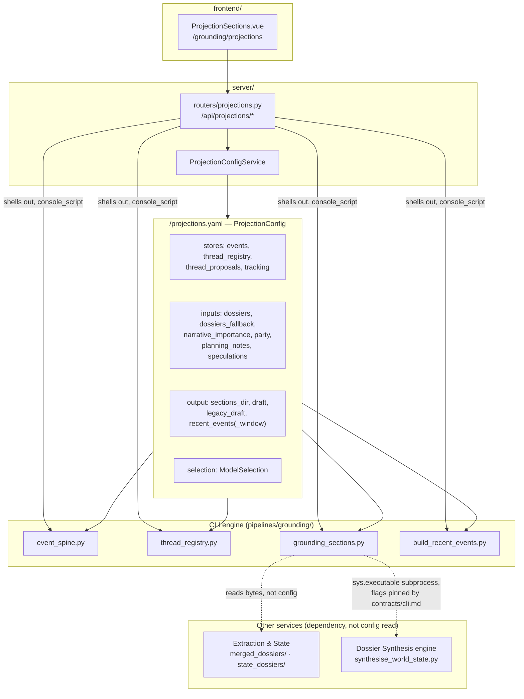

# State Projection Configuration Isolation Design

> **Status: ✅ Shipped (2026-08-01).** All seven phases of `specs/006-state-projection-service`
> landed on `feat/213-phase1-source-lineage`. Full suite, run with the worktree's own venv
> (`.venv/bin/python -m pytest tests/`): **7 failed / 2446 passed / 115 skipped**, identical failures
> to the pre-feature baseline measured the same way. **Zero regressions.**
>
> **The interpreter changes the number, so state it.** Run with the system `python3` instead, the
> same tree reports 10 failed / 2443 passed: `test_chapter_identity.py` contributes five extra
> failures because it spawns `renumber_chapters.py` via subprocess with `/usr/bin/python3`, which
> cannot import `campaignlib`, and `test_externalized_prompts.py` one more. Neither is caused by this
> feature; both are artifacts of measuring with an interpreter that lacks the package. Any future
> comparison against this baseline must use the same venv.
>
> The seven, all pre-existing and all failing identically before this feature:
>
> | Test | Why |
> |---|---|
> | `test_backend_seam_guardrails.py::…[grounding_sections.py]` | `grounding_sections.py`'s `--backend`/`--model` were never routed through `add_backend_args(`. Worth noting because this feature edits that file heavily — `git diff` confirms it does not touch those lines, and the failure reproduces on a stashed tree |
> | `test_externalized_prompts.py::test_all_externalised_prompts_listed` | stale against #213 Phases 3/4.2/4.3 prompts, none added here |
> | `test_extract_facts.py::test_cli_parallel_fully_cached` | pre-existing |
> | `test_registry_mcp.py::test_build_server_registers_every_subcommand_as_a_tool` | pre-existing |
> | `test_mempalace_client.py::TestLiveRoundTrip…` | needs a live MemPalace |
> | `test_resolve_refs.py::TestResolveRoots` ×2 | need a configured `fivetools_data` root |
>
> Every test this feature added passes (`test_projection_config.py`, `test_projection_isolation.py`,
> `test_projection_routes.py`, `test_fact_record_contract.py`), and
> `test_config_location.py`/`test_layering.py` stay green with `projections.yaml` added.
> `vue-tsc --noEmit` and `vite build` are clean.
>
> This is the sixth service/config-isolation effort in this series, after
> [session-editor-isolation.md](./session-editor-isolation.md),
> [planning-isolation.md](./planning-isolation.md),
> [ensemble-isolation.md](./ensemble-isolation.md),
> [grounding-isolation.md](./grounding-isolation.md) and
> [ui-state-retirement.md](./ui-state-retirement.md) — but the first that is not migrating a loose
> `ui.<section>` blob into a strict document. The State Projection service (`event_spine`,
> `thread_registry`, `grounding_sections`) had **no** config document at all before this feature;
> every location was a Python literal, and one of them — `docs/ensemble/events.jsonl` — was three
> *disagreeing* literals in the same file. Every "current state" claim below is code-verified
> against this feature's (uncommitted) diff on top of `feat/213-phase1-source-lineage` at `71ae176`,
> with a file:line citation.

## Overview

`service-cut.md`'s "Implied services" table now names State Projection as the third grounding-doc
producer, sitting beside Per-Tool Rendering (`grounding.yaml`) and Dossier Synthesis (the rendering
half of `ensemble.yaml`). Read too quickly, that placement suggests three interchangeable siblings.
They are not, and this document exists partly to correct that reading before it calcifies:

**Config and output are isolated. Runtime is not — deliberately.** State Projection owns its own
strict document (`projections.yaml`) and its own output directory (`docs/projections/`), same as
every isolated service in this series. But six of its thirteen sections cannot render without the
Extraction & State service's curated dossiers (`campaignlib/projection_config.py:81-82`,
`ProjectionInputs.dossiers`/`dossiers_fallback`), and one code path —
`grounding_sections.render_synthesis` (`pipelines/grounding/grounding_sections.py:439-457`) —
execs Dossier Synthesis's own engine, `pipelines/ensemble/synthesise_world_state.py`, as a
subprocess. That is not a bug this feature fixes; research D12 (below) chose it deliberately over
the alternative, which was a second copy of a synthesis prompt. **State Projection is a rendering
service with a hard runtime dependency on Extraction & State's output and a declared,
subprocess-mechanism dependency on Dossier Synthesis's engine — never the other way around, and
never on either service's *configuration*.** FR-002/FR-003 (spec.md) require exactly this
asymmetry: no rendering service may need another rendering service to have *run*, but nothing
forbids one rendering service's engine from *calling* another's, and nothing exempts a dependency
from being declared. Grep `pipelines/grounding/*.py` for `import.*EnsembleConfig` or
`import.*GroundingConfig` and the count is zero (`tests/test_projection_isolation.py`'s
`test_no_cross_service_config_read`) — the dependency is on bytes on disk and on one pinned CLI
flag surface (`contracts/cli.md`), never on a sibling's config document.

The corollary for anyone extending this service: adding a section, or changing what feeds one,
does not automatically inherit the isolation this doc describes. A new section that reads
`ensemble.yaml` directly, rather than declaring its own pointer in `projections.yaml`, reopens the
exact defect feature 003 deleted `grounding.py:_backend_flags` for (research D5) — constructing
another service's config object just to read one value out of it. The isolation is in the config
and the output path — not a claim that the service computes anything standalone.

## Current state (code-verified)



| Surface | Model | File |
|---|---|---|
| `<config>/projections.yaml` | `ProjectionConfig` (strict, `extra="forbid"`) | `campaignlib/projection_config.py:127-140` |
| Stores (this service writes+reads) | `ProjectionStores` | `campaignlib/projection_config.py:52-66` |
| Inputs (another service writes, this one declares a pointer) | `ProjectionInputs` | `campaignlib/projection_config.py:69-86` |
| Output (this service writes) | `ProjectionOutput` | `campaignlib/projection_config.py:89-124` |
| Service | `ProjectionConfigService` | `server/projection_config_service.py:52-116` |
| Routes | `GET/PUT /config`, `GET /sections`, `GET /run/build`, `GET /run/recent-events`, `GET/PUT/DELETE /selection`, `GET /selection/resolved` | `server/routers/projections.py`, mounted at `server/main.py:53` |
| UI | `ProjectionSections.vue`, nested at `/grounding/projections` | `frontend/src/router.ts:65-69` |

## Problems (state before this feature)

### 1. `docs/ensemble/events.jsonl` was three literals, not one

Research D1 found the same path declared independently at three call sites inside
`grounding_sections.py` (the freshness hash, the spine read, and the tracking read) plus
`event_spine.py`'s own `DEFAULT_STORE`. They happened to agree by construction, but nothing
enforced it — a fourth call site, or an edit to only one of the three, would stamp a section's
`inputs-sha` over bytes it was not actually rendered from. Shipped fix: `main()` resolves
`stores.events` once (`grounding_sections.py:709`) and threads the one `Path` through
`section_inputs`, `render_spine` and `render_tracking` (`contracts/cli.md`'s "one resolved
`stores.events`, threaded through" row).

### 2. The three rendering services collided on output

`server/routers/ensemble.py` (Dossier Synthesis) and `grounding_sections.py` (State Projection)
both wrote `docs/{doc}_draft.md` — the same four filenames — and `campaign_state.py`'s
`--synthesize-only` auto-stage read whichever one had run last. Running the newest renderer
silently destroyed the previous one's drafts, which blocked the entire point of this feature: a
side-by-side comparison of three renderers. Research D2; fixed by D13 below.

### 3. The fact-record contract was undeclared and unasserted

`event_spine.rows_from_corpus` and `thread_registry propose` each read a specific set of keys off
`merged.json` (`type`, `fact`, `subject`, `scene_index`, `quote_offset`, `source_quote`,
`quote_verified`, `source`), but nothing tested that the producer, `ensemble_merge`, actually
emitted them. A silent rename upstream degrades every consumer by skipping non-matching rows — the
spine shrinks, not fails. Research D3; closed by `tests/test_fact_record_contract.py`.

### 4. No config document existed at all

Unlike every prior isolation in this series, State Projection was not migrating a loose
`ui.<section>` blob — it had never had *any* declared configuration. `event_spine.py`,
`thread_registry.py` and `grounding_sections.py` hardcoded every path they touched
(`DEFAULT_STORE`, `DEFAULT_REGISTRY`, `DEFAULT_PROPOSALS`, `SECTIONS_DIR`, the inline
`docs/{doc}_draft.md`, `docs/tracking*.txt`, `narrative_importance.yaml`, and the three `SPECS`
`source=` paths). A campaign with a different `docs/` layout needed a code fork, not a config edit
— the same defect Phase 3 of `ensemble-isolation.md` and Phase 5 (Track B) of
`grounding-isolation.md` each closed for their own subsystem, arriving a third time in a subsystem
written after both.

### 5. `build_recent_events` was routed by the wrong service

It wraps `event_spine.update()` + `event_spine.render()` — Phase 2 engine code — but its route
lived at `/api/ensemble/run/recent-events` and its `--output`/`--window` defaults came from
`ensemble.yaml`'s `paths.recent_events_out` / `tuning.recent_events_window`. Once `--store`
resolves from `projections.yaml` (this feature's whole point), leaving the route on the ensemble
side would make a Dossier Synthesis route read State Projection's config document — the exact
cross-service read `_backend_flags` was deleted for. Research D7, superseded by D15.

## What shipped

### Track A — one document, resolved by declaration, not probed (research D14)

`campaignlib/projection_config.py` — `ProjectionConfig`, grouped into `stores` / `inputs` /
`output` / `selection`, strict (`extra="forbid"`), modelled field-for-field on
`campaignlib/planning_config.py`. Lives in `campaignlib` rather than `server` for the same reason
`party_config`/`planning_config` do: both the CLI engines and the eventual server service need the
shape, and putting it in `server` would make the engine import the web app —
`tests/test_layering.py` forbids it, and it is the exact inversion `party.py`/`planning.py` had
before Phase 1 of `grounding-isolation.md`.

The three State Projection CLIs (`event_spine`, `thread_registry`, `grounding_sections`) plus
`build_recent_events` — the wrapper research D15 moves to this service — all resolve it identically
(`contracts/cli.md`'s resolution rule, shipped verbatim):
`config_path(Path.cwd(), PROJECTION_CONFIG_FILENAME)` once at the top of `main()`
(`grounding_sections.py:697`, `event_spine.py:207`, `thread_registry.py:453`,
`build_recent_events.py:59`); every path-valued flag defaults to `None` and falls through to the
resolved config value; an explicit flag always wins; a missing or empty file loads as
all-defaults (`load_projection_config`, `campaignlib/projection_config.py:143-165`); malformed
YAML raises. `config_path()` is the declared-location helper already used by `resolve_refs.py`,
`launch_5etools_mcp.py` and `campaignlib/party.py` — a candidate-list probe would fail
`test_config_location.py`, which now carries `"projections.yaml"` (`tests/test_config_location.py:49`).

**Two fields are deliberately absent**, both test-asserted rather than merely undocumented:

- **No `corpus` field.** `event_spine update --corpus` and `thread_registry propose --corpus` are
  both `required=True, nargs="+"`, unchanged by this feature. A config default would manufacture
  an implicit "all chapters" — the Constitution X violation `ensemble.yaml`'s `chapters_selected`
  exists to prevent (research D6, FR-013).
- **No `sections`/`specs` field.** `SPECS` — which sections exist and which document they belong
  to — stays Python (`grounding_sections.py:103-139`, FR-014), the GM's granularity ruling from
  #213 Phase 4. A config knob here would let a future "completion" of this schema reintroduce the
  corpus default under a different name; `tests/test_projection_config.py` asserts both absences
  recursively.

### Track B — output namespace and the legacy-draft gate (research D13)

Each rendering service now writes drafts under its own subdirectory:

| Service | Draft location |
|---|---|
| Per-Tool Rendering | `docs/pertool/<doc>_draft.md` |
| Dossier Synthesis | `docs/ensemble/drafts/<doc>_draft.md` (`EnsemblePaths.drafts_dir`, `server/ensemble_config_shared.py:128`) |
| State Projection | `docs/projections/<doc>_draft.md` (`ProjectionOutput.draft`, `campaignlib/projection_config.py:109`) |

`ProjectionOutput.draft` carries a field validator requiring the literal `{doc}` placeholder
(`campaignlib/projection_config.py:114-124`) — a value without it would silently collapse every
document onto one file. The one cross-service input this move touched:
`campaign_state.py`'s `--synthesize-only` auto-stage now reads
`docs/ensemble/drafts/world_state_draft.md` (`pipelines/grounding/campaign_state.py:138`) instead
of the old shared `docs/world_state_draft.md` — the one place FR-007a forces a change to Per-Tool
Rendering's own code, preserving the behavior rather than silently reading nothing.

**The legacy-draft gate (FR-007b).** Before writing a draft, `grounding_sections.py` `stat`s
`output.legacy_draft.format(doc=...)` — the pre-move shared path — and if it exists, refuses:

```
error: a pre-move draft still exists at docs/planning_draft.md
       This service now writes docs/projections/planning_draft.md.
       Move or delete the old file to continue; nothing will be moved for you.
```

(`pipelines/grounding/grounding_sections.py:766-782`.) The check runs unconditionally on every
build that assembles a draft (not only when a section changed — `main()` assembles unless
`--no-assemble`), because a no-op rebuild still writes the draft this gate protects. Once the file
is moved or deleted by the GM, the check costs one `stat` and never fires again. The system never
moves or deletes it itself — an attributing migration would be guessing, and deletion destroys the
GM's diff baseline (rejected alternatives, research D13). **The gate applies only to State
Projection** (FR-007c) — Dossier Synthesis never wrote into State Projection's new namespace, so it
has nothing to be gated against; the accepted asymmetry is that a legacy draft is protected from
State Projection specifically, not from every service that could theoretically touch it.

### Track C — the dependent-layer boundary, declared rather than duplicated (research D12)

`grounding_sections.render_synthesis` (`pipelines/grounding/grounding_sections.py:439-457`)
invokes `pipelines/ensemble/synthesise_world_state.py` by `sys.executable` + repo-relative path —
unchanged mechanism, because `console_script()` lives in `server/subprocess_runner.py` and
`test_layering.py` forbids the engine importing it. What changed is that the dependency is now
**declared and pinned**: `contracts/cli.md` records the exact flag surface (`--dossiers`,
`--output`, `--registry`, `--backend`/`--endpoint`/`--model`/`--max-tokens`) State Projection
passes, and a test fails if any of them stop existing. The alternative — extracting the synthesis
primitive into `campaignlib` so both services call it as a library — was rejected as
disproportionate for two consumers and would pull prompt assembly into the engine layer;
duplicating the prompt was rejected outright as the worst option, the exact drift the constitution's
one-seam principle exists to prevent.

**Which dossier set fed a synthesis section is reported, not absorbed** (FR-024a, closing research
D4's silent-fallback finding). `resolve_dossiers_dir` (`grounding_sections.py:167-186`) prefers
`inputs.dossiers` (the type-merge-curated set) and falls back to `inputs.dossiers_fallback` only
when the curated directory has no `*.md` files; the chosen label (`"curated"` / `"fallback"` /
`"explicit"`) is printed in both `list` and `build` output (`grounding_sections.py:750-755`,
`:784-785`) **and** prefixed onto the rendered section body itself
(`_Dossiers: {source} ({dir})._`, `grounding_sections.py:463-471`) — visible in the draft the GM
actually reviews, not only in a run's stdout. Phandalin — one of the two live campaigns — has no
`merged_dossiers/` and exercises this fallback on every build.

### Track D — `ensemble.yaml` is not split (research D11)

This feature adds exactly one new document. `ensemble.yaml` remains the config for both Extraction
& State and Dossier Synthesis — the boundary R1 draws between those two is real in the service map
but was deliberately **not** carried into config ownership, because nothing today needs a knob one
of them must see and the other must not. Splitting it would cost a new migration CLI and touch a
service that isn't this feature's subject, for no correctness gain; the precedent is
`grounding-isolation.md`'s "they are not four services, they are one pipeline run four times."

### Track E — `build_recent_events` moves, no compatibility shim (research D15)

`recent_events_out` / `recent_events_window` are **deleted from `EnsemblePaths`/`EnsembleTuning`
outright** — `server/ensemble_config_shared.py:115-122` (paths) and `:142-151` (tuning) carry the
removal comment in place of the fields. The route moved from `/api/ensemble/run/recent-events` to
`/api/projections/run/recent-events` (`server/routers/projections.py:203-232`); the old site now
holds only an explanatory comment (`server/routers/ensemble.py:781-787`). `output.recent_events`
and `output.recent_events_window` are the new home (`campaignlib/projection_config.py:111-112`).

**This is a deliberate breaking change with no shim.** Both live campaigns' `config/ensemble.yaml`
carried `paths.recent_events_out`, so `GET /api/ensemble/config` now returns `400` naming the
offending key until it is hand-removed — the GM's own call, recorded verbatim in research D15:
*"I am okay with campaigns breaking on a first load, I can fix the config files."* Blast radius is
bounded: `EnsembleConfigService.get_config` catches the `ValidationError` and returns `400` for
that one page; the server still boots and every other service keeps working. The rejected
alternative — a retired-fields strip like `session_doc.yaml` used for `narrate.batch`
(005-ui-batch-selection) — was rejected as a shim carried forever for two files one person can
edit in a minute, and it makes the retirement invisible in the document itself.

## Phases

Mapped to `specs/006-state-projection-service/tasks.md`; all shipped except the doc-only tail.

| Phase | User story | Deliverable | Status |
|---|---|---|---|
| 1 | Setup | Baseline captured (worktree import verified, pre-change `list`/`sha256sum` snapshot) | ✅ |
| 2 | Foundational | `ProjectionConfig` + `load`/`save_projection_config`; `test_projection_config.py`; `projections.yaml` added to `CONFIG_FILENAMES` | ✅ |
| 3 | US1 — no clobbering | Output namespace + legacy-draft gate; `EnsemblePaths.drafts_dir`; `campaign_state.py` auto-stage re-pointed | ✅ |
| 4 | US2 — extract once, render twice | Dossier fallback resolved + reported; `test_fact_record_contract.py`; dossier-absent skip case | ✅ |
| 5 | US3 — declare every location once | `event_spine`/`thread_registry`/`grounding_sections`/`build_recent_events` config-resolved; `events.jsonl` three-site split closed; `recent_events_out`/`recent_events_window` deleted from `ensemble.yaml`, no shim | ✅ |
| 6 | US4 — staleness + rebuild UI | `grounding_sections list --json`; `ProjectionConfigService`; `server/routers/projections.py`; mounted at `/api/projections`; `ProjectionSections.vue` at `/grounding/projections` | ✅ |
| 7 | Polish | This doc + the six cross-cutting docs reconciled; `flow-state-projections.md` and `architecture.md` updated | ✅ (T045–T048) |

T049 (full quickstart against both live campaigns) and T050 (final regression comparison) are
operator-run steps, not documentation, and are outside this doc's scope.

## Tests

| Test | Asserts |
|---|---|
| `tests/test_projection_config.py` | Strict schema rejects unknown keys; missing/empty file → all-defaults; malformed YAML → `ValueError`; `output.draft` without `{doc}` rejected; no `corpus`/`sections`/`specs` field anywhere in the model (research D6/D14) |
| `tests/test_projection_isolation.py` | Running State Projection leaves the other two services' drafts and config documents byte-identical (SC-001); the legacy-draft gate refuses and never moves/deletes (FR-007b); no module under `pipelines/grounding/` imports `EnsembleConfig`/`GroundingConfig` (FR-003); no `docs/`-shaped literal survives in the four converted CLIs; a redirected `stores.events` is honoured by both the freshness hash and the read (the D1 regression test) |
| `tests/test_projection_routes.py` | `GET/PUT /api/projections/config` round-trip; `400` on unknown key; a projections write cannot touch `grounding.yaml`/`ensemble.yaml`/`platform.yaml`; `GET /run/build` with empty `sections` is `400`, never "all" (Constitution X); no `docs/`-shaped literal in `server/routers/projections.py` |
| `tests/test_fact_record_contract.py` | Every key `event_spine.rows_from_corpus` and `thread_registry propose` read is present in an `ensemble_merge` fixture; a matching `type` yields a row — an upstream rename fails here, not as a thinner spine (FR-004, SC-010) |
| `tests/test_config_location.py` | `"projections.yaml"` is a declared `CONFIG_FILENAMES` entry — the new document has exactly one location |
| `tests/test_layering.py` | `campaignlib/projection_config.py` does not import `server.*` |
| `tests/test_grounding_sections.py` | A dossier-absent campaign (no `merged_dossiers/`, no `state_dossiers/`) skips all four synthesis sections with `no dossiers matched` and exits zero |

## Invariants this must not break

- **Disk is truth; drafts stay drafts.** Every section file and every assembled draft is a file on
  disk; the GM diffs and promotes by hand. Nothing in this feature changes what "promote" means.
- **No silent "all."** `--corpus` stays `required=True, nargs="+"` on both consumers; `GET
  /run/build` rejects an empty `sections` list with `400` rather than defaulting to every section.
- **Content-derived freshness, never mtime** (#137). A section's `inputs-sha` covers the exact
  input bytes; touching a file without changing its content must not re-render anything.
- **A build without `--backend` spends nothing.** Deterministic sections (spine, threads, copy)
  always render; synthesis and tracking sections skip with a stated reason.
- **Legacy drafts are never moved or deleted by the system**, only refused against, and only by
  State Projection (FR-007b/FR-007c).
- **No cross-service config reads.** State Projection's own document is the only config it opens;
  every dependency on another service's output is a declared pointer in `projections.yaml` or a
  pinned CLI flag surface, never an import of another service's config model.

## Explicitly out of scope

- **Splitting `ensemble.yaml`.** Research D11: no consumer needs it yet; revisit when one does.
- **Extracting `synthesise_world_state` into a shared library primitive.** Research D12: out of
  proportion for two callers.
- **Thread triage, summary-map approval, the lineage report, and draft promotion in the UI.** Spec
  Q2 (2026-08-01): mechanical staleness + rebuild only, this release. Those four checkpoints stay
  CLI/skill-driven and are unaffected by this feature (FR-022).
- **A compatibility shim for the retired `ensemble.yaml` keys.** Research D15: migrate-and-delete,
  per the standing single-user rule; both live campaigns are hand-edited once.
- **Reconciling `docs/core/architecture.md`'s broader staleness** beyond this feature's own
  additions (router table row, on-disk layout entries) — tracked separately as issue #215.

## Decisions

| # | Question | Decision |
|---|---|---|
| D11 | Does `ensemble.yaml` split along the Extraction/Dossier-Synthesis service boundary? | **No.** One document remains for both; the boundary is real in the service map, not in config ownership, until a knob needs it (research D11). |
| D12 | Which service owns the synthesis engine both renderers can reach? | **Dossier Synthesis**, unchanged. State Projection invokes it as a declared, pinned subprocess dependency rather than duplicating or relocating it (research D12). |
| D13 | Where does each rendering service's draft live, and what protects the pre-move files? | **Own subdirectory per service** (`docs/pertool/`, `docs/ensemble/drafts/`, `docs/projections/`); a legacy-draft gate refuses to write over an un-attributed pre-move file rather than migrating or deleting it (research D13, FR-007b/c). |
| D14 | How do the CLIs locate `projections.yaml`? | `campaignlib.constants.config_path(Path.cwd(), PROJECTION_CONFIG_FILENAME)`, loaded once at the top of `main()` by all three State Projection CLIs plus `build_recent_events`; explicit flags win; no probe, no `--config` requirement (research D14). |
| D15 | Where does `build_recent_events` — and its two settings — live? | **Moved to State Projection**: `output.recent_events`/`output.recent_events_window` in `projections.yaml`; route moved to `/api/projections/run/recent-events`; the two `ensemble.yaml` fields deleted with no shim, both live campaigns hand-edited once (research D15). |
