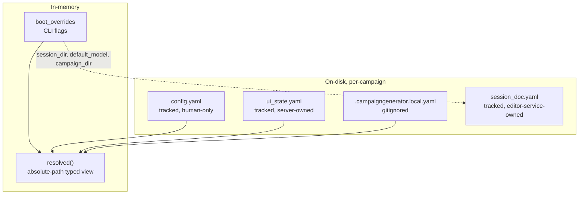

# CampaignGenerator Configuration — Schema

The app's own runtime configuration, owned by `server/config_service.py::CampaignConfigService`
and typed by `server/config_models.py` (schema v2). Per-campaign. Distinct from the external
wiring layer (`config/wiring.yaml`) and the 5e content refs. Also distinct from the Session Doc
Editor's own `session_doc.yaml`, a fourth per-campaign document owned by
`SessionEditorConfigService` — see [Session-editor isolation](./session-editor-isolation.md).

## Documents & layers

| Source | Ownership | Model | Notes |
|---|---|---|---|
| `config.yaml` | tracked, human-only | raw dict (`_tracked`) | Service never writes it; comments/order safe |
| `ui_state.yaml` | tracked, server-owned | `UIState` (v2) | Per-page UI state + runtime + legacy quarantine |
| `.campaigngenerator.local.yaml` | gitignored, machine-local | `LocalConfig` | host/port + nav |
| `session_doc.yaml` | tracked, owned by `SessionEditorConfigService` | `SessionEditorConfig` (grouped, strict `extra="forbid"`) | Session Doc Editor's own slice; not part of `CampaignConfigService`/`UIState` at all — see below |
| `boot_overrides` | in-memory only | dict | CLI flags to `server.main`; not persisted |
| `resolved` | in-memory (derived) | typed view | Path fields absolute vs campaign_dir; what routers read |

## config.yaml (tracked, human-only)

Raw dict, no pydantic model. Read via `campaignlib.load_config` with `$VAR` expansion.

| Key | Type | Example / default | Consumed by |
|---|---|---|---|
| `system_prompt` | str (repo path) | `config/system_prompt.md` | `pipelines/session_prep/prep.py` (`load_repo_file`) |
| `log_dir` | str (path) | `logs/` | `pipelines/session_prep/prep.py`, `pipelines/grounding/npc_table.py` |
| `agents` | map name→path | `lore_oracle`, `encounter_architect`, `voice_keeper` | `pipelines/session_prep/prep.py` (pipeline mode) |
| `documents` | list[{label, path}] | `campaign_state`, `world_state`, `mechanics`, `planning`, `party` | `assemble_docs`, `pipelines/session_prep/prep.py`, `pipelines/rlm/mcp_server.py`, `session_doc/check_consistency.py` |
| `mempalace.canon_wing` | str | default `narrative` | `pipelines/rlm/mcp_server.py` |
| `mempalace.index_wings` | list | e.g. `[chronicle, abyss]` | `pipelines/rlm/mcp_server.py` |
| `mempalace.palace` | str | (usually unset) | `apply_ingest_manifest.resolve_palace` (fallback) |

Legacy/compat keys — moved to `config/wiring.yaml` (mneme-owned); still read as fallback:
`rpg_library_url`, `fivetools_data_root` (`mcp_server`), `dgx_endpoint`, `dgx_model`.

## ui_state.yaml → UIState (v2)

| Field | Type | Role |
|---|---|---|
| `version` | int | `SCHEMA_VERSION = 2` |
| `ui` | UISection | All per-page state (typed + loose) |
| `runtime` | RuntimeSection | `default_model`, `session_dir` |
| `legacy` | LegacySection | `unmigrated` quarantine |

### Typed UI sections
`ui.vtt_summary` (VttSummarySection), `ui.grounding` (GroundingSection), `ui.ensemble`
(EnsembleSection). **`ui.session_doc` (`SessionDocSection`) and `ui.profiles` (`ProfilesSection`)
no longer exist** — both were deleted from `UISection` and from `config_models.py` when the
Session Doc Editor's config moved to its own `session_doc.yaml` (see below); `UIState` is
`extra="allow"`, so a pre-migration `ui_state.yaml` with leftover `session_doc`/`profiles` keys
still loads without error, it just no longer surfaces those fields anywhere. Run
`python -m server.migrate_session_doc --campaign-dir DIR` once per campaign to recover that data
— see [Session-editor isolation § Migrating an existing
campaign](./session-editor-isolation.md#migrating-an-existing-campaign).

### Loose UI sections (live, under-modeled; `extra='allow'`)
`campaign_state`, `distill`, `party`, `planning`, `prep`, `npc`, `query`, `workflow`, `connections`, `experimental`.

### Other models
| Model | Fields |
|---|---|
| `vtt_summary` | input, output, context[], date, session_name, extract_dir, reference_summaries, session_summary |
| `grounding` | summaries (path → campaign) |
| `ensemble` | campaign_dir, chapters_glob (`docs/chapters/chapter_*.md`), chapters_selected[], extract/synthesize (BackendProfile), known_names[], aliases_path |
| `BackendProfile` | backend (`anthropic\|dgx\|openrouter\|claude-code`), endpoint, model — **API key never stored**, read from env |
| `runtime` | default_model (env `CAMPAIGN_MODEL` or `claude-sonnet-4-6`), session_dir |
| `LocalConfig.server` | host = `127.0.0.1`, port = `5000` |
| `LocalConfig.nav` | last_page |

`ProfileEntry` (`{name, knobs}`) and `BackendProfile` stayed in `config_models.py` — they're
reused by `session_doc.yaml`'s `profiles`/`backends` fields below — but neither is a `UIState`
field anymore.

## session_doc.yaml → SessionEditorConfig (grouped, strict)

Fourth per-campaign document, owned exclusively by `SessionEditorConfigService`
(`server/session_editor_config_service.py` / `session_editor_config_shared.py`) — no other code
reads or writes `<config>/session_doc.yaml`. Unlike every model above, it is **strict**
(`extra="forbid"` at every level): an unrecognized field is a validation error, not silently
dropped or carried through. Read/written whole via `GET/PUT /api/editor/config`; `profiles` is
additionally exposed as its own sub-collection at `/api/editor/profiles`.

| Field | Type | Role |
|---|---|---|
| `paths` | `EditorPaths` | path selectors — see split below |
| `narrate` | `NarrateKnobs` | `tokens` (int=16000), `prose_mode`, `reflections` (bool=False), `genre`, `batch` (bool=False), `context[]` |
| `scrub` | `ScrubKnobs` | `enabled` (bool=False), `tokens` (int=16000) |
| `roster` | `Roster` | `characters`, `gm_player` |
| `backends` | `Backends` | `active` (`anthropic\|dgx\|openrouter\|claude-code`) + per-backend `BackendProfile` memory (`anthropic`, `claude-code` — aliased from the hyphenated YAML key, `dgx`, `openrouter`) |
| `session_name` | str \| None | |
| `profiles` | `list[ProfileEntry]` | named narrate/backend knob presets |
| `active_profile` | str \| None | mirrored server-side by `POST /api/editor/profiles/{name}/activate` |

`EditorPaths` fields (session-based vs campaign-based split is service-owned metadata, not
stored per-field, mirroring the old `_PATH_FIELDS["session_doc"]`):

| Field(s) | Base |
|---|---|
| `session_recap, session_summary, scene_extractions_dir, roleplay_extractions_dir, summary_extractions_dir, narration_dir, output_dir` | `session` — resolves vs `runtime.session_dir` (read from the platform, not stored here) |
| `party, voice_dir, examples_dir` | `campaign` — resolves vs campaign root |

`ResolvedEditorConfig` (never persisted) layers read-only platform extras on top for request
consumers: `model` (← `runtime.default_model`, overridden per O3 by the active backend's own
remembered model when set), `work_dir`/`campaign_dir`/`config_dir`, `session_dir`, `vtt`.

## Path resolution base (`_PATH_FIELDS`)

| Field(s) | Resolves against |
|---|---|
| vtt_summary.input / output / extract_dir / session_summary | `session_dir` |
| grounding.summaries | campaign root |
| runtime.session_dir | campaign root |

`session_doc` retired its `_PATH_FIELDS` entry in `CampaignConfigService` — its path resolution
now lives in `SessionEditorConfigService` (`_relativized_paths` / `resolved_editor_config`),
which delegates to the platform's `resolve_path`/`relativize_path` rather than duplicating the
table above. See the `EditorPaths` split in the previous section.

## Invariants
- `config.yaml` read-only to the service; missing file is fatal (`ConfigError`).
- `ui_state`/`local` created lazily; writes atomic (temp + `os.replace`), serialized by `_write_lock`.
- `session_doc.yaml` created lazily (first editor write); a missing or empty file loads as an
  all-defaults `SessionEditorConfig`, not an error.
- Boot flags never persist — overlaid in `resolved()` (or, for the editor, in
  `resolved_editor_config()`) for the process only.
- No secrets in config — LLM keys from env; `claude-code` uses the local `claude` CLI.
- No silent "all" — `ensemble.chapters_selected` empty means nothing runs.
