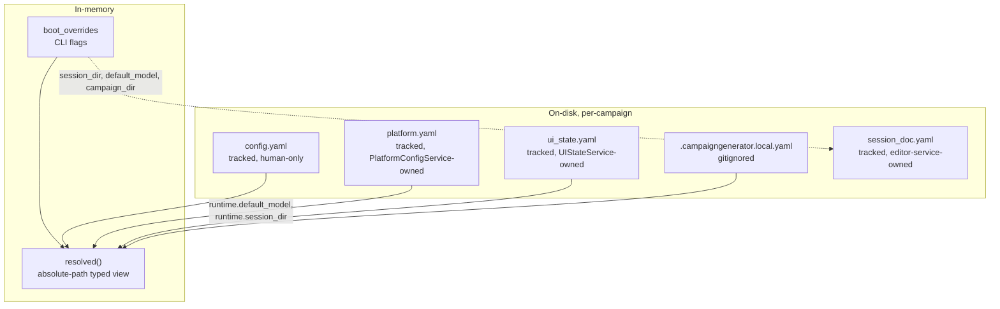

# CampaignGenerator Configuration — Schema

The app's own runtime configuration. Per `docs/config/platform-isolation.md` (Phases 0–5a), the
old fused `CampaignConfigService` is now two classes: `server/platform_config_service.py
::PlatformConfigService` owns the permanent **platform** tier (paths, `runtime.*`, wiring,
`config.yaml`) and, as its last construction step, builds `server/config_service.py::UIStateService`
— the renamed residual landlord of the ten un-isolated `ui.<section>` blobs. Both are typed by
`server/config_models.py` (`UIState`, schema v3) and `server/platform_config_shared.py`
(`PlatformDocument`, `PlatformLocalConfig`). Per-campaign. Distinct from the external wiring layer
(`config/wiring.yaml`) and the 5e content refs. Also distinct from the Session Doc Editor's own
`session_doc.yaml`, owned by `SessionEditorConfigService` — see
[Session-editor isolation](./session-editor-isolation.md).

## Documents & layers

| Source | Ownership | Model | Notes |
|---|---|---|---|
| `config.yaml` | tracked, human-only | raw dict (`_tracked`) | `PlatformConfigService` never writes it; comments/order safe |
| `platform.yaml` | tracked, server-owned | `PlatformDocument` (strict `extra="forbid"`) | `runtime.{default_model, session_dir}` — the sidebar model picker and the session-resolution anchor. Owned exclusively by `PlatformConfigService`; loaded BEFORE `UIStateService` is constructed (load-order is load-bearing — see `PlatformConfigService`'s module docstring) |
| `ui_state.yaml` | tracked, server-owned | `UIState` (v3) | Per-page UI state only — `runtime` left this document in Phase 3 (O3) |
| `.campaigngenerator.local.yaml` | gitignored, machine-local | `PlatformLocalConfig` (strict) | host/port + nav; owned by `PlatformConfigService` |
| `session_doc.yaml` | tracked, owned by `SessionEditorConfigService` | `SessionEditorConfig` (grouped, strict `extra="forbid"`) | Session Doc Editor's own slice; not part of `PlatformConfigService`/`UIStateService`/`UIState` at all — see below |
| `boot_overrides` | in-memory only | dict | CLI flags to `server.main`; not persisted. Phase 0 (O1) deleted the twelve dead `session_doc.*` flags — only `--campaign-dir`, `--session-dir`, `--config-dir`, `--host`, `--port` remain, and all five reach a real consumer |
| `resolved` | in-memory (derived) | typed view | Path fields absolute vs campaign_dir; what routers read. Thin passthrough — `PlatformConfigService.resolved()` calls `self.uis.resolved()`, since the boot-override application, sibling-session rebase, and per-field path resolution over `ui.<section>` still need `UIStateService`'s own `_PATH_FIELDS` knowledge |

## platform.yaml → PlatformDocument (strict)

New in Phase 3 (O3) of `docs/config/platform-isolation.md`. A single `runtime:` key, matching the
strictness of `SessionEditorConfig`/`PlanningConfig`. Owned outright by `PlatformConfigService` —
no delegation to `UIStateService` for either read or write, unlike the pre-Phase-3 shape where
`runtime` physically lived inside `ui_state.yaml` and had to be reached through it.

| Field | Type | Role |
|---|---|---|
| `runtime.default_model` | str | `default_factory` reads `campaignlib.constants.DEFAULT_MODEL` (env `CAMPAIGN_MODEL` or `"claude-sonnet-4-6"` — Phase 5a made this the one place that expression is computed; `server/config.py` and `PlatformRuntime` both import it rather than re-deriving it) |
| `runtime.session_dir` | str \| None | the session-resolution anchor every session-scoped path (`base="session"` in `resolve_path`/`relativize_path`) resolves against |

A missing `platform.yaml` (fresh campaign, never saved a model choice) loads as all-defaults, not
an error. A malformed file or schema mismatch raises `ConfigError` — unlike the local file below,
this document is exclusively server-written and holds the session-resolution anchor, so silent
data loss on a bad file would be worse than refusing to boot. Migrated from a pre-Phase-3
`ui_state.yaml`'s `runtime:` block via `python -m server.migrate_platform_config --campaign-dir DIR`
(modelled on `migrate_session_doc.py`: raw `yaml.safe_load`, `--config-dir`, `--force`, "nothing to
migrate" + exit 0 when clean).

## ui_state.yaml → UIState (v3)

| Field | Type | Role |
|---|---|---|
| `version` | int | `SCHEMA_VERSION = 3` — bumped from 2 in Phase 3 (O3), the second structural removal from `UIState` after Phase 5 of the session-editor isolation (which removed `session_doc`/`profiles`); this is the first version bump that actually carries information again |
| `ui` | UISection | All per-page state (typed + loose) |
| `legacy` | LegacySection | `unmigrated` quarantine |

`runtime` is **gone** — relocated to `platform.yaml` (see above). `UIState` stays
`extra="allow"`, so a pre-migration file's leftover top-level `runtime:` block loads harmlessly
and is simply ignored, the same precedent Phase 5 of the session-editor isolation set for a stale
`ui.session_doc`/`ui.profiles` block.

### Typed UI sections
`ui.vtt_summary` (VttSummarySection), `ui.grounding` (GroundingSection), `ui.ensemble`
(EnsembleSection). **`ui.session_doc` (`SessionDocSection`) and `ui.profiles` (`ProfilesSection`)
no longer exist** — both were deleted from `UISection` and from `config_models.py` when the
Session Doc Editor's config moved to its own `session_doc.yaml` (see below). Run
`python -m server.migrate_session_doc --campaign-dir DIR` once per campaign to recover that data
— see [Session-editor isolation § Migrating an existing
campaign](./session-editor-isolation.md#migrating-an-existing-campaign).

### Loose UI sections (live, under-modeled; `extra='allow'`)
`campaign_state`, `distill`, `party`, `planning`, `prep`, `npc`, `query`, `workflow`, `connections`, `experimental`
— ten sections, each a bare `_LooseSection`, still the residual `UIStateService`'s to isolate one
day (see [service-cut.md](./service-cut.md)).

### Other models
| Model | Fields |
|---|---|
| `vtt_summary` | input, output, context[], date, session_name, extract_dir, reference_summaries, session_summary |
| `grounding` | summaries (path → campaign) |
| `ensemble` | campaign_dir, chapters_glob (`docs/chapters/chapter_*.md`), chapters_selected[], extract/synthesize (BackendProfile), known_names[], aliases_path |
| `BackendProfile` | backend (`anthropic\|dgx\|openrouter\|claude-code`), endpoint, model — **API key never stored**, read from env |
| `PlatformLocalConfig.server` (`.campaigngenerator.local.yaml`) | host = `127.0.0.1`, port = `5000` |
| `PlatformLocalConfig.nav` | last_page |

`ProfileEntry` (`{name, knobs}`) and `BackendProfile` stayed in `config_models.py` — they're
reused by `session_doc.yaml`'s `profiles`/`backends` fields below — but neither is a `UIState`
field anymore.

## session_doc.yaml → SessionEditorConfig (grouped, strict)

Owned exclusively by `SessionEditorConfigService`
(`server/session_editor_config_service.py` / `session_editor_config_shared.py`) — no other code
reads or writes `<config>/session_doc.yaml`. Unlike every model above, it is **strict**
(`extra="forbid"` at every level): an unrecognized field is a validation error, not silently
dropped or carried through. Read/written whole via `GET/PUT /api/editor/config`; `profiles` is
additionally exposed as its own sub-collection at `/api/editor/profiles`.

| Field | Type | Role |
|---|---|---|
| `paths` | `EditorPaths` | path selectors — see split below |
| `narrate` | `NarrateKnobs` | `tokens` (int=16000), `prose_mode`, `reflections` (bool=False), `genre`, `batch` (bool=False), `context[]` |
| `scrub` | `ScrubKnobs` | `enabled` (bool=False), `tokens` (int=16000) |
| `roster` | `Roster` | `characters`, `gm_player` |
| `backends` | `Backends` | `active` (`anthropic\|dgx\|openrouter\|claude-code`) + per-backend `BackendProfile` memory (`anthropic`, `claude-code` — aliased from the hyphenated YAML key, `dgx`, `openrouter`) |
| `session_name` | str \| None | |
| `profiles` | `list[ProfileEntry]` | named narrate/backend knob presets |
| `active_profile` | str \| None | mirrored server-side by `POST /api/editor/profiles/{name}/activate` |

`EditorPaths` fields (session-based vs campaign-based split is service-owned metadata, not
stored per-field, mirroring the old `_PATH_FIELDS["session_doc"]`):

| Field(s) | Base |
|---|---|
| `session_recap, session_summary, scene_extractions_dir, roleplay_extractions_dir, summary_extractions_dir, narration_dir, output_dir` | `session` — resolves vs `platform.runtime.session_dir` (read through the platform, not stored here) |
| `party, voice_dir, examples_dir` | `campaign` — resolves vs campaign root |

`ResolvedEditorConfig` (never persisted) layers read-only platform extras on top for request
consumers: `model` (← `platform.runtime.default_model`, overridden per O3 by the active backend's
own remembered model when set), `work_dir`/`campaign_dir`/`config_dir`, `session_dir`, `vtt`.

## Router request-body model defaults (Phase 5a)

Every router that runs a subprocess CLI needing a `--model` flag declares `model: str | None =
None` on its request (twelve sites — five in `grounding.py`, three in `prep.py`, two in
`experimental.py`, one each in `session_workflow.py` and `connections.py`'s `ExtractRequest`
pydantic body — plus two more in `setup.py` that used to default to the `DEFAULT_MODEL`
*constant*, same defect, different spelling; fourteen total) and calls
`server/platform_config_service.py::resolve_default_model(model, request)` instead of hardcoding
a literal. Precedence: explicit request `model` → `platform.runtime.default_model` →
`campaignlib.constants.DEFAULT_MODEL` literal (reached only if no live `PlatformConfigService`
exists for the request at all — can't happen on a normally booted server). Fixes the bug where a
request that omitted `model` silently got a hardcoded `"claude-sonnet-4-6"` instead of the
sidebar's pick. See `docs/config/platform-isolation.md`'s O4/Phase-5a section for the full
before/after and the severity correction (the shipped Vue frontend always sends `model` explicitly,
so this was a latent defect on the HTTP surface, not an active misrouting of GM runs).

## Path resolution base

Two independent mechanisms, both owned by `PlatformConfigService`/`UIStateService`, that must not
be confused (Phase 4, O2, drew this line sharply after `server/config.py::derive_campaign_paths`
drifted by conflating them):

**`_PATH_FIELDS`** (formula — which base a stored relative path resolves against):

| Field(s) | Resolves against |
|---|---|
| vtt_summary.input / output / extract_dir / session_summary | `session` (→ `platform.runtime.session_dir`) |
| grounding.summaries | `campaign` |
| `platform.yaml`'s own `runtime.session_dir` | `campaign` (a separate one-entry table, `_RUNTIME_PATH_FIELDS`, since `UIState` no longer stores `runtime` at all) |

`session_doc` retired its `_PATH_FIELDS` entry in Phase 5 of the session-editor isolation — its
path resolution now lives in `SessionEditorConfigService` (`_relativized_paths` /
`resolved_editor_config`), which delegates to the platform's `resolve_path`/`relativize_path`
rather than duplicating the table above. See the `EditorPaths` split above.

**`PlatformConfigService.discover_campaign_paths`** (filesystem probe — Phase 4, O2): a
`@staticmethod` that globs/sniffs for files whose name or presence can't be known in advance
(VTT transcript, `gm-assist.md` vs `recap.md`, `summaries.md` vs `all_summaries.md`,
`docs/npcs/*.md`, `voice/`/`examples/` presence). Backs `GET /api/config/campaign-paths`, the sole
caller of which is `SessionConfig.vue`'s `deriveAll()`. This is the surviving half of the old
`server/config.py::derive_campaign_paths`; its **derivation** half (`output_dir`,
`DERIVED_SUBDIRS`, hardcoded layout constants — a second, undeclared, already-drifted
implementation of `_PATH_FIELDS`) was deleted outright, not migrated. A field that isn't a probe
belongs in `_PATH_FIELDS`, not here.

## Invariants
- `config.yaml` read-only to `PlatformConfigService`; missing file is fatal (`ConfigError`).
- `platform.yaml` load-bearing at construction time: it must load before `UIStateService` is
  built, because `UIStateService.__init__`'s `_normalize_stored_paths` relativizes session-scoped
  `ui.*` path fields against the CURRENTLY PERSISTED `runtime.session_dir` — see
  `PlatformConfigService`'s module docstring ("Why platform.yaml must load before UIStateService
  is constructed").
- `ui_state`/`local`/`platform.yaml` created lazily; writes atomic (temp + `os.replace`),
  serialized by `_write_lock`.
- `session_doc.yaml` created lazily (first editor write); a missing or empty file loads as an
  all-defaults `SessionEditorConfig`, not an error.
- Boot flags never persist — overlaid in `resolved()` (or, for the editor, in
  `resolved_editor_config()`) for the process only.
- No secrets in config — LLM keys from env; `claude-code` uses the local `claude` CLI.
- No silent "all" — `ensemble.chapters_selected` empty means nothing runs.
