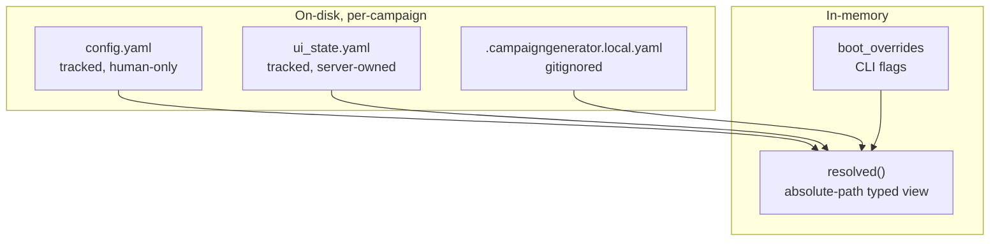

# CampaignGenerator Configuration — Schema

The app's own runtime configuration, owned by `server/config_service.py::CampaignConfigService`
and typed by `server/config_models.py` (schema v2). Per-campaign. Distinct from the external
wiring layer (`config/wiring.yaml`) and the 5e content refs.

## Documents & layers

| Source | Ownership | Model | Notes |
|---|---|---|---|
| `config.yaml` | tracked, human-only | raw dict (`_tracked`) | Service never writes it; comments/order safe |
| `ui_state.yaml` | tracked, server-owned | `UIState` (v2) | Per-page UI state + runtime + legacy quarantine |
| `.campaigngenerator.local.yaml` | gitignored, machine-local | `LocalConfig` | host/port + nav |
| `boot_overrides` | in-memory only | dict | CLI flags to `server.main`; not persisted |
| `resolved` | in-memory (derived) | typed view | Path fields absolute vs campaign_dir; what routers read |

## config.yaml (tracked, human-only)

Raw dict, no pydantic model. Read via `campaignlib.load_config` with `$VAR` expansion.

| Key | Type | Example / default | Consumed by |
|---|---|---|---|
| `system_prompt` | str (repo path) | `config/system_prompt.md` | `pipelines/session_prep/prep.py` (`load_repo_file`) |
| `log_dir` | str (path) | `logs/` | `pipelines/session_prep/prep.py`, `pipelines/grounding/npc_table.py` |
| `agents` | map name→path | `lore_oracle`, `encounter_architect`, `voice_keeper` | `pipelines/session_prep/prep.py` (pipeline mode) |
| `documents` | list[{label, path}] | `campaign_state`, `world_state`, `mechanics`, `planning`, `party` | `assemble_docs`, `pipelines/session_prep/prep.py`, `pipelines/rlm/mcp_server.py`, `session_doc/check_consistency.py` |
| `mempalace.canon_wing` | str | default `narrative` | `pipelines/rlm/mcp_server.py` |
| `mempalace.index_wings` | list | e.g. `[chronicle, abyss]` | `pipelines/rlm/mcp_server.py` |
| `mempalace.palace` | str | (usually unset) | `apply_ingest_manifest.resolve_palace` (fallback) |

Legacy/compat keys — moved to `config/wiring.yaml` (mneme-owned); still read as fallback:
`rpg_library_url`, `fivetools_data_root` (`mcp_server`), `dgx_endpoint`, `dgx_model`.

## ui_state.yaml → UIState (v2)

| Field | Type | Role |
|---|---|---|
| `version` | int | `SCHEMA_VERSION = 2` |
| `ui` | UISection | All per-page state (typed + loose) |
| `runtime` | RuntimeSection | `default_model`, `session_dir` |
| `legacy` | LegacySection | `unmigrated` quarantine |

### Typed UI sections
`ui.session_doc` (SessionDocSection), `ui.vtt_summary` (VttSummarySection), `ui.grounding`
(GroundingSection), `ui.ensemble` (EnsembleSection), `ui.profiles` (ProfilesSection + ProfileEntry, BackendProfile).

### Loose UI sections (live, under-modeled; `extra='allow'`)
`campaign_state`, `distill`, `party`, `planning`, `prep`, `npc`, `query`, `workflow`, `connections`, `experimental`.

### ui.session_doc fields
| Field(s) | Type | Meaning |
|---|---|---|
| `session, extract_dir, roleplay_dir, output_dir, summary_dir, session_summary, scene_extractions_dir, narration_dir` | path (session-based) | resolved vs `runtime.session_dir` |
| `party, voice_dir, examples_dir` | path (campaign-based) | resolved vs campaign root |
| `narrate_tokens` / `scrub_tokens` | int = 16000 | token budgets (string→int coercion) |
| `prose_mode, reflections, batch, scrub_enabled` | bool = False | null coerced to False |
| `narration_genre, session_name, gm_player, characters` | str \| None | optional knobs |
| `context` | list[str] | extra context files |
| `backend` | `anthropic \| dgx \| claude-code` | LLM selector |
| `dgx_endpoint, dgx_model` | str \| None | DGX overrides (null = runtime default) |

### Other models
| Model | Fields |
|---|---|
| `vtt_summary` | input, output, context[], date, session_name, extract_dir, reference_summaries, session_summary |
| `grounding` | summaries (path → campaign) |
| `ensemble` | campaign_dir, chapters_glob (`docs/chapters/chapter_*.md`), chapters_selected[], extract/synthesize (BackendProfile), known_names[], aliases_path |
| `BackendProfile` | backend (`anthropic\|dgx\|openrouter\|claude-code`), endpoint, model — **API key never stored**, read from env |
| `profiles` | profiles: list[ProfileEntry{name, knobs}], active |
| `runtime` | default_model (env `CAMPAIGN_MODEL` or `claude-sonnet-4-6`), session_dir |
| `LocalConfig.server` | host = `127.0.0.1`, port = `5000` |
| `LocalConfig.nav` | last_page |

## Path resolution base (`_PATH_FIELDS`)

| Field(s) | Resolves against |
|---|---|
| session_doc.session / extract_dir / roleplay_dir / output_dir / summary_dir / session_summary / scene_extractions_dir / narration_dir | `session_dir` (falls back to campaign_dir) |
| session_doc.party / voice_dir / examples_dir | campaign root |
| vtt_summary.input / output / extract_dir / session_summary | `session_dir` |
| grounding.summaries | campaign root |
| runtime.session_dir | campaign root |

## Invariants
- `config.yaml` read-only to the service; missing file is fatal (`ConfigError`).
- `ui_state`/`local` created lazily; writes atomic (temp + `os.replace`), serialized by `_write_lock`.
- Boot flags never persist — overlaid in `resolved()` for the process only.
- No secrets in config — LLM keys from env; `claude-code` uses the local `claude` CLI.
- No silent "all" — `ensemble.chapters_selected` empty means nothing runs.
