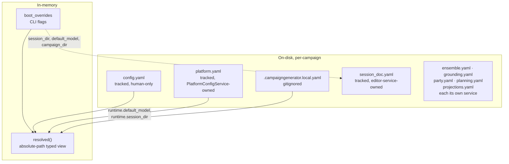

# CampaignGenerator Configuration — Schema

The app's own runtime configuration. `server/platform_config_service.py::PlatformConfigService`
owns the permanent **platform** tier (paths, `runtime.*`, wiring, `config.yaml`), typed by
`server/platform_config_shared.py` (`PlatformDocument`, `PlatformLocalConfig`). Per-campaign.
Distinct from the external wiring layer (`config/wiring.yaml`) and the 5e content refs.

`docs/config/platform-isolation.md` (Phases 0–5a) split that class out of the old fused
`CampaignConfigService`, leaving a residual `UIStateService` as landlord of the un-isolated
`ui.<section>` blobs. **That residual half no longer exists** — see
[ui-state-retirement.md](./ui-state-retirement.md). `server/config_service.py`,
`server/config_models.py`, `UIState`/`UISection`, `SCHEMA_VERSION` and `<config>/ui_state.yaml`
are all deleted: the six sections that remained were empty in every campaign, had no writer, and
had no reader that wasn't already broken. Every service with config owns its own document, listed
below.

## Documents & layers

| Source | Ownership | Model | Notes |
|---|---|---|---|
| `config.yaml` | tracked, human-only | raw dict (`_tracked`) | `PlatformConfigService` never writes it; comments/order safe |
| `platform.yaml` | tracked, server-owned | `PlatformDocument` (strict `extra="forbid"`) | `runtime.{default_model, default_backend, session_dir}` — the sidebar's two pickers and the session-resolution anchor (`default_backend` added by feature 003; see [values.md § The model/backend resolution rule](./values.md#the-modelbackend-resolution-rule-feature-003--the-single-statement)). Owned exclusively by `PlatformConfigService`. The "must load before `UIStateService`" ordering constraint this row used to carry went with that class |
| ~~`ui_state.yaml`~~ | **deleted** | — | Retired by [ui-state-retirement.md](./ui-state-retirement.md). Still read RAW by the four `server/migrate_*.py` CLIs, which exist to rescue an unmigrated campaign's data — never by the server |
| `.campaigngenerator.local.yaml` | gitignored, machine-local | `PlatformLocalConfig` (strict) | host/port + nav; owned by `PlatformConfigService` |
| `session_doc.yaml` | tracked, owned by `SessionEditorConfigService` | `SessionEditorConfig` (grouped, strict `extra="forbid"`) | Session Doc Editor's own slice, plus (since the retirement) `ProfileEntry`/`BackendProfile`, which used to be declared beside `UIState` — see below |
| `boot_overrides` | in-memory only | dict | CLI flags to `server.main`; not persisted. Phase 0 (O1) deleted the twelve dead `session_doc.*` flags — only `--campaign-dir`, `--session-dir`, `--config-dir`, `--host`, `--port` remain, and all five reach a real consumer |
| `resolved` | in-memory (derived) | typed view | `{campaign_dir, runtime, server, nav}` — boot overrides applied, path fields absolute. Implemented on `PlatformConfigService` itself since the retirement; it used to be a passthrough to `UIStateService.resolved()` and to carry a fifth key, `ui`. The `_PATH_FIELDS` machinery and sibling-session rebase that justified living there had been iterating an empty table since grounding-isolation Phase 10 |

## platform.yaml → PlatformDocument (strict)

New in Phase 3 (O3) of `docs/config/platform-isolation.md`. A single `runtime:` key, matching the
strictness of `SessionEditorConfig`/`PlanningConfig`. Owned outright by `PlatformConfigService`;
before Phase 3 `runtime` physically lived inside `ui_state.yaml` and had to be reached through the
class that owned that file.

| Field | Type | Role |
|---|---|---|
| `runtime.default_codex_reasoning_effort` | `minimal \| low \| medium \| high \| xhigh \| max \| None` | App-wide Codex-only remembered effort. `None` means “Codex default” and emits no override; the value is dormant for other providers. |
| `runtime.default_model` | str | `default_factory` reads `campaignlib.constants.DEFAULT_MODEL` (env `CAMPAIGN_MODEL` or `"claude-sonnet-4-6"` — Phase 5a made this the one place that expression is computed; `server/config.py` and `PlatformRuntime` both import it rather than re-deriving it) |
| `runtime.session_dir` | str \| None | the session-resolution anchor every session-scoped path (`base="session"` in `resolve_path`/`relativize_path`) resolves against |

A missing `platform.yaml` (fresh campaign, never saved a model choice) loads as all-defaults, not
an error. A malformed file or schema mismatch raises `ConfigError` — unlike the local file below,
this document is exclusively server-written and holds the session-resolution anchor, so silent
data loss on a bad file would be worse than refusing to boot. Migrated from a pre-Phase-3
`ui_state.yaml`'s `runtime:` block via `python -m server.migrate_platform_config --campaign-dir DIR`
(modelled on `migrate_session_doc.py`: raw `yaml.safe_load`, `--config-dir`, `--force`, "nothing to
migrate" + exit 0 when clean).

## ~~ui_state.yaml → UIState~~ — retired

**The document, its models and its route are deleted** —
[ui-state-retirement.md](./ui-state-retirement.md), 2026-07-25. Gone with it:
`server/config_service.py` (`UIStateService`), `server/config_models.py`
(`UIState`/`UISection`/`_LooseSection`/`LegacySection`/`UI_SECTION_NAMES`/`SCHEMA_VERSION`),
`PUT /api/config/section/{name}`, the store's `updateSection`, and the `ui_state_path` +
`schema_version` keys of `GET /api/config/`.

It was retired rather than re-homed because the six sections it still held — `prep`, `npc`,
`query`, `workflow`, `connections`, `experimental` — were **empty in every campaign** and had
**no writer**: `updateSection` had no callers, so the only write door into the file was unreachable
from the shipped UI. The four pages those names were reserved for keep their in-component state and
persist nothing, by decision (D1).

The eventual `version: 5` is the tell in hindsight: five schema bumps, four of them recording a
section's *departure*. Nothing ever arrived.

### Migrating a campaign that still has one

Any `ui_state.yaml` left on disk is now inert — the server does not open it. Its data is recovered
by the four one-shot CLIs, which read the file RAW (never through a typed model) precisely so they
can rescue fields no live schema declares. **Retiring the reader did not retire the rescuers.**

| Was | Now | Migrate with |
|---|---|---|
| `runtime` | `platform.yaml` (`PlatformDocument`) | `python -m server.migrate_platform_config --campaign-dir DIR` |
| `ui.session_doc` + `ui.profiles` | `session_doc.yaml` (`SessionEditorConfig`) | `python -m server.migrate_session_doc --campaign-dir DIR` |
| `ui.ensemble` | `ensemble.yaml` (`EnsembleConfig`) | `python -m server.migrate_ensemble_config --campaign-dir DIR` |
| `ui.grounding` + `ui.campaign_state` + `ui.distill` + `ui.party` + `ui.planning` | `grounding.yaml` (`GroundingConfig`) | `python -m server.migrate_grounding_config --campaign-dir DIR` |
| `ui.vtt_summary` | *(nothing — the VTT Summary service was retired outright)* | no migration |
| `ui.{prep,npc,query,workflow,connections,experimental}` | *(nothing — never held data)* | no migration |

Run them before deleting the file. `tests/test_no_ui_state.py` guards both directions: no live code
may reference the retired tier, **and** each migration CLI must still name the document it exists to
rescue.

## ensemble.yaml → EnsembleConfig (grouped, strict)

`<config>/ensemble.yaml`, owned outright by `EnsembleConfigService`
(`server/ensemble_config_shared.py`). Strict (`extra="forbid"`), atomic writes, lazy on first
write; a missing or empty file loads as an all-defaults `EnsembleConfig`, not an error.

| Group | Fields |
|---|---|
| *(root)* | `chapters_selected[]` |
| `extract` / `synthesize` | `EnsembleBackend`: backend (`anthropic\|dgx\|openrouter\|claude-code`), **`endpoints[]`** (plural — the extract stage fans out across DGX hosts), model |
| `paths` | chapters_glob, per_chapter_dir, corpus_glob, merged_out, state_dossiers_dir, dossiers_glob, npc_dossiers_glob, threads_out, **drafts_dir**, inventory |
| `tuning` | chapter_parallel, chunk_parallel, bundle_min_facts, threads_min_facts, **background_min_facts**, **dossier_recent_window**, entity_parallel |
| `merge` | method (`subject\|embed\|null` = derive), embed_endpoint, embed_model, embed_threshold, similarity |
| `planning` | synth_mode (`config\|flat`), npc[], arc_scores[], context[], depth (`scene\|full`), force_include[] |

`paths` and `tuning` were Python literals in `server/routers/ensemble.py`'s route signatures
before Phase 3 of [ensemble-isolation.md](./ensemble-isolation.md) — unreachable without editing
code. `planning` holds the six `planning_*` keys that used to ride on `ui.ensemble`'s
`extra="allow"` overflow, undeclared and unvalidated. `campaign_dir` is deliberately absent: it is
platform-tier. `bundle_min_facts` and `threads_min_facts` are separate fields because the shipped
defaults genuinely differ (3 vs 2). `known_names[]`/`aliases_path` — present in an earlier shape of
this table — were retired from the schema by a prior, unrelated effort in favor of the entity
registry (`docs/entity_registry.yaml`; commit `ed44935`), not by
[projection-isolation.md](./projection-isolation.md). `load_ensemble_config` still prunes both
keys from a pre-migration file on read, silently and without rewriting it
(`server/ensemble_config_shared.py:267-271`) — this table previously still listed them as live
root fields, which was already stale before this feature touched the file.

**`paths.drafts_dir`** (`docs/ensemble/drafts`) is where `/run/synthesize`'s four draft outputs
land — it replaced the draft half of `server/routers/ensemble.py`'s old `GROUNDING_DOCS` map, the
live-doc half of which is unaffected and stays a router literal (`server/routers/ensemble.py:68-81`).
**`paths.recent_events_out` and `tuning.recent_events_window` are gone, deleted with no
compatibility shim** — [projection-isolation.md](./projection-isolation.md) (research D15):
`build_recent_events` wraps the event spine, and once its `--store` resolved from a new
`projections.yaml`, leaving these two fields here would make a Dossier Synthesis route read State
Projection's config document. They now live as `output.recent_events` /
`output.recent_events_window` in `projections.yaml`, below. Both live campaigns carried
`recent_events_out`, so `GET /api/ensemble/config` returns `400` naming it until hand-removed —
the server still boots, only that page is affected.

**`dossier_recent_window` + `background_min_facts`** (settable on `/ensemble/setup`) scope
`synthesise_world_state`'s entity-dossier payload, and only make sense as a pair. Entities touched
within the last `dossier_recent_window` chapters are included **whatever their fact count**;
`background_min_facts` then filters everything older. They were one field
(`dossier_min_facts`, applied to every dossier) until [#194](https://github.com/kostadis/CampaignGenerator/issues/194):
a bare frequency floor deletes the present, because an entity introduced in the newest chapter has
the fewest facts by construction. A pre-rename `ensemble.yaml` is migrated on read with its value
preserved. Note `dossier_recent_window` is **not** `recent_events_window` — that one scopes
`build_recent_events`' `recent_events.md`, a different track.

**`merge`** (added by [#197](https://github.com/kostadis/CampaignGenerator/issues/197))
selects how `ensemble_merge` collapses the five extraction lenses into
`merged.json`. Field names mirror the flat mapping `ensemble_merge --config`
already accepts, so the names hold from here through the CLI flag to the
merge-config YAML. The two methods are **not** tunings of one algorithm:
`subject` groups on `(type, normalized_subject)` and therefore never compares
facts filed under different subjects, so cross-subject duplicates and
contradictions survive it by construction; `embed` partitions on `type` alone and
clusters on embedding cosine. `method: null` derives — `embed` when
`embed_endpoint` is set, else `subject`. Only `embed_endpoint` is surfaced on
`/ensemble/setup`; `0.94` is a measured threshold (calibrated on
`qwen3-embedding:0.6b`, 2026-07-28 — precision-first, zero false merges on the
labeled set; model-specific, recalibrate via `calibrate_embed` if the embed
model changes) rather than a dial. Before #197 none of this was declared and
`/run/extract` emitted no merge flags, so every UI-driven extraction silently
got `subject`.

### ~~Loose UI sections~~ — none
There are no `ui.<section>` blobs and no `_LooseSection` type. The last six were deleted with
`ui_state.yaml` (see above); `service-cut.md`'s "no service ownership" gap is **closed**.

## grounding.yaml → GroundingConfig (grouped, strict)

`<config>/grounding.yaml`, owned outright by `GroundingConfigService`
(`server/grounding_config_shared.py`). Strict (`extra="forbid"`), atomic writes, lazy on first
write; a missing or empty file loads as all-defaults.

One document for four pages because `campaign_state`/`distill`/`party`/`planning` are one
pipeline (extract → human review → synthesize) run four times through one router with a
near-identical parameter block — not four services.

| Group | Fields |
|---|---|
| *(root)* | `summaries` — the shared canonical-timeline pointer all four runs inherit |
| `campaign_state` | `GroundingRun` + `track_files[]`, `track_items[]` |
| `distill` | `GroundingRun` |
| `party` | `GroundingRun` + `mode`, `config_path`, `characters[]`, `backstory[]`, `arc_scores[]` |
| `planning` | `GroundingRun` + `synth_mode`, `config_path`, `npc[]`, `arc_scores[]`, `dossiers` |

`GroundingRun` (shared base): `input`, `output`, `extract_dir`, `split_chapters`,
`chunk_size`, `context[]`, `no_log`. Before Phase 8 every one of these was a literal in a
route signature — `chunk_size: int = 60000` appeared five times, and `split_chapters`
defaulted to `""` in Python but `'# Chapter'` in all four Vue pages.

### Other models
| Model | Fields |
|---|---|
| `grounding` | summaries (path → campaign) |
| `BackendProfile` | backend (`anthropic\|dgx\|openrouter\|claude-code`), endpoint, model — **API key never stored**, read from env. Used by `session_doc.yaml`'s `backends` only; ensemble has its own `EnsembleBackend` with a plural `endpoints` list |
| `PlatformLocalConfig.server` (`.campaigngenerator.local.yaml`) | host = `127.0.0.1`, port = `5000` |
| `PlatformLocalConfig.nav` | last_page |

`ProfileEntry` (`{name, knobs}`) and `BackendProfile` now live in
`server/session_editor_config_shared.py`, their only consumer. They were declared beside `UIState`
back when the editor's config *was* a `ui_state.yaml` section; Phase 5 of the session-editor
isolation moved the data out and left the models behind, and D2 of
[ui-state-retirement.md](./ui-state-retirement.md) finished the move when that module was
deleted.

## projections.yaml → ProjectionConfig (grouped, strict)

`<config>/projections.yaml`, owned outright by `ProjectionConfigService`
(`server/projection_config_service.py`), modelled in `campaignlib/projection_config.py` rather
than `server/` — the CLI engines (`event_spine`, `thread_registry`, `grounding_sections`,
`build_recent_events`) need the same shape, and `test_layering.py` forbids them importing
`server`. Strict (`extra="forbid"`), atomic writes, lazy on first write; a missing or empty file
loads as all-defaults, identical in content to the tool's pre-config behavior (SC-006).

One document for the State Projection service's three CLIs, replacing what used to be Python
literals — several of them declared more than once and capable of disagreeing
(`docs/ensemble/events.jsonl` was three independent literals inside `grounding_sections.py`
alone). See [projection-isolation.md](./projection-isolation.md) for the full design.

| Group | Fields |
|---|---|
| `stores` | `events`, `thread_registry`, `thread_proposals`, `thread_adjudication`, `tracking` — this service's own durable state, written and read back by its own CLIs |
| `inputs` | `dossiers`, `dossiers_fallback`, `narrative_importance`, `party`, `planning_notes`, `speculations` — produced by other services, declared here as pointers rather than read from their config documents |
| `output` | `sections_dir`, `draft`, `legacy_draft`, `recent_events`, `recent_events_window` |
| `selection` | `ModelSelection` — this service's own model/backend override (feature 003), empty by default (inherit the platform tier) |

`inputs.dossiers_fallback` is used only when `inputs.dossiers` (the type-merge-curated set) has no
matching files, and which one was used is reported in the run's output and in the rendered section
body — never silent (FR-024a; Phandalin, one of the two live campaigns, has no `merged_dossiers/`
and always exercises this fallback). `output.draft` must contain the literal `{doc}` placeholder
(validated at load) so the four documents cannot collapse onto one file; `output.legacy_draft` is
the pre-move shared path the FR-007b gate checks before every write, never moved or deleted by the
system itself. `output.recent_events` / `output.recent_events_window` **moved here from
`ensemble.yaml`'s `paths.recent_events_out` / `tuning.recent_events_window`**
([projection-isolation.md](./projection-isolation.md) research D15) — `build_recent_events` wraps
`event_spine`, so once its `--store` resolved from this document, its output settings had to move
with it or a Dossier Synthesis route would be reading State Projection's config. No `corpus` field
exists on this model, deliberately: `event_spine update --corpus` and `thread_registry propose
--corpus` are both `required=True`, and a config default would manufacture an implicit "all
chapters" (Constitution X). No `sections`/`specs` field either — which sections exist and which
document they belong to stays Python (`grounding_sections.py`'s `SPECS`), a fixed editorial
decision, not a configurable value.

## session_doc.yaml → SessionEditorConfig (grouped, strict)

Owned exclusively by `SessionEditorConfigService`
(`server/session_editor_config_service.py` / `session_editor_config_shared.py`) — no other code
reads or writes `<config>/session_doc.yaml`. Unlike every model above, it is **strict**
(`extra="forbid"` at every level): an unrecognized field is a validation error, not silently
dropped or carried through. Read/written whole via `GET/PUT /api/editor/config`; `profiles` is
additionally exposed as its own sub-collection at `/api/editor/profiles`.

| Field | Type | Role |
|---|---|---|
| `paths` | `EditorPaths` | path selectors — see split below |
| `narrate` | `NarrateKnobs` | `tokens` (int=16000), `prose_mode`, `reflections` (bool=False), `genre`, `context[]` — `batch` retired (005-ui-batch-selection T029; a stray key is stripped on load, see `RETIRED_NARRATE_FIELDS`), superseded by `backends.<name>.batch` below |
| `roster` | `Roster` | `characters`, `gm_player` |
| `backends` | `Backends` | `active` (`anthropic\|dgx\|openrouter\|claude-code`) + per-backend `BackendProfile` memory (`anthropic`, `claude-code` — aliased from the hyphenated YAML key, `dgx`, `openrouter`), each carrying `model`, `endpoint` (dgx only), and `batch` (bool \| None — 005-ui-batch-selection) |
| `session_name` | str \| None | |
| `profiles` | `list[ProfileEntry]` | named narrate/backend knob presets |
| `active_profile` | str \| None | mirrored server-side by `POST /api/editor/profiles/{name}/activate` |

`EditorPaths` fields (session-based vs campaign-based split is service-owned metadata, not
stored per-field, mirroring the old `_PATH_FIELDS["session_doc"]`):

| Field(s) | Base |
|---|---|
| `session_recap, session_summary, scene_extractions_dir, roleplay_extractions_dir, summary_extractions_dir, narration_dir, output_dir` | `session` — resolves vs `platform.runtime.session_dir` (read through the platform, not stored here) |
| `party, voice_dir, examples_dir` | `campaign` — resolves vs campaign root |

`ResolvedEditorConfig` (never persisted) layers read-only platform extras on top for request
consumers: `model` (← `platform.runtime.default_model`, overridden per O3 by the active backend's
own remembered model when set), `work_dir`/`campaign_dir`/`config_dir`, `session_dir`, `vtt`.

## Router request-body model defaults (Phase 5a)

Every router that runs a subprocess CLI needing a `--model` flag declares `model: str | None =
None` on its request (nine sites — five in `grounding.py`, three in `prep.py`, one in
`connections.py`'s `ExtractRequest` pydantic body — plus two more in `setup.py` that used to
default to the `DEFAULT_MODEL` *constant*, same defect, different spelling; eleven total.
Phase 5a covered fourteen; `experimental.py` ×2 and `session_workflow.py` ×1 were deleted with
the VTT Summary chain) and calls
`server/platform_config_service.py::resolve_selection` instead of hardcoding
a literal — one seam for all 22 token-spending endpoints, model and backend together. For the
precedence and the pairing rule, see [values.md § The model/backend resolution rule](./values.md#the-modelbackend-resolution-rule-feature-003--the-single-statement).

## Path resolution base

Two independent mechanisms, both owned by `PlatformConfigService`, that must not be confused
(Phase 4, O2, drew this line sharply after `server/config.py::derive_campaign_paths` drifted by
conflating them):

**Path-base formulas** — which base a stored relative path resolves against.

| Field(s) | Resolves against | Owner |
|---|---|---|
| `platform.yaml`'s `runtime.session_dir` | `campaign` | `_RUNTIME_PATH_FIELDS`, a one-entry table in `platform_config_service.py`, applied in `resolved()` |
| `session_doc.yaml`'s `EditorPaths` | `session` or `campaign`, per field | `SessionEditorConfigService` (`_relativized_paths` / `resolved_editor_config`), delegating to the platform's `resolve_path`/`relativize_path` rather than duplicating them |
| `grounding.yaml`, `party.yaml`, `planning.yaml` | `campaign` root | their own services (Track A′ of [grounding-isolation.md](./grounding-isolation.md) unified this) |

`UIStateService`'s `_PATH_FIELDS` — the general per-section table these grew out of — is **gone**.
It had been empty since Phase 10 of the grounding isolation took its last row
(`grounding.summaries`), so the normalize pass, the write-time relativize choke point and the
sibling-session rebase were all iterating an empty dict. It was kept and flagged at the time on the
grounds that "retiring it belongs with retiring `UIStateService` itself" — which is exactly what
[ui-state-retirement.md](./ui-state-retirement.md) did.

**`PlatformConfigService.discover_campaign_paths`** (filesystem probe — Phase 4, O2): a
`@staticmethod` that globs/sniffs for files whose name or presence can't be known in advance
(VTT transcript, `gm-assist.md` vs `recap.md`, `summaries.md` vs `all_summaries.md`,
`docs/npcs/*.md`, `voice/`/`examples/` presence). Backs `GET /api/config/campaign-paths`, the sole
caller of which is `SessionConfig.vue`'s `deriveAll()`. This is the surviving half of the old
`server/config.py::derive_campaign_paths`; its **derivation** half (`output_dir`,
`DERIVED_SUBDIRS`, hardcoded layout constants — a second, undeclared, already-drifted
implementation of `_PATH_FIELDS`) was deleted outright, not migrated. A field that isn't a probe
belongs in `_PATH_FIELDS`, not here.

## Invariants
- `config.yaml` read-only to `PlatformConfigService`; missing file is fatal (`ConfigError`).
- `platform.yaml` load-bearing at construction time: it must load before `UIStateService` is
  built, because `UIStateService.__init__`'s `_normalize_stored_paths` relativizes session-scoped
  `ui.*` path fields against the CURRENTLY PERSISTED `runtime.session_dir` — see
  `PlatformConfigService`'s module docstring ("Why platform.yaml must load before UIStateService
  is constructed").
- `ui_state`/`local`/`platform.yaml` created lazily; writes atomic (temp + `os.replace`),
  serialized by `_write_lock`.
- `session_doc.yaml` created lazily (first editor write); a missing or empty file loads as an
  all-defaults `SessionEditorConfig`, not an error.
- Boot flags never persist — overlaid in `resolved()` (or, for the editor, in
  `resolved_editor_config()`) for the process only.
- No secrets in config — LLM keys from env; `claude-code` uses the local `claude` CLI.
- No silent "all" — `ensemble.yaml`'s `chapters_selected` empty means nothing runs, and the
  config value deliberately does **not** stand in for an omitted `chapters` request parameter.
