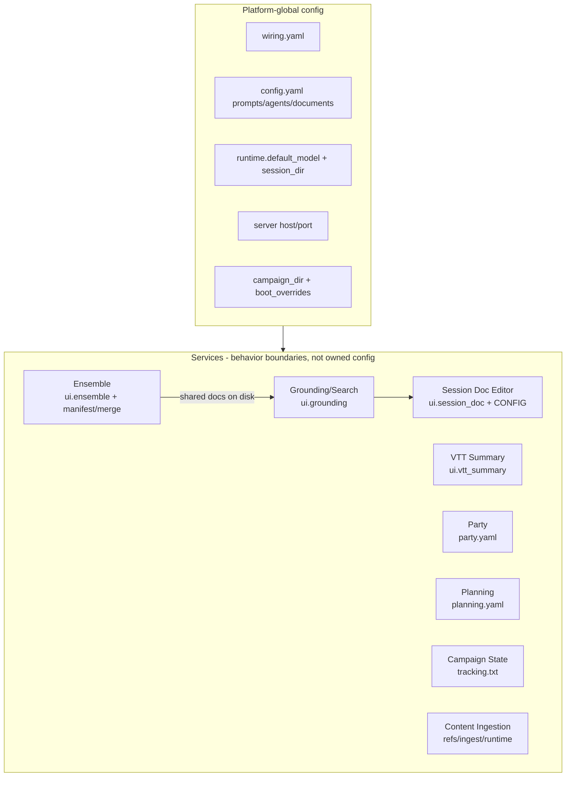

# CampaignGenerator as a Multi-Service Monolith

Re-slicing the config map along service boundaries. CampaignGenerator is effectively a UI + thin
routers over a set of independent workflows (session doc editor, ensemble, planning, party, ...).
Config splits into platform-global vs service-local — but the split is a convention, with no
enforced hierarchy or management layer.

## Implied services

| Service | Router / entry | ui_state section | CLI engine | Its config/state |
|---|---|---|---|---|
| Session Doc Editor | `scene_editor.py` + `scene_editor.CONFIG` | `ui.session_doc`, `ui.profiles` | narrate/scrub CLI | backend/dgx knobs, tokens, prose/reflections, session paths |
| Ensemble | `pipelines/ensemble/ensemble.py` | `ui.ensemble` | `ensemble_extract`/`ensemble_merge`/`synthesise_*` | chapters, known_names, aliases, per-stage `BackendProfile`, `manifest.json`, `merge.yaml` |
| VTT Summary | `session_workflow.py` | `ui.vtt_summary` | `session_doc/vtt_summary.py` | input/output, extract_dir, reference_summaries |
| Grounding / Search | `grounding.py`, `pipelines/rlm/mcp_server.py` | `ui.grounding` | grounded_search, query_lore, rpg_retriever | summaries pointer; reads wiring |
| Party | `config_routes` party-yaml | `ui.party` (loose) | `pipelines/grounding/party.py` | `party.yaml` (roster, 3-state arc_score) |
| Planning | `planning_routes` | (none - uses dedicated PlanningConfigService) | `pipelines/grounding/planning.py` | `planning.yaml` (npcs/factions) |
| Campaign State | (CLI-only page) | `ui.campaign_state` (loose) | `pipelines/grounding/campaign_state.py` | `tracking.txt` |
| Distill / NPC / Query / Prep / Connections / Experimental | generic `PUT /section/{name}` | `ui.<loose>` | `pipelines/grounding/distill.py`, `pipelines/grounding/npc_table.py`, `pipelines/session_prep/prep.py`, ... | under-modeled `extra='allow'` sections |
| Content Ingestion (5e) | `launch_5etools_mcp` / `apply_ingest_manifest` | (none) | `resolve_refs`, `fivetools_ingest` | `refs.yaml`, `refs.local.yaml`, `ingest_manifest.yaml`, runtime tree |

## Platform-global config (all services)

| Concern | Where | Why global |
|---|---|---|
| Platform identity/roots | `config/wiring.yaml` (mneme) | external endpoints + data roots shared by every service |
| Repo prompts/agents/docs | `config.yaml` (system_prompt, agents, documents[], log_dir) | shared inputs for prep + doc-reading services |
| Runtime model + session | `ui_state.runtime.{default_model, session_dir}` | cross-service defaults |
| Server binding | `local.yaml` server.{host,port} | the monolith process |
| Campaign root + boot ctx | `campaign_dir` + `boot_overrides` | process-wide context |
| Grounding docs (shared state) | `docs/{world_state,campaign_state,party,planning}.md` | produced by some services, consumed by others as shared truth |

## Service-local config

| Service | Owns |
|---|---|
| Session Doc Editor | `ui.session_doc`, `ui.profiles`, `scene_editor.CONFIG` |
| Ensemble | `ui.ensemble`, `manifest.json`, `merge.yaml`, aliases file, `*_draft.md` |
| VTT Summary | `ui.vtt_summary` |
| Grounding/Search | `ui.grounding.summaries` |
| Party | `party.yaml` |
| Planning | `planning.yaml` |
| Campaign State | `tracking.txt` |
| Content Ingestion | `refs.yaml`, `refs.local.yaml`, `ingest_manifest.yaml`, `~/.5etools-mcp-runtime/` |

## Where the monolith shows (no hierarchy / management)

| Gap | Evidence |
|---|---|
| No service ownership | All service sections share one `ui_state.yaml`; no service owns/validates its config lifecycle. Config service is a flat single authority |
| No config hierarchy | Global vs service-local is convention, not enforced. `config.yaml` mixes global (prompts) + service (`mempalace`); `ui_state` mixes runtime (global) + 15 service sections |
| Duplicated backend/model selection | `session_doc.backend`, ensemble `extract`/`synthesize` `BackendProfile`, `dgx_*` in wiring, `runtime.default_model` — no central model/backend manager; each service re-picks |
| Coupling via shared files, not APIs | Services integrate by reading/writing the same `docs/*.md` and palace, not versioned contracts. Disk is the bus |
| No schema-per-service enforcement | 10 loose sections use `extra='allow'`; typed and unmodeled sections coexist; no per-service validation gate |
| No dependency ordering / registry | Ensemble → grounding → prep/search is implicit through file mtimes; no declared service graph |

## The cut, stated plainly

There are two real config tiers: **PLATFORM** (mneme wiring, repo prompts/agents/documents, runtime
model + session, server binding, campaign root) and **SERVICE** (one typed-or-loose ui section per
workflow, plus that service's own YAML/artifacts). But they are physically co-mingled — `ui_state.yaml`
is one document holding every service's section, `config.yaml` holds both global and `mempalace` keys,
and no service validates or owns its slice. Services communicate through shared on-disk docs and the
palace rather than contracts. The system is a set of microservices wearing a monolith's clothes: the
boundaries exist in behavior (routers + CLI engines + sections) but not in ownership, schema
enforcement, model/backend management, or dependency orchestration.

## If you wanted to manage it

A managing hierarchy would: (1) give each service its own owned+validated config namespace (split
`ui_state` per service, or a per-service file), (2) centralize model/backend selection into one
platform provider the services request from, (3) replace file-mtime coupling with declared
producer/consumer contracts for the grounding docs, and (4) add a service registry so ordering
(ensemble then grounding then prep/search) is explicit rather than implied.
