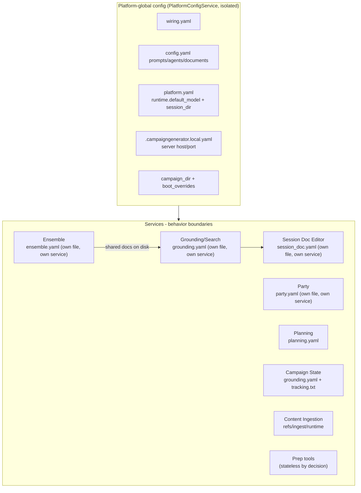

# CampaignGenerator as a Multi-Service Monolith

Re-slicing the config map along service boundaries. CampaignGenerator is effectively a UI + thin
routers over a set of independent workflows (session doc editor, ensemble, planning, party, ...).
Config splits into platform-global vs service-local. That split **used to be** a convention with
no enforced hierarchy or management layer; `docs/config/platform-isolation.md` (Phases 0–5a) made
the platform tier an actual owned, validated, physically separate thing —
`PlatformConfigService` — rather than a description of where some values happened to live inside
a class that also owned ten unrelated `ui.<section>` blobs.

**As of 2026-07-25 the split is complete on the ownership axis.** Every service with config owns a
strict document of its own, and the shared `ui_state.yaml` those blobs lived in is gone
([ui-state-retirement.md](./ui-state-retirement.md)) — its last six sections turned out to be
empty reservations rather than un-extracted services. See [Where the monolith
shows](#where-the-monolith-shows-no-hierarchy--management) for what that closed and what remains:
backend *selection*, producer/consumer contracts, and dependency ordering.

Every service is now drawn with **owned config**, not just a behavior boundary. There is no
"pending" column left on this diagram: the shared `ui_state.yaml` that once sat beside the
platform box is gone, and the prep tools that were assumed to be waiting for their own file turned
out to need none. See [Where the monolith
shows](#where-the-monolith-shows-no-hierarchy--management) for what that closed and what's still
open — selection, contracts, ordering.

## Implied services

| Service | Router / entry | Config | CLI engine | Its config/state |
|---|---|---|---|---|
| Session Doc Editor | `scene_editor.py` + `SessionEditorConfigService` | own file: `session_doc.yaml` (grouped, strict) | narrate/scrub CLI | backend/dgx knobs, tokens, prose/reflections, session paths, `profiles[]` |
| Ensemble *(Extraction & State + Dossier Synthesis — see note below)* | `server/routers/ensemble.py` + `EnsembleConfigService` | own file: `ensemble.yaml` (grouped, strict) | `ensemble_extract`/`ensemble_merge` (extraction+bundling) and `synthesise_*` (rendering) | chapters, per-stage `EnsembleBackend`, artifact `paths` (incl. `drafts_dir`), `tuning`, planning overrides, `manifest.json`, `merge.yaml` |
| Grounding / Search | `grounding.py` + `GroundingConfigService` | own file: `grounding.yaml` (grouped, strict) | campaign_state, distill, party, planning CLIs | shared `summaries` pointer + a run profile per doc |
| State Projection | `server/routers/projections.py` + `ProjectionConfigService` | own file: `projections.yaml` (grouped, strict) | `event_spine`/`thread_registry`/`grounding_sections`/`build_recent_events` | `stores` (own durable state), `inputs` (pointers into Ensemble's dossiers), `output` (own `docs/projections/` namespace + the legacy-draft gate) — see [projection-isolation.md](./projection-isolation.md) |
| Party | `party_routes` + `PartyConfigService` | own file: `party.yaml` | `pipelines/grounding/party.py` | roster, 3-state arc_score |
| Planning | `planning_routes` + `PlanningConfigService` | own file: `planning.yaml` | `pipelines/grounding/planning.py` | npcs/factions |
| Campaign State | `grounding.py` (`/run/campaign-state`) | `grounding.yaml`'s `campaign_state` group | `pipelines/grounding/campaign_state.py` | `tracking.txt` |
| NPC Table / Query / Session Prep / Connection Graph | `prep.py`, `connections.py` | **none — stateless by decision** (D1 of [ui-state-retirement.md](./ui-state-retirement.md)) | `pipelines/grounding/npc_table.py`, `pipelines/session_prep/prep.py`, `pipelines/rlm/query.py` | nothing persisted. These held reserved `ui.<loose>` sections that no code ever wrote; they are one-shot run forms, so the GM's call was to record the statelessness rather than build them a tier |
| Content Ingestion (5e) | `launch_5etools_mcp` / `apply_ingest_manifest` | (none) | `resolve_refs`, `fivetools_ingest` | `refs.yaml`, `refs.local.yaml`, `ingest_manifest.yaml`, runtime tree |

**The "Ensemble" row is one config document over two logical services** — a distinction
`specs/006-state-projection-service/research.md` (R1) drew explicitly while scoping State
Projection, because State Projection depends on the first half and not the second. `ensemble_batch`
+ `facts_to_state` (the **Extraction & State** service) produce the fact corpus and per-entity
dossiers; neither renders prose. `synthesise_world_state`/`synthesise_facts`/`synthesise_polish`
(the **Dossier Synthesis** service) render the four grounding docs from those dossiers, and is a
sibling of Grounding/Search and State Projection, not their shared substrate. State Projection
depends on Extraction & State's output (dossiers, corpus) and, for its four synthesis-mode
sections, on Dossier Synthesis's *engine* as a declared subprocess call — never on either one's
*configuration* (`projection-isolation.md`'s FR-003 discussion). `ensemble.yaml` was deliberately
**not** split along this line — research D11 found no knob one half needs that the other must not
see, and a document with no motivated consumer is a tax the constitution's Architecture-is-Destiny
clause argues against paying.

## Platform-global config (all services)

| Concern | Where | Why global |
|---|---|---|
| Platform identity/roots | `config/wiring.yaml` (mneme) | external endpoints + data roots shared by every service. Does not yet include the model registry — Phase 5b, deferred, [issue #177](https://github.com/kostadis/CampaignGenerator/issues/177) |
| Repo prompts/agents/docs | `config.yaml` (system_prompt, agents, documents[], log_dir) | shared inputs for prep + doc-reading services |
| Runtime model + session | `platform.yaml`'s `runtime.{default_model, session_dir}` — **its own file since Phase 3 (O3)**, not a section of `ui_state.yaml` | cross-service defaults; plus `default_backend` (feature 003); the platform tier every one of the 22 token-spending endpoints resolves through via `resolve_selection` |
| Server binding | `.campaigngenerator.local.yaml` server.{host,port} | the monolith process |
| Campaign root + boot ctx | `campaign_dir` + `boot_overrides` | process-wide context |
| Grounding docs (shared state) | `docs/{world_state,campaign_state,party,planning}.md` | produced by some services, consumed by others as shared truth |

## Service-local config

| Service | Owns |
|---|---|
| Session Doc Editor | `session_doc.yaml` — own file, own service (`SessionEditorConfigService`); no `ui_state.yaml` section and no `scene_editor.CONFIG` process-global anymore |
| Ensemble | `ensemble.yaml` — own file, own service (`EnsembleConfigService`) — plus `manifest.json`, `merge.yaml`, `docs/ensemble/drafts/*_draft.md` (`paths.drafts_dir`) |
| Grounding/Search | `grounding.yaml` — own file, own service (`GroundingConfigService`) |
| State Projection | `projections.yaml` — own file, own service (`ProjectionConfigService`) — plus `docs/ensemble/events.jsonl`, `docs/thread_registry.yaml`, `docs/grounding_sections/`, `docs/projections/*_draft.md` |
| Party | `party.yaml` — own file, own service (`PartyConfigService`) |
| Planning | `planning.yaml` (own file, own service — `PlanningConfigService`) |
| Campaign State | `grounding.yaml`'s `campaign_state` group + `tracking.txt` |
| Content Ingestion | `refs.yaml`, `refs.local.yaml`, `ingest_manifest.yaml`, `~/.5etools-mcp-runtime/` |
| NPC Table / Query / Session Prep / Connection Graph | nothing — deliberately stateless (D1) |

## Where the monolith shows (no hierarchy / management)

Four of the seven gaps below are now **closed**, across five efforts: service-level isolation
(Session Doc Editor, Planning, Ensemble, Grounding, Party), the platform-level isolation
`platform-isolation.md` describes, and finally `ui-state-retirement.md`, which closed the last
ownership row by deleting a tier rather than extracting one more service.

Three remain **open**, noted per-row rather than papered over — and worth stating plainly, because
four closed rows can read as "finished": what is left is the *interesting* half. Ownership and
schema enforcement were the tractable problems. Backend *selection*, producer/consumer contracts,
and dependency ordering are the ones that need a design, not a refactor:

| Gap | Evidence |
|---|---|
| No service ownership | **Closed** ([ui-state-retirement.md](./ui-state-retirement.md), 2026-07-25). Session Doc Editor (`session_doc.yaml`), Planning (`planning.yaml`), Ensemble (`ensemble.yaml`), Grounding (`grounding.yaml`) and Party (`party.yaml`) each own+validate their own file. The six loose sections that remained — `prep`, `npc`, `query`, `workflow`, `connections`, `experimental` — did not become a sixth service, because they were not one: all six were **empty in every campaign**, had **no writer** (the generic `PUT /api/config/section/{name}` route had no client anywhere in the frontend) and no reader that wasn't already broken. `UIStateService`, `ui_state.yaml`, `UIState`/`UISection`, `SCHEMA_VERSION` and the route were deleted rather than re-homed. Two defects surfaced on the way out: `EnsembleSynthesize.vue` had been reading `ui.party`/`ui.planning` since the grounding isolation deleted them (blank prefills, permanently-firing warnings), and `server/main.py`'s boot-failure message named a file the server no longer reads. **Earlier, in the grounding isolation:** `ui.campaign_state` and `ui.distill` were **write-never** — read on mount, never persisted — and `ui.party`/`ui.planning` persisted 2 of the 9 and 12 fields they read |
| Fused platform + residual roles | **Closed** (`platform-isolation.md`, new gap named and closed in the same effort). Through this branch's Phase 1, `CampaignConfigService` was simultaneously the permanent platform (paths, `runtime.*`, boot overrides, wiring/`config.yaml` access) AND the residual landlord of the ten loose `ui.<section>` blobs — one 610-line class, one write lock, one `ui_state.yaml`, so a `ui.distill` save could corrupt `runtime.default_model`/`session_dir`, the values every other service composes. Phase 2 split the class; Phase 3 (O3) went further and gave `runtime` its own file, `platform.yaml`, so the two roles can no longer share a write path even in principle — regression-tested by `test_ui_section_write_cannot_touch_platform_yaml[_via_route]` |
| No config hierarchy | **Closed for the two-tier split; one mixture left.** Global vs service-local is now enforced everywhere: the platform tier owns `platform.yaml` + `.campaigngenerator.local.yaml`, and every service owns its own file. There is no shared document left to mix them — `ui_state.yaml` is gone. What remains is inside `config.yaml`, which still mixes global (prompts, agents, documents) with a service key (`mempalace`); it is human-owned with no writer, and splitting it would cost a migration for every campaign, so it stays deliberately open |
| Duplicated backend/model selection | **Closed** (feature 003, `specs/003-model-selection-resolution/`). Selection was five independent spellings, not the four this row used to claim — the fifth lived *below* the CLI seam in `campaignlib/api/backends.py:109`, silently substituting `DGX_DEFAULT_MODEL` for any `claude-*` id, which is why the defect stayed invisible: a mismatched run succeeded on a model nobody chose. All 22 token-spending endpoints now resolve through one seam, `platform_config_service.resolve_selection` (request → service → platform → literal, with the pairing rule: model and backend come from the same tier). The platform tier gained `runtime.default_backend`, so the sidebar's two controls are finally owned by the same thing; `grounding.py`'s `_backend_flags`, which constructed a `SessionEditorConfigService` to read *another service's* backend, is deleted. Five config-owning services (Ensemble, Session Doc Editor, Grounding, Party, Planning) hold overrides in documents they already owned — **zero new config files** — and the five stateless ones inherit, preserving D1. An override that cannot run on the resolved backend is refused with a 409 rather than substituted, reversing ensemble's previous documented behaviour. Enforced by `tests/test_selection_isolation.py` (structural no-cross-service-read guard, exactly-one-`--model`, backend-reaches-every-endpoint) and `tests/test_service_selection_override.py`
| Coupling via shared files, not APIs | Still open. Services integrate by reading/writing the same `docs/*.md` and palace, not versioned contracts. Disk is the bus |
| No schema-per-service enforcement | **Closed.** `SessionEditorConfig`, `PlanningConfig`, `PlatformDocument`/`PlatformLocalConfig`, `EnsembleConfig`, `GroundingConfig` and `PartyConfig` are strict (`extra="forbid"`) — seven typed, enforced schemas, up from two. **Zero** loose `ui.<section>` sections remain, down from ten: the last six were deleted with the document that held them, not modelled. `_LooseSection` — the `extra="allow"` type that made a read/write drift invisible for as long as it did — no longer exists |
| No dependency ordering / registry | Still open. Ensemble → grounding → prep/search is implicit through file mtimes; no declared service graph |

## The cut, stated plainly

There are two real config tiers: **PLATFORM** (mneme wiring, repo prompts/agents/documents, runtime
model + session, server binding, campaign root) and **SERVICE** (that service's own owned YAML plus
its artifacts). Both are now real rather than descriptive. `platform-isolation.md` (Phases 0–5a)
made the platform a physically separate thing — `PlatformConfigService` + `platform.yaml` +
`.campaigngenerator.local.yaml` — closing the "fused roles" gap this doc used to name and leave
open; the four service isolations gave Session Doc Editor, Planning, Ensemble, Grounding and Party
each a strict document of their own; and `ui-state-retirement.md` removed the shared document the
rest were assumed to be waiting their turn to leave.

**There was no queue.** That is the finding worth carrying forward. Every prior effort was written
as though the remaining `ui.<section>` tenants were services that had not been extracted yet, and
each doc dutifully counted "3 of ~8", "5 of ~8". The last six were not under-served services —
they were empty, unwritten, and unread, six reserved names that had never held anything. Counting
them as pending work for four consecutive efforts is what an `extra="allow"` section buys you: not
just invisible drift between a read and a write, but invisible *absence*, indistinguishable from a
tenant that simply hadn't been got to yet.

What is still co-mingled is one file: `config.yaml` holds both global keys (prompts, agents,
documents) and a service key (`mempalace`). It is human-owned with no writer, so it is a naming
problem rather than a correctness one.

The system remains a set of services wearing a monolith's clothes — one process, one deployment —
but the boundaries now exist in *ownership and schema*, not only in behavior. Model/backend **selection** is now one seam rather than five independent
spellings (feature 003) — the boundary the sidebar always implied is finally real. What the
boundaries still do not exist in: producer/consumer **contracts** (services integrate through
`docs/*.md` and file mtimes), and **dependency ordering** (ensemble → grounding → prep is implied,
never declared).

## If you wanted to manage it

**Step (1) is done.** Session Doc Editor, Planning, Ensemble, Grounding and Party are worked
examples, each shipped as a designed schema → an owning service → a dedicated file; the platform
tier went through the same shape of change via `platform-isolation.md` (it is the foundation those
rows sit on, not one of them); and the six names that were still being counted as pending turned
out to be nothing at all. Steps (2)–(4) remain undone for every service — and they are now the
whole of the remaining work.

A managing hierarchy would: (1) give each service its own owned+validated config namespace — **done,
a per-service file for every service that has config**: `session_doc.yaml`, `planning.yaml`,
`ensemble.yaml`, `grounding.yaml`, `party.yaml`, (2) centralize model/backend *selection* into one
platform provider the services request from — **done** (feature 003): `resolve_selection` is that
provider, `runtime.default_backend` is the platform half, and each service's own document holds
its override, (3) replace file-mtime coupling with declared
producer/consumer contracts for the grounding docs, and (4) add a service registry so ordering
(ensemble then grounding then prep/search) is explicit rather than implied.
