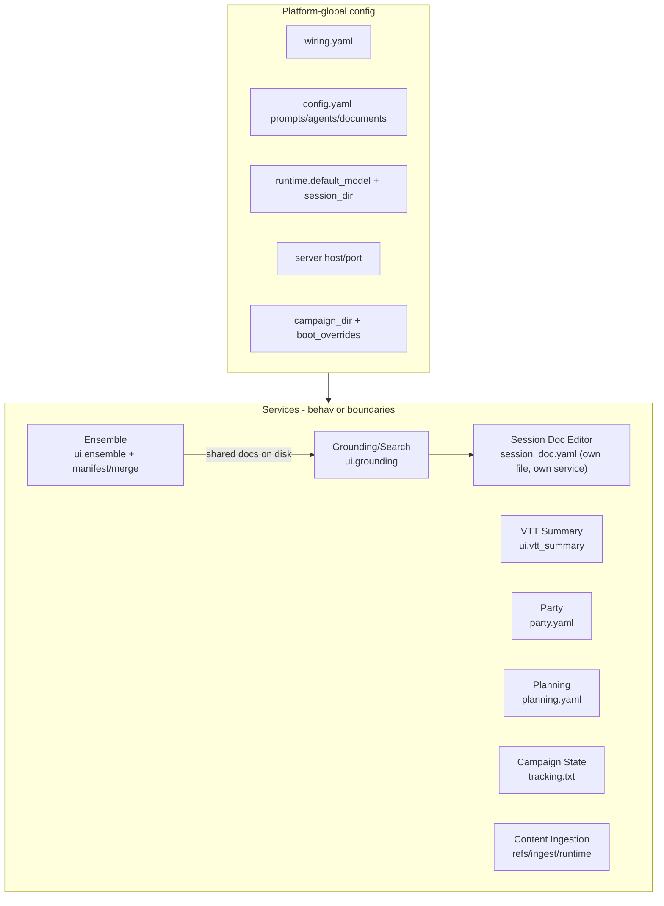

# CampaignGenerator as a Multi-Service Monolith

Re-slicing the config map along service boundaries. CampaignGenerator is effectively a UI + thin
routers over a set of independent workflows (session doc editor, ensemble, planning, party, ...).
Config splits into platform-global vs service-local — but the split is a convention, with no
enforced hierarchy or management layer.

Session Doc Editor and Planning are now drawn with **owned config**, not just a behavior
boundary — see [Where the monolith shows](#where-the-monolith-shows-no-hierarchy--management)
below for what that closed and what's still open.

## Implied services

| Service | Router / entry | Config | CLI engine | Its config/state |
|---|---|---|---|---|
| Session Doc Editor | `scene_editor.py` + `SessionEditorConfigService` | own file: `session_doc.yaml` (grouped, strict) | narrate/scrub CLI | backend/dgx knobs, tokens, prose/reflections, session paths, `profiles[]` |
| Ensemble | `pipelines/ensemble/ensemble.py` | `ui.ensemble` | `ensemble_extract`/`ensemble_merge`/`synthesise_*` | chapters, known_names, aliases, per-stage `BackendProfile`, `manifest.json`, `merge.yaml` |
| VTT Summary | `session_workflow.py` | `ui.vtt_summary` | `session_doc/vtt_summary.py` | input/output, extract_dir, reference_summaries |
| Grounding / Search | `grounding.py`, `pipelines/rlm/mcp_server.py` | `ui.grounding` | grounded_search, query_lore, rpg_retriever | summaries pointer; reads wiring; also reads `SessionEditorConfigService` for the global backend selector |
| Party | `config_routes` party-yaml | `ui.party` (loose) | `pipelines/grounding/party.py` | `party.yaml` (roster, 3-state arc_score) |
| Planning | `planning_routes` | (none - uses dedicated PlanningConfigService) | `pipelines/grounding/planning.py` | `planning.yaml` (npcs/factions) |
| Campaign State | (CLI-only page) | `ui.campaign_state` (loose) | `pipelines/grounding/campaign_state.py` | `tracking.txt` |
| Distill / NPC / Query / Prep / Connections / Experimental | generic `PUT /section/{name}` | `ui.<loose>` | `pipelines/grounding/distill.py`, `pipelines/grounding/npc_table.py`, `pipelines/session_prep/prep.py`, ... | under-modeled `extra='allow'` sections |
| Content Ingestion (5e) | `launch_5etools_mcp` / `apply_ingest_manifest` | (none) | `resolve_refs`, `fivetools_ingest` | `refs.yaml`, `refs.local.yaml`, `ingest_manifest.yaml`, runtime tree |

## Platform-global config (all services)

| Concern | Where | Why global |
|---|---|---|
| Platform identity/roots | `config/wiring.yaml` (mneme) | external endpoints + data roots shared by every service |
| Repo prompts/agents/docs | `config.yaml` (system_prompt, agents, documents[], log_dir) | shared inputs for prep + doc-reading services |
| Runtime model + session | `ui_state.runtime.{default_model, session_dir}` | cross-service defaults |
| Server binding | `local.yaml` server.{host,port} | the monolith process |
| Campaign root + boot ctx | `campaign_dir` + `boot_overrides` | process-wide context |
| Grounding docs (shared state) | `docs/{world_state,campaign_state,party,planning}.md` | produced by some services, consumed by others as shared truth |

## Service-local config

| Service | Owns |
|---|---|
| Session Doc Editor | `session_doc.yaml` — own file, own service (`SessionEditorConfigService`); no `ui_state.yaml` section and no `scene_editor.CONFIG` process-global anymore |
| Ensemble | `ui.ensemble`, `manifest.json`, `merge.yaml`, aliases file, `*_draft.md` |
| VTT Summary | `ui.vtt_summary` |
| Grounding/Search | `ui.grounding.summaries` |
| Party | `party.yaml` |
| Planning | `planning.yaml` (own file, own service — `PlanningConfigService`) |
| Campaign State | `tracking.txt` |
| Content Ingestion | `refs.yaml`, `refs.local.yaml`, `ingest_manifest.yaml`, `~/.5etools-mcp-runtime/` |

## Where the monolith shows (no hierarchy / management)

Two of the gaps below are now **closed for two services** (Session Doc Editor, Planning) and
**still open for the rest** — noted per-row rather than papered over, since "closed for the
largest service" is not the same claim as "closed":

| Gap | Evidence |
|---|---|
| No service ownership | **Partially closed.** Session Doc Editor (`SessionEditorConfigService` → `session_doc.yaml`) and Planning (`PlanningConfigService` → `planning.yaml`) each own+validate their own file now. The remaining ~7 services (Ensemble, VTT Summary, Grounding/Search, Party's UI slice, Campaign State, the loose pages) still share one `ui_state.yaml`, with the flat config service as their only authority |
| No config hierarchy | Still open. Global vs service-local remains convention for everything except the two isolated services above. `config.yaml` mixes global (prompts) + service (`mempalace`); `ui_state` mixes runtime (global) + the remaining service sections |
| Duplicated backend/model selection | **Not closed — relocated, not unified.** The isolation moved the field (`session_doc.backend` → `session_doc.yaml`'s `backends.active` + per-backend `BackendProfile` memory), and Phase 5 even *added* an editor-local model override (O3) on top of the global picker — a deliberate, named step *toward* the eventual central provider (pre-shapes it), but a fourth independently-configured backend selector today, not fewer. Still: ensemble `extract`/`synthesize` `BackendProfile`, `dgx_*` in wiring, `runtime.default_model`, `session_doc.yaml` `backends.*` — no central model/backend manager; each service still re-picks |
| Coupling via shared files, not APIs | Still open. Services integrate by reading/writing the same `docs/*.md` and palace, not versioned contracts. Disk is the bus |
| No schema-per-service enforcement | **Partially closed.** `SessionEditorConfig` and `PlanningConfig` are both strict (`extra="forbid"`/validated) now — the first two typed, enforced, per-service schemas in the codebase. The remaining 10 loose `ui.<section>` sections are still `extra='allow'`, unmodeled, unvalidated |
| No dependency ordering / registry | Still open. Ensemble → grounding → prep/search is implicit through file mtimes; no declared service graph |

## The cut, stated plainly

There are two real config tiers: **PLATFORM** (mneme wiring, repo prompts/agents/documents, runtime
model + session, server binding, campaign root) and **SERVICE** (one typed-or-loose ui section per
workflow, plus that service's own YAML/artifacts — or, for two services now, a dedicated owned file
instead of a `ui_state.yaml` section at all). Most of the system is still physically co-mingled —
`ui_state.yaml` is one document holding most services' sections, `config.yaml` holds both global and
`mempalace` keys, and most services don't validate or own their slice. Session Doc Editor and
Planning are the exceptions that prove the pattern is buildable, not evidence the pattern is
finished: two services out of roughly nine. Services still communicate through shared on-disk docs
and the palace rather than contracts. The system is a set of microservices wearing a monolith's
clothes, with two services that have started changing: the boundaries mostly exist in behavior
(routers + CLI engines + sections) but not yet in ownership, schema enforcement, model/backend
management, or dependency orchestration — except where Session Doc Editor and Planning now stand
apart from the rest.

## If you wanted to manage it

Step (1) below is no longer purely hypothetical — Session Doc Editor and Planning are worked
examples of it, each shipped as a designed schema → an owning service → a dedicated file. Steps
(2)–(4) remain undone for every service, including these two.

A managing hierarchy would: (1) give each service its own owned+validated config namespace (split
`ui_state` per service, or a per-service file — **done for 2 of ~9 services**: Session Doc Editor's
`session_doc.yaml`, Planning's `planning.yaml`), (2) centralize model/backend selection into one
platform provider the services request from, (3) replace file-mtime coupling with declared
producer/consumer contracts for the grounding docs, and (4) add a service registry so ordering
(ensemble then grounding then prep/search) is explicit rather than implied.
