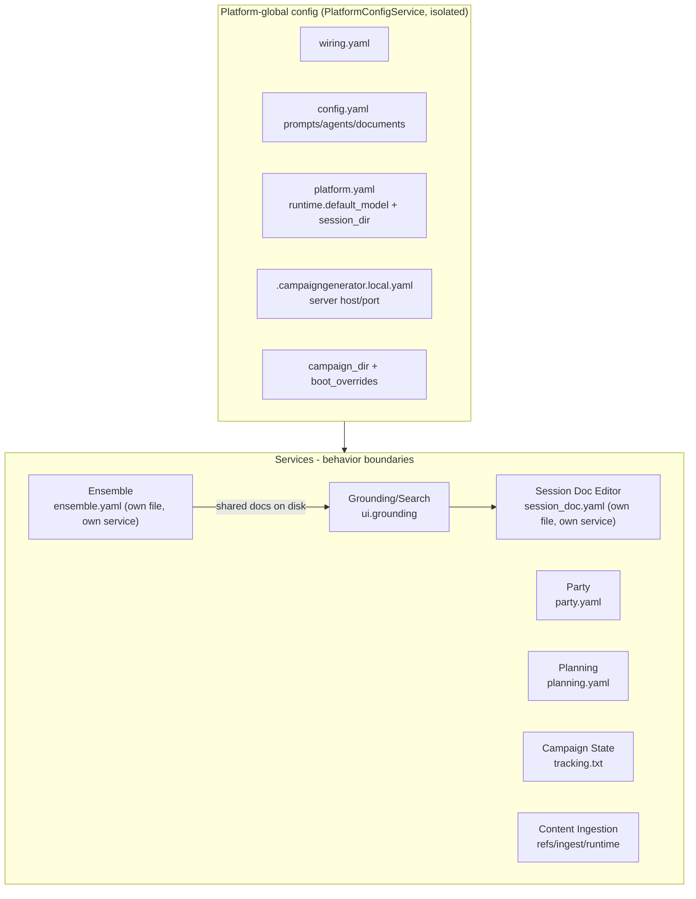

# CampaignGenerator as a Multi-Service Monolith

Re-slicing the config map along service boundaries. CampaignGenerator is effectively a UI + thin
routers over a set of independent workflows (session doc editor, ensemble, planning, party, ...).
Config splits into platform-global vs service-local. That split **used to be** a convention with
no enforced hierarchy or management layer; `docs/config/platform-isolation.md` (Phases 0–5a) made
the platform tier an actual owned, validated, physically separate thing —
`PlatformConfigService` — rather than a description of where some values happened to live inside
a class that also owned ten unrelated `ui.<section>` blobs. See [Where the monolith
shows](#where-the-monolith-shows-no-hierarchy--management) below for exactly what that closed and
what — services other than the platform itself — remains open.

Session Doc Editor, Planning and Ensemble are now drawn with **owned config**, not just a
behavior boundary — see [Where the monolith shows](#where-the-monolith-shows-no-hierarchy--management)
below for what that closed and what's still open.

## Implied services

| Service | Router / entry | Config | CLI engine | Its config/state |
|---|---|---|---|---|
| Session Doc Editor | `scene_editor.py` + `SessionEditorConfigService` | own file: `session_doc.yaml` (grouped, strict) | narrate/scrub CLI | backend/dgx knobs, tokens, prose/reflections, session paths, `profiles[]` |
| Ensemble | `server/routers/ensemble.py` + `EnsembleConfigService` | own file: `ensemble.yaml` (grouped, strict) | `ensemble_extract`/`ensemble_merge`/`synthesise_*` | chapters, known_names, aliases, per-stage `EnsembleBackend`, artifact `paths`, `tuning`, planning overrides, `manifest.json`, `merge.yaml` |
| Grounding / Search | `grounding.py`, `pipelines/rlm/mcp_server.py` | `ui.grounding` | grounded_search, query_lore, rpg_retriever | summaries pointer; reads wiring; also reads `SessionEditorConfigService` for the global backend selector |
| Party | `config_routes` party-yaml | `ui.party` (loose) | `pipelines/grounding/party.py` | `party.yaml` (roster, 3-state arc_score) |
| Planning | `planning_routes` | (none - uses dedicated PlanningConfigService) | `pipelines/grounding/planning.py` | `planning.yaml` (npcs/factions) |
| Campaign State | (CLI-only page) | `ui.campaign_state` (loose) | `pipelines/grounding/campaign_state.py` | `tracking.txt` |
| Distill / NPC / Query / Prep / Connections / Experimental | generic `PUT /section/{name}` | `ui.<loose>` | `pipelines/grounding/distill.py`, `pipelines/grounding/npc_table.py`, `pipelines/session_prep/prep.py`, ... | under-modeled `extra='allow'` sections |
| Content Ingestion (5e) | `launch_5etools_mcp` / `apply_ingest_manifest` | (none) | `resolve_refs`, `fivetools_ingest` | `refs.yaml`, `refs.local.yaml`, `ingest_manifest.yaml`, runtime tree |

## Platform-global config (all services)

| Concern | Where | Why global |
|---|---|---|
| Platform identity/roots | `config/wiring.yaml` (mneme) | external endpoints + data roots shared by every service. Does not yet include the model registry — Phase 5b, deferred, [issue #177](https://github.com/kostadis/CampaignGenerator/issues/177) |
| Repo prompts/agents/docs | `config.yaml` (system_prompt, agents, documents[], log_dir) | shared inputs for prep + doc-reading services |
| Runtime model + session | `platform.yaml`'s `runtime.{default_model, session_dir}` — **its own file since Phase 3 (O3)**, not a section of `ui_state.yaml` | cross-service defaults; also the fallback every one of the fourteen `/run/*` router model fields resolves through (Phase 5a, `resolve_default_model`) |
| Server binding | `.campaigngenerator.local.yaml` server.{host,port} | the monolith process |
| Campaign root + boot ctx | `campaign_dir` + `boot_overrides` | process-wide context |
| Grounding docs (shared state) | `docs/{world_state,campaign_state,party,planning}.md` | produced by some services, consumed by others as shared truth |

## Service-local config

| Service | Owns |
|---|---|
| Session Doc Editor | `session_doc.yaml` — own file, own service (`SessionEditorConfigService`); no `ui_state.yaml` section and no `scene_editor.CONFIG` process-global anymore |
| Ensemble | `ensemble.yaml` — own file, own service (`EnsembleConfigService`) — plus `manifest.json`, `merge.yaml`, aliases file, `*_draft.md` |
| Grounding/Search | `ui.grounding.summaries` |
| Party | `party.yaml` |
| Planning | `planning.yaml` (own file, own service — `PlanningConfigService`) |
| Campaign State | `tracking.txt` |
| Content Ingestion | `refs.yaml`, `refs.local.yaml`, `ingest_manifest.yaml`, `~/.5etools-mcp-runtime/` |

## Where the monolith shows (no hierarchy / management)

Three of the gaps below are now **closed or partially closed** — two by service-level isolation
(Session Doc Editor, Planning), one by the platform-level isolation this doc's sibling,
`platform-isolation.md`, describes — and the rest **still open**, noted per-row rather than
papered over, since "closed for the largest pieces" is not the same claim as "closed":

| Gap | Evidence |
|---|---|
| No service ownership | **Partially closed.** Session Doc Editor (`SessionEditorConfigService` → `session_doc.yaml`), Planning (`PlanningConfigService` → `planning.yaml`) and Ensemble (`EnsembleConfigService` → `ensemble.yaml`) each own+validate their own file now — three of roughly eight. The remaining ~5 services (Grounding/Search, Party's UI slice, Campaign State, the loose pages) still share one `ui_state.yaml`, now under `UIStateService` — the Phase 2 rename that made the "residual landlord" role explicit and countable rather than implicit inside a class that also did platform work |
| Fused platform + residual roles | **Closed** (`platform-isolation.md`, new gap named and closed in the same effort). Through this branch's Phase 1, `CampaignConfigService` was simultaneously the permanent platform (paths, `runtime.*`, boot overrides, wiring/`config.yaml` access) AND the residual landlord of the ten loose `ui.<section>` blobs — one 610-line class, one write lock, one `ui_state.yaml`, so a `ui.distill` save could corrupt `runtime.default_model`/`session_dir`, the values every other service composes. Phase 2 split the class; Phase 3 (O3) went further and gave `runtime` its own file, `platform.yaml`, so the two roles can no longer share a write path even in principle — regression-tested by `test_ui_section_write_cannot_touch_platform_yaml[_via_route]` |
| No config hierarchy | **Narrowed, not closed.** Global vs service-local is an enforced split for the platform tier now (`platform.yaml`/`.campaigngenerator.local.yaml` vs `ui_state.yaml`), on top of the two isolated services above. `config.yaml` still mixes global (prompts) + service (`mempalace`); `ui_state.yaml` still mixes the remaining ~6 services' sections in one file with one schema version |
| Duplicated backend/model selection | **Not closed — relocated, not unified; the *registry* half is now unified.** Backend *selection* is still four independently-configured selectors (ensemble `BackendProfile`, `session_doc.yaml` `backends.*`, grounding's global picker, connections' per-request field) — explicitly deferred, this doc's gap #3. Ensemble's *default-model* half closed separately in Phase 4 of [ensemble-isolation.md](./ensemble-isolation.md) — it was the last `/run/*` router outside `resolve_default_model`, because `backend_cli_args` emits nothing on the Anthropic branch, so the sidebar pick had never reached an ensemble run. But Phase 5a of `platform-isolation.md` did close the narrower "which models exist, and which one is the default" question: one `DEFAULT_MODEL` definition (`campaignlib.constants`), one `MODELS` registry (`server/config.py`, refreshed), and all fourteen router request-body model fields now resolve through `resolve_default_model` (explicit → `platform.runtime.default_model` → literal) instead of each hardcoding its own copy of the literal. The registry's *source* moving into `wiring.yaml` (so a new model needs no release) is Phase 5b — deferred, cross-repo, [issue #177](https://github.com/kostadis/CampaignGenerator/issues/177) |
| Coupling via shared files, not APIs | Still open. Services integrate by reading/writing the same `docs/*.md` and palace, not versioned contracts. Disk is the bus |
| No schema-per-service enforcement | **Partially closed.** `SessionEditorConfig`, `PlanningConfig`, `PlatformDocument`/`PlatformLocalConfig` and now `EnsembleConfig` are strict (`extra="forbid"`/validated) — five typed, enforced schemas, up from two. The remaining 10 loose `ui.<section>` sections are still `extra='allow'`, unmodeled, unvalidated |
| No dependency ordering / registry | Still open. Ensemble → grounding → prep/search is implicit through file mtimes; no declared service graph |

## The cut, stated plainly

There are two real config tiers: **PLATFORM** (mneme wiring, repo prompts/agents/documents, runtime
model + session, server binding, campaign root) and **SERVICE** (one typed-or-loose ui section per
workflow, plus that service's own YAML/artifacts — or, for two services now, a dedicated owned file
instead of a `ui_state.yaml` section at all). The PLATFORM tier is no longer just a description —
`platform-isolation.md` (Phases 0–5a) made it a real, owned, physically separate thing
(`PlatformConfigService` + `platform.yaml` + `.campaigngenerator.local.yaml`), closing the "fused
roles" gap this doc used to name and leave open. What's still co-mingled is the SERVICE tier:
`ui_state.yaml` is one document holding ~6 services' sections under `UIStateService`, `config.yaml`
holds both global and `mempalace` keys, and most services still don't validate or own their slice.
Session Doc Editor, Planning and Ensemble are the exceptions that prove the pattern is buildable,
not evidence the pattern is finished: three services out of roughly eight. Services still communicate through
shared on-disk docs and the palace rather than contracts. The system is a set of microservices
wearing a monolith's clothes, with a platform tier that has been extracted and two services that
have started changing: the boundaries mostly exist in behavior (routers + CLI engines + sections)
but not yet in per-service ownership, schema enforcement, model/backend *selection* management, or
dependency orchestration — except where the platform itself, and Session Doc Editor and Planning
within it, now stand apart from the rest.

## If you wanted to manage it

Step (1) below is no longer purely hypothetical — Session Doc Editor, Planning and Ensemble are
worked examples of it, each shipped as a designed schema → an owning service → a dedicated file. The
platform tier itself went through the same shape of change (design schema → owning service →
dedicated file) via `platform-isolation.md`, but it isn't one of the ~9 rows in step (1) — it's
the foundation those rows sit on, and closing its own "fused roles" problem was this branch's
whole point. Steps (2)–(4) remain undone for every *service*, including the two already isolated.

A managing hierarchy would: (1) give each service its own owned+validated config namespace (split
`ui_state` per service, or a per-service file — **done for 3 of ~8 services**: Session Doc Editor's
`session_doc.yaml`, Planning's `planning.yaml`, Ensemble's `ensemble.yaml`), (2) centralize model/backend *selection* into one
platform provider the services request from (Phase 5a narrowed this to "which models exist and
what's the default" — the *registry* — while selection itself, gap #3's four independent
selectors, is still open and explicitly deferred), (3) replace file-mtime coupling with declared
producer/consumer contracts for the grounding docs, and (4) add a service registry so ordering
(ensemble then grounding then prep/search) is explicit rather than implied.
