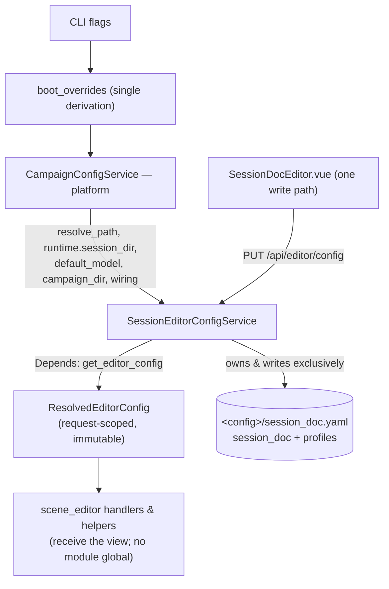

# Session Editor Configuration Isolation Design

> **Status: ✅ Done (2026-07-24).** Shipped and verified end-to-end across five
> commits on branch `session-editor-config-isolation` (`1862c8b` Phase 1 …
> `b05d944` Phase 5). All five implementation phases landed; see
> [Implementation status](#implementation-status) for the per-phase record and
> [Deviations / fixes found while implementing](#deviations--fixes-found-while-implementing)
> for three bugs found and fixed along the way. It followed the pattern
> established by [planning-isolation.md](./planning-isolation.md), though the
> session editor was a materially harder case — see
> [Why this is not planning](#why-this-is-not-planning). One notable deviation
> from the plan below: the data lift shipped as an **automated** one-shot CLI
> (`server/migrate_session_doc.py`) rather than the by-hand single-file edit
> originally scoped — see
> [Migrating an existing campaign](#migrating-an-existing-campaign).
> The [Resolved decision](#resolved-decision) and
> [Design decisions (O1–O3)](#design-decisions-o1o3) sections record the final
> calls, including two (O2, O3) that landed the **opposite** of this doc's
> original recommendation.

## Migrating an existing campaign

Any campaign whose `<config>/ui_state.yaml` still carries a pre-Phase-5
`ui.session_doc` / `ui.profiles` fragment needs one one-shot run before the
Session Doc Editor sees that data again — Phase 5 dropped both fields from
`UISection` (see [Data model](#data-model)), so the server now silently
ignores them instead of reading them.

```bash
python -m server.migrate_session_doc --campaign-dir /path/to/campaign
```

- `--config-dir` (default `config`) — the config subdirectory to read from /
  write to within the campaign, matching the server's own `--config-dir`
  convention.
- `--force` — overwrite an existing `session_doc.yaml` at the destination.
  Without it the command refuses to touch an existing file, so a second,
  accidental run can't clobber real data.
- If there is nothing to migrate — no non-empty `ui.session_doc` /
  `ui.profiles` in the source — it prints `nothing to migrate` and exits `0`.
  Safe to run against a campaign that never had session-editor state, or one
  that's already been migrated.
- Reads `ui_state.yaml` **raw** (`yaml.safe_load`, not the typed `UIState`
  model) specifically so it can rescue fields the current schema no longer
  declares. Writes `<config>/session_doc.yaml` through the same grouped,
  strict `SessionEditorConfig` shape the service owns — path values are
  copied as-is (no re-resolution or re-relativization; they were already
  stored relative).
- Run it once per campaign, then launch the server normally — the Session
  Doc Editor picks up the migrated file on its own.

## Overview

The Session Doc Editor is the largest "service" in the multi-service monolith
([service-cut.md](./service-cut.md)): a four-stage post-session pipeline
(`enhance_summary` → `scene_extract` → `sd_plan`/`sd_narrate` → `assemble`)
driven by `server/routers/scene_editor.py` (1349 lines). Its configuration is
today spread across **three co-existing representations of the same truth**,
kept in sync by a per-request refresh and two separate dual-write paths.

This document proposes isolating that configuration behind a
`SessionEditorConfigService` that **owns** the editor's slice and reads its
platform dependencies (session dir, global model, campaign root, wiring)
through a clean, explicit boundary — eliminating the split-brain first, and
optionally moving the data to its own file second.

## Current state

*(Historical — describes the pre-isolation state this design replaced. All
three representations below are gone as of Phase 5; see
[Implementation status](#implementation-status).)*

The editor's config lived in three places at once:

| # | Representation | Where | Owner | Populated by |
|---|---|---|---|---|
| 1 | Typed `ui.session_doc` (`SessionDocSection`) + `ui.profiles` (`ProfilesSection`) | `<config>/ui_state.yaml` (shared) | `CampaignConfigService` | `PUT /api/config/section/session_doc` **and** `PUT /api/editor/config` |
| 2 | `scene_editor.CONFIG` — a flat, **module-global mutable dict** | in-memory (process-global) | nobody (a naked module global + two free functions) | `_refresh_config_from_service` (per-request) + `init_editor_config` (boot) + `PUT /api/editor/config` |
| 3 | Boot seed dict | in-memory | `server/main.py::main` | CLI flags, built **separately** from `boot_overrides` |

```mermaid
flowchart TB
  subgraph boot[Boot — server/main.py]
    FLAGS[CLI flags] --> BO["boot_overrides<br/>(dotted typed keys:<br/>session_doc.scene_extractions_dir …)"]
    FLAGS --> SEED["config dict<br/>(CONFIG-shaped keys:<br/>roleplay_extract_dir, examples …)"]
  end
  BO --> SVC[CampaignConfigService]
  SEED -->|init_editor_config| CFG["scene_editor.CONFIG<br/>(module global)"]
  SVC -->|resolved().ui.session_doc<br/>_refresh_config_from_service<br/>per request, with key renames| CFG
  SVC -->|runtime.default_model| CFG
  SVC -->|campaign_dir / config_dir| CFG
  CFG --> HELPERS["~20 module helpers &amp; command builders<br/>_session_dir(), _vtt_path(), _build_narrate_cmd(), _backend_flags() …"]

  subgraph fe[Frontend — SessionDocEditor.vue, one view]
    P1["path fields + narrate knobs<br/>→ PUT /api/editor/config"]
    P2["backend / batch / dgx_* / openrouter_model<br/>→ PUT /api/config/section/session_doc"]
  end
  P1 --> CFG
  P1 -->|api_put_config also writes| SVC
  P2 --> SVC
```

### The key-name translation layer

`ui.session_doc` (typed) and `CONFIG` (flat) do not even use the same field
names. `scene_editor._TYPED_TO_CONFIG_KEY` bridges them on every refresh and
every PUT:

| Typed (`ui.session_doc`) | CONFIG key |
|---|---|
| `roleplay_dir` | `roleplay_extract_dir` |
| `summary_dir` | `summary_extract_dir` |
| `examples_dir` | `examples` |

`CONFIG` additionally carries keys the typed section never had: `model` (from
`runtime.default_model`), `work_dir`, `campaign_dir`, `config_dir`, `vtt`,
`dossier_dir`.

### How writes reach the section today (two doors, one room)

`SessionDocEditor.vue` writes the **same** `ui.session_doc` through **two
different endpoints**, by design:

- `buildEditorConfigPayload()` → `PUT /api/editor/config` → `api_put_config`,
  which does `CONFIG.update(data)` **and** `service.update_section("session_doc",
  _config_to_typed_payload(data))`. (path fields, `narrate_tokens`, `prose_mode`,
  `reflections`, `context`, `work_dir`; `narration_genre` retired by #276 fix 2)
- `config.updateSection("session_doc", {...})` → `PUT /api/config/section/session_doc`.
  (`backend`, `batch`, `dgx_endpoint`, `dgx_model`, `openrouter_model`)

The Vue comments are candid about the split — `dgx_*` persistence is annotated
*"non-fatal — the next subprocess will still read the in-memory CONFIG."* The
frontend knows there is a live parallel store.

### Boot seeds the same paths twice

`server/main.py::main` derives session paths from `--session-dir`, then feeds
them into the system **twice**:

- `_boot_overrides_from_args(args)` → dotted `session_doc.*` keys → the service.
- a separate hand-built `config` dict (CONFIG-shaped) → `init_editor_config(config)`
  → `CONFIG`.

Two derivations of one truth that can drift.

## Problems

*(Historical — all three are resolved as of Phase 5; see
[Benefits](#benefits) for what replaced each.)*

Beyond the four planning cited (coupling, blast radius, inefficiency, no
ownership), the session editor added three of its own:

1. **Split-brain / fragmented state.** `CONFIG` is a second live copy of
   `ui.session_doc`, reconciled per-request by `_refresh_config_from_service`.
   The service comment claims it is "the single source of truth," but a mutable
   module global that carries extra keys, uses different names, and is seeded
   from a *different boot path* is a de-facto second authority. This is the
   Split-Brain / Optimistic-Lies shape the Kostadis doctrine warns about: two
   stores, a sync ritual, and a comment asserting they agree.
2. **Process-global mutable state.** `CONFIG` is module-level, not
   request-scoped. It works only because there is exactly one campaign per
   process; `_refresh_config_from_service` mutates it on every request as a side
   effect. Any move toward per-request or multi-campaign contexts breaks
   silently. There is no lock around the refresh-then-read window.
3. **Whole-file write blast radius.** `update_section("session_doc", …)`
   re-serializes the **entire** `ui_state.yaml` (a full `model_copy` +
   `_persist_ui_state`). A serialization bug on a session_doc write can corrupt
   `ui.ensemble`, `ui.grounding`, `runtime`, etc. This is
   exactly planning's problem #2 — and it is *not* fixed by an in-code service
   alone; the dedicated `session_doc.yaml` in Phase 5 is what fixes it.

## Why this is not planning

Planning was cleanly separable: `planning.yaml` was already its own file, its
data (npcs/factions) was self-contained, and it had no runtime dependencies. So
isolation there was purely additive — a new file-owning service + a new REST
collection API — with essentially zero coupling to unwind.

The session editor is the opposite. Its config is **defined in terms of
platform-global context** and cannot be made standalone:

| Session-editor config depends on | Owned by | Used for |
|---|---|---|
| `runtime.session_dir` | platform (also drives VTT Summary; set by SessionConfig picker) | resolving session-based path fields |
| `runtime.default_model` | platform (sidebar model picker) | `CONFIG["model"]` → `--model` on every stage |
| `campaign_dir` / `config_dir` | platform (boot context) | `work_dir`, subprocess `cwd`, `CG_CAMPAIGN_DIR`/`CG_CONFIG_DIR` |
| `wiring.yaml` `dgx_endpoint`/`dgx_model` | mneme (external) | `_backend_flags()` DGX fallback |
| `resolve_path` / `_PATH_FIELDS` / boot rebasing | `CampaignConfigService` | the subtle session-vs-campaign, boot-override, sibling-session-rebase logic |

Two further shape differences from planning:

- **Single blob, not a collection.** Planning gained `GET/POST/PUT/DELETE
  /{npcs,factions}/{name}`. The session editor's config is one object per
  campaign — the right HTTP shape is the `GET/PUT /api/editor/config` that
  **already exists**. So the isolation here is almost entirely *internal*; the
  wire surface barely changes. (Profiles are the one genuine sub-collection.)
- **~20 read sites, not 2.** Planning's old endpoints had only tests as callers.
  `CONFIG` is read by roughly twenty helpers and command builders across
  `scene_editor.py`. Removing the global is a real refactor of that file, not a
  route swap.

**Thesis:** isolating the session editor does not mean making its config
independent — it means giving it a service that **owns** its slice and
**reads** its platform dependencies through one explicit seam, and deleting the
`CONFIG` global that pretends to be that seam today.

## The ownership boundary

The whole design turns on drawing this line correctly.

**Owned by `SessionEditorConfigService` (service-local):**
- `ui.session_doc` fields — the knobs (`narrate_tokens`, `prose_mode`,
  `reflections`, `batch`, `scrub_*`, `backend`, `dgx_*`,
  `openrouter_model`) and the path/selector fields.
- `ui.profiles` — named knob presets. Editor-only.
- The CONFIG-key ↔ typed-key translation (`_TYPED_TO_CONFIG_KEY`) — removed when
  the `CONFIG` global goes (Phase 2); the final logical field names + grouping
  land with the reshape (Phase 5).
- The per-request **resolved editor view** (paths absolute, extras injected).
- Which `session_doc` path fields are session-based vs campaign-based
  (`_PATH_FIELDS["session_doc"]` conceptually moves here).

**Read from the platform (NOT owned — the honest part):**
- `runtime.session_dir`, `runtime.default_model` — stay in `RuntimeSection`.
- `campaign_dir` / `config_dir` — stay process context.
- `wiring.yaml` DGX defaults — stay mneme-owned.
- The path-resolution **mechanism** (`resolve_path`, boot rebasing) — stays in
  `CampaignConfigService`; the new service *delegates* to it rather than
  re-implementing the subtle bits.

`_backend_flags()` / `_model_args()` build subprocess CLI flags at request time.
They are **runtime command assembly, not stored config** — they stay in the
router (reading the resolved editor view), and are explicitly out of scope for
"config isolation."

## Proposed solution



### 1. `SessionEditorConfigService` (`server/session_editor_config_service.py`)

Owns the session-editor slice; composes the platform service for path
resolution and platform reads.

```python
class SessionEditorConfigService:
    def __init__(self, platform: CampaignConfigService): ...

    # Raw, typed slice (service-owned)
    def get_session_doc(self) -> SessionDocConfig: ...
    def update_session_doc(self, partial: dict) -> SessionDocConfig: ...

    # Profiles (the one sub-collection)
    def list_profiles(self) -> list[ProfileEntry]: ...
    def upsert_profile(self, p: ProfileEntry) -> ProfileEntry: ...
    def delete_profile(self, name: str) -> None: ...
    def activate_profile(self, name: str) -> SessionDocConfig: ...   # server-side mirror

    # Resolved, request-scoped view consumed by the router
    def resolved_editor_config(self) -> "ResolvedEditorConfig": ...
```

`resolved_editor_config()` is the replacement for `_refresh_config_from_service`
+ `CONFIG`: it reads the platform's resolved `session_doc` (paths already
absolute, boot overrides applied), applies the key translation and the injected
extras (`model` ← `runtime.default_model`, `work_dir`/`campaign_dir`/`config_dir`
← platform, `vtt` optional), and returns an **immutable dataclass**, not a
shared mutable dict.

### 2. Kill the `CONFIG` global

- Delete `scene_editor.CONFIG`, `_refresh_config_from_service`,
  `init_editor_config`, `_config_to_typed_payload`.
- Add `get_editor_config(request) -> ResolvedEditorConfig` as a FastAPI
  `Depends` (mirrors planning's `get_planning_service`).
- Convert the ~20 module helpers (`_session_dir`, `_vtt_path`,
  `_scene_extractions_dir`, `_narration_dir`, `_build_*_cmd`, `_backend_flags`,
  `_model_args`, …) to take the resolved view (a method on it, or a first
  argument) instead of reading a module global. This is the bulk of the work
  and is mechanical but wide.

### 3. Collapse the write paths

- `PUT /api/editor/config` becomes the **single** editor write door; it calls
  `SessionEditorConfigService.update_session_doc(...)`.
- `SessionDocEditor.vue` stops writing `ui.session_doc` through
  `config.updateSection("session_doc", …)`; `backend`/`batch`/`dgx_*`/
  `openrouter_model` move onto the same `PUT /api/editor/config` payload. The
  `AppSidebar.vue` global backend selector also routes here.

### 4. Unify boot

- Delete the separate `init_editor_config(config)` seed. Session paths flow in
  **only** through `boot_overrides` → platform → `resolved_editor_config()`.
  One derivation, one authority.

## Data model

**Shipped exactly as designed below** — `server/session_editor_config_shared.py`'s
`SessionEditorConfig` matches this shape field-for-field (verified against
source 2026-07-24). The rename table lives on as
`TYPED_SESSION_DOC_TO_GROUPED`, now consumed only by
`server/migrate_session_doc.py` (see [Migrating an existing
campaign](#migrating-an-existing-campaign)) rather than by a live adapter.

Because the migration was one-time (whether by hand or, as shipped, via a
script — see [Deviations](#deviations--fixes-found-while-implementing) item
4), the new schema was **not** bound to the old `ui.session_doc` shape.
Phases 1–4 kept the existing field names (so the split-brain removal stayed
low-risk and mechanical); **Phase 5 redesigned** the schema as it relocated
the data — the reshape and the data lift were the same pass.

The old `SessionDocSection` was a flat bag of ~25 fields that mixed path
selectors, narrate knobs, scrub knobs, backend selection, and roster; carried
two names for several fields (the `_TYPED_TO_CONFIG_KEY` legacy); and was
`extra="allow"` (unenforced) — deleted from `config_models.py` in Phase 5
(`ProfileEntry`/`BackendProfile` were kept; both are still used elsewhere).
The `session_doc.yaml` shape it was replaced with
(`SessionEditorConfig`, **strict** — `extra="forbid"`):

```yaml
paths:                      # base (session/campaign) is service-owned metadata, not stored per-field
  session_recap:            # gm-assist recap            (session)   [was: session]
  session_summary:          #                            (session)
  scene_extractions_dir:    #                            (session)   [was: extract_dir + scene_extractions_dir, collapsed]
  roleplay_extractions_dir: #                            (session)   [was: roleplay_dir / roleplay_extract_dir]
  summary_extractions_dir:  #                            (session)   [was: summary_dir / summary_extract_dir]
  narration_dir:            #                            (session)
  output_dir:               #                            (session)
  party:                    #                            (campaign)
  voice_dir:                #                            (campaign)
  examples_dir:             #                            (campaign)  [was: examples_dir / examples]
  genre_file:               #                            (campaign)  [was: narrate.genre — a PASTE of the file, #276 fix 2]
narrate:
  tokens: 16000             # [was: narrate_tokens]
  prose_mode: false
  reflections: false
  batch: false
  context: []
scrub:
  enabled: false            # [was: scrub_enabled]
  tokens: 16000             # [was: scrub_tokens]
verify:                     # quote verification (spec 007) — new, no legacy key
  threshold: 0.85           # near/unverified boundary; NOT calibrated for a local model
  min_tokens: 4             # below this a quote is 'unscored', never accused
  report_only: false        # suppress the additive <!-- cg:unverified --> marker
roster:
  characters:
  gm_player:
backends:                   # remembered per-backend so switching doesn't lose a model
  active: anthropic         # [was: backend]
  anthropic:  { model: }            # BackendProfile
  dgx:        { endpoint:, model: } # [was: dgx_endpoint / dgx_model]
  openrouter: { model: }            # [was: openrouter_model]
  claude-code: {}
session_name:
profiles: []                # named knob presets         [was: ui.profiles]
active_profile:
```

**Per-backend model memory — decided: the `backends` map above** (2026-07-23).
It keeps each backend's remembered model/endpoint across switches (the old
flat `dgx_model` / `openrouter_model` behavior), reuses `BackendProfile`, and
pre-shapes the eventual central backend provider (service-cut gap #3). The
anthropic/claude-code entries were left empty in this design pass pending O3
— **as shipped, O3 resolved the other way**: `backends.anthropic.model` /
`backends.claude-code.model` are real, settable overrides that win over the
global `runtime.default_model` picker when set (see [Design decisions
(O1–O3)](#design-decisions-o1o3)).

The remaining schema choices (grouping granularity, dead-field audit) landed
as recorded under [Design decisions (O1–O3)](#design-decisions-o1o3) and
[Open questions](#open-questions-historical--resolved-above) below.

A **dead-field audit** rode with the reshape: `extract_dir` was confirmed
vestigial next to `scene_extractions_dir` (boot mapped `--extract-dir` →
`scene_extractions_dir`) and dropped rather than carried forward — see
[S4](#settled-with-a-recommendation--confirmed-as-shipped).

`ResolvedEditorConfig` stays a separate **read-only** dataclass (not persisted):
the stored `SessionEditorConfig` with paths resolved absolute and the platform
extras layered in (`model` ← `runtime.default_model`; `work_dir` /
`campaign_dir` / `config_dir`; optional `vtt`). Those extras are **never**
written to `session_doc.yaml`.

## API surface (as shipped)

Mostly unchanged, as predicted — the biggest departure from planning, which
added a whole REST surface. Here the surface stayed nearly stable and the win
was internal.

| Method | Path | Change | Shipped |
|---|---|---|---|
| `GET` | `/api/editor/config` | unchanged shape; now served from the resolved view | ✅ Phase 2 |
| `PUT` | `/api/editor/config` | **the only** editor-config write; absorbs backend/dgx/batch/openrouter | ✅ Phase 3b |
| `GET/PUT` | `/api/config/section/session_doc` | **removed** as a session-editor write path — `session_doc` left `UISection` in Phase 5, so this now 404s ("unknown section") rather than silently no-op-ing | ✅ Phase 5 |
| `GET` | `/api/editor/profiles` | list presets | ✅ Phase 3a |
| `POST/GET/PUT/DELETE` | `/api/editor/profiles[/{name}]` | manage presets (201/200/200/204; 404/409/400 contract mirrors `planning_routes`) | ✅ Phase 3a |
| `POST` | `/api/editor/profiles/{name}/activate` | server-side mirror into `session_doc.yaml`, returns the re-resolved config (same shape as `GET /api/editor/config`) | ✅ Phase 3a |

## Implementation phases

| Phase | Work | Risk |
|---|---|---|
| 1 | `session_editor_config_service.py` (+ `ResolvedEditorConfig`) delegating to the platform service. No behavior change yet. | low |
| 2 | Replace `CONFIG` reads with the `Depends`-injected resolved view across `scene_editor.py`; delete `_refresh_config_from_service`. | **high** (wide, mechanical) |
| 3 | Collapse frontend to the single `PUT /api/editor/config`; remove `session_doc` from the generic section route; move profiles to `/api/editor/profiles`. | medium (frontend + breaking route) |
| 4 | Delete `init_editor_config`; unify boot to `boot_overrides` only (one derivation of the session paths). | medium |
| 5 | Move `session_doc` + `profiles` out of `ui_state.yaml` into a dedicated `<config>/session_doc.yaml` the service owns exclusively, **reshaped to the logical `SessionEditorConfig` model** (rename consumers to the final field names in the same pass); carry the write-time relativization + load-time normalize for its path fields (delegating to the platform's `relativize_path`/`resolve_path`). Data lift is a documented **manual** field-by-field remap (single user). | medium (path-resolution re-expression + reshape; migration itself is manual) |
| 6 | Docs: update `schema.md`, `values.md`, `service-cut.md`, `master.md`; add this doc's "as shipped" section. | low |

## Implementation status

| Phase | Work | Status |
|---|---|---|
| 1 | `session_editor_config_shared.py` (grouped strict model) + `session_editor_config_service.py` (`SessionEditorConfigService`, temp adapter over `ui_state.yaml`) | ✅ done (`1862c8b`) |
| 2 | Kill `scene_editor.CONFIG`, `_refresh_config_from_service`, `init_editor_config`; `GET/PUT /api/editor/config` via `Depends`-injected `ResolvedEditorConfig`; ~20 helpers converted to take `cfg` explicitly | ✅ done (`fbaeab8`) |
| 3a | `/api/editor/profiles` CRUD + `/activate`; grouped-or-flat `PUT` (temp compat shim) | ✅ done (`fd5742a`) |
| 3b | Frontend (`SessionDocEditor.vue`, `SessionConfig.vue`, `AppSidebar.vue`, `config.ts`) switches to `/api/editor`; flat PUT shim and `sd_*` overlay retired | ✅ done (`ff440c1`) |
| 4 | Boot unification — `main.py`'s vestigial session-dir/seed-dict code deleted; `--session-dir` reaches the editor only via `boot_overrides` → `resolved_editor_config()` (one derivation) | ✅ done (`13d856f`) |
| 5 | Relocate to dedicated `<config>/session_doc.yaml` (`SessionEditorConfigService` owns it exclusively, write-time relativize + read-time resolve delegating to the platform); `config_models.py` drops `SessionDocSection`/`ProfilesSection`; `migrate_session_doc.py` CLI; `grounding.py` backend-read fix | ✅ done (`b05d944`) |
| 6 | Docs: this doc + `schema.md` / `values.md` / `subsystems.md` / `service-cut.md` / `master.md` / `cli_tools.md` / `CLAUDE.md` | ✅ done (this pass) |

**Tests:** `tests/test_session_editor_config_service.py` (22 tests, Phase 1),
`tests/test_editor_service_integration.py` and `tests/test_editor_pipeline.py`
(rewritten across Phases 2–4), `tests/test_editor_profiles_routes.py` (Phase
3a, mirrors `test_planning_routes.py`'s status-code contract). Net: +24
passing tests by Phase 5, same 35 pre-existing unrelated failures, none new.

## Deviations / fixes found while implementing

Three bugs were found and fixed along the way (none pre-dated this refactor
in a way that blocked it — each was caught by the refactor forcing every
`CONFIG` read site to be re-examined):

1. **Latent `--examples` bug (fixed Phase 2, `fbaeab8`).** The old code read
   `CONFIG["examples_dir"]` when building the `sd_narrate` command, but only
   `CONFIG["examples"]` was ever populated (the `_TYPED_TO_CONFIG_KEY` rename
   table mapped `examples_dir` → `examples`) — so `--examples` was silently
   never forwarded to `sd_narrate`, regardless of what the editor had
   configured. Fixed by reading `cfg.paths.examples_dir` directly once the
   key-rename layer was deleted.
2. **Dead `dossier_dir` branch (dropped Phase 2, `fbaeab8`).** `CONFIG` carried
   a `dossier_dir` key that nothing in boot or the frontend ever populated —
   confirmed dead per the design doc's
   [S4](#settled-with-a-recommendation--confirmed-as-shipped) audit and
   dropped rather than carried into `ResolvedEditorConfig`.
3. **Stale `grounding.py` backend read (fixed Phase 5, `b05d944`).**
   `server/routers/grounding.py`'s global-backend `_backend_flags()` read
   `ui.session_doc.backend` directly — this had already gone stale in Phase
   3b once the `sd_*` overlay retired, and would have raised a `KeyError`
   once `session_doc` left `UISection` entirely in Phase 5. Fixed to read the
   active backend via `SessionEditorConfigService(service)
   .resolved_editor_config().backends` instead, matching how `scene_editor.py`
   and the ensemble router already resolve it.
4. **Migration shipped automated, not manual.** The original scope (see
   [Resolved decision](#resolved-decision)) assumed the sole user would
   hand-edit `ui_state.yaml` → `session_doc.yaml` once. It shipped instead as
   `server/migrate_session_doc.py`, a proper one-shot CLI — see
   [Migrating an existing campaign](#migrating-an-existing-campaign). Not a
   bug, but a deviation worth flagging since it changes the operational story
   for every future campaign, not just the first one.

## Benefits

1. **One authority.** The `CONFIG` global, its per-request refresh, and the dual
   boot seed all disappear. `ui.session_doc` (behind the service) is the only
   store.
2. **Request-scoped, lock-free.** An immutable per-request `ResolvedEditorConfig`
   removes the process-global mutable dict and its unguarded refresh-then-read
   window.
3. **One write door.** The frontend stops writing the same section through two
   endpoints; the "next subprocess still reads CONFIG" hazard is gone.
4. **Owned lifecycle.** A named service validates and owns the editor's config,
   matching planning and closing the service-cut "no service ownership" gap for
   the largest service.
5. **Clean, small wire surface.** Because the editor config is a single blob, the
   HTTP surface barely moves — the change is almost entirely internal hygiene.
6. **Bounded write blast radius.** With `session_doc` + `profiles` in their own
   `session_doc.yaml` (Phase 5), an editor write no longer re-serializes
   `ui_state.yaml`, so it can no longer corrupt `ui.ensemble` / `ui.grounding` /
   `runtime` — the same isolation guarantee planning gained.
7. **A schema worth enforcing.** The Phase 5 reshape replaces a flat,
   `extra="allow"` bag that carries two names per field with a grouped, **strict**
   `SessionEditorConfig` — closing the service-cut "no per-service schema
   enforcement" gap for the largest service, and deleting the
   `_TYPED_TO_CONFIG_KEY` translation at its root.

## Risks & blast radius

- **Phase 2 is wide.** ~20 helpers read `CONFIG`. Mitigate by keeping their
  logic identical and only changing where the values come from; land it behind
  the unchanged `GET/PUT /api/editor/config` contract so the frontend is
  untouched until Phase 3.
- **Path-resolution regressions (esp. Phase 5).** The session-vs-campaign base,
  boot-override, and sibling-session-rebase logic is subtle. **Delegate** to
  `CampaignConfigService.resolve_path` / `relativize_path` / `resolved()`; do
  not re-implement it. When the data moves to `session_doc.yaml`, the write-time
  relativization (today in `update_section`) and the load-time
  `_normalize_stored_paths` heal move *with* it — the new service must apply
  both to its own path fields, still keying off the platform's
  `runtime.session_dir`, or session-scoped paths will silently re-anchor.
- **Breaking route removal.** Dropping `session_doc` from the generic section
  route is breaking — acceptable per the planning precedent, but the frontend
  must migrate in the same change.
- **Backend/model duplication is left standing.** `session_doc.backend`/`dgx_*`,
  `runtime.default_model`, wiring `dgx_*`, and ensemble `BackendProfile` remain
  four places to pick a backend. Named and deferred — see below.

## Out of scope (named, deferred)

- **Central backend/model provider.** Unifying the four backend/model selectors
  into one platform provider is a separate re-architecture (service-cut gap #3),
  not part of isolating the editor's *storage*.
- **`_backend_flags()`/`_model_args()` behavior.** They keep working as-is,
  reading the resolved view.
- **The `.scrubbed.md` glob fragility** and other pipeline-correctness issues in
  `scene_editor.py` — unrelated to config ownership.

## Resolved decision

**Where does the session-editor config physically live? → Its own
`<config>/session_doc.yaml` (Option B). All five phases ship.** Decided
2026-07-23 by the maintainer.

The two options considered were:

- **Option A — keep in `ui_state.yaml`, own in-code (Phases 1–4 only).** Smallest
  disruption, no data lift. **Does not** fix the whole-file write blast radius
  (problem #3): a session_doc write still re-serializes the shared `ui_state.yaml`.
- **Option B — dedicated `<config>/session_doc.yaml` (adds Phase 5). ← chosen.**
  Gives the planning-style guarantee that a bad session_doc write cannot corrupt
  other services' config. Costs a data lift (move `ui.session_doc` +
  `ui.profiles` out of `ui_state.yaml`) and re-expressing session-based path
  resolution against the platform's `runtime.session_dir`.

**Sequencing:** Phases 1–4 landed first — they delivered the real prize
(killing the split-brain) independent of file location and kept each step
reviewable — and Phase 5 then completed the physical isolation. The data lift
ended up **automated** rather than manual: instead of the sole user
hand-editing `session_doc:` / `profiles:` fragments out of `ui_state.yaml`,
Phase 5 shipped `server/migrate_session_doc.py`, a one-shot CLI — see
[Migrating an existing campaign](#migrating-an-existing-campaign) and item 4
under [Deviations](#deviations--fixes-found-while-implementing). The
opportunity to **redesign** the schema rather than carry the current shape
forward (see [Data model](#data-model)) was taken as planned; the CLI
performs the same field-by-field remap the manual process would have, just
scripted and repeatable across campaigns instead of one-off.

## Design decisions (O1–O3)

The three questions this doc originally left open were called during
implementation. **O2 and O3 both landed the opposite of this doc's original
recommendation** — flagged explicitly below since a reader skimming only the
"recommend" lines from the design phase would now be misled.

- **O1 — Schema grouping granularity → grouped.** *Matches* the
  recommendation. `session_doc.yaml` is `paths` / `narrate` / `scrub` /
  `roster` / `backends` (see [Data model](#data-model)), not a
  flattened-but-cleaned single section — enforced by `SessionEditorConfig`
  (`extra="forbid"`) in `server/session_editor_config_shared.py`.
- **O2 — Profiles activation location → server-side.** *Opposite* of the
  original "recommend: keep client-side" call.
  `SessionEditorConfigService.activate_profile()` mirrors a profile's
  narrate/backend knobs into the stored `session_doc.yaml` and records
  `active_profile`, all server-side; `POST
  /api/editor/profiles/{name}/activate` returns the re-resolved config so the
  frontend never computes the merge itself.
- **O3 — Anthropic/claude-code model source → editor-local override.**
  *Opposite* of the original "recommend: keep the global picker as the
  source" call. `backends.anthropic.model` / `backends.claude-code.model` are
  real, rememberable overrides: `_model_args()` in `scene_editor.py` uses the
  active backend's own remembered model first, falling back to the global
  `runtime.default_model` picker only when unset.

## Open questions (historical — resolved above)

*(Kept for context: this is what was actually open going into Phase 5, and
what was recommended at the time. See [Design decisions
(O1–O3)](#design-decisions-o1o3) above for the final calls.)*

**Decided before Phase 5:** file location → Option B (`session_doc.yaml`),
all five phases; schema → redesigned; backend storage → `backends` map.

### Genuinely open — need a call before Phase 5

- **O1 — Schema grouping granularity.** Grouped (`paths` / `narrate` / `scrub` /
  `backends` / `roster`) vs a single flat-but-cleaned section. Grouped is more
  legible and lets a whole group update atomically; flat is a smaller diff from
  today. *Recommend grouped.*
- **O2 — Profiles activation location.** Today applying a knob preset happens
  **client-side** (the Vue view sets the knob fields, which persist through the
  normal save); `ui.profiles` is just stored presets. The proposed
  `POST /api/editor/profiles/{name}/activate` would move that mirror
  **server-side** (one authoritative activation, consistent with the service
  owning its slice). Isolation does not *require* moving it. *Recommend: keep
  client-side unless you want a server-authoritative activation; either way the
  presets themselves move to `/api/editor/profiles`.*
- **O3 — Anthropic/claude-code model source.** With the `backends` map
  formalized, does `backends.anthropic.model` become a real editor-local
  override, or stay empty with the global `runtime.default_model` picker
  remaining the source (status quo)? *Recommend: keep the global picker as the
  source — do not introduce a new session-local-vs-global split; revisit under
  the deferred central backend provider (service-cut gap #3).*

### Settled with a recommendation — confirmed as shipped

- **S1 — `sd_*` legacy overlay retired (Phase 3b, `ff440c1`).**
  `flatten_resolved_to_legacy` used to project `session_doc` → `sd_*` flat
  keys for the un-reshaped frontend. Phase 3 migrated those reads to the
  editor config and dropped the `sd_` projection — forced by O1-grouped,
  since a grouped schema cannot flatten to `sd_<field>` anyway.
- **S2 — Boot-override plumbing moved in Phase 5 (`b05d944`, building on the
  Phase 4 unification in `13d856f`).** Boot flags now reach
  `SessionEditorConfigService.resolved_editor_config()` by threading the
  boot-override-resolved `runtime.session_dir` into each session-based
  `resolve_path()` call — still fed from `main.py`'s single `boot_overrides`
  derivation, just consumed by the new service instead of
  `CampaignConfigService.resolved()`.
- **S3 — Path resolution stayed in the platform; the new service delegates**
  (`resolve_path` / `relativize_path`), keyed off the platform's
  `runtime.session_dir` — confirmed in `session_editor_config_service.py`'s
  `_relativized_paths` / `resolved_editor_config`. Not re-implemented.
- **S4 — Dead-field / latent-override audit — confirmed and dropped.**
  `extract_dir` was confirmed a dead duplicate of `scene_extractions_dir` and
  is deliberately not in `TYPED_SESSION_DOC_TO_GROUPED`; the CONFIG-only
  `dossier_dir` override was confirmed dead and dropped in Phase 2 (see
  [Deviations](#deviations--fixes-found-while-implementing) item 2). `vtt`
  stayed a resolved-view-only optional override — it is not a
  `SessionEditorConfig` field.

## Contrast with planning-isolation

| Dimension | Planning | Session editor |
|---|---|---|
| Starting point | already its own `planning.yaml` | typed section in shared `ui_state.yaml` **+** a module-global mirror **+** a boot seed |
| Core problem | coupling / blast radius | split-brain + process-global mutable state + blast radius |
| Data shape | collection (npcs/factions) | single blob + one sub-collection (profiles) |
| Platform coupling | none | `session_dir`, `default_model`, `campaign_dir`, wiring, path-resolution |
| API change | net-new REST collection | mostly internal; existing `GET/PUT /api/editor/config` stays |
| Read sites to unwind | tests only | ~20 helpers in `scene_editor.py` |
| Hardest part | (none — additive) | deleting the `CONFIG` global without changing behavior |
