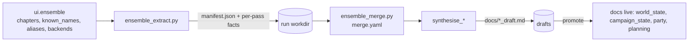

# Config Subsystems — Ensemble Workflow & Grounding Docs

Two configuration subsystems beyond the core config service: the ensemble grounding-doc
pipeline and the party / campaign_state / world_state grounding-doc system. Both mix persisted
`ui_state` sections, hand-authored YAML, and generated run artifacts.

## Ensemble workflow (extract → bundle → synthesize → review)

Router `server/routers/ensemble.py` shells out to CLI scripts; disk is truth, CLI is the engine.
Only 4 docs are promotable: `world_state`, `campaign_state`, `party`, `planning`.



| Config source | Kind | Read by | Written by |
|---|---|---|---|
| `ui.ensemble` (EnsembleSection) | ui_state.yaml (persisted) | ensemble router (`chapters_glob`, `chapters_selected[]`, extract/synthesize `BackendProfile`, `known_names[]`, `aliases_path`, `campaign_dir`) | `PUT /section/ensemble` |
| merge-config YAML (`--config merge.yaml`) | hand-authored, per-run | `ensemble_merge.py` (method, similarity, threshold) | human; precedence CLI flag > `--config` > default |
| `manifest.json` (run workdir) | generated per run | `ensemble_merge.load_manifest` / `load_pass_outputs` | `ensemble_extract.py` |
| per-pass fact JSON (workdir) | generated | `ensemble_merge.load_pass_outputs` | `ensemble_extract.py` |
| aliases file (`aliases_path`) | hand-authored | alias-correction gate (bundle stage) | human |
| known_names sources | referenced files | bundle stage / alias gate | human (selected in `ui.ensemble`) |
| GROUNDING_DOCS live/draft pairs | `docs/*.md` + `docs/*_draft.md` | ensemble router promote/diff; synthesis writes draft | synthesize writes `*_draft.md`; promote copies draft → live |

Stage/model knobs:

| Knob | Type | Rule |
|---|---|---|
| extract stage | BackendProfile | any backend; OpenRouter via env seam |
| synthesize stage | BackendProfile | warns if model not in `SYNTHESIS_CAPABLE` |
| `chapters_selected` | explicit list | empty = nothing (no silent "all"); extraction refuses to run |

## Grounding docs (party / campaign_state / world_state / planning)

```mermaid
flowchart TB
  PY[party.yaml] --> PP[party.py] --> PMD[docs/party.md]
  PLY[planning.yaml] --> PLP[planning.py] --> PLMD[docs/planning.md]
  TRK[tracking.txt] --> CS[campaign_state.py] --> CSMD[docs/campaign_state.md]
  WS[world_state.md hand + ensemble] --> WSMD[docs/world_state.md]
  PMD & PLMD & CSMD & WSMD -->|referenced by config.yaml documents[]| PREP[prep.py / mcp_server.py]
```

| File | Shape | Read by | Written by |
|---|---|---|---|
| `party.yaml` (`config/party.yaml`) | `characters[]`: name, sheet, backstory?, dossier?, arc_score (3-state), trackless | `config_routes.get_party_yaml` (UI); `party.py --party-config` | `config_routes.put_party_yaml` (UI); hand |
| `planning.yaml` | `npcs[]` + `factions[]`: name, dossier, arc_score (3-state), trackless | `config_routes.get_planning_yaml` (UI); `planning.py` | `config_routes.put_planning_yaml` (UI); hand |
| tracking file (`--track-file tracking.txt`) | one item per line; `#` comments ignored | `campaign_state.py` | hand |
| `world_state.md` | lore / history / canon | prep, mcp_server, ensemble (extract input) | hand (+ ensemble synthesis draft); referenced by `config.yaml` `documents[]` |
| `campaign_state.md` | completed vs currently-true state | prep, mcp_server | `campaign_state.py` (extract+synthesize from summaries; `.candidate` to avoid clobber) |
| `party.md` | party roster + arc scores | prep, mcp_server | `party.py` (from party.yaml + sheets + summaries; `.candidate` if exists) |
| `planning.md` | forward-looking dossiers / NPC notes | prep, mcp_server | `planning.py`; hand-edited |

### arc_score 3-state (party.yaml + planning.yaml)

| State | On disk | Meaning |
|---|---|---|
| absent | `arc_score` key omitted | trackless=False, no track |
| null | `arc_score: null` | trackless=True (first-class trackless PC/NPC) |
| path | `arc_score: docs/tracking/x.md` | tracked against that file |

## Freshness & ordering (mtime)

The ensemble pipeline and the session-doc/narrate pipeline express "what is up to date"
entirely through file **modification times**, computed on demand in status endpoints — there is
no declared dependency graph and no execution gate.

There are three distinct freshness mechanisms in the repo; only the first is mtime-based:

| Mechanism | Where | Signal |
|---|---|---|
| Ensemble + narrate stage status | `ensemble.py`, `scene_editor.py` | `stat().st_mtime` comparisons |
| 5e runtime rebuild | `launch_5etools_mcp.py` | sha256 of `refs.yaml` + `refs.local.yaml` |
| Ingest idempotence | `fivetools_ingest` / `apply_ingest_manifest.check_status` | `(size, mtime)` sidecar tuple |

### Promotion staleness rule (ensemble `/status`)

A grounding doc counts as **promoted/reviewed** only when the live file exists, the draft file
exists, and `live.mtime >= draft.mtime`:

```python
promoted = [name for name, (live_rel, draft_rel) in GROUNDING_DOCS.items()
            if (cwd / live_rel).exists() and (cwd / draft_rel).exists()
            and (cwd / live_rel).stat().st_mtime >= (cwd / draft_rel).stat().st_mtime]
```

Re-running synthesize writes a newer `*_draft.md`, which makes the draft newer than live, so the
`review` stage flips back to not-complete. That timestamp comparison is the entire "live doc is
stale vs a newer draft" detector — no content check.

### Ordering is derived, not declared

The ensemble `/status` endpoint recomputes stage completion from artifacts on disk every request
(no caching):

- `extract` complete = `docs/ensemble/per_chapter/*/merged.json` exists
- `bundle` complete = `docs/ensemble/state_dossiers/*.md` exists
- `synthesize` complete = any `*_draft.md` exists
- `review` complete = the mtime rule above
- `current_stage` = first non-complete stage

The order `extract → bundle → synthesize → review` is inferred from which artifacts exist and
their timestamps, not from a declared DAG. The narrate pipeline (`scene_editor.api_pipeline_status`)
uses the same pattern: `cold` (no output), `warn` (an input mtime is newer than the output), `ok`.

### What it does and does not do

- Drives **UI status only** (stage badges / header strip). It does not trigger or block execution;
  nothing auto-reruns a downstream stage when an upstream mtime moves.
- Loosest across the `config.yaml` `documents[]` boundary: `prep.py` / `mcp_server.py` read the live
  grounding docs with **no** freshness check, so a stale doc can flow downstream with no signal.

### Failure modes of mtime-as-contract

- **mtime ≠ content.** A no-op rewrite or `touch` marks a draft "newer"; hand-editing a *live* doc
  bumps its mtime above the draft so it looks reviewed while its content has diverged.
- **Clock skew / mtime granularity** can misorder near-simultaneous writes.
- **No cross-service invalidation** for the prep/MCP consumers of the promoted docs.

> Tracked improvement: grounding docs (starting with `world_state`) should carry an explicit,
> content-derived freshness stamp *inside the file* (e.g. a front-matter `source_hash` / generation
> id) rather than relying on filesystem mtime. See the CampaignGenerator issue on embedded grounding-doc stamps.

## How they connect

`ui.ensemble` selects inputs (chapters, known_names, aliases, per-stage backends); the ensemble
CLI produces `manifest.json` + per-pass facts in a run workdir, merges them (merge-config YAML),
synthesizes `*_draft.md`, and promotes drafts into the four live grounding docs. `party.yaml` and
`planning.yaml` declare rosters/dossiers with 3-state arc tracking; `party.py` / `planning.py` /
`campaign_state.py` generate the matching `.md` docs (non-clobbering `.candidate` on conflict),
which `config.yaml` `documents[]` then references for prep and the MCP server.
