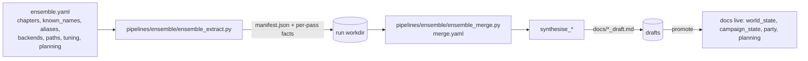

# Config Subsystems — Ensemble Workflow & Grounding Docs

Two configuration subsystems beyond the core config service: the ensemble grounding-doc
pipeline and the party / campaign_state / world_state grounding-doc system.

Neither subsystem uses a `ui_state` section — nothing does.
[ensemble-isolation.md](./ensemble-isolation.md) gave Ensemble its own owned, strict
`<config>/ensemble.yaml` (`EnsembleConfigService`), and
[grounding-isolation.md](./grounding-isolation.md) gave the grounding docs
`<config>/grounding.yaml` (`GroundingConfigService`) plus a real owner for the PC roster
(`PartyConfigService`). [ui-state-retirement.md](./ui-state-retirement.md) then deleted
`ui_state.yaml` itself. Their *content* documents (`party.yaml`, `planning.yaml`, `tracking.txt`)
remain hand-authored — that separation is the design, not a gap.

## Ensemble workflow (extract → bundle → synthesize → review)

Router `server/routers/ensemble.py` shells out to CLI scripts; disk is truth, CLI is the engine.
Only 4 docs are promotable: `world_state`, `campaign_state`, `party`, `planning`.



| Config source | Kind | Read by | Written by |
|---|---|---|---|
| `ensemble.yaml` (`EnsembleConfig`, strict) | own file, `EnsembleConfigService` | every `/api/ensemble/*` route via `resolved()` — `chapters_selected[]`, `known_names[]`, `aliases_path`, `extract`/`synthesize` (`EnsembleBackend`, plural `endpoints`), `paths.*`, `tuning.*`, `planning.*` | `PUT /api/ensemble/config` |
| merge-config YAML (`--config merge.yaml`) | hand-authored, per-run | `pipelines/ensemble/ensemble_merge.py` (method, similarity, threshold) | human; precedence CLI flag > `--config` > default |
| `manifest.json` (run workdir) | generated per run | `ensemble_merge.load_manifest` / `load_pass_outputs` | `pipelines/ensemble/ensemble_extract.py` |
| per-pass fact JSON (workdir) | generated | `ensemble_merge.load_pass_outputs` | `pipelines/ensemble/ensemble_extract.py` |
| aliases file (`aliases_path`) | hand-authored | alias-correction gate (bundle stage) | human |
| known_names sources | referenced files | bundle stage / alias gate | human (selected in `ensemble.yaml`) |
| GROUNDING_DOCS live/draft pairs | `docs/*.md` + `docs/*_draft.md` | ensemble router promote/diff; synthesis writes draft | synthesize writes `*_draft.md`; promote copies draft → live |

Stage/model knobs:

| Knob | Type | Rule |
|---|---|---|
| extract stage | `EnsembleBackend` | any backend; OpenRouter via env seam |
| synthesize stage | `EnsembleBackend` | warns if model not in `SYNTHESIS_CAPABLE` |
| `chapters_selected` | explicit list | empty = nothing (no silent "all"); extraction refuses to run, and the stored value never stands in for an omitted `chapters` request param |
| `paths.*` / `tuning.*` | per-campaign | were route-signature literals before Phase 3 — a differently laid-out `docs/` needed a code edit |
| Anthropic `--model` | resolved | explicit request → per-stage config → `platform.runtime.default_model` → `campaignlib` literal (Phase 4). A stale non-Anthropic id is dropped, not forwarded |

## Grounding docs (party / campaign_state / world_state / planning)

```mermaid
flowchart TB
  PY[party.yaml] --> PP[pipelines/grounding/party.py] --> PMD[docs/party.md]
  PLY[planning.yaml] --> PLP[pipelines/grounding/planning.py] --> PLMD[docs/planning.md]
  TRK[tracking.txt] --> CS[pipelines/grounding/campaign_state.py] --> CSMD[docs/campaign_state.md]
  WS[world_state.md hand + ensemble] --> WSMD[docs/world_state.md]
  PMD & PLMD & CSMD & WSMD -->|referenced by config.yaml documents[]| PREP[pipelines/session_prep/prep.py / pipelines/rlm/mcp_server.py]
```

| File | Shape | Read by | Written by |
|---|---|---|---|
| `party.yaml` (`config/party.yaml`) | `characters[]`: name, sheet, backstory?, dossier?, arc_score (3-state), trackless | `PartyConfigService` (UI, `/api/party/characters`); `pipelines/grounding/party.py --party-config` | `PartyConfigService`; hand |
| `planning.yaml` | `npcs[]` + `factions[]`: name, dossier, arc_score (3-state), trackless | `PlanningConfigService` (UI); `pipelines/grounding/planning.py` | `PlanningConfigService` (UI); hand |
| tracking file (`--track-file tracking.txt`) | one item per line; `#` comments ignored | `pipelines/grounding/campaign_state.py` | hand |
| `world_state.md` | lore / history / canon | prep, mcp_server, ensemble (extract input) | hand (+ ensemble synthesis draft); referenced by `config.yaml` `documents[]` |
| `campaign_state.md` | completed vs currently-true state | prep, mcp_server | `pipelines/grounding/campaign_state.py` (extract+synthesize from summaries; `.candidate` to avoid clobber) |
| `party.md` | party roster + arc scores | prep, mcp_server | `pipelines/grounding/party.py` (from party.yaml + sheets + summaries; `.candidate` if exists) |
| `planning.md` | forward-looking dossiers / NPC notes | prep, mcp_server | `pipelines/grounding/planning.py`; hand-edited |

### arc_score 3-state (party.yaml + planning.yaml)

| State | On disk | Meaning |
|---|---|---|
| absent | `arc_score` key omitted | trackless=False, no track |
| null | `arc_score: null` | trackless=True (first-class trackless PC/NPC) |
| path | `arc_score: docs/tracking/x.md` | tracked against that file |

## How they connect

`ensemble.yaml` selects inputs (chapters, known_names, aliases, per-stage backends, paths, tuning); the ensemble
CLI produces `manifest.json` + per-pass facts in a run workdir, merges them (merge-config YAML),
synthesizes `*_draft.md`, and promotes drafts into the four live grounding docs. `party.yaml` and
`planning.yaml` declare rosters/dossiers with 3-state arc tracking; `pipelines/grounding/party.py` / `pipelines/grounding/planning.py` /
`pipelines/grounding/campaign_state.py` generate the matching `.md` docs (non-clobbering `.candidate` on conflict),
which `config.yaml` `documents[]` then references for prep and the MCP server.
