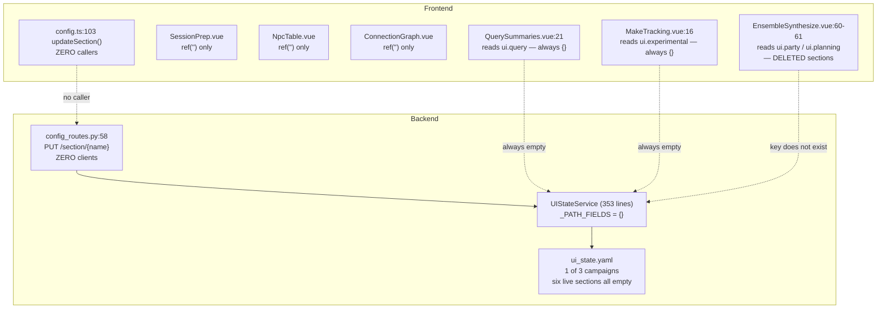

# UI State Retirement — closing the last "no service ownership" row

> **Status: ✅ Done (2026-07-25).** All five phases shipped on
> `feat/ui-state-retirement`. Fifth and final entry in the service-isolation series, after
> [planning-isolation.md](./planning-isolation.md),
> [session-editor-isolation.md](./session-editor-isolation.md),
> [platform-isolation.md](./platform-isolation.md),
> [ensemble-isolation.md](./ensemble-isolation.md) and
> [grounding-isolation.md](./grounding-isolation.md). It closes the row
> [service-cut.md](./service-cut.md) had marked **"Mostly closed"** — and closes it by deleting a
> tier rather than extracting a sixth service.
>
> **Verified:** full suite 12 failures/errors, **identical IDs to `main`** (dgxlib absent ×7, one
> live mempalace test, two env-dependent `resolve_roots`, one benchmark gate, one extract_facts
> CLI) — zero regressions. `vue-tsc` clean. Net **−629 lines**.
>
> **D1 settled by the GM (2026-07-25): delete only** — the prep pages stay stateless, and that is
> now recorded rather than incidental. **D2 taken as an implementation call.** **D3 open** — the
> orphaned `ui_state.yaml` in `out-of-the-abyss` is drained but not yet deleted.
>
> See [Implementation notes](#implementation-notes-as-shipped) for what the work turned up that
> the plan did not predict. Every "current state" claim below was code-verified against `main` at
> `09cbfa4` with a file:line citation.

## Thesis

The four prior isolations each *extracted* a service. **This one does not.**

`service-cut.md` reads the remaining six sections as "the loose pages" — the tail
of a queue that five services already worked through. Read against source, they
are not a tail. They are **zero services with zero data and zero writers**. The
last four pages that a `ui.<section>` was supposed to serve persist nothing at
all, and the machinery that would persist them has had no caller since the
frontend was migrated off it.

So the row closes by **deletion**, not extraction — with one genuine question
underneath that deletion must not paper over: *four pages have never had
persistence, and retiring the tier makes that permanent unless we decide
otherwise.*

**Decided (D1): leave them stateless.** They are one-shot run forms — the GM
types a value and runs it in the same breath. That is now a recorded design
position rather than an accident of a service nobody finished, which is the
substantive difference between this and the write-never bug grounding-isolation
had to fix.

## Current state (code-verified)



| Surface | Source | Reality |
|---|---|---|
| `UISection` | `config_models.py:120-125` | six `_LooseSection` fields: `prep`, `npc`, `query`, `workflow`, `connections`, `experimental` |
| `updateSection` | `stores/config.ts:103` | **no callers.** `grep -rn updateSection frontend/src` returns the definition (`:103`), the export (`:189`), and two historical comments (`CampaignState.vue:24`, `DistillWorldState.vue:18`) |
| `PUT /api/config/section/{name}` | `config_routes.py:58-68` | **no client.** The only write door into `ui_state.yaml`, and nothing in the shipped UI opens it |
| `_PATH_FIELDS` | `config_service.py:76` | `{}` — empty since grounding-isolation Phase 10, kept and flagged deliberately |
| `_normalize_stored_paths` | `config_service.py:144-193` | iterates `sections_to_check = ("grounding",)` — a section that no longer exists in `UISection` |
| sibling-session rebase | `config_service.py:292-318` | loops `for section, fields in _PATH_FIELDS.items()` — an empty dict |
| `ui_state.yaml` | live campaigns | present in **1 of 3** (`out-of-the-abyss`); absent in `Phandalin`, `obelisk` |

### 1. Every one of the six sections is empty, in the only campaign that has the file

`out-of-the-abyss/config/ui_state.yaml` is 57 KB. Its six *live* sections hold
nothing:

| Section | Stored |
|---|---|
| `ui.prep`, `ui.npc`, `ui.query`, `ui.workflow`, `ui.connections`, `ui.experimental` | `{}` — all six, zero keys |

The 57 KB is entirely **stale pre-migration debris** that `UISection`
(pydantic default `extra="ignore"`) silently drops at load: `ui.session_doc`
(26 keys), `ui.vtt_summary` (8), `ui.ensemble` (7), `ui.profiles` (2),
`ui.party` (2), `ui.grounding` (1), `ui.campaign_state` / `ui.distill` /
`ui.planning` (0 each). The file still declares `version: 2` against
`SCHEMA_VERSION = 5`.

### 2. There is unmigrated live data in that debris — and it is being ignored *today*

`out-of-the-abyss/config/` has **no `platform.yaml`**, but its `ui_state.yaml`
carries a top-level `runtime:` block:

```yaml
runtime:
  default_model: claude-opus-4-8
  session_dir: /home/kroussos/campaigns/out-of-the-abyss/summaries/20260629
```

`PlatformConfigService._load_platform_doc` treats a missing `platform.yaml` as
all-defaults, so **right now that campaign boots with `default_model` =
`claude-sonnet-4-6` and `session_dir` = unset** — the GM's persisted Opus pick
and session anchor are orphaned. This is not caused by the plan; it is a live
condition the plan must not step on. See
[Prerequisite](#prerequisite-run-the-three-pending-migrations-on-out-of-the-abyss).

`ui.ensemble` and `ui.grounding` are also unmigrated there, but hold only
defaults (`chapters_selected: []`, `summaries: null`) — migrating them recovers
nothing. `runtime` is the one that matters.

### 3. Four pages persist nothing at all

| Page | Section it was meant to use | What it actually does |
|---|---|---|
| `views/prep/SessionPrep.vue` | `ui.prep` | 7 bare `ref()`s (`:9-16`) — beat, session file, prep mode, config, output, no-log. No load, no save |
| `views/prep/NpcTable.vue` | `ui.npc` | 4 bare `ref()`s (`:9-12`) |
| `views/prep/ConnectionGraph.vue` | `ui.connections` | ~20 bare `ref()`s (`:11-46`) including `docsDir`, `dossierDir`, `cachePath` |
| `views/prep/QuerySummaries.vue` | `ui.query` | reads `config.resolved.ui?.query` on mount (`:21`) — always `{}`; the value it wants (`summaries`) now comes from `groundingConfig` (`:23`) |

This is the **same write-never class** grounding-isolation found in
`ui.campaign_state` / `ui.distill` — except worse: those at least had a read
path expecting a writer. Here there was never a writer to break. Every path the
GM types into Session Prep, NPC Table or the Connection Graph is lost on
navigation.

### 4. Three reads point at sections that no longer exist

| Site | Reads | Status |
|---|---|---|
| `views/ensemble/EnsembleSynthesize.vue:60` | `config.resolved?.ui?.party?.config_path` | `ui.party` **deleted** in grounding-isolation Phase 10 → permanently `''` |
| `views/ensemble/EnsembleSynthesize.vue:61` | `config.resolved?.ui?.planning?.config_path` | `ui.planning` **deleted** → permanently `''` |
| `views/setup/MakeTracking.vue:16` | `config.resolved.ui?.experimental?.make_tracking` | section exists but is empty and unwritable → permanently `{}` |

The EnsembleSynthesize pair is a **live user-visible defect**, not just dead
code. `partyConfigPath` / `planningConfigPath` feed the run params (`:113`,
`:122`, `:138`), the displayed path hint (`:166`) and two `warn-hint` guards
(`:172`, `:184`). Since Phase 10 those prefills are always blank and the warnings
always fire. The correct source is `groundingConfig.party.config_path` /
`groundingConfig.planning.config_path`, which `GroundingConfig` already declares
and the store already boot-loads (`config.ts:69`).

### 5. `resolved()` is still needed — just not its `ui` key

Deleting the tier must not delete `resolved()`. Live consumers of the other keys:

| Key | Consumers |
|---|---|
| `resolved.campaign_dir` | `utils/paths.ts:15`, `ConnectionGraph.vue:276`, `PartyConfigEditor.vue:51`, `PlanningConfigEditor.vue:47` |
| `resolved.runtime.session_dir` | `utils/paths.ts:16`, `SessionDocEditor.vue:59` |
| `resolved.runtime.default_model` | `stores/config.ts:76` |
| `resolved.server` / `resolved.nav` | `Settings.vue:8` (raw dump) |

All four are platform-owned. `resolved()` currently lives on `UIStateService`
(`config_service.py:247`) purely because it once needed `_PATH_FIELDS`; with that
table empty, it needs nothing this class owns. `PlatformConfigService.resolved()`
is already a one-line passthrough to it (`platform_config_service.py:464`).

## Problems, stated plainly

1. **A tier that owns nothing.** 353 lines of service, 149 lines of models, a
   REST route, a store method and a 57 KB file, serving six empty dicts.
2. **Dead machinery that looks load-bearing.** `_PATH_FIELDS` is empty by
   design and flagged as such — but `_normalize_stored_paths`, the sibling-session
   rebase and the write-time relativization all still read it. The comment at
   `config_service.py:64-76` explicitly defers retirement to "the next isolation
   that empties `UISection`." **This is that isolation.**
3. **Stale reads survive because nothing validates a read.** Three sites read
   keys that cannot exist. A loose `extra="allow"` section cannot fail a read —
   which is the same property that hid the grounding write-never bug.
4. **Four pages with no persistence, invisible because there is no schema to
   check them against.** Naming this is the point of the effort; whether to *fix*
   it is D1.
5. **A schema version that has stopped meaning anything, again.** `version: 2`
   on disk vs `SCHEMA_VERSION = 5` in code, in the only campaign that has a file.

## Prerequisite: run the three pending migrations on out-of-the-abyss

**Before any phase below.** Not part of the code change — one command each,
today, against the one campaign that has the file:

```bash
python -m server.migrate_platform_config  --campaign-dir ~/campaigns/out-of-the-abyss   # RECOVERS claude-opus-4-8 + session_dir
python -m server.migrate_ensemble_config  --campaign-dir ~/campaigns/out-of-the-abyss   # defaults only
python -m server.migrate_grounding_config --campaign-dir ~/campaigns/out-of-the-abyss   # defaults only
```

Only the first recovers anything. Run all three anyway: after Phase 4 the source
file is gone, and "we checked and it was only defaults" is a claim worth being
able to make from a migration report rather than from this document.

## Proposed solution

Two tracks. B is independent and lands first; A is the bulk. C is struck by D1
and survives only as a documentation obligation.

### Track B — fix the stale reads (independent, do first)

Land before A so the fixes are attributable and the ensemble defect is closed
regardless of what happens to the rest.

1. `EnsembleSynthesize.vue:60-61` → read `config.groundingConfig?.party?.config_path`
   and `?.planning?.config_path`. Closes the blank-prefill/always-warning defect.
2. `MakeTracking.vue:16` → drop the `ui.experimental.make_tracking` read; the
   page keeps its `ref()` defaults.
3. `QuerySummaries.vue:21` → drop the `config.resolved.ui?.query` read; keep the
   `groundingConfig.summaries` fallback that already works (`:23`).

### Track A — retire the tier

| Delete | Where |
|---|---|
| `UIStateService` | `server/config_service.py` (whole file, 353 lines) |
| `UIState`, `UISection`, `_LooseSection`, `LegacySection`, `UI_SECTION_NAMES`, `SCHEMA_VERSION` | `server/config_models.py` — the file empties out except `OptStr`/`OptBool`/`ProfileEntry`/`BackendProfile`, which move to `server/platform_config_shared.py` (see D2) |
| `PUT /api/config/section/{name}` + `SectionUpdate` | `config_routes.py:54-68` |
| `"ui_state_path"` from the `GET /api/config/` body | `config_routes.py:41` |
| `"schema_version"` from the same body | `config_routes.py:43` |
| `updateSection` | `stores/config.ts:103-107`, `:189` |
| `uiStatePath` + its `.config-path` block | `Settings.vue:20`, `:56-59` |
| `ui_state.yaml` from `CONFIG_NAMES` | `migrate_config.sh:61` |
| `ConfigError` | moves to `platform_config_shared.py` (it is raised by the platform loader too) |

| Move | From → To |
|---|---|
| `resolved()` + `_RUNTIME_PATH_FIELDS` + `_resolve_session_base` | `UIStateService` → `PlatformConfigService`, dropping the `ui` key from its return and the now-unreachable `_PATH_FIELDS` loops, the sibling-session rebase, and the `else: ui_raw.setdefault(section, {})` boot-override branch (`config_service.py:280`) |
| `self.uis` construction | deleted from `PlatformConfigService.__init__:217`; the "load `platform.yaml` before `UIStateService`" ordering constraint documented in that class's docstring **goes away with it** |

`resolved()` after the move returns `{campaign_dir, runtime, server, nav}` — all
four still consumed (§5). Its boot-override loop keeps only the `runtime` and
`server` branches.

**On-disk:** `ui_state.yaml` becomes an unread file. Per the GM directive
recorded in `grounding-isolation.md` D6, orphaning is not defended against and no
stray-file boot check is built — but this case is the inverse (the *reader* goes
away, not the file), so the file should be deleted by hand after the prerequisite
migrations, not left to rot. That is D3.

### ~~Track C — the four unpersisted pages~~ (struck: D1 = delete only)

No `prep.yaml`, no `PrepConfigService`. Session Prep, NPC Table, Query Summaries
and the Connection Graph keep their `ref()` state and lose it on navigation, by
decision rather than by omission.

What Track C *does* still owe is one paragraph, in `service-cut.md` and in each
of the four components' script blocks, saying so — in the shape
`CampaignState.vue:24` and `DistillWorldState.vue:18` already use to record their
own history. Without it, the next reader finds four pages with no persistence and
no schema and re-opens the question from scratch; with it, the absence is
legible. Cheap, and it is the entire reason this was worth asking rather than
assuming.

Should the position ever reverse, the template is `grounding.yaml` verbatim (one
strict document, one owning service, one grouped `GET`/`PUT`, four run profiles)
and the line to draw is the one `ensemble.yaml` already draws: stored
*selections* (paths, modes, output targets) are config; per-run *inputs* (`beat`,
`session_text`, the query string, `selectedFiles`) never are.

## Phases

| # | Track | Deliverable | Status |
|---|---|---|---|
| 0 | — | **Prerequisite:** the four migrations on `out-of-the-abyss` | ✅ (`platform` by the GM; `ensemble`/`grounding` in-effort — defaults only, as predicted) |
| 1 | B | Three stale reads repointed; `EnsembleSynthesize` prefill defect closed | ✅ |
| 2 | A | `resolved()` moved to `PlatformConfigService`; `ui` key dropped; dead `_PATH_FIELDS` machinery deleted | ✅ |
| 3 | A | `config_service.py`, `config_models.py`, `PUT /section/{name}`, `updateSection`, the `Settings.vue` block and the `migrate_config.sh` entry deleted; D2 relocations | ✅ |
| 4 | A | Delete `~/campaigns/out-of-the-abyss/config/ui_state.yaml` | ⏸ **pending D3** |
| 5 | — | Docs reconciled; the gap row goes **Mostly closed → Closed** | ✅ |

Phase 1 is independent of everything. Phases 2–3 must not be one commit: Phase 2
is a behavior-preserving move of the session-base resolution and deserves its own
attributable diff, for the same reason `platform-isolation.md` split its Phase 3
out ("moves the anchor, not a leaf").

## Tests

| Test | Asserts |
|---|---|
| `test_no_ui_state.py` *(new guard)* | no source file under `server/`, `frontend/src/` references `ui_state`, `UISection`, `ui.<section>` or `PUT /section/` — the mechanical guard that stops a seventh loose section being added later, in the spirit of `test_config_location.py` and `test_retrieve_render_isolation.py` |
| `test_platform_config_service.py` | `resolved()` returns `{campaign_dir, runtime, server, nav}` and **no `ui` key**; boot overrides for `runtime.*` and `server.*` still apply; a `--session-dir` boot override still reaches `resolved().runtime.session_dir` |
| `test_config_routes.py` | `GET /api/config/` no longer carries `ui_state_path` / `schema_version`; `PUT /api/config/section/prep` **404s** (route gone, not "unknown section") |
| `test_ensemble_synthesize_paths.py` *(new)* | **Track B:** `party`/`planning` config-path prefill comes from `grounding.yaml`, and a configured path suppresses the `warn-hint` — the regression that has been live since Phase 10 |
| `test_main_boot_overrides.py` | update: the `else` branch that routed unknown dotted keys into `ui_raw` is gone; every remaining flag still reaches a consumer (the assertion shape `platform-isolation.md` O1 established) |

**Existing tests that retire rather than migrate:** `test_config_service.py`
(670 lines — the largest single test file touched by this effort) and
`test_config_models.py` (127 lines) test `UIStateService`/`UIState` exclusively.
Their `resolved()` coverage moves to `test_platform_config_service.py`; the rest
is deleted, not ported. Eleven further test files reference the retired names
incidentally and need touch-ups: `test_migrate_{session_doc,ensemble_config,
grounding_config,platform_config}.py` (they read `ui_state.yaml` **raw** and are
unaffected in behavior — only their imports of `UI_STATE_NAME` need a home),
`test_ensemble_config_service.py`, `test_grounding_config_service.py`,
`test_session_editor_config_service.py`, `test_editor_service_integration.py`,
`test_grounding_backend.py`, `test_config_location.py`, `test_config_routes.py`.

`UI_STATE_NAME` must survive somewhere for the four migration CLIs — they exist
to read a file the server no longer reads. Suggest `server/migrate_common.py`,
or inline the literal in each. See D2.

## Invariants this must not break

- **The four migration CLIs keep working after the server stops reading
  `ui_state.yaml`.** They read it raw, by design, precisely so they can rescue
  fields the live schema no longer declares. Retiring the *reader* must not
  retire the *rescuers* — a campaign restored from an old backup still needs them.
- **`resolved().runtime.session_dir` stays the session-resolution anchor.**
  `SessionEditorConfigService._relativized_paths` / `resolved_editor_config`
  depend on it; `utils/paths.ts:16` and `SessionDocEditor.vue:59` read it.
- **Boot overrides keep winning for the process.** `--session-dir`, `--host`,
  `--port` must still overlay in `resolved()` after the move.
- **`config.yaml` is never machine-written.**
- **No new probe.** Anything Track C adds resolves off `platform.config_path_base`
  by declaration — `test_config_location.py` enforces this.

## Explicitly out of scope

- **Gap #3, unified backend selection.** Four selectors survive; untouched, as in
  all four prior efforts.
- **`SessionConfig.vue`'s client-side broadcast** (`Object.assign(config.values, …)`,
  `:57`, `:154`). `platform-isolation.md` named it and deferred it: it is the same
  fragmented-state shape one layer up, in the frontend. Retiring `ui_state.yaml`
  does not touch it, and `QuerySummaries.vue:20` still reads `config.values` as a
  fallback. **Named here so "the config tier is finished" is not read as "the
  fragmented state is finished."**
- **`config.yaml`'s platform/`mempalace` mixture** — human-owned, no writer.
- **Gap #4 (producer/consumer contracts) and gap #6 (service registry).** After
  this effort `service-cut.md`'s "no service ownership" and "no schema-per-service"
  rows close outright; those two, plus gap #3 and "coupling via shared files",
  remain the honest open list.

## Implementation notes (as shipped)

Five things the work turned up that the plan above did not predict.

**The guard test found a live defect while being written.** `server/main.py`'s boot-failure
message told the GM to go fix `ui_state.yaml` — a file the server had stopped reading one phase
earlier. Pointing someone at a file that cannot be the cause is worse than naming none; it now
names the two documents that can actually raise a `ConfigError`. This is the fourth time in the
series that a mechanical guard caught something a manual audit had walked past.

**And the guard's own first cut was wrong in the series' signature way.** It stripped comments by
skipping lines that *start* with a quote — which reported 40 false positives, every one a
continuation line inside a multi-line docstring, while keeping the one true positive above. Rewrote
it to find Python docstrings with `ast`. Same lesson `platform-isolation.md` records three times:
a thing defined by its structure cannot be inventoried by grepping one of its spellings.

**Deleting the `else` branch would have been a silent no-op.** `resolved()`'s boot-override loop
swept any unrecognised dotted section into `ui_raw`, where nothing read it — that is precisely
where twelve dead `session_doc.*` flags hid for months (O1). Dropping the branch along with
`ui_raw` would have restored the same silence by a different route, so it is replaced by a
construction-time `ConfigError`: an override with no consumer now fails the boot.

**Two isolation-invariant tests needed re-expressing, not deleting.** Both used a `ui.<section>`
write as their probe for "one service's write must not touch another's document". The probe
ceased to exist; the invariant did not. They now use `grounding.yaml` as the sibling document —
and the "assert both files exist or this guard is vacuous" line the ensemble test already carried
turned out to be exactly the right instinct, since the naive edit would have left it guarding a
file nothing creates.

**`SCHEMA_VERSION` was the tell, in hindsight.** The document reached `version: 5` through five
bumps — four of which recorded a section's *departure*. Nothing ever arrived. A version number
that only ever counts subtractions is describing a document being dismantled, and four prior
efforts read it as a document being migrated.

## Decisions

| # | Question | Call |
|---|---|---|
| **D1** | Do the four prep/setup pages get real persistence, or does the tier close by deletion alone? | **Delete only** (GM, 2026-07-25). They are one-shot run forms; the GM does not retype into them across sessions. Track C struck, Phase 5 removed. The statelessness gets **recorded** in `service-cut.md` and in the four components, so it reads as a position rather than an oversight |
| **D2** | Where do `ProfileEntry`, `BackendProfile`, `OptStr`, `OptBool`, `ConfigError` and `UI_STATE_NAME` land when `config_models.py` empties? | **Split each symbol to its owner** — validators + `ConfigError` → `platform_config_shared.py`; `ProfileEntry`/`BackendProfile` → `session_editor_config_shared.py` (their only consumer); `UI_STATE_NAME` → a new `server/migrate_common.py` shared by the four migration CLIs. Taken as an implementation call: internal organization, no data at stake, and "each symbol lands with its owner" is the series' own rule. Costs one new file |
| **D3** | The orphaned 57 KB `out-of-the-abyss/config/ui_state.yaml` | **Still open — needs a GM call, and it is the destructive one.** The file is now fully drained (all four migrations run; only `runtime` held anything real), so deleting it loses nothing — but it is campaign data, so the call is the GM's. (a) delete in Phase 4 after the prerequisite migrations; (b) leave it as an unread record of pre-isolation state. Recommend (a): `~/campaigns` is git-tracked so history keeps the record, and an unread config file on disk is the exact "multiple authorities" smell the series exists to remove |

## Effort

| Phase | Size |
|---|---|
| 0 | XS — three commands |
| 1 | S — three frontend reads |
| 2 | **M — the real work**; moves `resolved()` and the session-base helpers |
| 3 | M — wide deletion, 13 test files touched, 2 retired |
| 4 | XS |
| 5 | S — 7 docs + 4 component comments |

Net **deletion**: ~500 lines of server code and ~800 lines of tests removed
against ~150 added. The second net-negative effort in the series after
`platform-isolation.md`, and the largest.
