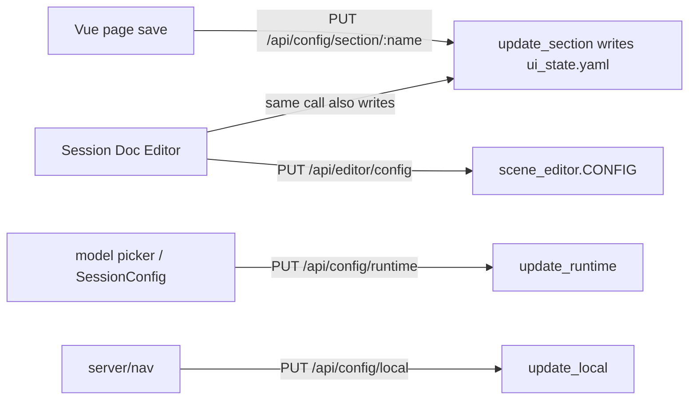

# CampaignGenerator Configuration — Value-Level Read/Write Map

One level below the file map: each configuration value, who reads it, who updates it.
Test-only references omitted; only runtime code paths listed.

## Write-path mechanics

Every `ui.<section>` is written through the one generic route `PUT /api/config/section/:name`
→ `CampaignConfigService.update_section` (each Vue page saves its own section). `scene_editor`
additionally writes `session_doc` via `PUT /api/editor/config`. `config.yaml` has no writer;
`wiring.yaml` is mneme-only.

## config.yaml (writer: human / pipelines/workspace/new_workspace.py)

| Value | Read by |
|---|---|
| `system_prompt` | `pipelines/session_prep/prep.py` |
| `log_dir` | `pipelines/session_prep/prep.py`, `pipelines/grounding/npc_table.py` |
| `agents.{lore_oracle,encounter_architect,voice_keeper}` | `pipelines/session_prep/prep.py` pipeline |
| `documents[]` | `assemble_docs`, `pipelines/session_prep/prep.py`, `pipelines/rlm/mcp_server.py`, `session_doc/check_consistency.py` |
| `mempalace.canon_wing` / `index_wings` | `pipelines/rlm/mcp_server.py` |
| `mempalace.palace` | `apply_ingest_manifest.resolve_palace` (fallback) |

## ui_state.yaml — ui.session_doc

Writer: `PUT /section/session_doc` + `scene_editor` (`PUT /api/editor/config`).

| Value(s) | Read by |
|---|---|
| path fields (session/campaign based) | `scene_editor` resolved paths for narrate pipeline |
| `narrate_tokens, prose_mode, reflections, narration_genre, batch` | `scene_editor` narrate knobs (also mirrored from `ui.profiles`) |
| `backend, dgx_endpoint, dgx_model` | `scene_editor._llm_env` → DGX env |
| `scrub_enabled, scrub_tokens` | `scene_editor` scrub stage |
| `gm_player, characters, context[]` | `scene_editor` |

## ui_state.yaml — other sections + runtime

| Value | Read by | Written by |
|---|---|---|
| `ui.vtt_summary.*` | `session_doc/vtt_summary.py` / session_workflow router | `PUT /section/vtt_summary` (router also writes `session_summary` after a run) |
| `ui.grounding.summaries` | `pipelines/rlm/mcp_server.py` (`_find_summaries_file`, `query_lore`, `grounded_search`) | `PUT /section/grounding` |
| `ui.ensemble.*` | ensemble router + `ensemble_merge`/`extract_facts` | `PUT /section/ensemble` |
| `ui.profiles.{profiles[], active}` | session-doc editor (active profile mirrored into `ui.session_doc`) | `PUT /section/profiles` |
| `ui.<loose>` (campaign_state, distill, prep, npc, query, workflow, connections, experimental) | their Vue pages via `GET /api/config` flat overlay | `PUT /section/<name>` |
| `runtime.default_model` | model picker / run scripts default model | `PUT /runtime` |
| `runtime.session_dir` | `resolved()` session base for session-scoped paths | `PUT /runtime`; boot `--session-dir` wins for process |
| `legacy.unmigrated` | migrator quarantine only | migration path only |

## Extra layer: scene_editor.CONFIG (session doc editor)

A flat, in-memory back-compat mirror of `ui.session_doc` (the old "L4"). Not a file. The config
service is canonical; CONFIG is materialized per request and written back on PUT.

| Phase | Code | Detail |
|---|---|---|
| Seed | `init_editor_config(config)` | `main.py` boot passes resolved session paths + narrate_tokens + work_dir |
| Refresh | `_refresh_config_from_service` (Depends on every editor request) | rebuilds CONFIG from `service.resolved()['ui']['session_doc']` |
| Read | scene_editor helpers | `_session_dir`, `_session_summary_path`, `_vtt_path`, `_scene_extractions_dir`, `_narration_dir`, narrate params, `_llm_env`; command builders forward `CONFIG['model']` |
| Write | `PUT /api/editor/config` (`api_put_config`) | updates CONFIG in-memory AND `service.update_section('session_doc', ...)` so it persists |
| Injected extras | `model`, `work_dir`, `vtt` | `model` ← `runtime.default_model`; `work_dir` ← `campaign_dir`; `vtt` optional override |
| Key renames | `_TYPED_TO_CONFIG_KEY` | `roleplay_dir`↔`roleplay_extract_dir`, `summary_dir`↔`summary_extract_dir`, `examples_dir`↔`examples` |

Full session-doc config stack: boot dict → `ui.session_doc` (persisted) → `scene_editor.CONFIG` (runtime mirror).

## .campaigngenerator.local.yaml (writer: PUT /local)

| Value | Read by |
|---|---|
| `server.host` / `server.port` | LocalConfig defaults (host `127.0.0.1`, port `5000`); startup |
| `nav.last_page` | frontend nav restore |

## config/wiring.yaml (writer: mneme render)

| Key | Read by |
|---|---|
| `rpg_library_url` | suggest_conversion, rpg_retriever, query_rpg_lib, mcp_server, fivetools_ingest |
| `fivetools_data_root` | resolve_refs (`_DEFAULT_ROOTS`), rpg_retriever |
| `homebrew_private` | resolve_refs (`_DEFAULT_ROOTS`) |
| `fivetools_mcp_index` | launch_5etools_mcp (`DEFAULT_MCP_INDEX`) |
| `pdf_translators` | fivetools_ingest (`_DEFAULT_PDF_TRANSLATORS`) |
| `dgx_endpoint` | scene_editor._llm_env, extract_facts |
| `dgx_model` | extract_facts, campaignlib/api/backends (`DGX_DEFAULT_MODEL`) |

## refs.yaml / refs.local.yaml (writer: human; local seedable via `launch --init-local`)

| Value | Read by |
|---|---|
| `canonical` / `canonical_exclude` | `resolve_refs.resolve_canonical` |
| `refs[].rpglib` (+ `library`, `book_id`, `note`) | `resolve_refs._resolve_rpglib_entry` |
| `refs[].homebrew_private` | `resolve_refs._resolve_homebrew_entry` |
| `refs[].path` | `resolve_refs._resolve_path_entry` |
| `roots.{fivetools_data, rpg_library, homebrew_private}` | `resolve_refs.resolve_roots` (rank 1) |
