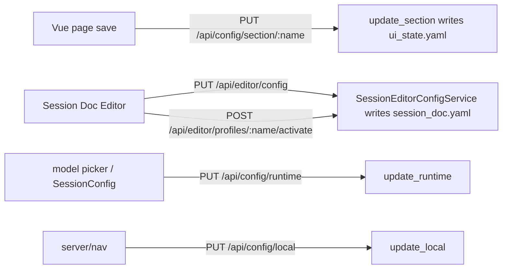

# CampaignGenerator Configuration — Value-Level Read/Write Map

One level below the file map: each configuration value, who reads it, who updates it.
Test-only references omitted; only runtime code paths listed.

## Write-path mechanics

Every `ui.<section>` is written through the one generic route `PUT /api/config/section/:name`
→ `CampaignConfigService.update_section` (each Vue page saves its own section) — `session_doc`
is **not** among them; `PUT /api/config/section/session_doc` 404s ("unknown section"). The
Session Doc Editor writes its own dedicated `session_doc.yaml` exclusively through
`SessionEditorConfigService`, via `PUT /api/editor/config` (the single grouped write door) and
`POST /api/editor/profiles[/{name}[/activate]]` (the profiles sub-collection). `config.yaml` has
no writer; `wiring.yaml` is mneme-only. See
[Session-editor isolation](./session-editor-isolation.md) for the full design and
[schema.md](./schema.md#session_docyaml--sessioneditorconfig-grouped-strict) for the shape.

## config.yaml (writer: human / pipelines/workspace/new_workspace.py)

| Value | Read by |
|---|---|
| `system_prompt` | `pipelines/session_prep/prep.py` |
| `log_dir` | `pipelines/session_prep/prep.py`, `pipelines/grounding/npc_table.py` |
| `agents.{lore_oracle,encounter_architect,voice_keeper}` | `pipelines/session_prep/prep.py` pipeline |
| `documents[]` | `assemble_docs`, `pipelines/session_prep/prep.py`, `pipelines/rlm/mcp_server.py`, `session_doc/check_consistency.py` |
| `mempalace.canon_wing` / `index_wings` | `pipelines/rlm/mcp_server.py` |
| `mempalace.palace` | `apply_ingest_manifest.resolve_palace` (fallback) |

## ui_state.yaml — other sections + runtime

`ui.session_doc` and `ui.profiles` are **gone** — the Session Doc Editor's config left
`ui_state.yaml` entirely for its own `session_doc.yaml`; see the next section.

| Value | Read by | Written by |
|---|---|---|
| `ui.vtt_summary.*` | `session_doc/vtt_summary.py` / session_workflow router | `PUT /section/vtt_summary` (router also writes `session_summary` after a run) |
| `ui.grounding.summaries` | `pipelines/rlm/mcp_server.py` (`_find_summaries_file`, `query_lore`, `grounded_search`) | `PUT /section/grounding` |
| `ui.ensemble.*` | ensemble router + `ensemble_merge`/`extract_facts` | `PUT /section/ensemble` |
| `ui.<loose>` (campaign_state, distill, prep, npc, query, workflow, connections, experimental) | their Vue pages via `GET /api/config` flat overlay | `PUT /section/<name>` |
| `runtime.default_model` | model picker / run scripts default model; also the fallback source for `session_doc.yaml`'s editor-local `backends.<active>.model` override (O3) | `PUT /runtime` |
| `runtime.session_dir` | `resolved()` session base for session-scoped paths; also read by `SessionEditorConfigService.resolved_editor_config()` for `session_doc.yaml`'s session-based path fields | `PUT /runtime`; boot `--session-dir` wins for process |
| `legacy.unmigrated` | migrator quarantine only | migration path only |

## session_doc.yaml (Session Doc Editor's own document)

Writer: `SessionEditorConfigService` exclusively, via `PUT /api/editor/config` (grouped
partial-merge write) and the `/api/editor/profiles` CRUD + `/activate` endpoints. No other
route, and no `PUT /section/session_doc` shim, writes this file — see
[Session-editor isolation](./session-editor-isolation.md) for the full design and
[schema.md](./schema.md#session_docyaml--sessioneditorconfig-grouped-strict) for the field list.

| Value(s) | Read by |
|---|---|
| `paths.*` (session/campaign based) | `scene_editor.py` resolved paths for the narrate pipeline (via `Depends(get_editor_config)` → `ResolvedEditorConfig`) |
| `narrate.tokens, prose_mode, reflections, genre, batch, context[]` | `scene_editor.py` narrate knobs (also mirrored from `profiles` via `activate_profile`) |
| `backends.active, backends.<b>.model, backends.<b>.endpoint` | `scene_editor._backend_flags`/`_model_args` (dgx/openrouter forward `--backend`/`--endpoint`/`--model`; anthropic/claude-code use the per-backend `model` override, else `runtime.default_model`) and `grounding.py._backend_flags` (global sidebar backend selector for campaign_state/distill/party/planning runs) |
| `scrub.enabled, scrub.tokens` | `scene_editor.py` scrub stage |
| `roster.gm_player, roster.characters` | `scene_editor.py` |
| `profiles[], active_profile` | `scene_editor.py` profile endpoints; `active_profile` set by `activate_profile` |

There is no `scene_editor.CONFIG` mirror and no `sd_*` flat overlay anymore (both retired in
Phase 3b of the isolation) — every read above goes through the request-scoped
`ResolvedEditorConfig` injected by `Depends(get_editor_config)`, not a process-global.

## .campaigngenerator.local.yaml (writer: PUT /local)

| Value | Read by |
|---|---|
| `server.host` / `server.port` | LocalConfig defaults (host `127.0.0.1`, port `5000`); startup |
| `nav.last_page` | frontend nav restore |

## config/wiring.yaml (writer: mneme render)

| Key | Read by |
|---|---|
| `rpg_library_url` | suggest_conversion, rpg_retriever, query_rpg_lib, mcp_server, fivetools_ingest |
| `fivetools_data_root` | resolve_refs (`_DEFAULT_ROOTS`), rpg_retriever |
| `homebrew_private` | resolve_refs (`_DEFAULT_ROOTS`) |
| `fivetools_mcp_index` | launch_5etools_mcp (`DEFAULT_MCP_INDEX`) |
| `pdf_translators` | fivetools_ingest (`_DEFAULT_PDF_TRANSLATORS`) |
| `dgx_endpoint` | scene_editor._backend_flags, grounding._backend_flags, extract_facts (fallback when `session_doc.yaml`'s `backends.dgx.endpoint` is unset) |
| `dgx_model` | extract_facts, campaignlib/api/backends (`DGX_DEFAULT_MODEL`) |

## refs.yaml / refs.local.yaml (writer: human; local seedable via `launch --init-local`)

| Value | Read by |
|---|---|
| `canonical` / `canonical_exclude` | `resolve_refs.resolve_canonical` |
| `refs[].rpglib` (+ `library`, `book_id`, `note`) | `resolve_refs._resolve_rpglib_entry` |
| `refs[].homebrew_private` | `resolve_refs._resolve_homebrew_entry` |
| `refs[].path` | `resolve_refs._resolve_path_entry` |
| `roots.{fivetools_data, rpg_library, homebrew_private}` | `resolve_refs.resolve_roots` (rank 1) |
