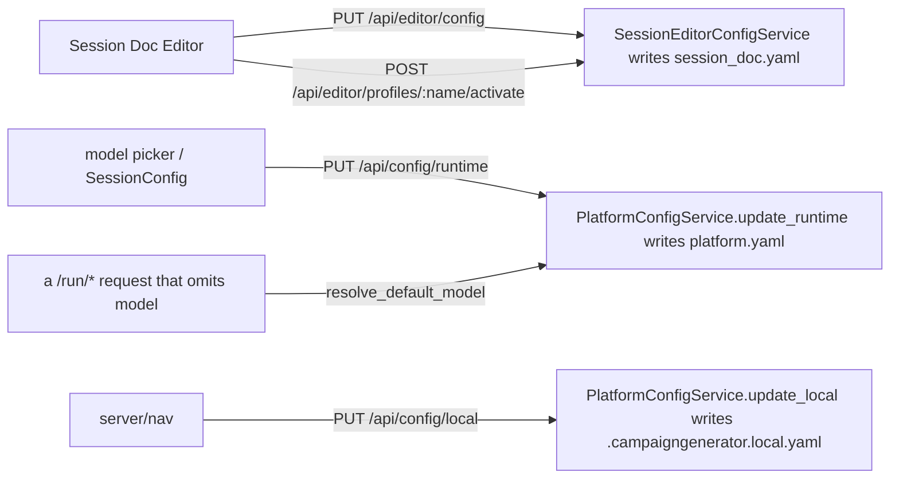

# CampaignGenerator Configuration — Value-Level Read/Write Map

One level below the file map: each configuration value, who reads it, who updates it.
Test-only references omitted; only runtime code paths listed.

## Write-path mechanics

**Every write door above is service-specific.** There is no generic one: the `PUT
/api/config/section/:name` route that wrote `ui.<section>` blobs — and the `UIStateService` behind
it — are deleted ([ui-state-retirement.md](./ui-state-retirement.md)), because no Vue page ever
called it.

The Session Doc Editor writes `session_doc.yaml` through `SessionEditorConfigService`, via `PUT
/api/editor/config` (the single grouped write door) and `POST
/api/editor/profiles[/{name}[/activate]]` (the profiles sub-collection). Ensemble, Grounding, Party
and Planning each have their own equivalent. `PUT /api/config/runtime` and `PUT /api/config/local`
go straight to `PlatformConfigService`. `config.yaml` has no writer; `wiring.yaml` is mneme-only.
See [Session-editor isolation](./session-editor-isolation.md) for the full design and
[schema.md](./schema.md#session_docyaml--sessioneditorconfig-grouped-strict) for the shape.

## config.yaml (writer: human / pipelines/workspace/new_workspace.py)

| Value | Read by |
|---|---|
| `system_prompt` | `pipelines/session_prep/prep.py` |
| `log_dir` | `pipelines/session_prep/prep.py`, `pipelines/grounding/npc_table.py` |
| `agents.{lore_oracle,encounter_architect,voice_keeper}` | `pipelines/session_prep/prep.py` pipeline |
| `documents[]` | `assemble_docs`, `pipelines/session_prep/prep.py`, `pipelines/rlm/mcp_server.py`, `session_doc/check_consistency.py` |
| `mempalace.canon_wing` / `index_wings` | `pipelines/rlm/mcp_server.py` |
| `mempalace.palace` | `apply_ingest_manifest.resolve_palace` (fallback) |

## ~~ui_state.yaml~~ — retired, nothing left to map

Every section this file used to track has left. `ui.session_doc`/`ui.profiles` →
`session_doc.yaml`; `ui.ensemble` → `ensemble.yaml`; `ui.grounding` + `ui.campaign_state` +
`ui.distill` + `ui.party` + `ui.planning` → `grounding.yaml`; `runtime` → `platform.yaml`.

The six that remained — `prep`, `npc`, `query`, `workflow`, `connections`, `experimental` — had
**no values to map**: empty in every campaign, with no writer, since `updateSection` had no
callers anywhere in the frontend. The document, its models and its route were deleted rather than
re-homed ([ui-state-retirement.md](./ui-state-retirement.md)); the four pages those names were
reserved for are stateless by decision (D1).

> **Correction, kept for the lesson.** This table used to claim `ui.grounding.summaries` was read
> by `pipelines/rlm/mcp_server.py` (`_find_summaries_file`, `query_lore`, `grounded_search`). It
> never was: that function probes three hardcoded paths and never touches config
> (`mcp_server.py:531-542`). **No file outside `server/` ever read `ui_state.yaml`** — and by the
> end, nothing inside `server/` did either, except the migration CLIs that exist to drain it.

## ensemble.yaml — the ensemble workflow (ensemble-isolation Phases 1-5)

Owned outright by `EnsembleConfigService`, its own file. Read through
`resolved()` by every `/api/ensemble/*` route; written only by `PUT /api/ensemble/config`.

| Value | Read by | Written by |
|---|---|---|
| `chapters_selected[]` | Extract page (the picker's state) — **not** a fallback for an omitted `chapters` request param | `PUT /api/ensemble/config` |
| `known_names[]`, `aliases_path` | `/run/bundle`, `/run/threads` (→ `facts_to_state`) | `PUT /api/ensemble/config` |
| `extract.{backend,endpoints,model}` | `/run/extract`, `/run/bundle` | `PUT /api/ensemble/config` |
| `synthesize.{backend,endpoints,model}` | `/run/synthesize` | `PUT /api/ensemble/config` |
| `paths.*` | every `/api/ensemble/*` route + `/chapters`, `/status` | `PUT /api/ensemble/config` |
| `tuning.*` | `/run/extract`, `/run/bundle`, `/run/threads`, `/run/recent-events`, `/run/synthesize` | `PUT /api/ensemble/config` |
| `planning.*` | `/run/synthesize?doc=planning` | `PUT /api/ensemble/config` |

Model resolution for the Anthropic branch is `explicit request → ensemble.yaml's per-stage model →
platform.runtime.default_model → campaignlib DEFAULT_MODEL` (`ensemble._backend_args`, Phase 4).
A non-Anthropic id left over from a dgx/openrouter selection is discarded before resolution rather
than forwarded.

## grounding.yaml — the four grounding docs (grounding-isolation Phases 6-10)

Owned outright by `GroundingConfigService`, its own file. Read
through `resolved()` by every `/api/grounding/run/*` route; written by
`PUT /api/grounding/config`.

| Value | Read by | Written by |
|---|---|---|
| `summaries` (root) | all four runs, when their own `input` is blank; `SessionConfig.vue`, `QuerySummaries.vue` | `PUT /api/grounding/config` |
| `campaign_state.*` (+ `track_files`, `track_items`) | `/run/campaign-state` | as above |
| `distill.*` | `/run/distill` | as above |
| `party.*` (+ `mode`, `config_path`, flat lists) | `/run/party` | as above |
| `planning.*` (+ `synth_mode`, `config_path`, `dossiers.*`) | `/run/planning`, `/run/build-dossiers` | as above |

Input resolution is `explicit request param → that doc's stored input → the root
`summaries` → 400`. No silent fallback — the same "no silent all" rule
`ensemble.yaml`'s `chapters_selected` follows.

## platform.yaml — runtime (Phase 3, O3)

Owned outright by `PlatformConfigService`, its own file. No other service's write can reach these
two values — the isolation `docs/config/platform-isolation.md` Phase 3 exists to guarantee,
regression-tested by `test_another_services_write_cannot_touch_platform_yaml` (which used a
`ui.<section>` write as its probe until that write ceased to exist, and now uses a grounding
write).

| Value | Read by | Written by |
|---|---|---|
| `runtime.default_model` | the sidebar model picker's persisted choice; the fallback source for all fourteen `/run/*` request-body `model` fields via `resolve_default_model` (Phase 5a, `server/platform_config_service.py`) — explicit request `model` wins, then this value, then the `campaignlib.constants.DEFAULT_MODEL` literal; also the fallback source for `session_doc.yaml`'s editor-local `backends.<active>.model` override (O3) | `PUT /runtime` → `PlatformConfigService.update_runtime` |
| `runtime.session_dir` | `resolved()` session base for session-scoped paths (`resolve_path`/`relativize_path`, `base="session"`); also read by `SessionEditorConfigService.resolved_editor_config()` for `session_doc.yaml`'s session-based path fields. Loaded during `PlatformConfigService.__init__` | `PUT /runtime` → `PlatformConfigService.update_runtime`; boot `--session-dir` wins for process |

`server/config.py::MODELS` (the selectable-model list `GET /api/config/models` serves) is a
hardcoded Python list, not a `runtime` value — relocating its *source* into `wiring.yaml` is
Phase 5b, deferred pending a cross-repo change (tracked as
[issue #177](https://github.com/kostadis/CampaignGenerator/issues/177)).

## session_doc.yaml (Session Doc Editor's own document)

Writer: `SessionEditorConfigService` exclusively, via `PUT /api/editor/config` (grouped
partial-merge write) and the `/api/editor/profiles` CRUD + `/activate` endpoints. No other
route, and no `PUT /section/session_doc` shim, writes this file — see
[Session-editor isolation](./session-editor-isolation.md) for the full design and
[schema.md](./schema.md#session_docyaml--sessioneditorconfig-grouped-strict) for the field list.

| Value(s) | Read by |
|---|---|
| `paths.*` (session/campaign based) | `scene_editor.py` resolved paths for the narrate pipeline (via `Depends(get_editor_config)` → `ResolvedEditorConfig`) |
| `narrate.tokens, prose_mode, reflections, genre, batch, context[]` | `scene_editor.py` narrate knobs (also mirrored from `profiles` via `activate_profile`) |
| `backends.active, backends.<b>.model, backends.<b>.endpoint` | `scene_editor._backend_flags`/`_model_args` (dgx/openrouter forward `--backend`/`--endpoint`/`--model`; anthropic/claude-code use the per-backend `model` override, else `runtime.default_model`) and `grounding.py._backend_flags` (global sidebar backend selector for campaign_state/distill/party/planning runs) |
| `scrub.enabled, scrub.tokens` | `scene_editor.py` scrub stage |
| `roster.gm_player, roster.characters` | `scene_editor.py` |
| `profiles[], active_profile` | `scene_editor.py` profile endpoints; `active_profile` set by `activate_profile` |

There is no `scene_editor.CONFIG` mirror and no `sd_*` flat overlay anymore (both retired in
Phase 3b of the isolation) — every read above goes through the request-scoped
`ResolvedEditorConfig` injected by `Depends(get_editor_config)`, not a process-global.

## .campaigngenerator.local.yaml (writer: PUT /local → PlatformConfigService.update_local)

Typed by `PlatformLocalConfig` (strict `extra="forbid"`, `server/platform_config_shared.py`) —
the pre-Phase-2 untyped `config_models.LocalConfig` is retired. A parse error or unknown key
warns and drops rather than raising (machine-written file, nobody hand-edits it).

| Value | Read by |
|---|---|
| `server.host` / `server.port` | `PlatformLocalConfig` defaults (host `127.0.0.1`, port `5000`); startup |
| `nav.last_page` | frontend nav restore |

## config/wiring.yaml (writer: mneme render)

| Key | Read by |
|---|---|
| `rpg_library_url` | suggest_conversion, rpg_retriever, query_rpg_lib, mcp_server, fivetools_ingest |
| `fivetools_data_root` | resolve_refs (`_DEFAULT_ROOTS`), rpg_retriever |
| `homebrew_private` | resolve_refs (`_DEFAULT_ROOTS`) |
| `fivetools_mcp_index` | launch_5etools_mcp (`DEFAULT_MCP_INDEX`) |
| `pdf_translators` | fivetools_ingest (`_DEFAULT_PDF_TRANSLATORS`) |
| `dgx_endpoint` | scene_editor._backend_flags, grounding._backend_flags, extract_facts (fallback when `session_doc.yaml`'s `backends.dgx.endpoint` is unset) |
| `dgx_model` | extract_facts, campaignlib/api/backends (`DGX_DEFAULT_MODEL`) |

## refs.yaml / refs.local.yaml (writer: human; local seedable via `launch --init-local`)

| Value | Read by |
|---|---|
| `canonical` / `canonical_exclude` | `resolve_refs.resolve_canonical` |
| `refs[].rpglib` (+ `library`, `book_id`, `note`) | `resolve_refs._resolve_rpglib_entry` |
| `refs[].homebrew_private` | `resolve_refs._resolve_homebrew_entry` |
| `refs[].path` | `resolve_refs._resolve_path_entry` |
| `roots.{fivetools_data, rpg_library, homebrew_private}` | `resolve_refs.resolve_roots` (rank 1) |
