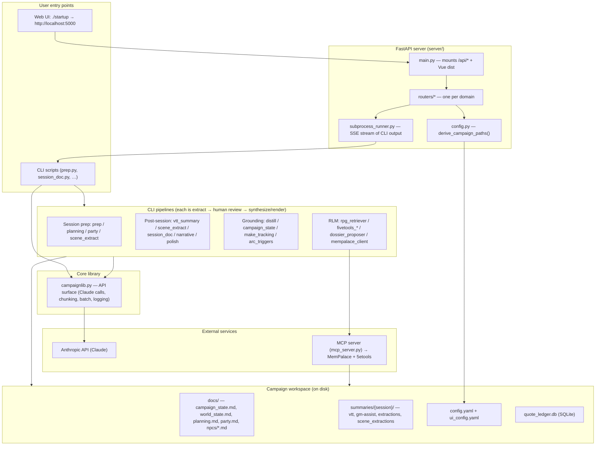
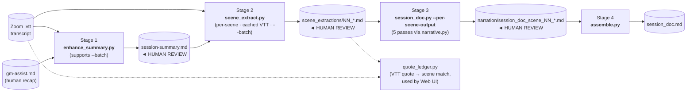
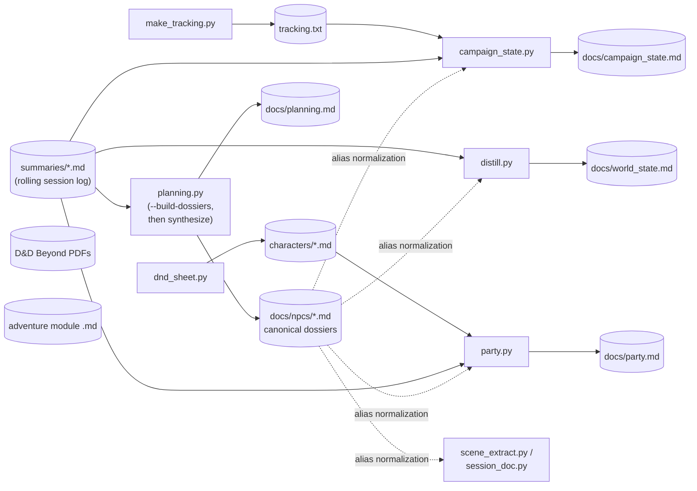
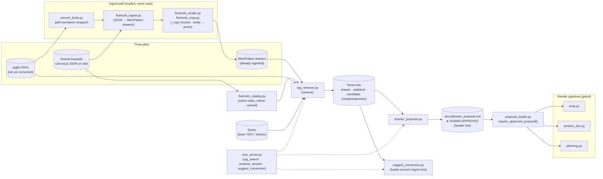

# Architecture

System map for CampaignGenerator. Read this first when starting feature work; drill into the per-area docs in [Detailed docs](#detailed-docs) when you need depth.

## What this system is

A D&D session-prep + post-session toolkit. It assembles markdown grounding docs and Zoom transcripts, calls the Claude API to generate prep beats, scene extractions, and narrative documents, and exposes the whole thing through a Vue/FastAPI web UI on top of a CLI library. Markdown files on disk are the source of truth; Claude is a renderer between human checkpoints.

Hard rules — see [Critical rules](../../CLAUDE.md#critical-rules-apply-to-every-task):
- All Claude API calls go through [`campaignlib.py`](../../campaignlib.py). Never `import anthropic` from a script.
- Render pipelines never consume raw retrieval output. They read a human-approved `docs/dossier_proposal.md`. Enforced by [`tests/test_retrieve_render_isolation.py`](../../tests/test_retrieve_render_isolation.py).
- LLM extracts → human reviews → LLM renders. Scope/ordering/attribution decisions need a human checkpoint.

## High-level diagram



## Pipeline data flows

Two pipelines, one CLI/UI surface. Every arrow that crosses a HUMAN REVIEW box is a gating checkpoint — that's where the LLM has done a rendering pass and a human imposes structure before the next call (see the global "LLMs render, humans decide" rule in `~/.claude/CLAUDE.md`).

### Post-session pipeline



Side-pipelines that build the grounding docs the above and `prep.py` consume (run periodically, not per-session):



### RLM retrieval pipeline

Three-state retrieval feeds a human-approved proposal file; render pipelines refuse to run without it.



Detail: [`docs/cli/session_doc_pipeline.md`](../cli/session_doc_pipeline.md), [`docs/cli/session_prep_workflow.md`](../cli/session_prep_workflow.md), [`docs/rlm/rlm_pipeline.md`](../rlm/rlm_pipeline.md), [`docs/rlm/rlm_architecture.md`](../rlm/rlm_architecture.md), [`docs/rlm/retrieval_architecture.md`](../rlm/retrieval_architecture.md), [`docs/rlm/dossier_aliases.md`](../rlm/dossier_aliases.md).

## Layer 1 — Core library

[`campaignlib.py`](../../campaignlib.py) is the only module that talks to the Anthropic SDK. Every script imports from it. Group of responsibilities:

| Concern | Key functions |
|---|---|
| Config loading | `find_default_config`, `load_config`, `load_file`, `load_file_optional`, `assemble_docs` |
| Claude calls | `make_client`, `call_api`, `call_api_with_tools`, `stream_api` (auto-retries on rate limit/overload/timeout) |
| Batch API | `build_batch_request`, `submit_batch`, `poll_batch`, `collect_batch`, `write_batch_sidecar`, `read_batch_sidecar` |
| Pipeline helpers | `prepare_chunks`, `run_extract_pipeline`, `run_synthesize_pipeline`, `run_scene_extraction`, `plan_scene_extraction` |
| Dossier/alias | `parse_dossier`, `build_alias_normalizer`, `load_alias_map`, `format_npc_roster`, `extract_player_character_map` |
| VTT | `normalize_vtt_speakers`, `normalize_base64_images`, `parse_gmassist_scenes` |
| I/O | `save_log`, `copy_to_clipboard`, `utc_now_iso` |

`stream_api` and `call_api` already retry transient errors — do not wrap them in another retry loop.

## Layer 2 — Web server (FastAPI)

Entry point: [`startup`](../../startup) builds the frontend then runs `python -m server.main`.

[`server/main.py`](../../server/main.py) mounts nine routers under `/api/*` plus the Vue SPA at `/` (catch-all serves `index.html`):

| Router | Prefix | File |
|---|---|---|
| Config | `/api/config` | [`server/routers/config_routes.py`](../../server/routers/config_routes.py) |
| Session workflow | `/api/workflow` | [`server/routers/session_workflow.py`](../../server/routers/session_workflow.py) |
| Grounding docs | `/api/grounding` | [`server/routers/grounding.py`](../../server/routers/grounding.py) |
| Session prep | `/api/prep` | [`server/routers/prep.py`](../../server/routers/prep.py) |
| Setup | `/api/setup` | [`server/routers/setup.py`](../../server/routers/setup.py) |
| Experimental | `/api/experimental` | [`server/routers/experimental.py`](../../server/routers/experimental.py) |
| Scene editor | `/api/editor` | [`server/routers/scene_editor.py`](../../server/routers/scene_editor.py) |
| Quote ledger | `/api/ledger` | [`server/routers/ledger.py`](../../server/routers/ledger.py) |
| Connection graph | `/api/connections` | [`server/routers/connections.py`](../../server/routers/connections.py) |

Long-running endpoints spawn the underlying CLI script via [`server/subprocess_runner.py`](../../server/subprocess_runner.py) and stream stdout as Server-Sent Events. Each run is also persisted as a markdown log in `<cwd>/logs/`.

[`server/config_service.py:CampaignConfigService`](../../server/config_service.py) is the single authority for configuration. It owns three on-disk files per campaign — `config.yaml` (tracked, human-only), `ui_state.yaml` (tracked, server-owned, typed via pydantic v2), `.campaigngenerator.local.yaml` (gitignored). The service is constructed at boot in [`server/main.py`](../../server/main.py) and stashed on `app.state.config_service`. Routers reach it through the request. Path resolution and atomic-rename writes live in the service; routers never touch YAML files. Helpers from the older [`server/config.py`](../../server/config.py) (`derive_campaign_paths`) are still used for path discovery; the legacy `load_ui_config` / `save_ui_config` and an allowlist of key prefixes also remain during the in-progress frontend sweep. Full design: [`docs/core/configuration.md`](configuration.md).

## Layer 3 — Frontend (Vue 3 + Pinia)

Entry: [`frontend/src/router.ts`](../../frontend/src/router.ts). The top-level views (`PrepTools.vue`, `GroundingDocs.vue`, etc.) are 77-byte `<router-view />` shells; the real screens are nested children:

- `/workflow/{config,vtt,extract,editor}` — post-session flow (see [`views/session/`](../../frontend/src/views/session/))
- `/grounding/{campaign-state,distill,party,planning}` — grounding-doc generators (see [`views/grounding/`](../../frontend/src/views/grounding/))
- `/prep/{session-prep,npc-table,query,connections}` — pre-session tools (see [`views/prep/`](../../frontend/src/views/prep/))
- `/setup/{dnd-sheet,make-tracking}` — workspace setup
- `/experimental/{enhance-recap,narrative}` — opt-in experiments
- `/settings` — campaign/session selection, model picker

Stores: [`stores/config.ts`](../../frontend/src/stores/config.ts) (ui_config + models + API key status), [`stores/process.ts`](../../frontend/src/stores/process.ts) (per-process `{output, status, returnCode}`).

API client + SSE: [`api/client.ts`](../../frontend/src/api/client.ts), [`api/sse.ts`](../../frontend/src/api/sse.ts).

Deeper UI docs: [`docs/web/web_ui.md`](../web/web_ui.md), [`docs/web/web_ui_config_persistence.md`](../web/web_ui_config_persistence.md).

## Layer 4 — CLI pipelines

Each pipeline follows the **extract → human review → synthesize/render** pattern. Per-script flags live in [`docs/cli/cli_tools.md`](../cli/cli_tools.md).

### Session prep (pre-session)

| Script | Role |
|---|---|
| [`prep.py`](../../prep.py) | Single mode (one call), pipeline mode (Lore Oracle → Encounter Architect → Voice Keeper), session mode (outline → per-beat encounters) |
| [`planning.py`](../../planning.py) | Two-pass: extract NPC/faction state from summaries, synthesize into `planning.md`. `--build-dossiers` writes per-NPC files for human review before `--synthesize` |
| [`party.py`](../../party.py) | Two-pass: arc-score candidate events from summaries + character sheets → `party.md` |
| [`dossier_proposer.py`](../../dossier_proposer.py) | Proposes NPC dossiers from narrative text; writes `docs/dossier_proposal.md` (the human checkpoint between retrieval and render) |
| [`scene_extract.py`](../../scene_extract.py) | Stage-2 scene-anchored extraction (per-scene verbatim moments). Supports Batch API |

End-to-end walkthrough: [`docs/cli/session_prep_workflow.md`](../cli/session_prep_workflow.md).

### Post-session (session → narrative document)

| Script | Role |
|---|---|
| [`vtt_summary.py`](../../vtt_summary.py) | Zoom WebVTT → structured `session-summary.md` + verbatim `vtt_roleplay_extractions/` chunks |
| [`enhance_summary.py`](../../enhance_summary.py) | Stage 1: enrich gm-assist with VTT detail (cached system prefix) |
| [`scene_extract.py`](../../scene_extract.py) | Stage 2: per-scene verbatim moments |
| [`session_doc.py`](../../session_doc.py) | 5-pass narrative document (consistency → enhance → plan → character extract → narrate). The big one — read [`docs/cli/session_doc_pipeline.md`](../cli/session_doc_pipeline.md) before touching it |
| [`narrative.py`](../../narrative.py) | Three-pass per-character narrator (used by `session_doc.py`) |
| [`enhance_recap.py`](../../enhance_recap.py) | Single cached call: enriches gm-assist recap |
| [`polish.py`](../../polish.py) | Agentic loop with tools (read/edit/insert/finish) — experimental |
| [`quote_ledger.py`](../../quote_ledger.py) | SQLite-backed fuzzy-matching of quotes across roleplay + scene extractions |

### Grounding docs (long-lived state)

| Script | Output | Reads |
|---|---|---|
| [`distill.py`](../../distill.py) | `docs/world_state.md` (lore, NPC/faction states) | summaries.md |
| [`campaign_state.py`](../../campaign_state.py) | `docs/campaign_state.md` (what's done, active threads) | summaries.md |
| [`make_tracking.py`](../../make_tracking.py) | per-character/faction arc tracking files | adventure module |
| [`arc_triggers.py`](../../arc_triggers.py) | candidate trigger events from chronicle | mempalace |

### RLM / retrieval

| Script | Role |
|---|---|
| [`rpg_retriever.py`](../../rpg_retriever.py) | Three-pile orchestrator (mempalace → 5etools → rpg-library) |
| [`fivetools_catalog.py`](../../fivetools_catalog.py) | Mtime-cached name index over canonical 5etools data |
| [`fivetools_ingest.py`](../../fivetools_ingest.py) | 5etools JSON → MemPalace drawer prose |
| [`mempalace_client.py`](../../mempalace_client.py) | HTTP client for MemPalace search |
| [`dossier_proposer.py`](../../dossier_proposer.py) | Retrieval → `docs/dossier_proposal.md` (human checkpoint) |
| [`proposal_loader.py`](../../proposal_loader.py) | Render pipelines load approved proposals from here |
| [`mcp_server.py`](../../mcp_server.py) | FastMCP stdio server: read campaign docs, write to `notes/` only, semantic search via mempalace |

Deep dives: [`docs/rlm/rlm_pipeline.md`](../rlm/rlm_pipeline.md), [`docs/rlm/rlm_architecture.md`](../rlm/rlm_architecture.md).

### Workspace setup

| Script | Role |
|---|---|
| [`new_workspace.py`](../../new_workspace.py) | Skeleton: `config.yaml`, `docs/`, `voice/`, `examples/`, `summaries/` |
| [`dnd_sheet.py`](../../dnd_sheet.py) | D&D Beyond PDF → markdown (vision API) |
| [`transform.py`](../../transform.py) | NotebookLLM dossier → prep.py beat format |
| [`scabard_sync.py`](../../scabard_sync.py) | Sync workspace ↔ Scabard |

## Data flow — on-disk state

The campaign workspace is the database. All long-lived state is markdown.

```
<campaign>/
  config.yaml                 # Tool config (paths, prompts, models)
  ui_config.yaml              # Web UI state (campaign_dir, session_dir, model selections)
  docs/
    campaign_state.md         ← campaign_state.py     → prep, session_doc, mcp
    world_state.md            ← distill.py            → prep, party, planning, session_doc, mcp
    planning.md               ← planning.py           → prep, scene_editor, mcp
    party.md                  ← party.py              → prep, session_doc, narrative, mcp
    mechanics.md              ← (manual)              → optional grounding
    dossier_proposal.md       ← dossier_proposer.py   → render pipelines (human-approved)
    npcs/*.md                 ← planning.py --build-dossiers
  voice/                      # Per-character narrator personality notes
  examples/                   # Handcrafted style examples for session_doc.py
  notes/                      # MCP server's only writable directory
  summaries.md                # Concatenated session summaries (input to distill, campaign_state)
  summaries/{session}/
    session.vtt               # Zoom transcript
    gm-assist.md              # GM recap (input to enhance_recap, scene structure for scene_extract)
    session-summary.md        ← vtt_summary.py
    vtt_extractions/          ← vtt_summary.py        → distill, campaign_state
    vtt_roleplay_extractions/ ← vtt_summary.py        → quote_ledger, enhance_recap
    scene_extractions/        ← scene_extract.py      → session_doc Pass 4, ledger
  quote_ledger.db             # SQLite — fuzzy quote ↔ scene mapping
```

Typical session lifecycle:
1. `vtt_summary.py` → `session-summary.md` + extractions
2. `enhance_summary.py` → enriched gm-assist
3. `scene_extract.py` → `scene_extractions/`
4. `session_doc.py` → final narrative doc
5. Append summary to `summaries.md`
6. `distill.py`, `campaign_state.py`, `planning.py`, `party.py` update grounding docs
7. Next session: `prep.py` reads all four grounding docs

## MCP integration

[`mcp_server.py`](../../mcp_server.py) is a FastMCP stdio server registered per campaign via `.mcp.json` ([template](../../.mcp.json.template)). Reads `CAMPAIGN_DIR` from env. Tools:

- Read-only: `get_campaign_state`, `get_world_state`, `get_planning`, `get_mechanics`, `get_party`, `read_document`, `search_document`, `list_sessions`, `list_files`, `list_notes`
- Write: `write_note` (only into `<campaign_dir>/notes/`)
- Semantic search: passes through to `mempalace.searcher.search_memories()` if MemPalace is installed

## Tests

Run: `python -m pytest tests/`. Notable structural tests:

- [`tests/test_retrieve_render_isolation.py`](../../tests/test_retrieve_render_isolation.py) — fails the build if any function body mixes a retrieval call (`retrieve`, `search_hierarchical`, `rpg_search`) with a render call (`stream_api`, `call_api`). Don't bypass — fix the structure.
- [`tests/test_require_proposal_cli.py`](../../tests/test_require_proposal_cli.py) — render pipelines must require an approved proposal file.
- [`tests/test_campaignlib_pipeline.py`](../../tests/test_campaignlib_pipeline.py) — extract/synthesize pipeline end-to-end.

Per-script tests live alongside (`test_prep.py`, `test_session_doc.py` covered by `test_polish.py` etc., `test_scene_extract.py`, `test_planning.py`, `test_party.py`, `test_distill.py`, `test_campaign_state.py`, `test_vtt_summary.py`, `test_dossier_proposer.py`, `test_rpg_retriever.py`, `test_fivetools_*`, `test_connections.py`, `test_editor_pipeline.py`, `test_batch_api.py`).

## Recurring concepts (read once, recognize forever)

- **Two-pass extract → synthesize.** Nearly every grounding-doc generator (`distill`, `campaign_state`, `party`, `planning`, `vtt_summary`) chunks the input, asks the LLM to extract per chunk, then synthesizes one document from the pile of extractions. Re-runs reuse cached extractions on disk. Implementation: `run_extract_pipeline` + `run_synthesize_pipeline` in [`campaignlib.py`](../../campaignlib.py).

- **Scene-anchored extraction.** Stage 2 caches the full VTT in the system prompt and asks for one scene's quotes per call. Live (`run_scene_extraction`) and batch (`scene_extract.py:_submit_pending`) paths share the cache breakpoint so the prompt cache stays warm.

- **Alias normalization.** A single source of truth — frontmatter in `docs/npcs/*.md` — feeds an `{canonical: [aliases]}` map into every extractor that crosses pipelines. Variants get rewritten *before the LLM sees them*; a "Known NPCs" roster is appended to the system prompt. Empty map = identity / no-op.

- **Batch mode (`--batch`).** `enhance_summary.py` and `scene_extract.py` submit via Anthropic Message Batches API for 50% off, prompt caching honoured. Three sub-modes: block-and-poll (default), `--submit-only` (sidecar, exit), `--collect` (read sidecar, retrieve). Sidecars live next to the output: `<output>.batch.json` or `<output-dir>/.batch.json`.

- **Three-state RLM retrieval.** Every hit is a *drawer* (already ingested), a *statblock* (already ingested), or a *candidate* — and candidates are tagged `cost="cheap"` (5etools JSON on disk, ready for `fivetools_ingest.py`) or `cost="expensive"` (rpglib PDF needing `convert_book.py` first). The retriever never fetches; it suggests.

- **Proposal-gate.** Render pipelines (`prep.py`, `session_doc.py`, `planning.py`) refuse to use retrieval results unless a human has flipped the status line in `docs/dossier_proposal.md` to "approved". Enforced in [`proposal_loader.py`](../../proposal_loader.py); the rule is documented in [`docs/rlm/rlm_pipeline.md`](../rlm/rlm_pipeline.md).

- **CLI ↔ UI symmetry.** The FastAPI server never reimplements logic — it shells out to CLI scripts. Fixing a bug in a script fixes it in the UI; exposing a CLI flag means adding it to the corresponding `_build_*_cmd()` in the router.

- **MCP boundary.** Anything that touches MemPalace goes through [`mempalace_client.py`](../../mempalace_client.py). Anything that exposes CampaignGenerator capability *outward* to other Claude sessions goes through [`mcp_server.py`](../../mcp_server.py). One file, one direction each.

## Common task → start here

A fast-orientation table for "I need to change X, where does it live?"

| If you want to… | Open this first |
|---|---|
| Add a new CLI tool | [`campaignlib.py`](../../campaignlib.py) intro + a small existing script like [`npc_table.py`](../../npc_table.py) |
| Change Stage 1/2 prompts | `ENHANCE_SYSTEM_PREFIX` in [`enhance_summary.py`](../../enhance_summary.py); `SCENE_EXTRACT_SYSTEM_PREFIX` in [`scene_extract.py`](../../scene_extract.py) |
| Add `--batch` to another script | Copy the pattern from [`enhance_summary.py`](../../enhance_summary.py) (`_submit`, `_collect_and_write`, sidecar). Helpers already exist in [`campaignlib.py`](../../campaignlib.py). |
| Touch retry / cache wiring | [`campaignlib.py`](../../campaignlib.py) `# ── API ──` and `# ── Batch API ──` sections (`_is_retryable`, `stream_api`, `build_batch_request`) |
| Add a new Web UI page | A small existing view like [`frontend/src/views/setup/MakeTracking.vue`](../../frontend/src/views/setup/MakeTracking.vue) and its router [`server/routers/setup.py`](../../server/routers/setup.py) |
| Stream a long-running script to the UI | [`server/subprocess_runner.py`](../../server/subprocess_runner.py) + a `StreamingResponse` endpoint in [`server/routers/scene_editor.py`](../../server/routers/scene_editor.py) |
| Persist a new UI setting | [`frontend/src/stores/config.ts`](../../frontend/src/stores/config.ts); use a `sd_*` / `prep_*` / etc. prefix listed in CLAUDE.md |
| Change scene-extraction file format | `format_scene_output` in [`campaignlib.py`](../../campaignlib.py) (live + batch share it) and [`session_doc.py:load_scene_extractions`](../../session_doc.py) |
| Resolve NPC name variants | [`campaignlib.py`](../../campaignlib.py) NPC alias section + [`docs/rlm/dossier_aliases.md`](../rlm/dossier_aliases.md) |
| Understand the 5-pass narration | [`session_doc.py`](../../session_doc.py) docstring + [`narrative.py`](../../narrative.py) |
| Match VTT quotes to scenes | [`quote_ledger.py`](../../quote_ledger.py) + [`server/routers/ledger.py`](../../server/routers/ledger.py) |
| Add an MCP tool | [`mcp_server.py`](../../mcp_server.py); for MemPalace I/O use [`mempalace_client.py`](../../mempalace_client.py) only |
| Change retrieval ranking / tiering | [`rpg_retriever.py`](../../rpg_retriever.py) (`retrieve`); name-index changes in [`fivetools_catalog.py`](../../fivetools_catalog.py) |
| Touch the proposal-gate | [`proposal_loader.py`](../../proposal_loader.py) — `require_approved_proposal` is the choke point |
| Render a 5etools entity to prose | [`fivetools_render.py`](../../fivetools_render.py) (`render_<type>` family); resolve `_copy` first via [`fivetools_copy.py`](../../fivetools_copy.py) |
| Convert a new RPG PDF | [`convert_book.py`](../../convert_book.py) (wraps pdf-translators); then [`fivetools_ingest.py`](../../fivetools_ingest.py) — keep the steps explicit |

## Detailed docs

When you need depth on one area, read the matching file:

| Need | File |
|---|---|
| Per-script CLI flags + new-campaign workflow | [`docs/cli/cli_tools.md`](../cli/cli_tools.md) |
| `session_doc.py` 5-pass + 4-stage pipeline | [`docs/cli/session_doc_pipeline.md`](../cli/session_doc_pipeline.md) |
| End-to-end session prep | [`docs/cli/session_prep_workflow.md`](../cli/session_prep_workflow.md) |
| Web UI screens, ui_config.yaml | [`docs/web/web_ui.md`](../web/web_ui.md), [`docs/web/web_ui_config_persistence.md`](../web/web_ui_config_persistence.md) |
| Dossier merge + cross-pipeline aliases | [`docs/rlm/dossier_aliases.md`](../rlm/dossier_aliases.md) |
| RLM retrieval/render separation, MCP | [`docs/rlm/rlm_pipeline.md`](../rlm/rlm_pipeline.md), [`docs/rlm/rlm_architecture.md`](../rlm/rlm_architecture.md) |
| Retrieval architecture | [`docs/rlm/retrieval_architecture.md`](../rlm/retrieval_architecture.md) |
| Per-tool input/output formats | [`docs/specs/formats.md`](../specs/formats.md) |
| Configuration storage / load / save across CLI + UI + server | [`docs/core/configuration.md`](configuration.md) |
