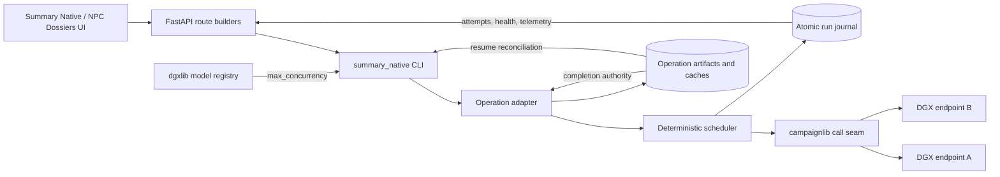
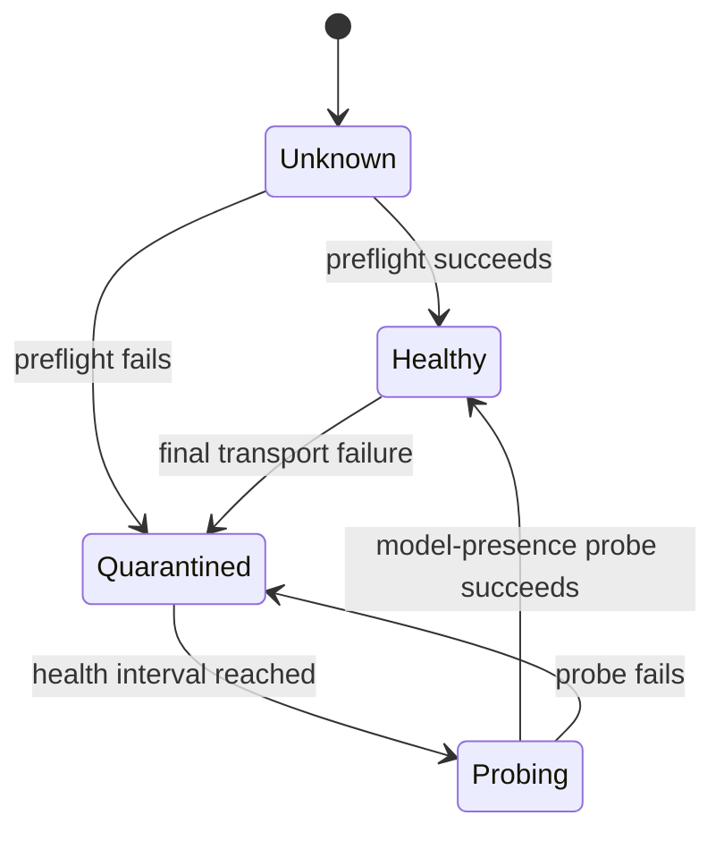

# Resilient DGX Work Scheduler

Status: **implemented on `codex/549-dgx-scheduler`**  
Tracks: [issue #549](https://github.com/kostadis/CampaignGenerator/issues/549), including #539 and #519  
Feature artifacts: [`specs/038-dgx-resilient-scheduler/`](../../specs/038-dgx-resilient-scheduler/)  
Companion change: `dgx-fun` branch `codex/549-dgx-registry`

## 1. Purpose

Summary Native work can be split across several DGX endpoints, but the earlier
execution paths treated parallelism, endpoint failure, and recovery differently.
The default concurrency was a fixed six even when the served model supported
more work, one failed preflight could block healthy endpoints, and interrupted
runs did not have one shared, inspectable recovery model.

This design provides one deterministic work scheduler for four operations:

- summary extraction;
- campaign-state audit;
- NPC drafting, including chunked map/reduce drafting;
- deterministic, model-free NPC verification.

It also moves the omitted `--parallel` default to the per-model dgxlib registry.
For `qwen3.8-flash-next`, the declared per-endpoint concurrency is eight.

The scheduler changes execution and observability. It does not change campaign
selection, prompts, content validation, GM review, or publication authority.

## 2. Design goals

1. Use the capacity declared for the selected served model.
2. Keep healthy endpoints working when another endpoint fails.
3. Never duplicate campaignlib's same-endpoint transport retry chain.
4. Resume only compatible unfinished work and make zero calls for valid,
   completed artifacts.
5. Produce the same content bytes regardless of completion order, failover, or
   resume.
6. Reconstruct status from disk after browser reload, disconnect, or process
   restart.
7. Keep the CLI as the execution engine and expose the same controls in the
   existing Summary Native and NPC Dossiers pages.
8. Preserve existing cache and artifact authority without adding a database or
   competing checkpoint store.

## 3. Ownership boundaries

The feature deliberately keeps policy at three separate seams.

| Owner | Responsibility | Must not own |
|---|---|---|
| `dgxlib` | Per-model served capacity and request behavior | Campaign selection, run state, UI defaults |
| `campaignlib` | Provider calls, same-endpoint transport retries, final failure classification | Cross-endpoint scheduling or artifact completion |
| Summary Native scheduler | Queueing, endpoint bounds, health, quarantine, failover, attempts, telemetry | Prompts, content validation, cache truth, publication |
| Operation adapters | Stable item creation, cache keys, validation, artifact writes, canonical assembly | Provider retry policy or endpoint health policy |
| FastAPI/Vue | CLI invocation and read-only projection of durable status | Scheduling policy or checkpoint truth |

This boundary prevents a failed endpoint from changing content semantics and
prevents a run journal from claiming that missing or invalid output is complete.

## 4. Architecture



### Main implementation units

| File | Role |
|---|---|
| `pipelines/summary_native/concurrency.py` | Resolves the effective per-endpoint limit and provenance |
| `pipelines/summary_native/scheduler.py` | Work queue, endpoint state, attempts, recovery, journals, and reports |
| `campaignlib/api/client.py` | Exposes classification after campaignlib finishes transport retries |
| `extract.py`, `audit.py`, `npc_draft.py` | Remote-operation adapters and artifact reconciliation |
| `npc_verify.py` and `cli.py` | Stable local verification items and per-item resume journals |
| `server/scheduler_status.py` | Safe disk-backed status projection |
| Summary Native and NPC Dossiers routes/views | Start, resume, status, health, and categorized outcomes |

## 5. Concurrency resolution

Concurrency is resolved after the actual backend and model are known:

```text
explicit positive --parallel
    ↓ absent
selected DGX model's positive dgxlib max_concurrency
    ↓ absent
compatibility fallback 6
```

The effective value and its source are recorded and displayed. Sources use a
stable vocabulary such as `explicit`, `dgxlib`, and `fallback`, together with
the resolved model identity.

The companion dgxlib change adds an optional positive `max_concurrency` field
to `ModelConfig` and declares:

```yaml
qwen3.8-flash-next:
  max_concurrency: 8
```

Older dgxlib installations remain compatible because a missing declaration
falls back to six. An invalid declaration refuses execution instead of silently
using a different value.

The limit applies independently to every endpoint. Two healthy endpoints with
a declared limit of eight may therefore run up to sixteen calls, while neither
endpoint exceeds eight.

## 6. Work and endpoint model

### Work items

Each adapter materializes its complete, explicit selection before execution.
A work item has:

- a stable operation-specific ID;
- a canonical ordinal;
- a compatibility key derived from result-affecting inputs;
- an assignment generation used to reject obsolete late results.

Typical item identities are extraction chunk IDs, audit claim IDs, NPC draft
IDs, chunked draft map/reduce IDs, and NPC verification IDs.

Duplicate IDs or ordinals refuse before dispatch. Empty selection never means
"all"; `Select all` is materialized into an explicit set by the caller.

### Endpoint state

An endpoint moves through these observable states:



Preflight is independent. One failed endpoint is quarantined while healthy
peers begin work. If no endpoint is healthy, the operation refuses without
starting model work.

Each item may be attempted at most once on each configured endpoint. This makes
exhaustion finite and prevents a bad endpoint from repeatedly consuming the
same item.

## 7. Dispatch and failure handling

The scheduler maintains one deterministic queue across endpoints. It fills
available slots up to each endpoint's own limit and commits results in canonical
item order.

### Retry boundary

`campaignlib` owns retrying rate limits, overload, connection errors, timeouts,
and configured server failures on the same endpoint. Only the final classified
failure reaches the scheduler.

The scheduler then behaves as follows:

| Final outcome | Scheduler action |
|---|---|
| Success | Validate and commit through the operation adapter |
| Transport/endpoint exhaustion | Quarantine endpoint and requeue on an untried healthy endpoint |
| Model-output rejection | Record content outcome; do not quarantine endpoint |
| Verifier finding | Record verifier category and detailed code |
| All endpoints attempted | Mark retry exhausted with complete attempt evidence |

Operations may retain a separately named content-repair attempt when their
existing contract requires one. That repair is distinct from transport retry.

### Late results

Network work may finish after an endpoint has been quarantined and its item
reassigned. Every assignment carries a generation. Only the current generation
may commit. A late obsolete generation is recorded but cannot overwrite the
accepted result.

## 8. Deterministic output

Execution order is allowed to vary; content order is not.

1. Adapters assign immutable ordinals before dispatch.
2. Results are validated against the operation contract.
3. An item has one accepted generation.
4. Final output is assembled by ordinal rather than completion time.
5. Telemetry and endpoint topology are excluded from content identity.

Serial execution, reversed completion delays, endpoint failover, and
interruption/resume therefore produce the same aggregate bytes and hash when
the result-affecting inputs are unchanged.

## 9. Durable journals and resume

The scheduler journal is an observable history, not a second result store.

### Sources of truth

- Checked extraction chunks, audit artifacts, NPC drafts, and verification
  reports prove completed work.
- The run journal records selection, compatibility, attempts, endpoint events,
  telemetry, and status.
- If the journal and operation artifact disagree, the operation artifact wins.

This resolves crash races safely:

| State after interruption | Resume decision |
|---|---|
| Valid artifact, incomplete/missing success record | Repair journal without another call |
| Success record, missing/invalid artifact | Schedule the item again |
| Incomplete cache file | Schedule the item again |
| Compatible completed artifact | Reuse with zero calls |
| Changed result-affecting input | Refuse the named run or treat item as stale |
| Changed endpoint list or parallel limit | Preserve compatible results |

### Resume identity

Compatibility includes operation, explicit selected items and keys, backend,
model, prompts/rules, audience, and other result-affecting inputs. It excludes
endpoint topology, assignment, concurrency, health cadence, timestamps, and
telemetry.

The CLI grammar is:

```text
--resume RUN_ID   resume that exact compatible run
--resume          resume only when exactly one compatible incomplete run exists
```

Zero or multiple bare-resume candidates refuse. Resume never silently becomes
a fresh run. `--resume` is incompatible with options such as `--force` and
`--dump-only` that would obscure the recovery contract.

NPC verification follows the same durable model while remaining local and
model-free. Each verification result is keyed independently; completed current
items are reused without running the verifier again.

## 10. Run record and telemetry

Run records use an additive schema-v2 format and atomic replacement. Readers
remain tolerant of compatible v1 records.

The journal contains:

- run identity and operation;
- compatibility inputs and selected items;
- resolved concurrency value, source, and model;
- endpoint states and health transitions;
- per-item attempt records and assignment generations;
- accepted, cached, failed, and unfinished outcomes;
- per-endpoint latency, retry, usage availability, quarantine, and recovery
  aggregates.

Endpoint URLs are sanitized before persistence. User information, credential
material, and secret query values are not written to the journal.

Usage remains explicitly unavailable when the provider facade supplies text
without usage metadata. The scheduler never estimates provider usage and labels
it as measured.

## 11. Failure taxonomy

Reporting uses two axes so operators can distinguish infrastructure recovery
from content review.

### Operational outcome

- success or cached;
- model-response rejection;
- verifier finding or rejection;
- transport failure;
- retry exhausted.

### Verifier category

Existing detailed verifier codes remain intact and additionally map to the
shared #523 categories:

- `unsupported_or_contradicted`;
- `citation_non_entailment`;
- `superseded_claim`;
- `knowledge_leak`;
- `missing_source`;
- `presentation_only`;
- `verifier_transport_or_protocol`.

This preserves precise evidence while giving #519 and the later endpoint-backed
verifier one common reporting vocabulary.

## 12. CLI, routes, and UI

Remote operations use the shared option spelling `--endpoints`, `--parallel`,
and `--resume`. Deterministic NPC verification accepts local `--parallel` and
`--resume` without introducing a model call.

FastAPI routes validate simple request constraints, build fixed CLI arguments,
and stream CLI output. They do not import scheduler policy. Status routes read
the latest durable journal on every request and return a safe projection;
malformed records are shown as incomplete/error state and never as success.

The existing pages provide the UI:

- Summary Native: extraction and audit;
- NPC Dossiers: drafting and verification.

Both show resolved concurrency and source, endpoint health, progress,
quarantine/recovery, telemetry, resume availability, and categorized outcomes.
Reloading the page reconstructs the same state from disk. SSE disconnect does
not imply success.

## 13. Compatibility and delivery

No campaign workspace migration is required. Cache formats retain their existing
authority, run-record fields are additive, and older dgxlib installations use
the fallback concurrency.

Delivery order is:

1. publish the companion dgxlib field and `qwen3.8-flash-next: 8` declaration;
2. publish CampaignGenerator's resolver and scheduler;
3. deploy the existing UI with the new route/status controls.

If CampaignGenerator is deployed before the companion package, behavior remains
safe and uses six until the registry declaration is available.

## 14. Validation strategy

Tests use in-process fake endpoints, injected clocks, and no-sleep call seams.
No live DGX or paid model call is required.

Coverage includes:

- explicit, dgxlib, fallback, and invalid concurrency resolution;
- independent endpoint bounds and identity collisions;
- partial preflight, quarantine, failover, probe, and rejoin;
- no duplicate same-endpoint transport retry;
- model rejection without endpoint quarantine;
- finite exhaustion and ignored late generations;
- record/artifact crash races and compatible zero-call resume;
- per-item NPC verification reuse and stale-input refusal;
- byte/hash identity across serial, parallel, failover, and resume modes;
- taxonomy and telemetry reconciliation;
- CLI/route option parity and disk-backed status;
- browser reload, bare resume, explicit `Select all`, and empty-selection refusal;
- frontend production build and companion dgxlib registry tests.

Exact commands and results are recorded in
[`implementation-notes.md`](../../specs/038-dgx-resilient-scheduler/implementation-notes.md).

## 15. Known extension point

Current NPC verification is deterministic and model-free. A future #523
endpoint-backed verifier can implement the same work-item adapter and use the
existing scheduler, operational envelope, resume identity, and verifier
taxonomy. Adding that adapter does not require changing the scheduler's trust or
artifact-authority model.
