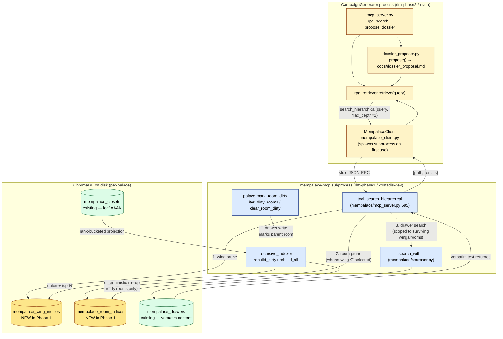
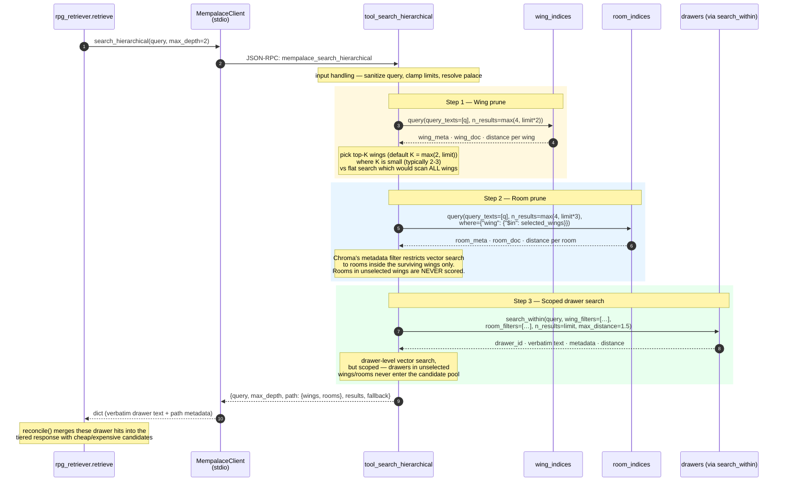
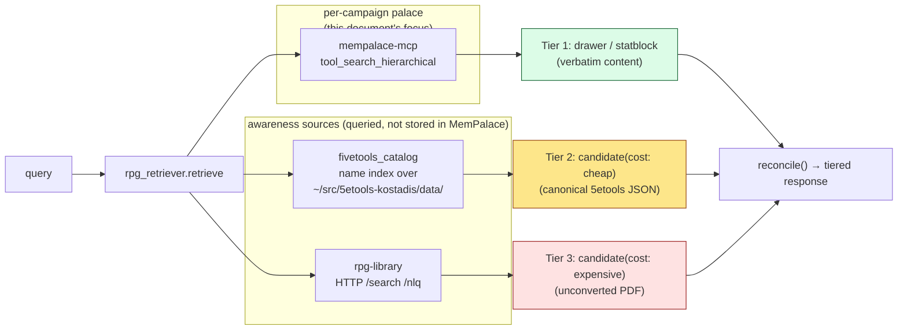

# Retrieval Architecture — CampaignGenerator ↔ MemPalace

> **Scope: Palace internals deep-dive.** Read this when you're debugging
> or extending the retrieval pipeline itself — the hierarchical descent
> algorithm, the dirty-flag index lifecycle, the 100% recall guarantee,
> failure modes, and the operational checklist for when something goes
> wrong.
>
> **For the system-level reference** (three-pile awareness model, MCP
> surface, where retrieval plugs into the rest of CampaignGenerator), read
> [`rlm_architecture.md`](rlm_architecture.md). For a quick entry point,
> [`rlm_pipeline.md`](rlm_pipeline.md).

This document is the reference for **how `rpg_retriever.retrieve()` actually fetches verbatim content from a per-campaign palace**. It covers the process model, the on-disk collections, the hierarchical descent algorithm, the recall guarantee, and the failure modes.

It complements `rlm_architecture.md`, which describes the *three-pile* model (canonical 5etools / rpg-library PDFs / campaign content) and where retrieval fits inside it. This doc zooms in on the **drawer/statblock tier** — what happens when MemPalace already has the content the GM is asking about.

> Repos referenced: `kostadis/CampaignGenerator` (`main`, post `#18 1f13f44`), `kostadis/mempalace` (`kostadis-dev`, post `#5 a0d6a4d`). Branch tags `rlm-phase2` / `rlm-phase1` preserved on origin.

---

## 1. Process and storage model

Three processes are involved in any retrieval. They communicate over stdio JSON-RPC; no shared memory, no shared files except ChromaDB on disk.

**Rules the diagram encodes:**

- ChromaDB collections live in **one location per palace**. The palace is selected by `--palace <name>` when CG spawns the subprocess (`MempalaceClient(palace=...)`). Per-campaign palaces are the standard since 2026-04 (`MEMPALACE_HOWTO`).
- **CG never opens ChromaDB itself.** `grep -rn "chromadb\|PersistentClient" --include="*.py"` in CampaignGenerator returns zero hits. The only file in CG that touches mempalace is `mempalace_client.py`, and it only speaks JSON-RPC. This boundary is by design — see §5.
- The two **highlighted collections** (`wing_indices`, `room_indices`) are the Phase 1 deliverable. Drawers and closets pre-existed; the new collections add hierarchical pruning without changing storage of verbatim content.

---

## 2. The hierarchical descent — per-query flow

`rpg_retriever.retrieve()` calls `mp_client.search_hierarchical(query, limit=10, max_depth=2)`. CG always uses `max_depth=2` (full descent); `max_depth=0` and `1` exist for future wake-up integration (see §7).

**Why this is cheap:** if a palace has 12 wings, 80 rooms, and 14,000 drawers, a flat drawer-level vector search scores ~14,000 vectors per query. The hierarchical path scores ~12 wings + ~10 rooms (filtered by `where`) + maybe ~600 drawers (only those in the 2-3 selected wings × 2-3 selected rooms). Phase 1 Gate 1 measured this at **19.82× drawer-scored reduction at 0% recall@10 loss** vs the flat baseline.

**Why pruning is safe (not just heuristic):** the wing and room indices are **rank-bucketed AAAK projections** of their leaf closets — a deterministic union-and-top-N over the same content the drawers contain, run through the same dialect. A wing's index ranks high for query `q` *only if* drawers under that wing carry tokens that score high for `q`. Pruning a wing means committing that no top-K drawer for `q` lives inside it. Gate 1 is the empirical test that this commitment holds at recall@10 = 1.0 against a benchmark fixture.

**`recursive_indexer` writes these projections** with no LLM involvement — just rank buckets, frequency sorts, top-N selections, histogram clamps. Verbatim content stays in `mempalace_drawers`; the indices are arithmetic compressions, regenerable from leaves at any time.

---

## 3. Index lifecycle — when intermediate indices update

The wing/room indices are **dirty-flag-driven**. Drawer writes don't trigger index rebuilds inline; they mark the parent room dirty, and the indexer drains the queue at the next call to `recursive_indexer.rebuild_dirty()`.

| Event | Effect |
|---|---|
| `tool_add_drawer(wing, room, content, ...)` | drawer lands in `mempalace_drawers`; `palace.mark_room_dirty(wing, room)` flips a flag. |
| `tool_delete_drawer(drawer_id)` / `tool_update_drawer(...)` | same — parent room marked dirty. |
| `recursive_indexer.rebuild_dirty()` | iterates `palace.iter_dirty_rooms()`, regenerates each affected room index from its closets, then regenerates each affected wing index from its rooms, then `clear_room_dirty()` on each. **Idempotent**; safe under concurrent writes via `mine_lock`. |
| `recursive_indexer.rebuild_all()` | nukes and regenerates every room and wing index for the palace. Used after a corruption / version bump / palace restore. |
| Empty `wing_indices` collection | `tool_search_hierarchical` transparently falls back to flat `search_within` and sets `fallback=True` in the response (see §6). |

**Who calls `rebuild_dirty()`?** Today, MemPalace's miners and the post-`add_drawer` hook in chat-mode operations call it under `mine_lock`. CG-side ingest (`fivetools_ingest.py`) writes drawers via the MCP `add_drawer` tool, so the dirty-flag plumbing happens server-side without CG having to know.

**No cron. No background worker.** Indices are rebuilt synchronously when something asks. If you ingest 1,000 drawers and then immediately query, you pay the rebuild cost on that first query (typically <1 s for a per-room rebuild; tens of ms for a wing aggregate). Subsequent queries are sub-100ms.

---

## 4. The 100% recall guarantee — why it holds

MemPalace's design rule is *100% recall is the design requirement — the target every search path is measured against. Anything less means forgetting* (`mempalace/CLAUDE.md`). Three properties of this retrieval path preserve that:

1. **Verbatim drawer storage.** The content returned to CG is the exact text written by `tool_add_drawer`. Nothing summarizes, paraphrases, or truncates between write and read.

2. **Deterministic intermediate compression.** Wing and room indices are not LLM summaries — they are rank-bucketed projections of leaf closets. The same leaves always produce the same index. Drift impossible by construction.

3. **Pruning is bounded by the recall@10 = 1.0 gate.** The benchmark fixture at `tests/benchmarks/hierarchical_aaak.json` is the concrete contract; Gate 1 fails CI if any future change to `recursive_indexer` causes a single top-10 hit to drop. As of the Phase 1 merge, Gate 1 holds at 19.82× cheaper than flat search.

**Where recall could degrade unnoticed:**
- If `recursive_indexer.rebuild_dirty()` is silently failing on some rooms, those rooms' indices stay stale. A drawer ingested 1 hour ago might not be findable until a manual `rebuild_all()`. **Detection:** the dirty queue (`palace.iter_dirty_rooms()`) is observable; an alert on its depth catches this.
- If the wing index collection has zero entries (palace too fresh), the tool falls back to flat search — slower but recall-correct. Detection: `fallback=True` on the response.
- If a wing's leaf closets contain tokens that the wing-index AAAK projection drops below the rank cutoff, that wing might be pruned at step 1. The Gate 1 fixture is what catches this regression.

---

## 5. Architectural boundaries — what doesn't cross

These boundaries are load-bearing. Violating them breaks recall guarantees, retrieve/render isolation, or both.

| Boundary | Enforced by | Why |
|---|---|---|
| **CG never opens ChromaDB.** All palace I/O goes through stdio JSON-RPC to `mempalace-mcp`. | Code review + `grep` verification (zero hits in CG-rlm). | Lets MemPalace own its storage layer; lets CG be palace-agnostic; future MemPalace storage migrations don't ripple into CG. |
| **No LLM in MemPalace's index path.** Mining, indexing, room/wing aggregation are all rule-based. | Same audit as the global LLM-pipeline rule (`~/.claude/CLAUDE.md`). | Otherwise verbatim storage drifts and recall@10 goes from "1.0 by gate" to "1.0 except the times the LLM paraphrased." |
| **Retrieve and render don't co-locate in a function body.** `tests/test_retrieve_render_isolation.py` walks every `.py` file in CG and fails if any function body contains both a retrieval call (`retrieve`, `search_hierarchical`, `rpg_search`, …) and a render call (`stream_api`, `call_api`, …). | CI; 48 cases pass at merge time. | Forces the human-checkpoint pattern: retrieval produces a candidate file or proposal, the human approves it, then render runs against the approved structure. Prevents silent error compounding. |
| **MemPalace knows nothing about RPG content.** No 5etools awareness, no `pointer` results, no `suggest_conversion`, no campaign concept. | Sub-plan A scope in the integration plan. | RPG-specific orchestration belongs in CG. MemPalace is generic over any palace (chat archives, research notes, RPG content) and the hierarchical retrieval property is generic too. |

---

## 6. Failure modes and fallbacks

The retrieval path is designed to degrade in legible ways, never silently.

| Condition | Behavior | Where it's logged / signaled |
|---|---|---|
| `mempalace-mcp` subprocess fails to start | CG sets `mempalace_result = {"results": [], "path": {}, "fallback": True, "fallback_reason": "mempalace unavailable: <exc>"}`. Cheap and expensive candidate tiers still flow. | `rpg_retriever.py:570–573` — `MemPalace start failed` warning |
| Wing index collection empty (palace too fresh, `recursive_indexer` hasn't run) | `tool_search_hierarchical` calls `_shortcut_flat_search("wing indices empty — run recursive_indexer.rebuild_all")` and returns `fallback=True` with a real flat-search result. Recall is still correct, just slower. | `tool_search_hierarchical:670` — `fallback_reason` field on response |
| Wing query raises (Chroma I/O error, schema mismatch) | Same as above — `_shortcut_flat_search` recovery; flat search runs. | `tool_search_hierarchical:683` |
| Caller passes `wing_filter` or `room_filter` | `_shortcut_flat_search("explicit wing/room filter supplied")` — no point pruning twice. Returns scoped flat search results. | `tool_search_hierarchical:657` |
| Room query raises after a successful wing prune | `fallback=True` on the response, but still returns the path of selected wings + an empty rooms list. | `tool_search_hierarchical:781–783` |
| Any exception during `mp_client.search_hierarchical` in CG | CG sets `mempalace_result = {"results": [], "path": {}, "fallback": True, "fallback_reason": "mempalace search error: <exc>"}`. Tiered response continues with cheap/expensive candidates only. | `rpg_retriever.py:580–583` — `MemPalace search failed` warning |

**There is no "fall back to flat search inside CG" path.** If the MCP server returns `fallback=True`, CG accepts those (correct, just-slower) results. If the MCP call itself raises, CG produces an empty drawer tier and surfaces the reason in the result envelope — it doesn't try to reach around to a different retrieval path.

---

## 7. Where retrieval fits in the broader CG flow

This document covers the drawer/statblock tier. The full retriever response also carries cost-tagged candidates from two awareness sources outside MemPalace.

**Hard tier order:** drawer/statblock > cheap candidate > expensive candidate. No score normalization across sources. `reconcile()` truncates each candidate tier independently via `k_cheap` / `k_expensive`. See `rlm_architecture.md` §9 for the canonical retrieval contract.

**Wake-up integration (Phase 4, not yet shipped):** `max_depth=0` returns wing-level AAAK hits only — no room or drawer descent. The intent is to use this as the L1/L2 cold-start signal so wake-up stays under the 900-token / 100-ms budget per Gate 4. CG today always sends `max_depth=2`; Phase 4 will introduce a `max_depth=0` codepath.

---

## 8. Concrete file references

**CampaignGenerator side (`kostadis/CampaignGenerator` `main`, post `1f13f44`):**
- `mempalace_client.py:175–176` — `MempalaceClient.search_hierarchical(query, **kwargs)` calls the `mempalace_search_hierarchical` tool.
- `rpg_retriever.py:577–579` — the only call site in the retriever; `max_depth=2` default.
- `rpg_retriever.py:580–583` — graceful fallback to empty drawer tier on any exception.
- `mcp_server.py:725–726` — `propose_dossier` MCP tool plumbs `max_depth` through to the retriever for chat-driven proposals.
- `dossier_proposer.py` — wraps the retriever; produces `docs/dossier_proposal.md` for human approval before any render runs.
- `tests/test_retrieve_render_isolation.py` — the CI invariant.
- `tests/test_mempalace_client.py`, `tests/test_rpg_retriever.py` — unit coverage.

**MemPalace side (`kostadis/mempalace` `kostadis-dev`, post `a0d6a4d`):**
- `mempalace/mcp_server.py:585–820` — `tool_search_hierarchical` implementation (the algorithm in §2).
- `mempalace/searcher.py` — `search_within(query, wing_filters, room_filters, ...)` scoped-search primitive.
- `mempalace/recursive_indexer.py` — deterministic room + wing index aggregator; `rebuild_dirty()` and `rebuild_all()`.
- `mempalace/palace.py` — `mark_room_dirty`, `iter_dirty_rooms`, `clear_room_dirty`, `get_room_indices_collection`, `get_wing_indices_collection`.
- `mempalace/dialect.py` — leaf-closet AAAK; rank-bucketed projection helpers reused by `recursive_indexer`.
- `mempalace/config.py` — DrvFs / 9P / CIFS / NFS storage warning that prevents WSL2 footguns.
- `tests/test_recursive_indexer.py`, `tests/test_search_hierarchical.py`, `tests/test_palace_indices.py` — unit coverage.
- `tests/benchmarks/test_hierarchical_aaak_gate1.py` — Gate 1 (recall + cost ratio).

**Cross-cutting:**
- `~/src/CampaignGenerator/docs/rlm/rlm_architecture.md` — three-pile model + the chosen-not-to-do log (§16).
- `~/src/CampaignGenerator/docs/archive/rlm_integration_plan.md` — historical planning doc; Sub-plan A is what Phase 1 shipped.
- `~/campaigns/MEMPALACE_HOWTO.md` — per-campaign palace conventions.

---

## 9. Operational checklist

When something feels off, walk these in order:

1. **Is `mempalace-mcp` on PATH and pointing at the right install?** `which mempalace-mcp` and `python -c "from mempalace.mcp_server import TOOLS; print(len(TOOLS), 'mempalace_search_hierarchical' in TOOLS)"`. After this PR pair, expect `30 True`.
2. **Does the palace have the hierarchical collections?** `python -c "from mempalace.palace import get_wing_indices_collection; print(get_wing_indices_collection('<palace>', create=False).count())"`. Zero means a flat-search fallback — run `recursive_indexer.rebuild_all` once to seed.
3. **Are dirty rooms backing up?** `python -c "from mempalace.palace import iter_dirty_rooms; print(list(iter_dirty_rooms('<palace>')))"`. Long lists mean writes are happening but indices aren't rebuilding — figure out who's supposed to be calling `rebuild_dirty()` and why they aren't.
4. **Is CG actually reaching mempalace?** `python rpg_retriever.py "<query>" -v` and look for `MemPalace start failed` or `MemPalace search failed` warnings. The `fallback` field on the response carries the reason.
5. **Is the storage warning firing?** Check `mempalace-mcp` startup logs for the DrvFs / 9P / CIFS / NFS warning. If it is, the palace lives on a filesystem where ChromaDB / SQLite semantics aren't reliable; move it to ext4.
6. **Are drawers actually present?** `mempalace_status` over MCP returns total drawer counts per palace. Empty palace → no drawers to retrieve.

If steps 1–6 all check out and recall is still wrong, the next step is the Gate 1 benchmark — run `pytest tests/benchmarks/test_hierarchical_aaak_gate1.py -m benchmark` against the failing palace and see whether it's the algorithm or the data.
