# RLM Integration — Architecture Reference

> **Scope: system-level reference.** Three-pile awareness model
> (canonical 5etools / rpg-library / campaign content), MCP surface,
> retrieval contract, ingest flow, code map. Read this to orient on the
> RLM integration as a whole.
>
> **For Palace internals** (hierarchical descent algorithm, dirty-flag
> index lifecycle, 100% recall guarantee, failure modes, operational
> checklist), read [`retrieval_architecture.md`](retrieval_architecture.md).
> For a quick entry point, [`rlm_pipeline.md`](rlm_pipeline.md).

This document captures the architecture of the **Recursive Large Models (RLM)** integration spanning four trees: `mempalace-rlm`, `CampaignGenerator-rlm`, `~/src/mytools/rpg-lib/`, and `~/src/mytools/pdf-translators/`. Read this and you should be able to navigate the code, understand the design pressures that shaped the system, and reason about end-to-end behavior without re-deriving anything from the planning doc.

For the planning narrative (phase gates, risks, host decisions) see [`../archive/rlm_integration_plan.md`](../archive/rlm_integration_plan.md) (archived; the plan shipped). For the design philosophy that motivates the whole system see *Rich Plots, Real Improvisation* (https://wrongtool.kostadis.com/72-architecturalist-papers-rich-plots-real-improvisation/). For the JSON schema this whole pipeline is built on, see [`~/src/5etools-kostadis/JSON_FORMAT.md`](~/src/5etools-kostadis/JSON_FORMAT.md), [`~/src/5etools-kostadis/DATA_INVENTORY.md`](~/src/5etools-kostadis/DATA_INVENTORY.md), and [`~/src/5etools-kostadis/ARCHITECTURE.md`](~/src/5etools-kostadis/ARCHITECTURE.md). For the campaign-palace conventions that the per-campaign palaces follow, see [`~/campaigns/MEMPALACE_HOWTO.md`](~/campaigns/MEMPALACE_HOWTO.md).

---

## 1. The problem we are solving — the GM trilemma

A long-running tabletop campaign demands three things at once:

1. **Deep preparation** — rich NPCs, factions with independent agendas, locations with history.
2. **Flexibility** — when the players go off-script, the GM needs to improvise consistent answers in seconds, not minutes.
3. **Consistency** — across 20+ sessions, no contradictions, no retcons, no "wait, didn't we already loot that?"

Traditional GM tooling lets you have any two but not all three. Deep prep without flexibility is railroading; flexibility without consistency is contradiction; consistency without depth is a railroad with extra paperwork.

The system described in this document is one attempt to break that trilemma using:

- A **catalog** of every RPG book the GM owns (`rpg-lib`).
- An **on-demand converter** that turns any book in the catalog into a structured, typed schema (`pdf-translators` → 5etools homebrew JSON).
- A **verbatim memory palace** that indexes the converted content for sub-second hierarchical retrieval (`MemPalace`).
- A **render layer** that calls Claude only when grounded by a human-approved dossier of retrieval results (`CampaignGenerator`).

The defining design choice is **on-demand**. The corpus is 2 TB of RPG PDFs. Pre-converting all of it is wasted work (most books are never referenced) and pre-indexing all of it pollutes retrieval (irrelevant Forgotten Realms drawers crowd out the one Eberron book you're actually playing). Conversion happens **when the GM, mid-conversation with Claude, decides this book is worth promoting from a catalog entry to a queryable structured asset**.

---

## 2. Why 5etools schema is load-bearing

Every system component (except `rpg-lib`, which is the catalog tier) operates on **5etools homebrew JSON**, not on raw PDF text. This is the architectural keystone, and it is worth understanding why.

5etools is a community-maintained schema for D&D-flavoured tabletop content. It is not a single shape — it is a family of ~30 entity types, each with its own typed schema, plus a polymorphic `entries` block that nests prose / sidebars / tables / images / inline references inside any of them. From [`DATA_INVENTORY.md`](~/src/5etools-kostadis/DATA_INVENTORY.md):

| Entity type | Wrapper key | Count | Where it lives |
|---|---|---:|---|
| Monster | `monster` | 4,454 | `data/bestiary/bestiary-<src>.json` × 106 (sharded by source) |
| Spell | `spell` | 936 | `data/spells/spells-<src>.json` × 17 |
| Item (magic) | `item`, `itemGroup` | 2,524 | `data/items.json` |
| Item (mundane / vocabulary) | `baseitem`, `itemProperty`, `itemType`, `itemMastery`, `itemEntry` | 342 | `data/items-base.json` |
| Magic variant | `magicvariant` | 214 templates | `data/magicvariants.json` (expanded at runtime) |
| Class / subclass / features | `class`, `subclass`, `classFeature`, `subclassFeature` | 30 / 315 / 677 / 1,397 | `data/class/class-<name>.json` × 15 |
| Race / subrace | `race`, `subrace` | 157 / 98 | `data/races.json` |
| Background | `background` | 157 | `data/backgrounds.json` |
| Feat | `feat` | 265 | `data/feats.json` |
| Optional feature | `optionalfeature` | 213 | `data/optionalfeatures.json` |
| Action | `action` | 48 | `data/actions.json` |
| Condition / disease / status | `condition`, `disease`, `status` | 30 / 29 / 5 | `data/conditionsdiseases.json` |
| Variant rule | `variantrule` | 230 | `data/variantrules.json` |
| Deity | `deity` | 563 | `data/deities.json` |
| Object / Trap / Hazard / Vehicle | `object`, `trap`, `hazard`, `vehicle`, … | 37 / 37 / 73 / 70 | various single-file catalogs |
| Adventure prose | `data` (entries tree) | 99 adventures | `data/adventure/adventure-<id>.json` × 99 |
| Sourcebook prose | `data` (entries tree) | 60 books | `data/book/book-<id>.json` × 60 |
| Fluff (lore + images) | `<entity>Fluff` | parallel to every catalog | `fluff-*.json` and `fluff-bestiary-<src>.json` × 91, etc. |

Plus a **generated** layer in `data/generated/` produced by Node build scripts:

| Generated file | Purpose |
|---|---|
| `gendata-spell-source-lookup.json` | Reverse index: "which classes/subclasses/feats grant spell X" |
| `gendata-tables.json` | 2,234 tables hoisted out of `entries` blocks across the corpus |
| `gendata-tag-redirects.json` | Reprint redirects (PHB → XPHB) so old hashes resolve |
| `bookref-quick.json` / `bookref-dmscreen.json` | Sliced quick-reference rules, denser than the full books |

Why this matters for retrieval: free-text PDF search returns "the page where `Candlekeep` appears." 5etools-typed search returns:

> *the inset describing Candlekeep's atmosphere, plus the entries about its librarians, plus the table of admission tokens, plus the statblock for the Avowed.*

You can ask MemPalace for "give me an inset describing Candlekeep" and it should return that and only that — not the GM advice paragraph next to it, not the random encounter on the next page. **Typed retrieval is surgical retrieval, and surgical retrieval is what makes mid-session improvisation viable.** Free-text retrieval is too coarse for the trilemma's flexibility leg.

This is also why pdf-translators is heavyweight enough to need a real ML pipeline. PDFs without bookmarks (most scanned 1e/2e modules) are routed to **Marker** for ML-based layout extraction (~5 GB of model weights, GPU recommended). PDFs *with* bookmarks take the **PyMuPDF fast path** (~100× faster). Both paths feed into a Claude-API pass that imposes the 5etools schema on the chunked content. Statblocks are extracted in a separate `--extract-monsters` pass that writes a sibling `*-bestiary.json`.

**The 5etools repo itself ships the canonical corpus**, and that's what makes the *cheap* ingest path viable. `~/src/5etools-kostadis/data/` already contains 4,454 monsters across 106 source files (`bestiary-mm.json`, `bestiary-oota.json`, …), 99 adventure files (`adventure-oota.json`, …), 60 sourcebooks, 936 spells, plus the full class / race / item / variant-rule / fluff catalog — schema-perfect 5etools JSON sitting on disk in ~106 MB. For any campaign running a published WotC adventure, recreating that JSON via PDF→ML→Claude reconversion is wasted work. The retriever surfaces canonical-JSON content as a **`candidate (cost: cheap)`** with a one-line `fivetools_ingest.py` command, and reserves pdf-translators for the *expensive* path — content that genuinely doesn't exist in canonical form yet (third-party PDFs, AD&D modules, homebrew). See §4 for how this routes through retrieval, and the [serene-harbor plan](file:///home/kroussos/.claude/plans/sorry-you-should-read-serene-harbor.md) "Three piles" table for the corpus split.

The schema is the contract that lets every downstream tool — MemPalace ingest, CG retrieval, the render pipeline — assume typed structure. **`fivetools_ingest.py` honors the full catalog-shape side of this contract** as of Step 1 of the serene-harbor plan (wrapper-key dispatch, `_copy` resolution, full statblock render); see [`docs/archive/fivetools_ingest_audit.md`](../archive/fivetools_ingest_audit.md) for what's shipped vs. what's deferred to enrichment-only post-MVP work.

---

## 3. Architecture diagram

```mermaid
graph TB
    %% ── Human + Claude ───────────────────────────────────────────────
    subgraph Live["Live conversation"]
        GM["GM (Kostadis)"]
        CLAUDE["Claude (chat)"]
        GM <--> CLAUDE
    end

    %% ── MCP servers exposed to Claude ────────────────────────────────
    subgraph MCP["MCP surfaces (read by Claude as tools)"]
        direction TB

        subgraph RPGMCP["rpg-lib MCP — library_mcp.py"]
            RPGTOOLS["search_books · get_book ·<br/>find_books_by_tag · list_filters · get_stats"]
        end

        subgraph CGMCP["CampaignGenerator-rlm MCP — mcp_server.py"]
            CGTOOLS["<b>rpg_search</b> · <b>propose_dossier</b> ·<br/><b>suggest_conversion</b>"]
        end

        subgraph MPMCP["MemPalace MCP — mempalace-mcp"]
            MPTOOLS["mempalace_search ·<br/><b>mempalace_search_hierarchical</b> ·<br/>add_drawer · list_wings"]
        end
    end

    %% ── Awareness layer (catalogs the retriever consults) ─────────────
    subgraph Awareness["Awareness layer (queried, not stored in MemPalace)"]
        RPGDB[("rpg_library.db<br/>SQLite catalog of 14K+ PDFs<br/>HTTP API: /search /nlq /book/{id}")]
        FIVECAT["<b>fivetools_catalog.py</b><br/>name index + mtime cache over<br/>~/src/5etools-kostadis/data/<br/>26,921 entities · pickle-cached"]
    end

    %% ── Persistent stores ────────────────────────────────────────────
    subgraph Stores["Persistent stores"]
        PDFS["2 TB PDFs<br/>on Google Drive / /mnt/g/<br/>(catalogued by rpg-library)"]
        FIVEJSON["~/src/5etools-kostadis/data/<br/>schema-perfect 5etools JSON<br/>~106 MB · canonical corpus"]
        JSON5E["pdf-translators output<br/>5etools-shaped JSON<br/>(adventure + bestiary)"]
        CAMPALACE[("MemPalace — per-campaign palace<br/>~/.mempalace/palaces/&lt;campaign&gt;/<br/>wing_bestiary · wing_spells · wing_items ·<br/>wing_classes · wing_rules · wing_rpglib · wing_lore<br/>+ narrative · chronicle · &lt;campaign&gt;<br/>(see MEMPALACE_HOWTO)")]
    end

    %% ── On-demand conversion pipeline ────────────────────────────────
    subgraph Convert["pdf-translators (on demand)"]
        PROFILE["pdf_to_5etools_v2.py<br/>profile_pdf() → routing"]
        FAST["PyMuPDF fast path"]
        MARKER["Marker (ML layout)<br/>~5 GB weights · GPU"]
        CLAUDEPASS["Claude-API pass<br/>imposes 5etools schema<br/>(adventure entries tree)"]
        BESTIARY["--extract-monsters<br/>second pass → bestiary JSON"]
        PROFILE --> FAST
        PROFILE --> MARKER
        FAST --> CLAUDEPASS
        MARKER --> CLAUDEPASS
        CLAUDEPASS --> BESTIARY
    end

    %% ── CG-rlm Retrieve + Ingest ─────────────────────────────────────
    subgraph CGCore["CampaignGenerator-rlm core"]
        RETR["<b>rpg_retriever.py</b><br/>tiered: drawer / statblock /<br/>candidate(cost: cheap | expensive)<br/>one ranked list, hard tier order"]
        FTI["<b>fivetools_ingest.py</b><br/>5etools JSON → MemPalace drawers<br/>--filter (name=… / chapter=N)<br/>(idempotent via .fivetools_ingest/)"]
        CONVBOOK["<b>convert_book.py</b><br/>wrapper over pdf-translators v2"]
        SUGGEST["<b>suggest_conversion.py</b><br/>builds convert+ingest commands<br/>(targets pdf_to_5etools_v2.py)"]
        PROPOSER["<b>dossier_proposer.py</b><br/>writes docs/dossier_proposal.md<br/>cheap vs expensive ingest blocks"]
        MCLIENT["<b>mempalace_client.py</b><br/>stdio JSON-RPC"]
    end

    %% ── Prep-time render layer ───────────────────────────────────────
    subgraph Render["Prep-time render (calls Claude)"]
        DOSSIER["<b>docs/dossier_proposal.md</b><br/>'candidates only' → 'approved by …'"]
        LOADER["<b>proposal_loader.py</b><br/>require_approved_proposal()<br/>attach_proposal_to_documents()"]
        PREP["<b>prep.py</b><br/>--require-proposal"]
        SESSDOC["<b>session_doc.py</b><br/>--require-proposal"]
        PLANNING["<b>planning.py</b><br/>--require-proposal"]
    end

    %% ── CI guard ──────────────────────────────────────────────────────
    ISO["<b>tests/test_retrieve_render_isolation.py</b><br/>fails if any function body mixes<br/>retrieve + render calls"]

    %% ── Live-flow edges ──────────────────────────────────────────────
    CLAUDE <-. MCP tool calls .-> RPGTOOLS
    CLAUDE <-. MCP tool calls .-> CGTOOLS
    CLAUDE <-. MCP tool calls .-> MPTOOLS

    RPGTOOLS -- HTTP /search /nlq --> RPGDB
    MPTOOLS --> CAMPALACE

    CGTOOLS --> RETR
    CGTOOLS --> PROPOSER
    CGTOOLS --> SUGGEST
    RETR -- "search rpglib + 5etools<br/>(merged candidate pool)" --> RPGDB
    RETR -- "search rpglib + 5etools<br/>(merged candidate pool)" --> FIVECAT
    RETR -- "verbatim hits<br/>(--palace &lt;campaign&gt;)" --> MCLIENT
    MCLIENT <-- spawn stdio --> MPTOOLS

    %% ── Cheap-path edges (5etools-canonical → MemPalace) ─────────────
    FIVEJSON -- "candidate(cost: cheap)<br/>--filter name= / chapter=" --> FTI
    FTI -- writes drawers via JSON-RPC --> MCLIENT
    MCLIENT -- writes --> CAMPALACE

    %% ── Expensive-path edges (PDF → pdf-translators → ingest) ────────
    SUGGEST -. "candidate(cost: expensive)<br/>convert+ingest payload" .-> GM
    GM -. "approves<br/>conversion" .-> CONVBOOK
    PDFS --> CONVBOOK
    CONVBOOK --> Convert
    Convert --> JSON5E
    JSON5E --> FTI

    %% ── Prep-time render edges ───────────────────────────────────────
    PROPOSER --> DOSSIER
    DOSSIER -- "human edits status banner" --> LOADER
    PREP --> LOADER
    SESSDOC --> LOADER
    PLANNING --> LOADER

    %% ── CI ───────────────────────────────────────────────────────────
    ISO -. enforces .-> CGCore
    ISO -. enforces .-> Render

    %% styling
    classDef live fill:#fef3c7,stroke:#92400e,color:#000
    classDef ci fill:#fee2e2,stroke:#991b1b,color:#000
    classDef store fill:#dbeafe,stroke:#1e3a8a,color:#000
    classDef awareness fill:#fde68a,stroke:#92400e,color:#000
    classDef demand fill:#dcfce7,stroke:#166534,color:#000
    class GM,CLAUDE,Live live
    class ISO ci
    class PDFS,JSON5E,FIVEJSON,CAMPALACE store
    class RPGDB,FIVECAT awareness
    class Convert,CONVBOOK,FTI,SUGGEST demand
```



The diagram has three horizontal bands:

- **Top:** the live conversation (GM ↔ Claude) and the three MCP servers Claude can call.
- **Middle:** the **awareness layer** (rpg-library catalog + 5etools-canonical catalog — both queried by the retriever, neither stored in MemPalace), the persistent stores (PDFs, canonical 5etools JSON, pdf-translators output, the per-campaign palace), and the on-demand pdf-translators pipeline that bridges *unconverted* PDFs into typed JSON.
- **Bottom:** the prep-time render flow that consumes a human-approved dossier proposal, plus the CI guard that polices the retrieve/render separation.

**One unified search, two awareness sources.** The retriever consults `rpg_library.db` (HTTP) **and** `fivetools_catalog.py` (in-process, mtime-cached over `~/src/5etools-kostadis/data/`) on every query, and merges their hits into a single ranked candidate pool. From the GM's and Claude's perspective there is one "search rpglib + 5etools" operation, not two. The cost tag (`cheap` for canonical 5etools JSON, `expensive` for PDFs that need pdf-translators) communicates ingest cost without exposing which awareness source surfaced the candidate.

**Per-campaign MemPalace.** The same per-campaign palace at `~/.mempalace/palaces/<campaign>/` holds both the campaign's narrative content (`narrative` / `chronicle` / `<campaign>` wings per the [MEMPALACE_HOWTO](~/campaigns/MEMPALACE_HOWTO.md) pattern) **and** the 5etools-derived content the GM has chosen to ingest for that campaign (`wing_bestiary` / `wing_spells` / `wing_items` / `wing_classes` / `wing_rules` / `wing_rpglib` / `wing_lore`). There is no shared `dnd5e` palace — see §16 for why. The same Drow Priestess statblock gets re-ingested per campaign that asks for it; that's intentional, and at millisecond-scale cheap-path ingest cost it is the right trade.

---

## 4. The primary flow — GM-driven on-demand ingest from three piles

The system serves queries against **three piles of source data**, surfaced through **one unified search**, with the GM as the human checkpoint deciding which candidates get promoted into MemPalace at what cost. The prep-time render flow (Section 5) is a secondary pattern that locks in this primary flow's results for batch processing.

### 4.1 The three piles

| Pile | Shape | Size | Path to MemPalace |
|---|---|---|---|
| **5etools-canonical** | Schema-perfect 5etools JSON, on disk | ~106 MB at `~/src/5etools-kostadis/data/` | **Cheap** — read JSON, dispatch on wrapper key, write drawers (millisecond-scale) |
| **PDFs that will exist** | Unconverted PDFs catalogued in rpg-library | ~2 TB on `/mnt/g/`, ~14K books | **Expensive** — `pdf_to_5etools_v2.py` (Marker / PyMuPDF + Claude pass) → 5etools JSON → ingest (minutes + API spend) |
| **Campaign content** | Session summaries, NPC dossiers, distillations | small, per campaign | Already in the palace via `narrative` / `chronicle` / `<campaign>` wings |

Both pile 1 and pile 2 land in MemPalace as **5etools-shaped drawers** (because the 5etools schema is the load-bearing contract — see §2). The difference between them is purely the ingest cost.

### 4.2 The unified search contract

`rpg_retriever.retrieve(query)` consults the campaign palace **and** both awareness catalogs (rpg-library over HTTP, `fivetools_catalog` in-process), merges their hits, and returns a single ranked list. The list is sorted by **hard tier order** — no score normalization across sources:

1. `drawer` / `statblock` — already-ingested MemPalace hits, sorted by MemPalace's native AAAK score.
2. `candidate (cost: cheap)` — 5etools-canonical hits from `fivetools_catalog`, sorted by catalog score.
3. `candidate (cost: expensive)` — rpg-library hits, sorted by rpg-library's native order (NLQ relevance or `/search` ordering).

Each candidate carries the exact one-liner that would ingest it. Cheap candidates carry a `fivetools_ingest.py --filter "name=…"` (or `chapter=N` for adventure-shape docs) command. Expensive candidates carry the `pdf_to_5etools_v2.py convert` + `fivetools_ingest.py` pair.

The MCP layer (`rpg_search`) supports three call modes through one tool:

| Mode | Args | Behavior |
|---|---|---|
| **A — Search** | `query="..."` | Tiered list across all sources. Default. |
| **B — Scoped search** | `query` + `source="MM"` *or* `book_id=42` | Same ranking, narrower pool. `source` filters the cheap pool by 5etools source code; `book_id` filters the expensive pool. |
| **C — Pin** | `file_path` + `filter` *or* `book_id` | No `query`. Returns one candidate with the fully-formed paste-ready one-liner. |

The CLI surfaces (`fivetools_ingest.py`, `pdf_to_5etools_v2.py`) remain first-class — MCP is a discovery + ergonomics layer, not a single point of failure.

### 4.3 Walkthrough — *"tell me about Velkynvelve"*

OotA campaign, freshly-created palace:

1. **GM asks Claude in chat:** *"tell me about Velkynvelve."*

2. **Claude calls `rpg_search` with `query="velkynvelve"`.** `rpg_retriever.retrieve` runs the unified search:
   - **Palace search** → empty (the campaign palace has no OotA content yet).
   - **`fivetools_catalog.search("velkynvelve")`** → score 100 chapter `Velkynvelve` in `~/src/5etools-kostadis/data/adventure/adventure-oota.json` at `chapter_ordinal: 0`.
   - **rpg-library `/nlq`** → returns *Out of the Abyss* hardcover PDF if catalogued.

3. **The retriever assembles a tiered response:**
   - Tier 1 (drawer/statblock): empty.
   - Tier 2 (cheap): one record — `{kind: "candidate", cost: "cheap", entity_type: "chapter", name: "Velkynvelve", source: "OotA", chapter_ordinal: 0, command_argv: [...], command: "python fivetools_ingest.py ~/src/5etools-kostadis/data/adventure/adventure-oota.json --palace <campaign> --filter 'chapter=0'"}`.
   - Tier 3 (expensive): zero or one record (the OotA hardcover PDF), depending on whether the GM wants prose-level redundancy. Since the cheap path already covers OotA, the GM normally skips it.

4. **Claude reports back to the GM:**
   > *"Velkynvelve isn't in the campaign palace yet, but it's a chapter-0 location in the canonical OotA adventure JSON sitting on disk. Cheap to ingest — one filter on `fivetools_ingest.py`. Want me to run it?"*

5. **GM says yes.** Claude (or the GM directly) runs the one-liner. The script reads `adventure-oota.json`, walks `_iter_top_level_entries` filtered to `chapter=0`, dispatches each entry to `wing_rpglib`, and writes drawers via `mempalace_client.add_drawer`. State sidecar at `<json_dir>/.fivetools_ingest/<digest>.json` keys on `(size, mtime, filter)` so re-running with a different filter is not a no-op. The room is marked dirty; `recursive_indexer.rebuild_dirty()` regenerates only the affected room and wing indices.

6. **Claude re-queries `rpg_search`.** Tier 1 now returns rich `drawer` results — *Velkynvelve* as a chapter container, the inset reading "Captives", the Drow Priestess of Lolth statblock if its `bestiary-oota.json` neighbor is ingested next, the chamber-by-chamber descriptions, NPC entries. The cheap candidate is gone from Tier 2 because the room is now in the palace.

7. **Claude answers the GM** with verbatim 5etools-structured content, citing source + section path. The GM can verify against the canonical book in seconds.

**Pattern:** *empty palace → one unified search → cost-tagged candidate → GM checkpoint → cheap ingest → re-query → verbatim answer.* No PDF conversion was needed; the canonical JSON was already on disk. The `pdf_to_5etools_v2.py` pipeline is reserved for the genuinely-expensive case — third-party PDFs, AD&D modules, homebrew — where canonical JSON does not exist.

### 4.4 When the expensive path actually fires

The same query against a third-party adventure that *isn't* in the canonical 5etools tree:

- `fivetools_catalog.search` returns nothing.
- rpg-library returns the PDF as a `BookSummary` with `filepath`, `relative_path`, `product_id`.
- The retriever emits one `candidate (cost: expensive)` carrying:
  - `command_argv: ["python", "pdf_to_5etools_v2.py", "convert", "/mnt/g/.../book.pdf", "--type", "<mapped from product_type>", ...]` followed by `["python", "fivetools_ingest.py", "<output.json>", "--palace", "<campaign>", "--book-id", "<id>"]`.
  - The identifier triple `(book_id, relative_path, product_id)` so persisted references survive a rpg-library re-index (per [`mytools/rpg-lib/ARCHITECTURE.md`](~/src/mytools/rpg-lib/ARCHITECTURE.md) §7).
- The GM approves; conversion runs (minutes + API spend); the resulting JSON gets ingested via the same `fivetools_ingest.py` codepath that handles the cheap case.

The retriever is the only component that has to know which awareness source surfaced the candidate. Everything downstream — `dossier_proposer`, `proposal_loader`, the render scripts — sees one shape: drawers, statblocks, and cost-tagged candidates.

This is how the system breaks the GM trilemma's flexibility leg without sacrificing depth or consistency: the canonical 5etools corpus + 14K-book PDF catalog provides depth, on-demand cost-tagged ingest preserves flexibility (no upfront cost; cheap path is millisecond-scale), and the verbatim palace with source attribution preserves consistency (you can always check what the book actually said). The cost-tagging makes the trade-off legible to the GM at decision time, instead of hiding it behind a uniform "search."

---

## 5. The secondary flow — prep-time dossier proposal

The interactive flow above is for "I'm in conversation, I need an answer now." There is a second, slower flow for "I'm prepping next week's session and want to commit to a fixed set of grounding sources before I run the heavyweight render scripts."

This is the **dossier proposal** flow:

1. **Propose:**
   ```bash
   python dossier_proposer.py "party arrives at Icespire Hold"
   ```
   `dossier_proposer.py` calls `rpg_retriever.retrieve()` and writes `<campaign-dir>/docs/dossier_proposal.md`. The first non-frontmatter line is a status banner:
   ```
   > **Status:** candidates only. Review, delete, reorder, and edit before approving.
   ```

2. **Review:** the GM opens the file, deletes irrelevant candidates, reorders, and edits the banner:
   ```
   > **Status:** approved by Kostadis on 2026-04-30.
   ```

3. **Render with the gate enforced:**
   ```bash
   python prep.py --campaign-dir . --require-proposal --beat "..."
   ```
   - `proposal_loader.require_approved_proposal()` reads the file. If the status still says `candidates only`, the script refuses with a non-zero exit code before any Claude API call is made.
   - `proposal_loader.attach_proposal_to_documents()` injects the approved excerpts into the user prompt alongside `world_state.md`, `campaign_state.md`, `party.md`.

If `--require-proposal` is not passed but an approved proposal exists, the render scripts opportunistically attach it. The flag is the strict form: refuse to run without one.

This flow exists because the heavyweight prep scripts (`prep.py`, `session_doc.py`, `planning.py`) make many Claude API calls each, and the cost of running them on bad grounding is high. The proposal is the human checkpoint that says "yes, *these* sources are the right ones for this session."

---

## 6. The CI invariant — retrieve and render must not co-locate

The architectural separation between retrieve and render is enforced by a single test:

```
tests/test_retrieve_render_isolation.py
```

It walks every `.py` file in the repo (`Path.rglob("*.py")`), parses each into an AST, and for every function body checks whether any descendant call is in the **retrieve set** (`retrieve`, `search_hierarchical`, `rpg_search`, …) and any descendant call is in the **render set** (`stream_api`, `call_api`, …). If both, the test fails with the path and line number.

No function in the repo can call MemPalace and Claude in the same body. To do both you must split into two functions, with the dossier proposal between them. Because this is a test that runs in CI, the rule cannot be silently re-violated.

It currently passes for 31 modules including `prep.py`, `planning.py`, `session_doc.py`, `polish.py`, `proposal_loader.py`, the `server/routers/*` family, and the `scabard_sdk/` modules absorbed from main during the rebase.

This test is the operational expression of the rule from the global `~/.claude/CLAUDE.md`: *LLMs are renderers, not architects. Scope decisions need a human checkpoint.* The test prevents engineers from accidentally building "LLM extracts → LLM structures → LLM renders" pipelines that compound errors silently.

---

## 7. Three MCP surfaces — what Claude actually sees

Claude in chat does not call any of the CG-rlm Python scripts directly. It calls **MCP tools**, exposed by three independent MCP servers:

### `rpg-lib` MCP — `~/src/mytools/rpg-lib/library_mcp.py`

Catalog tier. Read-only access to the 14K+ book metadata in `rpg_library.db`.

| Tool | Purpose |
|---|---|
| `search_books` | Multi-filter search (game_system, product_type, tags, keywords). |
| `get_book` | Full detail for a single book, including bookmarks. |
| `find_books_by_tag` | Books carrying a specific canonical tag. |
| `get_topic` | Topic-hub view (game system, tag, series, publisher pages). |
| `list_filters` | Discover valid filter values with book counts. |
| `get_stats` | Library-wide statistics. |
| `get_related_books` | Series and collection neighbors. |

Tags use a canonical snake_case vocabulary (~80 tags, see `pdf_enricher.py` for the full set). NLQ — free-text queries via `POST /api/library/nlq` — uses Claude Haiku to parse into structured filters and falls back to keyword-only on any error.

### `MemPalace` MCP — `mempalace-mcp` (from `mempalace-rlm/mempalace/mcp_server.py`)

Verbatim tier. Hierarchical search over typed drawers. One `mempalace-mcp` process per palace; `--palace <name>` selects which.

| Tool | Purpose |
|---|---|
| `mempalace_search` | Flat AAAK retrieval (legacy). |
| `mempalace_search_hierarchical` | **Phase 1 deliverable.** 3-depth descent: wings → rooms → drawers. |
| `add_drawer` / `list_wings` / `list_rooms` | Write and inspect operations. |

The hierarchical search executes:
- **Depth 0:** search wing-index → pick top-K wings.
- **Depth 1:** within those wings, search room-index → pick top-K rooms (typically the relevant book).
- **Depth 2:** within those rooms, search drawer-index → return final hits.

Indexes are kept fresh by a **dirty-flag mechanism**: `palace.py::mark_room_dirty()` is called whenever a drawer changes; `recursive_indexer.rebuild_dirty()` regenerates only the affected room and wing indices via atomic JSON file writes. Idempotent and safe under concurrent access.

**Gate 1 metric** (`tests/benchmarks/test_hierarchical_aaak_gate1.py`): 19.82× drawer-scored reduction at 0% recall@10 loss vs. flat baseline, indices under 50 MB on disk.

### `CampaignGenerator-rlm` MCP — `mcp_server.py`

Orchestration tier. Knits the catalog and verbatim tiers together.

| Tool | Purpose |
|---|---|
| `rpg_search` | Calls `rpg_retriever.retrieve`. Returns tiered JSON: `drawer` / `statblock` / `candidate`, where `candidate` carries `cost: cheap | expensive`. Args: `query`, `k_cheap`, `k_expensive`, `include_cheap`, `include_expensive`, `source`, `book_id`, `file_path`, `filter`, `palace`. |
| `propose_dossier` | Calls `rpg_search` and writes `docs/dossier_proposal.md`. Cheap and expensive ingest blocks are formatted differently so the GM can see at a glance which approvals cost money. Returns a status string. |
| `suggest_conversion` | For an unconverted book (by id or filepath), builds the `pdf_to_5etools_v2.py` convert command + the matching `fivetools_ingest.py` command. `product_type` maps to `--type` / `--monsters-only` per pdf-translators v2's CLI. |

**None of these tools call Claude.** They are retrieval / slotting / command-building only. This is what makes the human checkpoint enforceable: an agent that "searches" via `rpg_search` cannot accidentally render off the raw results — it has to write a dossier proposal, and a human has to approve it, before any render script will accept it as grounding. And for the *expensive* path, the cost tag plus the explicit ingest command surface the financial commitment to the GM before any pdf-translators run starts.

---

## 8. The RPG reference palace — wing taxonomy

The campaign palaces follow the [MEMPALACE_HOWTO](~/campaigns/MEMPALACE_HOWTO.md) three-wing pattern (`narrative` / `chronicle` / `<campaign>`). The RPG reference palace is a *different* shape because it indexes typed 5etools entities, not narrative session content. Recommended target wing layout:

| Wing | Source files | Content type | Faceted metadata |
|---|---|---|---|
| `wing_bestiary` | `bestiary-<src>.json` × 106 | 4,454 monsters | source, CR, type, size, alignment, environment, sense, immunities, has-spellcasting, has-legendary |
| `wing_spells` | `spells-<src>.json` × 17 | 936 spells | level, school, casting time, components, range type, duration, damage type, classes that grant |
| `wing_items` | `items.json` + `items-base.json` + `magicvariants.json` | 2,650+ items | type, rarity, attunement, properties, weapon/armor flags |
| `wing_classes` | `class-<name>.json` × 15 | classes / subclasses / features | class name, level, edition |
| `wing_rules` | `variantrules.json` + `bookref-quick.json` + `bookref-dmscreen.json` + `actions.json` + `conditionsdiseases.json` | rules text — concise, high signal | rule type, source |
| `wing_rpglib` | `adventure-<id>.json` × 99 + `book-<id>.json` × 60 | long-form prose, chunked by `(id, chapter, header)` | source, chapter, header, page |
| `wing_lore` | All `fluff-*.json` (parallel to every catalog) | flavor / art / atmospheric prose | source, parent entity name |

**Why the split matters:** a query like *"a fey forest encounter for mid-level"* should hit `wing_bestiary` (CR 5–10 fey) joined with `wing_rpglib` (encounter prose from forest adventures). It should *not* dilute results with fluff entries about elven cuisine. Typed wings make that disambiguation a one-line filter on `wing` in the `mempalace_search_hierarchical` query.

The room layout inside each wing is **one room per source book**: `room_<sanitized-book-title>`. This mirrors how content is naturally sharded in 5etools (per-source files for bestiary/spells/classes) and lets hierarchical retrieval prune at the book level — Depth 1 picks the 2–3 books most relevant to the query before descending into drawers.

**Status:** as of Step 1 of the serene-harbor plan, `fivetools_ingest.py` dispatches on the 5etools wrapper key (`monster` / `spell` / `item` / `class` / `subclass` / `classFeature` / `subclassFeature` / `race` / `background` / `feat` / `*Fluff` / `data`) and writes to the typed wings above. Statblock content is rendered in full per `JSON_FORMAT.md §6.1`. Adventure prose lands in `wing_rpglib` with `chapter_ordinal` metadata. Cross-shard `_copy` resolution (`fivetools_copy.py`) handles inheritance via `_meta.dependencies`. The `{@tag}` cross-reference DSL is flattened to plain text at render time; per-tag metadata extraction (S3.1 in the audit) is the deferred enrichment. See [`docs/archive/fivetools_ingest_audit.md`](../archive/fivetools_ingest_audit.md) for what's shipped vs. what's still on the enrichment-only Batch C list.

---

## 9. The tiered retrieval contract

`rpg_retriever.retrieve(query)` returns an array of result dicts using a single `kind` discriminator. The `candidate` kind carries an additional `cost` discriminator that selects the field set:

| `kind` | `cost` | Meaning | Origin | Downstream consumer |
|---|---|---|---|---|
| `drawer` | — | Verbatim prose / section / inset / quote / table hit | Per-campaign palace (any prose-flavored wing) | Joined with awareness-derived metadata; rendered into the dossier proposal or returned to Claude in chat |
| `statblock` | — | Compact creature reference | `wing_bestiary` | Same as drawer; bestiary-flavored excerpt with AC/HP/attacks/traits |
| `candidate` | `cheap` | A 5etools-canonical entity sitting in `~/src/5etools-kostadis/data/` that is *not yet* in the campaign palace | `fivetools_catalog` | Carries a `fivetools_ingest.py --filter` one-liner; ingestion is millisecond-scale |
| `candidate` | `expensive` | A PDF in the rpg-library catalog with no canonical-JSON equivalent | rpg-library HTTP API | Carries a `pdf_to_5etools_v2.py convert` + `fivetools_ingest.py` command pair plus the `(book_id, relative_path, product_id)` identifier triple; ingestion is minutes + API spend |

Each candidate carries **both** `command_argv: list[str]` (machine-runnable via Bash / subprocess) and `command: str` (`shlex.join`-ed for chat display). The argv list is what gets executed; the string is what Claude shows the GM.

This tiered shape is the **load-bearing contract** between the awareness layer and the verbatim layer. The render layer treats the drawer/statblock subset as opaque grounding context once the human approves the proposal. Claude in chat treats `candidate` results as actionable, and the cost tag makes the trade-off legible: cheap candidates are usually auto-approvable by the GM ("yes, ingest the chapter"); expensive candidates trigger an explicit "this will take minutes and burn API credits — confirm" prompt.

The hard-tier ordering (drawer/statblock > cheap > expensive) is not score-normalized across sources. rpg-library `/search` doesn't return a relevance score; inventing a position-based pseudo-score to interleave against `fivetools_catalog`'s deterministic scoring would be faux precision. Cost asymmetry plus granularity asymmetry (cheap = one entity, expensive = one whole book) make the tiers legible without fake interleaving.

Code pointers:
- `rpg_retriever.py::retrieve` — the retrieval entry point.
- `mcp_server.py::rpg_search` — the MCP tool with the discriminated record shape.
- `dossier_proposer.py` — formats cheap-vs-expensive ingest blocks differently in `dossier_proposal.md`.
- `tests/benchmarks/test_rlm_benchmark_rpg_gate2.py` — Phase 2 Gate: top-3 correct on ≥90% of 15 RPG queries.

---

## 10. 5etools-specific concerns (must-handle at ingest)

These are the gotchas baked into the 5etools format that any complete ingest pipeline must respect. Several are partially or wholly missing from the current `fivetools_ingest.py` — see the audit.

### 10.1 The wrapper-vs-`data`-tree dichotomy

Two distinct shapes ([JSON_FORMAT §1.1](~/src/5etools-kostadis/JSON_FORMAT.md)):

- **Catalog files** wrap entities under typed keys: `{spell: [...]}`, `{monster: [...]}`, `{item: [...]}`, `{class: [...], subclass: [...], classFeature: [...], subclassFeature: [...]}`, etc. To ingest, iterate the wrapper key and treat each entity as a top-level drawer with all its fields preserved as metadata.
- **Adventure / book files** wrap a deeply nested `entries` tree under `data`: `{data: [{type: "section", entries: [...]}, ...]}`. To ingest, walk the entries tree depth-first chunking by `(id, chapter, header)` for retrieval.

A correct ingest needs **both code paths**, dispatched on the wrapper key. pdf-translators primarily produces the adventure shape (plus a sibling bestiary shape from `--extract-monsters`); the canonical 5etools repo at `~/src/5etools-kostadis/data/` ships the full catalog of both.

### 10.2 `_copy` inheritance ([JSON_FORMAT §11](~/src/5etools-kostadis/JSON_FORMAT.md))

Many entities use `_copy` to inherit from another entity and apply a diff:

```json
{ "name": "Goblin Boss", "source": "MM",
  "_copy": { "name": "Goblin", "source": "MM",
             "_mod": { "action": { "mode": "appendArr", "items": [...] },
                       "hp": { "average": 21, "formula": "6d6" } } } }
```

Without resolving `_copy` before ingest, every variant entity becomes a half-empty stub. The merge logic (with modes `replaceArr` / `appendArr` / `prependArr` / `replaceTxt` / `removeArr` / `addSenses` / `addSaves` / `addSkills` / `addSpells`) lives in 5etools' [`js/utils-dataloader.js`](~/src/5etools-kostadis/js/utils-dataloader.js) (search `DataUtil.generic.copyApplier`). The Python ingest needs an equivalent.

`_meta.internalCopies` declares which entity types in a file use `_copy`, so the loader knows when to expect them.

### 10.3 The `{@tag}` inline DSL ([JSON_FORMAT §4](~/src/5etools-kostadis/JSON_FORMAT.md))

Every entry string can carry inline `{@tag content}` markers. They are the **only** mechanism for cross-references in 5etools — `{@spell fireball|XPHB}`, `{@creature ancient red dragon|MM}`, `{@condition prone}`, `{@item +1 longsword}`, etc.

For retrieval, every `{@tag}` should be **extracted at ingest time and stored as Chroma metadata** so queries can answer: *"what adventures reference the Cult of the Dragon?"*, *"what spells does this monster cast?"*, *"what items grant this condition?"* The full tag vocabulary is in 5etools' [`js/render.js:1993+`](~/src/5etools-kostadis/js/render.js).

### 10.4 Reprint canonicalization

Many entities exist in both PHB and XPHB (the 2024 reprint). Source codes use:
- **No prefix** = Classic 5e (`PHB`, `DMG`, `MM`, `XGE`, `TCE`, `MPMM`, …)
- **`X` prefix** = 2024 / One D&D (`XPHB`, `XDMG`, `XMM`)

`gendata-tag-redirects.json` maps old hashes (PHB-rooted) to new ones (XPHB-rooted) and `reprintedAs` provides forward pointers. The `_meta.edition` field discriminates `"classic"` vs `"one"`. An ingest should either:
- **Deduplicate** to the latest edition (newest wins) using `gendata-tag-redirects.json`, OR
- **Index both** with explicit `edition` metadata and let the user filter — and link the pair via `reprintedAs`.

### 10.5 Pre-built reverse lookups (`data/generated/`)

Several enrichment indices are built once by Node scripts and shipped in `data/generated/`. These should be loaded at ingest time as **enrichment metadata**, not recomputed:

- `gendata-spell-source-lookup.json` — *"who can cast spell X"* (classes / subclasses / races / feats / optional features). Attach to every spell drawer's metadata.
- `gendata-tables.json` — 2,234 tables hoisted out of `entries` blocks across all adventures and books. **The real table corpus**, much larger than `data/tables.json` (which holds 13).
- `gendata-tag-redirects.json` — see §10.4.
- `bookref-quick.json` / `bookref-dmscreen.json` — sliced rules from PHB/XPHB, denser than the full books. Better for `wing_rules` than the raw 60+ MB book files.

### 10.6 Magic variant template expansion ([DATA_INVENTORY §1.1](~/src/5etools-kostadis/DATA_INVENTORY.md))

`magicvariants.json` holds 214 *templates* (`+1 weapon`, `+2 weapon`, `+3 weapon`, …) that are expanded against `items-base.json` at runtime to produce 200+ concrete items. Decide per-query-style whether to:
- Index the **templates** (cheaper, but a query for "+1 longsword" wouldn't hit unless we name-match against the template),
- Index the **expanded** materialized variants (correct but redundant), or
- Both.

Recommended: expand at ingest, mark each expanded drawer with `expanded_from: "+1 weapon|DMG"` metadata so deduplication is possible later.

### 10.7 Per-source sharding awareness

The bestiary lives in 106 separate files; spells in 17; classes in 15. The loader manifest (`bestiary/index.json`, `spells/index.json`, `class/index.json`) maps source codes to filenames. **Don't hard-code filenames** — read the index and iterate. Adding a new source book is a matter of dropping a `bestiary-<src>.json` and updating the index.

### 10.8 Lazy fluff loading

Each catalog file has a parallel `fluff-*.json` with the same source suffix; the entity flags `hasFluff: true` and the renderer fetches lazily when the user opens it. For ingest, do the opposite: ingest fluff into `wing_lore` proactively so semantic queries about flavor / lore / atmosphere can hit it without an entity-page intermediary.

---

## 11. Storage / host architecture

All four trees (rpg-lib, pdf-translators, MemPalace, CampaignGenerator) run inside **WSL2**, with storage-critical state on a **dedicated 80 GB ext4 VHD mounted at `/mnt/data`**.

- `~/.mempalace/` symlinks (or bind-mounts) into `/mnt/data/mempalace/`.
- rpg-lib's SQLite (~79 MB) lives on `/mnt/data/`.
- pdf-translators outputs (5etools JSON + bestiary JSON) live on `/mnt/data/`.
- The 2 TB PDF corpus stays on Google Drive / `/mnt/g/` and is read in place — never copied.

Why a VHD instead of `/mnt/c/`: ChromaDB (which MemPalace uses) and SQLite need correct `mmap` / `fsync` / `flock` semantics. WSL2's DrvFs/9P bridge does not provide them — locks can be lost, fsyncs can be no-ops, mmap'd writes can race. A dedicated VHD is native ext4 from WSL2's perspective, sidestepping the bridge entirely. MemPalace's `config.py` ships a startup warning that fires if the palace resolves onto DrvFs/9P/CIFS/NFS — that warning was the deliverable of mempalace-rlm commit `bc91c23`.

See [`../archive/rlm_integration_plan.md`](../archive/rlm_integration_plan.md) § "Storage architecture" for the full rationale.

---

## 12. Phase status

| Phase | Description | Status | Gate |
|---|---|---|---|
| 0 | Host + baselines (WSL2 + VHD) | ⚠️ Partial — VHD not mounted yet | benchmarks committed |
| 1 | MemPalace hierarchical AAAK | ✅ Done | Gate 1: 19.82× cheaper at 0% recall loss |
| 2 | CG ingest + retriever | ✅ Done — three-pile model shipped via the serene-harbor plan (Steps 1–3): wrapper-key dispatch, `_copy` resolver, full statblock render, `fivetools_catalog`, unified `rpg_retriever.retrieve` with cost-tagged candidates, three-mode `rpg_search` MCP tool. See [`docs/archive/fivetools_ingest_audit.md`](../archive/fivetools_ingest_audit.md) for what's deferred to enrichment-only post-MVP work | Gate 2: top-3 ≥90% on 15 RPG queries (passes); retrieve/render isolation guard 48 cases passes |
| 3 | Dossier + render separation | ✅ Done | retrieve/render isolation CI passes; `--require-proposal` works end-to-end |
| 4 | Wake-up integration (optional) | ⬜ Not started | — |
| 5 | Scale stress test (conditional) | ⬜ Not started | — |

The rebases that produced the current tree state are documented in `/home/kroussos/.claude/plans/rustling-wishing-lagoon.md`. The serene-harbor three-pile plan is at `/home/kroussos/.claude/plans/sorry-you-should-read-serene-harbor.md`; its Step 3 design decisions (D1–D8) are the source of truth for the why behind the shipped retrieval contract — see §16 for the chosen-not-to-do summary.

---

## 13. Code map

### `~/src/mytools/rpg-lib/` (catalog tier)

| Path | Role |
|---|---|
| `pdf_indexer.py` | Scans folders, extracts PDF metadata and bookmarks → SQLite. |
| `pdf_enricher.py` | Calls Claude API to classify each book with `game_system`, `product_type`, `tags`, `description`, `display_title`. |
| `library_server.py` | FastAPI app + Vue 3 SPA. REST API + NLQ endpoint. |
| `library_api/nlq.py` | NLQ engine — uses Claude Haiku to parse free-text into structured filters. |
| `library_mcp.py` | MCP server (fastmcp). Exposes the catalog to Claude. |
| `service.sh` | Start/stop/restart for `library_server.py`. **Always use this; never spawn python directly.** |
| `rpg_library.db` | SQLite catalog. Read-only by the API (`?mode=ro`). |

### `~/src/mytools/pdf-translators/` (conversion tier)

| Path | Role |
|---|---|
| `pdf_to_5etools_v2.py` | Unified converter. Routes via `profile_pdf()`. |
| `claude_api.py` | Shared API layer. Owns retry/validation/recovery logic + `COMMON_TAG_RULES` + `COMMON_NESTING_RULES` prompt fragments. |
| `pdf_utils.py` | PyMuPDF bookmark/TOC extraction. `TocNode`, `parse_toc_tree`, `extract_pdf_toc`. |
| `cli_args.py` | Shared argparse. Single source of truth for `--type`, `--batch`, `--extract-monsters`, etc. |
| `adventure_model.py` | 5etools data model + structural validation. Imported by `fivetools_ingest.py` for pre-ingest validation. |
| `app.py` | Flask UI (port 5100). |
| `marker-env/` | Marker virtualenv (gitignored, ~5 GB of model weights). |

Routing:
- **Has bookmarks AND selectable text** → PyMuPDF fast path (~100× faster than Marker).
- **Anything else** → Marker (ML-based layout extraction). Subprocess invocation; produces markdown with `#`/`##`/`###` headings; synthesized into a `TocNode` tree by `parse_markdown_headings()` + `normalise_numbered_rooms()` + `build_synthetic_toc()`.

### `~/src/5etools-kostadis/` (canonical schema + data corpus)

| Path | Role |
|---|---|
| `JSON_FORMAT.md` | The canonical reference for the JSON shape — wrapper keys, entries-block types, the `{@tag}` DSL, source codes, per-entity-type field reference, `_copy` inheritance, fluff conventions. |
| `DATA_INVENTORY.md` | Catalog of everything under `data/` with entity counts and a recommended indexing strategy. |
| `ARCHITECTURE.md` | System map of the 5etools site itself (browser layer, JS globals, filter system, build pipeline). |
| `data/` | The full corpus — bestiary/spells/items/classes/races/etc. (~106 MB). |
| `data/generated/` | Build outputs — pre-built reverse lookups. **Use these directly; do not recompute.** |
| `js/utils-dataloader.js` | The reference `_copy` resolver (`DataUtil.generic.copyApplier`). |

### `mempalace-rlm` (branch `rlm-phase1`)

| Path | Role |
|---|---|
| `mempalace/recursive_indexer.py` | `build_room_index`, `build_wing_index`, `rebuild_dirty`, `rebuild_all`. |
| `mempalace/searcher.py::search_within` | Scoped-search primitive. |
| `mempalace/palace.py` | Collection accessors (`mempalace_room_indices`, `mempalace_wing_indices`) + dirty-flag plumbing (`mark_room_dirty`, `iter_dirty_rooms`, `clear_room_dirty`). |
| `mempalace/mcp_server.py::tool_search_hierarchical` | New MCP tool. |
| `mempalace/config.py` | DrvFs/9P/CIFS/NFS storage warning. |
| `tests/test_recursive_indexer.py`, `tests/test_search_hierarchical.py`, `tests/test_palace_indices.py` | Unit coverage. |
| `tests/benchmarks/test_hierarchical_aaak_gate1.py` | Phase 1 Gate. |

### `CampaignGenerator-rlm` (branch `rlm-phase2`)

| Path | Role |
|---|---|
| `mempalace_client.py` | Stdio JSON-RPC client; spawns `mempalace-mcp` and speaks its protocol. The only file in CG that knows how to talk to MemPalace. |
| `rpg_retriever.py` | `retrieve(query)` → tiered result list (drawer / statblock / cost-tagged candidate). Merges MemPalace hits, `fivetools_catalog` cheap candidates, and rpg-library expensive candidates into a single ranked response. |
| `fivetools_catalog.py` | Mtime-cached name index over `~/src/5etools-kostadis/data/`. 26,921 entities + chapters; pickle-cached, rebuilt on staleness. |
| `convert_book.py` | Wrapper over `pdf-translators/pdf_to_5etools_v2.py`. |
| `fivetools_ingest.py` | Idempotent ingest of 5etools JSON → MemPalace drawers. **Currently adventure-shape only and content-lossy for statblocks; full schema coverage is the audit's remediation list.** |
| `suggest_conversion.py` | Builds `convert_book.py` + `fivetools_ingest.py` command payloads for unconverted books. |
| `dossier_proposer.py` | Writes `docs/dossier_proposal.md` from a retrieval query. |
| `proposal_loader.py` | `require_approved_proposal` / `attach_proposal_to_documents`. |
| `mcp_server.py` | MCP server exposing `rpg_search`, `propose_dossier`, `suggest_conversion`. |
| `prep.py`, `session_doc.py`, `planning.py` | Render scripts; each accepts `--campaign-dir` + `--require-proposal`. |
| `tests/test_retrieve_render_isolation.py` | The CI invariant. |
| `tests/test_require_proposal_cli.py` | End-to-end CLI gate behavior. |
| `tests/test_dossier_proposer.py`, `tests/test_proposal_loader.py`, `tests/test_mempalace_client.py`, `tests/test_fivetools_ingest.py`, `tests/test_suggest_conversion.py`, `tests/test_rpg_retriever.py` | Unit coverage per module. |
| `tests/benchmarks/test_rlm_benchmark_rpg_gate2.py` | Phase 2 Gate. |
| `docs/archive/rlm_integration_plan.md` | Planning doc (phases, gates, risks). Archived — plan shipped. |
| `docs/rlm_architecture.md` | This document. |
| `docs/fivetools_ingest_audit.md` | Phase 2 ingest gap analysis vs. the 5etools schema. |

---

## 14. Why this architecture is the architecture

Three forces shape the design:

1. **The GM trilemma** — depth + flexibility + consistency at once requires a system that is both deep (whole-library catalog) and surgical (typed retrieval) and verifiable (verbatim source attribution). Free-text PDF search satisfies none of those. The 5etools schema is what makes "surgical" possible — without it the indexed content is undifferentiated prose.

2. **The on-demand principle** — the corpus is 2 TB of PDFs *plus* a smaller (~106 MB) canonical 5etools tree on disk. Pre-converting / pre-ingesting either pile is wasted work and pollutes retrieval. The architecture makes ingestion a per-entity (cheap) or per-book (expensive) decision, triggered by an actual question. The two awareness catalogs (rpg-library + `fivetools_catalog`) make this safe by ensuring every potentially-relevant source is at least *visible* even before any of its content is *queryable*.

3. **The global LLM-pipeline rule** — *LLMs are renderers, not architects.* Scope decisions (which books? which entries? which statblocks?) are precision decisions, and precision decisions need a human checkpoint. The `candidate (cost: cheap | expensive) → ingest one-liner` handshake is the live-flow checkpoint; the `dossier_proposal.md` file is the prep-flow checkpoint. The `test_retrieve_render_isolation.py` CI guard makes both checkpoints structurally impossible to bypass.

If any of these forces changed (the trilemma loosens, the corpus shrinks, the rule stops applying), the architecture could be simpler. Until then, this is the minimal shape that respects all three.

---

## 15. End-to-end runbook

```bash
# (one-time) start rpg-lib
cd ~/src/mytools/rpg-lib && ./service.sh start

# (one-time, per book) convert and ingest a PDF on demand
cd ~/src/CampaignGenerator-rlm
python convert_book.py /mnt/g/path/to/book.pdf
# → produces /mnt/data/.../book.json + book-bestiary.json (if --extract-monsters)
python fivetools_ingest.py /mnt/data/.../book.json --book-id 7421 --palace <campaign>
# → adventure prose drawers land in wing_rpglib/room_<book>; statblocks land in wing_bestiary
# → catalog files dispatch to wing_spells / wing_items / wing_classes / wing_lore / etc. by wrapper key

# (live flow) chat with Claude using all three MCP servers
# → Claude calls rpg-lib MCP, CG MCP, MemPalace MCP as needed
# → if candidate(cost: cheap) comes back, Claude proposes the fivetools_ingest one-liner
# → if candidate(cost: expensive) comes back, Claude proposes pdf_to_5etools_v2 + ingest and waits for "yes"

# (prep flow) propose a dossier for an upcoming session
python dossier_proposer.py "party arrives at Icespire Hold"
# → opens docs/dossier_proposal.md
# user reviews, edits, changes status banner to "approved by <name> on <date>"

# (prep flow) render with the approved proposal as grounding
python prep.py --campaign-dir . --require-proposal --beat "The party enters Icespire Hold"
python session_doc.py recap.md --output session-doc.md --campaign-dir . --require-proposal …
python planning.py --npc docs/npcs/*.md --output docs/planning.md --campaign-dir . --require-proposal
```

If the GM has not yet approved the proposal, every render script exits non-zero before any Claude API call is made. If a relevant book has not yet been converted, the live flow surfaces it as a `candidate (cost: expensive)` with the exact pdf-translators + ingest command pair to promote it. Candidates from the canonical 5etools tree appear instead as `candidate (cost: cheap)` with a one-line `fivetools_ingest.py --filter` command.

---

## 16. What we explicitly chose not to do

Five rejected designs that the serene-harbor plan walked through and discarded. Documented here so future work doesn't re-invent them by accident.

### 16.1 Bulk-ingest of `~/src/5etools-kostadis/data/`

**Rejected.** The canonical corpus is small enough to bulk-ingest in principle (~106 MB, ~26,921 entities). We do not ship a script that does so. The user's reasoning, captured during planning:

- The total system corpus (5etools + 14K PDFs eventually + per-campaign content) is too large to index whole.
- Cold content pollutes retrieval. Ranking degrades when irrelevant drawers crowd the search space; the same Drow Priestess statblock indexed across every D&D campaign the user has ever run would push the *current* campaign's NPCs out of the top-K.
- The GM-as-checkpoint discipline keeps the system honest. If you didn't ingest it, you can't accidentally render off it. Bulk-ingest erases that boundary.

The cheap-path on-demand mechanism (`candidate (cost: cheap)` → `fivetools_ingest.py --filter`) is the only supported way 5etools-canonical content reaches the palace.

### 16.2 A shared `dnd5e` palace across campaigns

**Rejected.** 5etools-derived drawers (MM creatures, PHB spells, OotA prose) land in the **active campaign's** palace, not in a shared `dnd5e` palace queried by every campaign. The same Drow Priestess statblock gets re-ingested per campaign that asks for it. Reasoning:

- Per-campaign palaces have been the standard since `MEMPALACE_HOWTO` 2026-04. A shared palace is a deviation, not a default.
- Cheap-path ingest is millisecond-scale. The "save the cost of re-ingest" argument is for PDF conversion (minutes + API spend), not JSON reads — so the shared palace would optimize the wrong axis.
- A shared palace accumulating every entity any campaign ever touched breaks ranker scope (cold content competing for top-K) and breaks GM-checkpoint discipline (someone else's approval auto-applying to this table).
- One palace per `rpg_search` call, not N+1.

### 16.3 Bookmark-aware sub-book convert ranges

**Deferred to Step 3.5+.** The retriever does not consume rpg-library bookmark trees, and expensive candidates are emitted at whole-book granularity. A future Step 3.5 may use `BookDetail.bookmarks` for *ranking* (not for sub-book convert scoping). The decisive constraint:

- `pdf_to_5etools_v2.py convert(...)` does not accept a page range. It profiles the PDF, builds a TOC, and chunks per section internally. There is no `--pages` or `--section` knob.
- Making the expensive one-liner page-bounded would require modifying pdf-translators — cross-repo scope creep that doesn't belong in the retriever.
- pdf-translators v2's internal section chunking already does the right per-PDF thing; the GM doesn't pay for "the whole book" in convert API spend, they pay for "all sections of the book that v2 chooses to chunk."

The candidate record carries `book_id` + `relative_path` + `product_id` so a future re-ranker can decorate without changing the contract.

### 16.4 Score normalization across awareness sources

**Rejected.** The retriever response is sorted by hard tier first (`drawer/statblock` > `cheap` > `expensive`), then by per-source native score within each tier. We do not interleave or normalize scores across sources.

- rpg-library `/search` doesn't return a relevance score. Inventing a position-based pseudo-score to interleave against `fivetools_catalog`'s deterministic 100/82/60 scoring is faux precision.
- Cost asymmetry is severe (free vs. $5–50 of API spend per book). Cheap always wants to be on top when both could plausibly answer.
- Granularity asymmetry: cheap = one entity, expensive = one whole book. Different presentation tiers communicate that without extra metadata.
- Test determinism: "first M results are cheap, next N are expensive" is a stable assertion under scoring tweaks.

### 16.5 Score-interleaved tier ordering

**Rejected as a follow-on to 16.4.** Even with normalization, a "cheap result with score 60 below an expensive result with score 95" interleave would invert the cost trade-off the GM is making. The hard tier order communicates "if there's a cheap path that plausibly answers, take it" — which is the user's policy, not just an implementation choice.

`k_cheap` and `k_expensive` cap each candidate tier (defaults 10 each); the total response is capped at ~30 records. If the user wants only the cheap pool, `include_expensive=False`. If they want only the expensive pool, `include_cheap=False`. Tier truncation is the supported knob; tier interleaving is not.

---

The serene-harbor plan's "Step 3 design decisions (resolved)" section (`/home/kroussos/.claude/plans/sorry-you-should-read-serene-harbor.md`) is the source-of-truth for the *why* behind each of D1–D8 that this section summarizes. Pull from there if a future change touches one of these axes — re-derive the trade-off explicitly rather than reverting silently.
