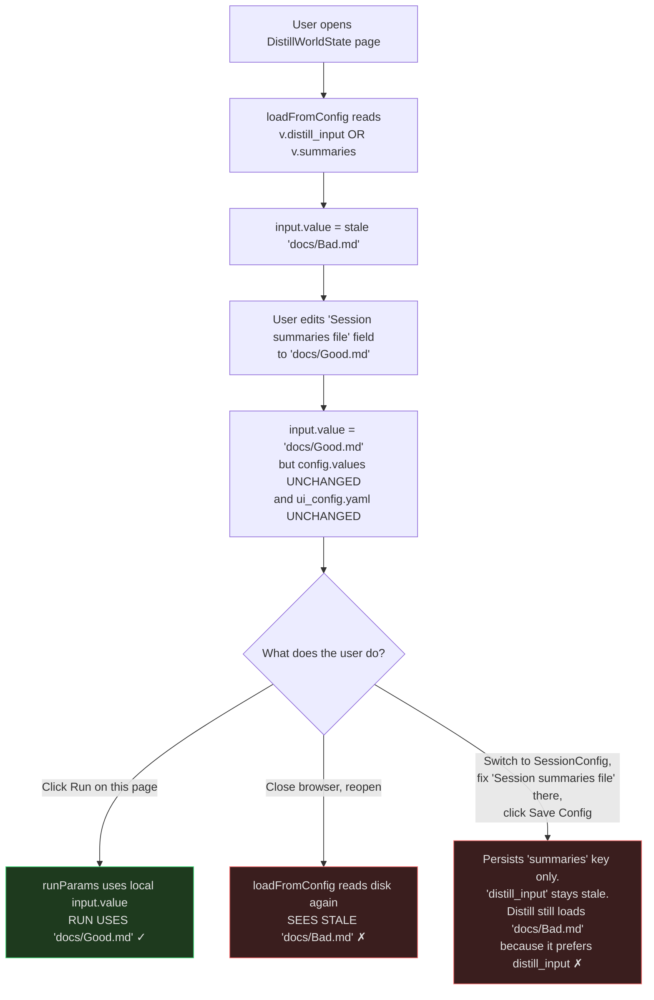

# Web UI config persistence — current behavior

Reference doc for how `ui_config.yaml` gets read and written by the FastAPI/Vue
front end. Captures the asymmetric persistence model that exists today so future
work can decide what (if anything) to change.

## TL;DR

- **Reads are uniform.** Every page hydrates from the in-memory `config.values`
  Pinia store at mount time.
- **Writes are not.** Only a handful of places persist `config.values` back to
  `ui_config.yaml` on disk. Most pages mutate local refs that never round-trip.
- **Some pages have key precedence** (e.g. Distill prefers `distill_input` over
  `summaries`). Fixing the fallback key won't fix the page if the preferred key
  is stale.

## Stores and endpoints

```
┌───────────────────────────┐         ┌──────────────────────────────┐
│  ui_config.yaml (on disk) │ ◄────── │  /api/config/  (PUT)         │
│  cwd or ~/<campaign>/     │ ──────► │  /api/config/  (GET)         │
└───────────────────────────┘         └──────────────────────────────┘
                                                  ▲
                                                  │  apiPut / apiFetch
                                                  ▼
                                      ┌──────────────────────────────┐
                                      │  Pinia store (config.values) │
                                      │  frontend/src/stores/config  │
                                      └──────────────────────────────┘
                                                  ▲
                                                  │ reads / writes refs
                                                  ▼
                                      ┌──────────────────────────────┐
                                      │  Vue page components         │
                                      │  (local refs per form field) │
                                      └──────────────────────────────┘
```

Backend persistence: `server/config.py:save_ui_config` merges any incoming
key whose name matches `_SAVE_KEY_PREFIXES` (`cs_`, `distill_`, `party_`,
`plan_`, `query_`, `prep_`, `npc_`, `sd_`, `sw_`, `vtt_`, `session_dir`,
`campaign_dir`, `narr_`, `er_`, `cg_`, `dnd_`, `mt_`, `global_`, `summaries`).
Anything not matching a prefix is silently dropped on save.

## Who actually writes to disk

| Trigger | File | Notes |
|---|---|---|
| "Save Config" button | `views/session/SessionConfig.vue:143` | Explicit `apiPut('/api/config/', { values: config.values })` — sends entire in-memory store |
| Sidebar model dropdown | `components/layout/AppSidebar.vue:112` → `config.save()` | Sends entire in-memory store, so any unsaved edits anywhere ride along |
| Batch toggle in Session Doc Editor | `views/session/SessionDocEditor.vue:74` | Same as above — full-store dump |
| Raw YAML editor | `views/Settings.vue:29` | `apiPut('/api/config/raw', { text })` — overwrites file wholesale |
| Party YAML editor | `components/shared/PartyConfigEditor.vue:65` | Writes a separate `party.yaml`, not `ui_config.yaml` |

That's it. Every other page is read-only with respect to disk.

## Pages that load but never save

These read `config.values` on mount and stuff form refs from it. They have no
`saveToConfig`, no `apiPut`, no `config.save()`:

- `views/grounding/DistillWorldState.vue`
- `views/grounding/PartyDocument.vue`
- `views/grounding/PlanningDocument.vue`
- `views/grounding/CampaignState.vue`
- `views/session/VttSummary.vue`
- `views/prep/QuerySummaries.vue`
- `views/prep/SessionPrep.vue`
- `views/prep/NpcTable.vue`
- `views/prep/ConnectionGraph.vue`
- `views/setup/MakeTracking.vue`
- `views/setup/DndSheet.vue`
- `views/experimental/EnhanceRecap.vue`
- `views/experimental/SessionNarrative.vue`

Edits made on these pages persist for the lifetime of the browser tab. They are
**lost** on refresh/close unless the user (a) navigates to SessionConfig and
hits Save, or (b) flips the model dropdown / batch toggle, both of which dump
the whole store including the unsaved edits.

## The "fixed it but it still ran with the old value" failure mode



### Key precedence traps

These OR-fallbacks mean fixing the fallback key won't repair a stale preferred
key:

| File | Line | Expression |
|---|---|---|
| `DistillWorldState.vue` | 19 | `v.distill_input \|\| v.summaries` |
| `PlanningDocument.vue` | 37 | `v.plan_summaries \|\| v.summaries` |
| `PlanningDocument.vue` | 44 | `v.plan_build_summaries \|\| v.summaries` |
| `QuerySummaries.vue` | 19 | `v.query_input \|\| v.summaries` |

A user who edits **only** the Session Config page's "Session summaries file"
field updates `summaries`. The pages above will continue to load from their
preferred key (e.g. `distill_input`) until the user either edits that page
directly **and** triggers a full-store save (sidebar model dropdown,
SessionConfig Save, etc.), or hand-edits `ui_config.yaml` via Settings.

## Why deriveAll doesn't rescue this

`SessionConfig.vue:deriveAll` (triggered 500ms after `campaign_dir` /
`session_dir` change) calls `/api/config/campaign-paths` and overlays the
returned paths onto `config.values`. But:

- It only sets `summaries` if a `summaries.md` / `all_summaries.md` file
  actually exists at one of the canonical campaign locations
  (`derive_campaign_paths` in `server/config.py:126-138`). For campaigns that
  don't have such a file, `d.summaries` is absent and the stale value survives.
- Even when it runs, it does NOT call `apiPut`. The overlay is in-memory only;
  the disk file isn't refreshed until something else triggers a save.

## Possible fixes (NOT applied — recorded for later)

1. **Auto-save on field blur for every page.** Add a small `saveToConfig` /
   `apiPut` shim to each page so edits round-trip immediately. Trade-off: many
   more disk writes, more chances to clobber a partially-typed value.
2. **Drop the OR-fallbacks** — make every page bind to exactly one config key,
   force the user to set it explicitly. Trade-off: loses the convenience of
   "set summaries once, every grounding page picks it up."
3. **Single source of truth in derive.** Have `derive_campaign_paths` return
   `summaries` even when the file doesn't yet exist (predicted path), and have
   `deriveAll` overwrite all the per-page keys (`distill_input`,
   `party_summaries`, `query_input`, `plan_*`) instead of just `summaries`. Then
   `apiPut` after derive so the canonical set lands on disk.
4. **Visible "unsaved changes" indicator.** Cheapest signal-only fix — make it
   obvious to the user that the form is dirty and disk is stale.

## Investigation triggered this doc

User reported "I changed the config to the right value but it still wrote to
the wrong path." Stale entries found in
`~/campaigns/out-of-the-abyss/ui_config.yaml`:

```yaml
summaries:        docs/The Underdark.md
distill_input:    docs/The Underdark.md
party_summaries:  docs/The Underdark.md
```

`vtt_output` and `sd_session_summary` were both correct. Root cause turned out
to be pilot error (per the user), but the persistence asymmetry above made the
mistake easy to make and hard to diagnose.
