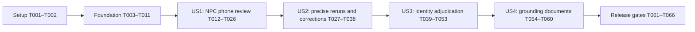

# Tasks: Shared Review and Identity Adjudication

**Input**: Design artifacts in `specs/036-review-adjudication/`.
**Prerequisites**: [plan.md](plan.md), [spec.md](spec.md), [research.md](research.md), [data-model.md](data-model.md), [contracts/cli.md](contracts/cli.md), [contracts/http-security.md](contracts/http-security.md), [contracts/verification.md](contracts/verification.md), [contracts/identity-apply.md](contracts/identity-apply.md), [migration.md](migration.md), [quickstart.md](quickstart.md).
**Workspace**: `/tmp/campaigngenerator-547`; branch `codex/547-review-adjudication`.
**Roles**: Astra plans/reviews; GPT-5.6-Sol orchestrates and codes, as selected by the user.

**Tests**: Included for the specification's required security review, category fixtures, recovery, measurable acceptance scenarios and phone continuity. Write the named contract tests before their implementation and confirm the relevant initial failure. Tests are behavior checks, not assertions that merely mirror code. Runtime acceptance is not complete until its evidence is recorded.

## Format and Path Conventions

Each task has a checkbox, sequential ID, optional `[P]`, a required story label within story phases, and concrete repository-relative file paths. `[P]` means tasks in a documented parallel wave touch distinct files and can start once that wave's prerequisites complete. It never bypasses a prerequisite or authorizes overlapping edits. Subsequent tasks run in listed order unless the dependency notes explicitly permit otherwise. Paths are relative to the worktree above; new files are intentional.

Setup/foundation tasks support multiple stories. Story-specific work stays in its own phase. The shared platform's first delivery is a usable NPC review queue, not an empty framework. No implementation is performed by this task-generation command.

## Phase 1: Setup (Shared Infrastructure)

**Goal**: Prepare package boundaries and disposable acceptance inputs without starting a speculative standalone review platform.

- [X] T001 Create the review package and resource layout in `pipelines/summary_native/review/__init__.py` and `pipelines/summary_native/review/web/`, preserving existing dependencies and registering packaged viewer resources in `pyproject.toml`.
- [X] T002 Build the disposable campaign fixture and documented selections in `tests/fixtures/summary_native_review/campaign/` and `tests/fixtures/summary_native_review/README.md`: authority v1, 25 NPC findings across seven categories, 38 duplicate pairs, four grounding drafts, authored conflicts, scoped/type/guard/collision cases and exact expected outcomes; never use live campaign files.

**Checkpoint**: Complete this phase before its dependents.

---

## Phase 2: Foundational (Blocking Prerequisites)

**Goal**: Finish the shared state, recovery and migration boundary before implementing story workflows. Review infrastructure is validated against the NPC fixture from the outset.

- [X] T003 [P] Define strict review configuration and single-owner defaults in `campaignlib/review_config.py`, covering config/campaign resolution, bind/origin, expiry, request/note/batch/page limits and bounded command timeouts; reject contradictory roots and unknown options.
- [X] T004 [P] Define strict records and canonical serialization in `pipelines/summary_native/review/models.py`: manifest, immutable semantic item, decision, source-custody generation, selection/run, grant, typed proposal/receipt and independent state axes; distinguish semantic digest from full-file hashes and review-local subject IDs from registry names.
- [X] T005 [P] Add schema/digest boundary tests in `tests/test_summary_native_review_models.py` for duplicate keys/IDs, unsupported versions, cross-campaign references, nonfinite values, exact text, distinct verdict meanings and same-text different-subject/occurrence isolation.
- [X] T006 [P] Add failpoint and migration contract tests in `tests/test_summary_native_review_transactions.py` and `tests/test_summary_native_review_migration.py` for create/replace/delete, missing versus empty, all-target preflight, stale migration plans, pending v1 transactions, preserved snapshots and repeated recovery/migration.
- [X] T007 Extend `pipelines/summary_native/authority_apply.py` with versioned create/replace/delete journals, explicit existence states, immutable before/after snapshots, all-target recovery preflight and durable receipt/tip completion; retain compatible recovery of preexisting v1 transactions before migration.
- [X] T008 Add audit-only review_decision records and live ledger v2 validation in `pipelines/summary_native/authority.py`; update `pipelines/summary_native/authority_inputs.py` and `pipelines/summary_native/authority_cli.py` so review decisions never become source replacements, planning facts or precedence overrides, and historical loser identities validate through immutable snapshots; audit discriminated-record iterations in `pipelines/summary_native/authority_apply.py`, conflict detection/resolution, status/history/tip validation and unchanged summary-only proposal behavior with an actual review_decision present.
- [X] T009 Implement explicit authority v1-to-v2 dry-run/digest-bound migration in `pipelines/summary_native/review/migrate.py`, preserving archival bytes, surfacing stale existing source proposals and refusing unknown fields/pending transactions; keep entity registry v1 unchanged.
- [X] T010 Implement campaign initialization, immutable item/event storage, source manifests and coherent read snapshots in `pipelines/summary_native/review/store.py` under the shared authority lock/journal; init must not silently migrate authority state and unsafe paths/symlinks must refuse.
- [X] T011 Register the review CLI dispatcher, init/migrate/recover and shared JSON/refusal behavior in `pipelines/summary_native/review/cli.py` and `pipelines/summary_native/cli.py`; validate foundation tests and existing #546 behavior in `tests/test_summary_native_review_foundation.py` before starting US1.

**Checkpoint**: Foundation prerequisites complete; start the real NPC review slice.

---

## Phase 3: User Story 1 — Review NPC Findings on a Phone (Priority: P1)

**Goal**: Deliver the shared workflow with a real NPC queue, durable phone decisions, protected transport and trusted application controls.

**Independent Test**: Create the selected 25-finding NPC review, save Approve/Reject/Discuss and notes on an actual phone, restart/reconnect, and see the same durable state through desktop and CLI; stale tabs, revoked grants and empty batches refuse safely.

- [X] T012 [P] [US1] Write real CLI decision-store tests in `tests/test_summary_native_review_decisions.py` for explicit batches, compare-and-swap conflicts, lost-response retries, reused request IDs, history/retraction and one journal covering accepted decision plus authority record.
- [X] T013 [P] [US1] Write real-service transport/security tests in `tests/test_summary_native_review_http.py` for capability scope, revocation/expiry, restart, CSRF/Origin/Host, no arbitrary files, cross-review IDs, Markdown/raw-HTML injection, fixed packaged-asset allowlisting, payload limits, secret redaction and absence of remote apply/admin routes.
- [X] T014 [P] [US1] Write phone/desktop browser acceptance in `frontend/e2e/summary-native-review.spec.ts` for the 25-item queue, 320/375-pixel layout, notes, filters, explicit selection, progress, pending/failed/stale feedback, competing tabs and reconnect/restart continuity.
- [X] T015 [US1] Adapt selected NPC verification results into the common queue in `pipelines/summary_native/review/verification.py`, preserving exact claim or failure context, excerpts, missing evidence, source paths, original diagnostics, severity and explicit source selection; route create through `pipelines/summary_native/review/cli.py` without implicit all-dossiers scope.
- [X] T016 [US1] Implement decide/history/retract in `pipelines/summary_native/review/store.py` and `pipelines/summary_native/review/cli.py`: durable all-or-refuse batches, reviewer/time, request idempotency, expected revisions, audit-only accepted rulings, no source mutation and no automatic inverse on retract.
- [X] T017 [US1] Implement list/show/status/export/import in `pipelines/summary_native/review/cli.py` and `pipelines/summary_native/review/store.py`, with coherent counts, bounded snapshots, immutable selected bundles, provenance validation and cross-campaign/stale import refusal; exclude access credentials.
- [X] T018 [US1] Implement 256-bit grant issue/validation/revoke and private credential storage in `pipelines/summary_native/review/access.py`; raw tokens appear only once to the local issuer, expiry survives restart and grant revocation is rechecked under the decision writer lock.
- [X] T019 [US1] Implement CLI-owned foreground serve and managed start/status/stop in `pipelines/summary_native/review/service.py` and `pipelines/summary_native/review/cli.py`, with required local private bind/origin, optional TLS, bounded readiness, process-start identity, restart-safe grants and no automatic public sharing.
- [X] T020 [US1] Implement the capability-only route adapter in `pipelines/summary_native/review/web/app.py` using bounded CLI invocation via `server/subprocess_runner.py`; authenticate before revealing item existence and enforce exact route allowlist, safe pagination, CSRF, Host/Origin, limits, redaction and security headers.
- [X] T021 [US1] Build the shared viewer in `pipelines/summary_native/review/web/viewer.html`, `pipelines/summary_native/review/web/viewer.js` and `pipelines/summary_native/review/web/viewer.css` with safe text/allowlisted Markdown, no external resources, wrapping evidence, touch actions, explicit batches, filters/counts and honest save/retry states.
- [X] T022 [US1] Add trusted local application adapters in `server/routers/review_routes.py` and register them in `server/main.py`, exposing create/read/decide/history/retract/export/import/migrate/init/recover and service/grant lifecycle through typed CLI arguments; pass secrets privately and never log links.
- [X] T023 [US1] Add `frontend/src/components/ReviewLauncher.vue` to `frontend/src/views/grounding/SummaryNative.vue` and `frontend/src/views/npcs/NpcDossiers.vue` with explicit source selection, migration/init, lifecycle/grant controls, queue open/status and file interchange/history; use the dedicated page for adjudication.
- [X] T024 [US1] Verify complete US1 command-to-UI parity and independent service lifecycle in `tests/test_summary_native_review_routes.py`, including CLI defaults, bounded JSON failures, recovery of interrupted decision saves, saved-state visibility and a browser/SSE disconnect that does not stop an already-started service.
- [X] T025 [US1] Execute US1 suites and a written security review against `specs/036-review-adjudication/contracts/http-security.md`; record outcomes and fix findings in `specs/036-review-adjudication/security-review.md` before any phone-accessible release.
- [x] T026 [US1] Run the actual-phone US1 acceptance from `specs/036-review-adjudication/quickstart.md` and record device/transport, three verdicts/notes, same saved CLI state, reload/restart and viewport evidence in `specs/036-review-adjudication/validation.md`; keep this task open if no real phone is available.

**Checkpoint**: Story acceptance above is independently demonstrated on its prerequisites; later consumers are not needed to validate this story.

---

## Phase 4: User Story 2 — Resolve Failures Without Repeating Settled Work (Priority: P1)

**Goal**: Add precise reruns, semantic judgment entry, stable approvals and reviewed correction integration without weakening publication gates.

**Independent Test**: Starting with the US1 queue, prove exact selected-check execution and all seven categories; unrelated changes preserve approved items through audited rebind, relevant evidence/rules stale them, and source/draft corrections retain separate application and publication gates.

- [X] T027 [P] [US2] Write taxonomy and false-entailment/typography tests in `tests/test_summary_native_review_verification.py`, retaining all legacy codes and proving valid citations do not certify meaning or waive claimed-verbatim failures.
- [X] T028 [P] [US2] Write execution-instrumented selection and refresh tests in `tests/test_summary_native_review_rerun.py` and `tests/test_summary_native_review_refresh.py`: only selected check IDs execute, approved items refuse unresolved rerun, partial failures persist, unrelated paragraph changes preserve approvals through audited rebind, and relevant/rule changes stale them.
- [X] T029 [US2] Refactor `pipelines/summary_native/npc_verify.py` into reusable scoped checks while preserving the existing verify aggregator and legacy results; use `pipelines/summary_native/review/verification.py` for the seven-category lossless adapter and mechanical/advisory/GM-confirmed distinctions.
- [X] T030 [US2] Add deterministic ordinal/number and same-citation inconsistency advisories in `pipelines/summary_native/review/verification.py`, plus explicitly encoded supersession/audience checks; keep inferred semantic truth unresolved and add no automatic model pass.
- [X] T031 [US2] Implement attributable finding add/import in `pipelines/summary_native/review/cli.py` and `pipelines/summary_native/review/verification.py` with exact evidence, expected generation, categories, rationale and proposed action; entering a GM/agent candidate must not approve it.
- [X] T032 [US2] Implement immutable rerun previews and per-member run records in `pipelines/summary_native/review/verification.py` and `pipelines/summary_native/review/cli.py`, distinguishing unresolved versus explicitly selected pending/stale modes, refusing changed selection hashes and retaining unprocessed/failure state.
- [X] T033 [US2] Implement deterministic refresh and conservative occurrence reconciliation in `pipelines/summary_native/review/store.py`, recording new custody generations and immutable rebind evidence while preserving only unchanged semantic item revisions; never transfer exact mutation approval or guess ambiguous matches.
- [X] T034 [US2] Implement typed correction proposal/application dispatch in `pipelines/summary_native/review/cli.py` and `pipelines/summary_native/review/corrections.py`, linking true source errors to unchanged #546 summary-only adapters and previewing authored-dossier corrections separately when generated text is wrong but the summary is correct.
- [X] T035 [US2] Enforce separate exact-draft sign-off and mechanical publication gates in `pipelines/summary_native/npc_publish.py` and `pipelines/summary_native/review/cli.py`; repair/recheck must clear hard failures, semantic approval cannot turn them into passes, and changed draft bytes stale document approval.
- [X] T036 [US2] Expose refresh, finding entry, rerun preview/run, correction propose/apply, correction-specific recovery status and NPC sign-off controls in `server/routers/review_routes.py` and `frontend/src/components/ReviewLauncher.vue`; show their outcomes in `pipelines/summary_native/review/web/viewer.js` without adding remote mutation routes.
- [X] T037 [US2] Validate source-versus-draft correction, inverse refusal, exact-input freshness and no-source-change-on-save in `tests/test_summary_native_review_corrections.py`, and extend `frontend/e2e/summary-native-review.spec.ts` for selected reruns and stale approval feedback.
- [X] T038 [US2] Execute the independent US2 scenario and existing NPC/authority regressions, recording exact check membership, all seven categories, approval survival and publication refusals in `specs/036-review-adjudication/validation.md`.

**Checkpoint**: Story acceptance above is independently demonstrated on its prerequisites; later consumers are not needed to validate this story.

---

## Phase 5: User Story 3 — Adjudicate Duplicate Identities Safely (Priority: P2)

**Goal**: Add exact reviewed global identity merges, evidence-bound distinct rulings and complete recoverable dependent updates; preserve scoped requests as blocked decisions.

**Independent Test**: Starting with the shared review engine, adjudicate 38 selected pairs: safe global merge updates all reviewed dependents without summary normalization, scoped/type/guard/collision cases change nothing, distinct rulings reopen on new evidence, and crash/replay recovery is safe.

- [X] T039 [P] [US3] Write proposal/apply/refusal tests in `tests/test_summary_native_review_identity.py` for 38 selected pairs, global same-type merges, scoped/nonpersistent/type/guard refusals, canonical alternatives, factual summary separation and historical loser audit references.
- [X] T040 [P] [US3] Write dependency/freshness and migration tests in `tests/test_summary_native_review_dependencies.py` for complete affected-path inventory, stale/malformed manifests, authored conflicts, selective output preservation and coarse-hash-to-subject-dependency adoption.
- [X] T041 [US3] Make registry read snapshots and all legacy mutation paths participate in the shared campaign lock/pending-journal boundary in `campaignlib/registry.py` and `entity_registry/registry.py`, with no nested nonreentrant locks or direct-writer race against reviewed application.
- [X] T042 [US3] Build pure candidate registries in `pipelines/summary_native/review/identity.py`, preserving names/aliases/provenance and refusing scope/type/anti-merge conflicts; never invoke the direct cmd_merge writer or infer additional first-name aliases.
- [X] T043 [US3] Implement versioned per-subject dependency manifests and freshness reads in `pipelines/summary_native/corpus.py`, `pipelines/summary_native/freshness.py` and `pipelines/summary_native/review/migrate.py`; preserve coarse invalidation until explicit adoption proves finer dependencies, and surface required rebuilds without running models in migration.
- [X] T044 [US3] Implement complete inspected/affected-path closure and collision classification in `pipelines/summary_native/review/identity.py`, covering all configured ranges, summaries, authored/published/draft dossiers, links/citations/manifests and review items; block incomplete inventories, symlink aliases, case collisions, merge chains and ambiguous authored reconciliation.
- [X] T045 [US3] Stage deterministic affected outputs and immutable bounded canonical alternatives in `pipelines/summary_native/review/identity.py`, recording unchanged summary occurrences, exact create/replace/delete targets and separately pending generative rebuilds; never hold a writer lock during a model call.
- [X] T046 [US3] Add duplicate review create/propose and proposal-detail CLI reads in `pipelines/summary_native/review/cli.py`; show prepared previews in `pipelines/summary_native/review/web/viewer.js` so phone merge approval selects an exact candidate digest, while custom/scoped requests remain Discuss/blocked until a new trusted preview.
- [X] T047 [US3] Integrate current scope/evidence-bound distinct decisions into `pipelines/summary_native/duplicates.py` and `pipelines/summary_native/review/identity.py`; reopen on relevant new evidence without projecting into global registry distinct pairs or deleting legacy guards.
- [X] T048 [US3] Implement digest-bound identity apply and reproducible receipts in `pipelines/summary_native/review/identity.py` using journal v2 for registry, dependent artifacts, stale markers, authority event/tip and application references; identical replay returns the original receipt and accurate summaries stay byte-identical.
- [X] T049 [US3] Add explicit affected-only regeneration and reviewed guard/conflict-resolution proposal handling in `pipelines/summary_native/review/identity.py` and `pipelines/summary_native/review/cli.py`; do not broaden a selection, silently remove guards, concatenate authored dossiers or publish regenerated prose without sign-off.
- [X] T050 [US3] Expose duplicate create/preview/apply/recovery, blocked-scope explanations and affected regeneration selection in `server/routers/review_routes.py` and `frontend/src/components/ReviewLauncher.vue`, with the shared viewer displaying both canonical alternatives and every affected path.
- [X] T051 [US3] Prove create/replace/delete crash recovery and concurrent legacy registry behavior in `tests/test_summary_native_review_identity_recovery.py`, including deletion after-state, unexpected bytes causing zero further writes, stale preview refusal, replay and preserved historical loser references.
- [X] T052 [US3] Add affected-consumer regressions in `tests/test_summary_native_review_registry_consumers.py` for registry projections, summary-native grouping/NPC selection/forms/linking/annotation/state views, entity resolve/MCP, provenance identity, ensemble synthesis/known names, grounding NPC/planning and heading normalization, using the inventory in `specs/036-review-adjudication/research.md`.
- [x] T053 [US3] Execute the independent 38-pair scenario and phone prepared-alternative flow in `frontend/e2e/summary-native-review.spec.ts`, recording exact changed paths, unrelated approval/artifact preservation, scoped refusals and distinct reopening in `specs/036-review-adjudication/validation.md`.

**Checkpoint**: Story acceptance above is independently demonstrated on its prerequisites; later consumers are not needed to validate this story.

---

## Phase 6: User Story 4 — Reuse Review for Grounding Documents (Priority: P3)

**Goal**: Review long drafts and export the same decision format, while requiring whole-document approval and existing publication checks.

**Independent Test**: Starting with the shared engine, review four long drafts, export/import decisions, reject promotion without separate sign-off or after a byte/dependency change, and promote only an exact approved bundle through existing checks.

- [X] T054 [US4] Write four-document review/sign-off/promotion contract tests in `tests/test_summary_native_review_documents.py` for missing sign-off, one-byte stale drafts, missing bundle pointers, audience/freshness failure, explicit selection and imported decision bindings.
- [X] T055 [US4] Implement the four grounding-document adapters in `pipelines/summary_native/review/documents.py`, capturing exact draft/dependency bytes, evidence/proposed replacements and separate whole-document sign-off items in the common format.
- [X] T056 [P] [US4] Implement bounded section reads and legible long-document rendering in `pipelines/summary_native/review/web/app.py` and `pipelines/summary_native/review/web/viewer.js`, retaining full-document digests, safe text rendering and the capability-only read/save boundary.
- [X] T057 [P] [US4] Implement explicit grounding signoff and exact publication proposal creation in `pipelines/summary_native/review/documents.py` and `pipelines/summary_native/review/cli.py`, checking current findings plus independent document approval, destination collisions and all bundle dependencies.
- [X] T058 [US4] Implement narrow reviewed-bundle promote through journaled exact writes in `pipelines/summary_native/review/documents.py`, reusing outline/pointer/freshness/audience checks and immutable receipts; resolving all findings must never imply document sign-off.
- [X] T059 [US4] Expose four-document selection, export/import, sign-off, publication preview/promote and recover in `server/routers/review_routes.py` and `frontend/src/components/ReviewLauncher.vue`, invoking the same CLI contract with exact reviewed revisions.
- [X] T060 [US4] Extend `frontend/e2e/summary-native-review.spec.ts` for long documents at narrow widths and separate sign-off, then record the independent four-document and common-decision export scenario in `specs/036-review-adjudication/validation.md`.

**Checkpoint**: Story acceptance above is independently demonstrated on its prerequisites; later consumers are not needed to validate this story.

---

## Phase 7: Polish & Cross-Cutting Concerns

**Goal**: Close delivery gates across all stories without claiming runtime evidence from planning alone.

- [X] T061 [P] Publish operator instructions for authority/manifest migration, verification and no-migration refusal, private hosting, grant lifecycle, blocked scoped aliases, recovery and review/apply/sign-off boundaries in `docs/cli/summary_native_review.md`; link from `docs/README.md` and update the obsolete blanket summary-edit policy in `docs/cli/summary_native_howto.md` to user option A.
- [X] T062 [P] Add installed-wheel resource/entry-point coverage in `tests/test_summary_native_review_installation.py`, proving packaged viewer assets, shared CLI operation and safe failure when required assets are absent outside an editable checkout.
- [X] T063 Audit every command and flag against visible application controls in `tests/test_summary_native_review_routes.py`, including migrations, refresh, finding entry, retraction, import/export, foreground-equivalent service launch, grant lifecycle, recovery and both sign-off/publication paths; fix omissions before completion.
- [X] T064 Run the full relevant Python regressions, frontend production build, Playwright suite and installed-wheel smoke described in `specs/036-review-adjudication/quickstart.md`; record exact commands/results and remaining limitations in `specs/036-review-adjudication/validation.md` rather than merging totals from unrelated runs.
- [X] T065 Complete the final adversarial real-server security review in `specs/036-review-adjudication/security-review.md`, rechecking all transport changes, capability/CSRF races, disclosure/logging, replay, oversized input and no remote application of changes; unresolved findings block release.
- [x] T066 Run the complete quickstart on a disposable campaign including real-phone continuity, selected reruns, 38-pair identity adjudication and all four drafts; reconcile SC-001–SC-007 evidence and all thirteen constitution gates in `specs/036-review-adjudication/validation.md`, leaving any unperformed external/manual gate explicitly open.

**Checkpoint**: Complete this phase before its dependents.

---

## Dependencies & Execution Order

### Phase dependencies

This graph is the chosen delivery order from #547, not a claim that all stories can be implemented simultaneously. US1 has no dependency on later consumers. US2 builds on US1 state/UI. US3 reuses US1/US2 state, freshness and correction seams; its acceptance does not require US4. US4 uses the shared engine and sign-off/mutation primitives; it can be tested with documents alone once prerequisites exist. Shared files (`cli.py`, `review_routes.py`, `ReviewLauncher.vue`, the viewer and authority primitives) have one active owner at a time.

### Exact sequencing within phases

- T001–T002 complete before foundation work. T003–T006 form a parallel wave; finish them before T007. T007 → T008 → T009 → T010 → T011. Run the authored tests against the relevant implementations before foundation completion.
- US1: T012–T014 may be authored concurrently; each must demonstrate the intended failing behavior before its implementation. Then T015 → T016 → T017 → T018 → T019 → T020 → T021 → T022 → T023 → T024 → T025 → T026. T025/T026 are MVP completion gates, not optional future polish.
- US2: T027–T028 in parallel, then T029 through T038 in order. T033 custody rebind does not authorize T034 source changes; source proposals retain full hashes. T035's NPC sign-off must exist before publication is considered integrated.
- US3: T039–T040 in parallel, then T041 through T053 in order. T043 includes explicit dependency-manifest migration before T044/T045 may claim precise affected-only behavior. T041 prevents legacy registry races before T048 apply is enabled. T052 covers consumer seams even though scoped aliases are refused.
- US4: T054 tests first; T055 supplies document items. T056 renderer and T057 proposal/sign-off work may then proceed in parallel because they change different files; both complete before T058. T059 → T060 completes parity/acceptance.
- Final: T061–T062 in parallel after stories are integrated. T063 → T064 → T065 → T066. Required tests/security/real-phone evidence remain blocking even if code work is complete.

### Parallel execution examples per story

| Story | Safe concurrent assignments | Required boundary |
|---|---|---|
| US1 | T012 decision CLI tests; T013 real-service security tests; T014 browser acceptance | Foundation complete; implementation waits for meaningful initial failures. |
| US2 | T027 taxonomy tests; T028 exact-selection and audited-refresh tests | US1 complete; separate test files. |
| US3 | T039 identity proposal tests; T040 dependency/migration tests | US2 complete; separate test files. |
| US4 | T056 bounded long-document viewer; T057 local sign-off/publication proposals | T054/T055 complete; different files; T058 waits for both. |

Sol may use these independent assignments during orchestration. Parallel markers do not override the user's model choices: Astra plans/reviews; Sol implements. Agent count is a scheduling choice, not a requirement to run every available slot.

## Requirement Coverage

| Spec requirement | Primary tasks |
|---|---|
| FR-001 shared workflow/NPC first | T015, T021–T024, T046, T055–T060 |
| FR-002 exact attributable decisions | T004–T005, T010, T012, T016 |
| FR-003 controls, filters, resume, export | T016–T017, T021, T023, T046 |
| FR-004 durability/concurrency/history | T006–T007, T010, T012, T016, T024–T026 |
| FR-005 CLI/UI parity | T011, T022–T024, T036, T050, T059, T063 |
| FR-006 phone reachability/layout | T019–T021, T026, T056, T060, T066 |
| FR-007 capability surface/security | T013, T018–T020, T025, T065 |
| FR-008 exact findings/evidence | T015, T029, T031 |
| FR-009 stable taxonomy/severity | T002, T027, T029–T030 |
| FR-010 mechanical versus semantic | T027, T029–T031, T035, T038 |
| FR-011 blocking versus advisory | T027, T029, T035, T038 |
| FR-012 explicit selective reruns | T028, T029, T032, T036–T038 |
| FR-013 approval survival/staleness | T004–T005, T028, T033, T043, T047 |
| FR-014 shared #546 ruling integration | T008–T010, T016, T034–T035, T048 |
| FR-015 registry merge/summary boundary | T039, T042, T045, T048–T049 |
| FR-016 scope safety | T039, T042, T046–T047, T052–T053 |
| FR-017 complete reviewed preview | T040, T043–T046 |
| FR-018 replay/recovery/affected updates | T006–T007, T041, T043–T045, T048–T053 |
| FR-019 long drafts/sign-off | T054–T060 |
| FR-020 source truth/verbatim | T027, T034–T035, T039, T048, T064 |
| FR-021 versions/migration/refusals | T004–T011, T017, T043, T061 |

SC-001/SC-002 map to T014, T026 and T066; SC-003/SC-004 to T027–T038; SC-005 to T039–T053; SC-006 to T054–T060; SC-007 to T006–T007, T013/T025, T051 and T065–T066. The mapping is a coverage aid; the full task descriptions and referenced contracts govern behavior.

## Implementation Strategy

### MVP first

Complete Setup + Foundation + US1 (T001–T026). Demonstrate a real 25-item NPC failure queue with phone/desktop/CLI durable decisions, private access and successful security/phone gates. This is a useful review-only increment; it does not claim that selective reruns, identity application or grounding publication are implemented. Do not add dummy production surfaces for unimplemented consumers.

### Incremental delivery

Add US2 (T027–T038), validate independently, then US3 (T039–T053), then US4 (T054–T060). Each increment preserves earlier behavior. Before feature completion, execute the cross-cutting release gates T061–T066. Use disposable campaigns for migration/failpoint tests. No approval to migrate live campaign data or publicly expose a service is inferred from task generation.

### Definition of task completion

Record changed behavior, exact verification and material limitations in `validation.md`; mark a task complete only when its described result exists and its gate passes. Code completion alone does not satisfy a security review or a physical-phone walkthrough. If a manual prerequisite is unavailable, finish independent work and report the specific remaining gate. Do not replace missing runtime evidence with design assertions or mark later tasks complete because an earlier test happens to pass.

## Task Summary

| Phase/story | Count |
|---|---:|
| Setup | 2 |
| Foundation | 9 |
| US1 — NPC phone review | 15 |
| US2 — selective verification/corrections | 12 |
| US3 — duplicate identity adjudication | 15 |
| US4 — grounding documents | 7 |
| Cross-cutting release gates | 6 |
| **Total** | **66** |

All tasks are initially unchecked. Generation does not implement or test application code.
