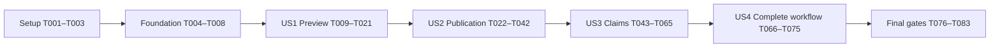

# Tasks: Reviewed Bundle Promotion Gate

**Input**: Design documents in `specs/037-promotion-gate/`
**Branch/worktree**: `codex/548-promotion-gate` — `/tmp/campaigngenerator-548`
**Prerequisites**: [plan.md](plan.md), [spec.md](spec.md), [research.md](research.md), [data-model.md](data-model.md), [contracts/](contracts/), [migration.md](migration.md), [quickstart.md](quickstart.md), [spike.md](spike.md)
**Status**: Implementation task list; all tasks are initially unchecked.

**Tests**: Included because the specification explicitly requires acceptance tests, five regression fixtures/positive controls, concurrency/failure scenarios and phone workflow validation. Write story contract tests first and observe the missing behavior; environment/setup failures do not count as acceptance evidence. Use disposable campaigns and mocked model boundaries unless a separately authorized model experiment is necessary.

**Organization**: One phase per story, in priority order. Astra owns design; the approved GPT-5.6-Sol orchestrates and codes. Use codebase-memory-mcp for structural discovery, with exact text searches for paths/config and stale-index verification. No production campaign edits, implementation-triggered Git commit/push, or new public hosting.

## Format and Path Conventions

- Each task has a checkbox, unique sequential ID, optional `[P]`, a story label in story phases, and explicit repository-relative file paths.
- `[P]` means eligible to run beside the named independent work **after its listed prerequisites are complete**; it does not override phase dependencies. Unmarked tasks touching a shared file run serially.
- All paths resolve beneath `/tmp/campaigngenerator-548`. New files are intentionally named. T001 freezes remaining discovered reader/writer paths before code changes; do not guess consumers from filenames.
- Runtime tests/results go in `specs/037-promotion-gate/validation.md`. Mark tasks complete only after their behavior is implemented and verified; writing a test or promising a later gate is not completion.

## Phase 1: Setup

**Purpose**: Establish exact integration scope, disposable data and package seams without changing live campaigns.

- [X] T001 Audit managed grounding readers/writers with codebase-memory-mcp and record exact call sites, classifications and required changes in `specs/037-promotion-gate/reader-inventory.md`; cover `campaignlib/config.py`, `campaignlib/projection_config.py`, `server/platform_config_service.py`, `server/grounding_config_shared.py`, `server/routers/ensemble.py`, session-doc consumers, campaign MCP, Kanka integrations and `pipelines/workspace/new_workspace.py`, distinguishing managed reads/writes from unrelated path mentions.
- [X] T002 [P] Build a deterministic disposable campaign factory at `tests/fixtures/summary_native/promotion/create_campaign.py` with four range-001–003 drafts, actual timeline, nested references, review/authority prerequisites, complete legacy and pristine baselines, changed/removed members and a roughly 200 KB document; keep it network/model-free and expose the command specified in `quickstart.md`.
- [X] T003 Add package seams in `pipelines/summary_native/promotion/__init__.py` and `pipelines/summary_native/claims/__init__.py`, document dependency direction in `specs/037-promotion-gate/reader-inventory.md`, and ensure neither pure package initialization imports the optional extractor or a model client; do not add a database/framework.

**Checkpoint**: T001 inventory and T002 fixtures exist; T003 package import direction is fixed. T001 and T003 share the inventory document, so perform their inventory edits serially; T002 may run beside either.

## Phase 2: Foundational Prerequisites

**Purpose**: Common strict identities, pure filesystem access and centralized options required by every story. Complete this phase before story implementation.

- [X] T004 Implement strict shared campaign/range/member/gate identities and canonical hash/error helpers in `pipelines/summary_native/promotion/models.py` and `pipelines/summary_native/promotion/errors.py`, reusing shared review canonical serialization and rejecting unknown versions/keys, duplicate paths, foreign campaigns and malformed IDs without introducing a second fact authority.
- [X] T005 [P] Add centrally owned promotion/claim limits and defaults in `campaignlib/grounding_config.py` with schema/default regression coverage in `tests/test_summary_native_promotion_config.py`; retain existing config discovery, range/backend/model precedence and unknown-key behavior without read-time config rewrites.
- [X] T006 Add an existing-lock-only read mode in `pipelines/summary_native/authority_apply.py` and read-only inspection helpers in `campaignlib/grounding_bundle.py`; dry-run/status must not create directories, locks or state, and mutation lock ordering must remain compatible with #546/#547 transactions.
- [X] T007 Implement the narrow managed-path resolver in `campaignlib/grounding_bundle.py`: validate one pinned current target, six owned aliases and member-relative containment; reject arbitrary symlink components, escaping dependencies, detached aliases and unsupported filesystem assumptions without globally weakening review path guards.
- [X] T008 Add common invariant tests in `tests/test_grounding_bundle_contracts.py` for strict/canonical identities, pure existing-lock inspection, exact managed-link allowlisting, deterministic membership and source/path-record locator scoping; run them against T004–T007 and record supported local-filesystem assumptions in `specs/037-promotion-gate/validation.md`.

**Checkpoint**: All foundational tests pass. No migration or publication has yet been performed on a real campaign.

## Phase 3: US1 — Preview the Exact Reviewed Bundle (P1, MVP)

**Goal**: Select one range and show every proposed change, dependency and blocking condition without writing anything.

**Independent test**: Against an already initialized disposable managed baseline, preview the complete four-document bundle and compare the full manifest/diff with source and live bytes. Filesystem snapshots must show no additions, removals or changes. Missing/stale/unreviewed/mixed-range input refuses with actionable reasons. An unmigrated baseline reports migration required without initializing it.

### Tests first

- [X] T009 [P] [US1] Add manifest/diff and zero-write CLI contract tests in `tests/test_summary_native_promotion_preview.py` for four documents, actual `canon_events_timeline.md`, all nested references, removals, manual live drift, binary differences, empty/mixed range selection, unsupported layout and no model invocation.
- [X] T010 [P] [US1] Add eligibility/freshness tests in `tests/test_summary_native_promotion_gates.py` covering absent or v1-only sign-off, changed support/authority/audience/rules, incomplete drafts, new unresolved findings, destination-only staleness and preservation of unrelated valid approvals.

### Implementation

- [X] T011 [US1] Define `BundleSelection`, `PromotionPreview` and gate-result models in `pipelines/summary_native/promotion/models.py`, including complete before/after membership, config/alias identities, source/rule/review bindings and a reproducible preview digest that excludes only display/time fields.
- [X] T012 [US1] Implement pure bundle enumeration in `pipelines/summary_native/promotion/manifest.py` using `schema.draft_dir` and `schema.TIMELINE_FILE`; require all four drafts from one range, the full reference tree and retained records keyed by document/embedded locator/anchor, refusing uncertain removals or unrecognized ownership.
- [X] T013 [US1] Factor reusable completeness, copied-byte outline/pointer, run-record and dependency freshness checks into `pipelines/summary_native/promotion/gates.py` and correct the timeline enumeration in `pipelines/summary_native/review/documents.py`; preserve exact approved document bytes and include all required original inputs plus retained record hashes.
- [X] T014 [US1] Implement promotion-side review binding validation in `pipelines/summary_native/promotion/review_bindings.py`: require four distinct current sign-offs, their accepted #546 audit records and relevant evidence/identity/audience/rule context; reject old sign-off rules without rewriting history, using synthetic v2 fixture items until US3 delivers real producers.
- [X] T015 [US1] Implement exact additions/replacements/removals and human-edit diffs in `pipelines/summary_native/promotion/diff.py`; compare actual live membership to the proposed output, preserve unrelated files and distinguish destination preview drift from source approval staleness.
- [X] T016 [US1] Compose pure preview orchestration in `pipelines/summary_native/promotion/preview.py`; report every available blocker, compute stable consent identity and represent an unavailable claims gate explicitly rather than passing it, with no persistent report/cache/model side effects.
- [X] T017 [US1] Add promotion preview dispatch and stable JSON/exit handling in `pipelines/summary_native/promotion/cli.py` and `pipelines/summary_native/cli.py`, requiring explicit `--since/--until`, review/report bindings and `--dry-run`; bypass the existing scan/build path that writes reports. A supplied missing/unavailable check-report path produces a structured blocker and the available preview, never a synthetic production pass.
- [X] T018 [US1] Retire individual publication through `pipelines/summary_native/review/cli.py`, `pipelines/summary_native/review/documents.py` and `server/routers/review_routes.py` with `PROMOTION_WHOLE_BUNDLE_REQUIRED` and exact replacement instructions, preserving create/sign/history and historical receipt inspection.
- [X] T019 [US1] Expose typed local preview invocation in `server/routers/summary_native.py` through the installed CLI and add route equivalence/zero-write tests in `tests/test_summary_native_promotion_routes.py`; routes must not reproduce gate logic or silently supply a missing selection.
- [X] T020 [US1] Add a preview panel in `frontend/src/components/GroundingPromotion.vue` and mount it in `frontend/src/views/grounding/SummaryNative.vue`, showing explicit range, complete manifest/diffs, blockers, source versus destination staleness and honest claims-unavailable state with visible request feedback.
- [X] T021 [US1] Execute US1 acceptance cases and the preview route tests, documenting command outputs, zero-write hashes and refusal coverage in `specs/037-promotion-gate/validation.md`; verify T018 has no remaining individual-publication bypass.

**Checkpoint**: A read-only preview demonstration is available. It is not permission to release #548 or certify semantic coverage; US2/US3/US4 remain required for final delivery.

## Phase 4: US2 — Publish One Complete Generation Safely (P1)

**Goal**: Deliberately migrate/adopt a workspace, publish one complete generation, retain exact prior live bytes and reconcile interruptions without exposing mixed content.

**Independent test**: With a disposable reviewed bundle and a fixed deterministic gate fixture, migrate, preview and commit; inspect complete output and receipt. Faults before activation leave the old bundle live; faults after activation produce committed or explicit unknown state. A cooperating reader loop sees whole old/new snapshots. Retry, later publication and historical replay cause no unintended mutation.

### Tests first

- [X] T022 [P] [US2] Add migrator contract tests in `tests/test_migrate_grounding_bundle.py` for pure preview, exact config/six-alias inventory, legacy adoption versus pristine absence, partial-bundle refusal, retained originals, legacy-baseline activation, interrupted phases and no silent fallback/migration.
- [X] T023 [P] [US2] Add process/fault-injection publication tests in `tests/test_summary_native_promotion_recovery.py` for staging/copy/check/receipt/fsync/rename/swap/activation failures, orphan nonactivation, `commit_unknown`, corrupted identities, conflicting contenders and historical idempotent replay after a later publication.
- [X] T024 [P] [US2] Add cooperating reader/writer tests in `tests/test_grounding_bundle_readers.py` for one captured generation per operation, shared/exclusive lock behavior, pending migration or activation refusal, manual live drift, alias detachment and actual config/MCP/session-context entry points from T001.

### Implementation

- [X] T025 [US2] Define generation, operation intent/state, receipt candidate and immutable activation-chain models in `pipelines/summary_native/promotion/models.py`, distinguishing generation kind `legacy_adoption` from activation variant `legacy_baseline`, exact precommit snapshot references, truthful prepared/completed/recovered times and explicit absent parent semantics.
- [x] T026 [US2] Implement explicit migration preview/inventory and strict plan digests in `server/migrate_grounding_bundle.py`, validating loose bundles/config/ownership/paths and prerequisites while refusing incomplete legacy state; dry-run/status/verify must not create campaign state.
- [X] T027 [US2] Implement migration apply, pending marker, backups, per-path expected-before journal, verified aliases/config transition and forward-only explicit recovery in `server/migrate_grounding_bundle.py`; fsync its receipt and legacy-baseline activation before clearing pending, preserving unrecognized config keys and unrelated files.
- [X] T028 [US2] Implement `open_grounding_snapshot` and managed-write/refusal helpers in `campaignlib/grounding_bundle.py`, capturing all requested live bytes/references under one lock and pinned target, returning generation/live digest/drift, and refusing unresolved activation rather than repairing on read.
- [X] T029 [US2] Integrate operation-scoped snapshots with `campaignlib/config.py`, `pipelines/session_prep/prep.py`, `pipelines/grounding/npc_table.py` and the compare path in `pipelines/summary_native/cli.py`; capture bytes before model work and preserve ordinary behavior for genuinely nonbundle paths.
- [X] T030 [US2] Integrate managed party/context reads across `session_doc/check_consistency.py`, `session_doc/sd_consistency.py`, `session_doc/sd_plan.py`, `session_doc/sd_narrate.py`, `session_doc/scene_extract.py` and `session_doc/enhance_summary.py` as classified by T001, including explicit context paths and all other inventory-confirmed managed readers.
- [X] T031 [US2] Integrate managed document/context reads in `pipelines/rlm/mcp_server.py`, including its fallback branch, and reconcile actual managed consumers in `server/platform_config_service.py`, `server/grounding_config_shared.py`, `server/routers/ensemble.py` and `campaignlib/projection_config.py`; finish the T001 Kanka/workspace classifications without changing unrelated operations.
- [X] T032 [US2] Protect managed targets in inventory-confirmed writers, including `pipelines/grounding/distill.py`, `pipelines/grounding/campaign_state.py`, `pipelines/grounding/party.py`, `pipelines/grounding/planning.py` and `pipelines/ensemble/synthesise_world_state.py`; generated per-file replacement must refuse with a draft-output instruction, while supported explicit human edits use the shared writer lock and never detach aliases.
- [X] T033 [US2] Implement same-filesystem generation staging in `pipelines/summary_native/promotion/staging.py`, copying separate `published/` and editable `live/` trees plus scoped retained record metadata, capturing exact old live edits only in the operation’s `previous/` snapshot and receipt/diff while both new trees start from reviewed source bytes, validating copied final-layout hashes/pointers/outlines and synchronizing before any activation.
- [X] T034 [US2] Implement digest-bound publication in `pipelines/summary_native/promotion/publish.py`: exclusive-lock revalidation, prior snapshot/intent, presealed receipt candidate, final source/live recheck, one relative-current atomic swap and directory sync; receipt/check failure before the swap cannot alter current.
- [X] T035 [US2] Implement immutable activation-chain completion and joined receipt/status inspection in `pipelines/summary_native/promotion/history.py`, validating parent/baseline digests and withholding historical-success claims from orphan receipt candidates; persist completion time only after durable reconciliation.
- [X] T036 [US2] Implement explicit recovery and request idempotency in `pipelines/summary_native/promotion/recovery.py`, aborting preactivation attempts, reconciling valid current-pointer activation, refusing unexpected state and never activating an orphan or choosing newest-by-time; replay of an older committed request returns history without moving current.
- [X] T037 [US2] Wire commit/status/receipt/recover commands in `pipelines/summary_native/promotion/cli.py` and register the standalone migrator in `pyproject.toml`; preserve shared `--operation` spelling, exact request/preview bindings, inspection semantics and distinct precommit failure versus unknown acknowledgment exits.
- [X] T038 [US2] Add typed local publication/status/receipt/recovery and migration-mode adapters in `server/routers/summary_native.py`, extending `tests/test_summary_native_promotion_routes.py` for CLI parity, no route-only policies and safe installed-command invocation.
- [X] T039 [US2] Extend `frontend/src/components/GroundingPromotion.vue` with migration preview/apply/status/verify/recover, digest-bound publish, current/historical receipts and unknown-outcome recovery; show every intended path/config change and never retry by silently refreshing consent.
- [X] T040 [US2] Add and run successful/blocked whole-publication integration cases in `tests/test_summary_native_promotion.py`, checking exact complete membership, manual-edit preservation, old sign-off/legacy-path refusal, copied-byte checks, first publication and absence of source-summary/Git mutation.
- [X] T041 [US2] Close every T001 reader/writer classification in `specs/037-promotion-gate/reader-inventory.md` and add a targeted bypass regression in `tests/test_grounding_bundle_readers.py` for inventory-confirmed direct-path/fallback cases; an unconverted managed consumer blocks completion.
- [X] T042 [US2] Execute migration, crash/concurrency, receipt/replay and reader acceptance from T022–T041 and record the exact tested filesystem/process-fault limits in `specs/037-promotion-gate/validation.md`; the foundation may be demonstrated with an explicit claims-unavailable state, but final release requires US3 integration.

**Checkpoint**: #521 publication mechanics work on disposable data. Claims checking remains visibly incomplete until US3; no production bypass flag is introduced to turn unavailable checking into success.

## Phase 5: US3 — Resolve Cross-Document Findings Before Publication (P2)

**Goal**: Select mandatory evidence, optionally extract candidates, confirm interpretations, check explicit claims, resolve findings and bind all four sign-offs to current context before publication.

**Independent test**: Use five labeled reconstructed negative/positive pairs plus all six category cases. Unknown meanings remain candidates; reviewed explicit incompatibilities are reproducible. Pending/false/stale/incomplete cases block; evidence-backed dismissal or accepted uncertainty has recorded nonblocking semantics. Complete the full digest sequence through real preview/commit without a circular identity.

### Tests first

- [X] T043 [P] [US3] Add source-closure and deterministic comparison contracts in `tests/test_summary_native_claims.py`, covering non-omittable dependencies, explicit horizon/identity/authority, six categories with paired evidence, unknown semantics and equal-authority conflicts detected without choosing a winner.
- [X] T044 [P] [US3] Add review/digest/freshness tests in `tests/test_summary_native_claims_review.py` for mapping versus fact authority, compatible action/verdict rules, acyclic analysis/resolution/sign-off/preview identities, new-finding invalidation, legacy v1 history and relevant-versus-unrelated changes.
- [X] T045 [P] [US3] Add extraction/import boundary tests in `tests/test_summary_native_claims_extract.py` for exact selected chunks, zero implicit scope expansion, malformed/partial/failed output, excerpt verification, cache identity, explicit force revisions and no unreviewed model-output chaining.

### Implementation

- [X] T046 [US3] Create five reconstructed negative/positive fixtures and provenance manifests in `tests/fixtures/summary_native/promotion/phandalin_shapes/` with only necessary surviving-source excerpts or clearly synthetic replacements; label unavailable historical replay and synthetic GM mappings, then exercise them in `tests/test_summary_native_claims_phandalin.py` including Petra's newer-error and Eastern Heart/Sridar semantic controls.
- [X] T047 [US3] Define strict source selection, claim annotation, candidate run, finding and report models in `pipelines/summary_native/claims/models.py`, with explicit roles/unknown values/audience/time scope, a controlled predicate vocabulary and separate acyclic mapping/analysis/resolution/sign-off digests.
- [X] T048 [US3] Implement mandatory source closure and suggested additional relevance in `pipelines/summary_native/claims/selection.py`, including non-omittable draft/support/run dependencies and citation/authority-linked relevant corpus sources, never the entire corpus implicitly; materialize explicit sources/horizon/chunks and require GM scope resolution for ambiguity without choosing facts by filename/date.
- [X] T049 [US3] Implement confirmed-selection persistence in `pipelines/summary_native/claims/selection.py` and exact `claims select`/`claims selection save` dispatch in `pipelines/summary_native/claims/cli.py`; select is pure, save supports file/stdin input and writes only the canonical campaign-contained digest path, refusing omitted required sources or conflicting confirmations.
- [X] T050 [US3] Implement deterministic bounded source-packet assembly in `pipelines/summary_native/claims/packets.py`, retaining exact excerpts/locators and audience/context metadata, isolating retrieval from model invocation and making every selected chunk and incomplete input visible.
- [X] T051 [US3] Implement optional model candidate extraction and cached immutable run revisions in `pipelines/summary_native/claims/extract.py` through campaignlib's existing seam; reuse standard backend/model/token/chunk options, validate each response before continuation and never feed unreviewed precision output to another call; prove pure check/promotion imports cannot transitively import the extractor/model seam in `tests/test_summary_native_no_llm.py` before enabling extraction.
- [X] T052 [US3] Implement human-candidate import and strict source-span validation in `pipelines/summary_native/claims/imports.py`, using the same selected packet/candidate format and GM-private storage as extraction; imported assertions remain unapproved and cannot create source authority.
- [X] T053 [US3] Implement mapping/candidate adapters and real v2 document-item creation in `pipelines/summary_native/claims/review.py` and `pipelines/summary_native/review/documents.py`, reusing the grounding review domain, durable custody, exact evidence and stable occurrences while preserving old immutable item/event history.
- [X] T054 [US3] Enforce typed proposed-action/verdict compatibility at all shared save/import boundaries in `pipelines/summary_native/review/store.py`, `pipelines/summary_native/review/cli.py`, `pipelines/summary_native/review/service.py`, `pipelines/summary_native/review/web/app.py` and `server/routers/review_routes.py`; forbid mapping approvals masquerading as document sign-off or semantic dismissal overriding mechanical blockers.
- [X] T055 [US3] Implement the six narrow deterministic rule families in `pipelines/summary_native/claims/check.py`, comparing only reviewed/structured applicable meanings, retaining unresolved authority conflicts, using explicit supersession/audience/status/order and reusing #546 planning precedence only in its valid scope.
- [X] T056 [US3] Implement immutable JSON/Markdown reports and current-resolution evaluation in `pipelines/summary_native/claims/report.py`, separating analysis from resolution and sign-off context, showing coverage/missing evidence and creating required finding items without treating an empty candidate run as semantic proof.
- [X] T057 [US3] Implement exact prepared dismissal/uncertainty alternatives in `pipelines/summary_native/claims/review.py`, binding rationale/evidence/revision and current expected decision revision; custom changes create new local proposals, notes alone do not decide, confirmed false claims require #546 correction/regeneration.
- [X] T058 [US3] Extend document sign-off and custody refresh in `pipelines/summary_native/review/documents.py` and `pipelines/summary_native/review/store.py` to bind current resolution/support/audience/rules, refuse unresolved required findings and preserve approvals only when semantic continuity is proved; destination-only changes must not invalidate source review.
- [X] T059 [US3] Integrate the completed claims/report/decision gate with `pipelines/summary_native/promotion/gates.py`, `pipelines/summary_native/promotion/review_bindings.py` and `pipelines/summary_native/promotion/publish.py`, replacing unavailable foundation checks with exact current evaluation and forbidding fallback passes or model calls under the publication lock; add runtime model-call counters to `tests/test_summary_native_promotion_gates.py` before enabling the integrated gate.
- [X] T060 [US3] Complete extract/import/review/check/show/prepare-disposition CLI dispatch in `pipelines/summary_native/claims/cli.py` and `pipelines/summary_native/cli.py`, including all contract options, stable errors, partial outcomes and the explicit select → mappings → check → resolution → four-sign-offs workflow. Use existing `review decide REVIEW --decisions FILE` for mapping/finding approvals and `review document sign REVIEW --item ID --document-sha256 SHA --expected-decision-revision N --reviewer NAME` for each of four v2 sign-offs; extend `pipelines/summary_native/review/cli.py` where needed.
- [X] T061 [US3] Add typed claim selection/save/extract/import/review/check/show/disposition endpoints in `server/routers/summary_native.py` through bounded/SSE installed CLI execution, with parity cases in `tests/test_summary_native_promotion_routes.py`; keep model work outside locks and prevent response loss from becoming false success.
- [X] T062 [US3] Add source/chunk confirmation, optional extraction/import, check report/coverage and prepared-disposition controls in `frontend/src/components/GroundingClaims.vue`; integrate shared review launch through `frontend/src/components/ReviewLauncher.vue`, exposing all meaningful CLI choices without creating another review authority.
- [X] T063 [US3] Extend the shared review presentation in `pipelines/summary_native/review/web/viewer.js`, `pipelines/summary_native/review/web/viewer.html` and `pipelines/summary_native/review/web/viewer.css` for exact normalization fields, paired evidence and explicit proposed dispositions while retaining section loading, saved badges, selection feedback and Save and next.
- [X] T064 [US3] Enforce GM-private report/packet/run permissions and access-safe rendering in `pipelines/summary_native/claims/report.py` and the existing review service, adding `tests/test_summary_native_claims_privacy.py` to prove restricted evidence/locators are redacted where required and never copied into promoted reference/bundle content; the capability service must gain no publish/migrate/model endpoint.
- [X] T065 [US3] Execute the five reconstructed pairs, six-category matrix, action-transport negative tests, extraction/import/cache cases and real review-to-publication workflow, recording original-versus-reconstructed provenance and source-correction/regeneration evidence in `specs/037-promotion-gate/validation.md`.

**Checkpoint**: #517's gate is integrated into #521. The approved reconstruction limitation remains explicit; no test claims automatic semantic truth or exact replay of the lost original drafts.

## Phase 6: US4 — Reach the Same Workflow from the Application (P2)

**Goal**: Finish one coherent application/CLI workflow with all controls, durable resume/status and the existing private phone review surface.

**Independent test**: Execute equivalent disposable selections/actions from CLI and the app; compare manifests, input/preview/report identities, outcomes and receipts. Refresh or change entry points after blocked/saved/published/interrupted states. Confirm actual-phone review continuity separately from browser emulation.

### Tests first

- [X] T066 [P] [US4] Add a complete CLI-to-route option/result parity matrix in `tests/test_summary_native_promotion_parity.py`, including selection save, every extractor option, import, disposition, four sign-offs, preview/commit/status/history/recovery and every migration mode; prove typed invocation and private capability authority limits.
- [X] T067 [P] [US4] Add browser scenarios in `frontend/e2e/summary-native-promotion.spec.ts` for explicit selection, full manifest/diffs, blocker handling, mapping/finding review, all sign-offs, consent staleness, commit-unknown recovery and reload/entry-point continuity; keep service/model data disposable and deterministic.

### Integration and acceptance

- [X] T068 [US4] Integrate preview/publication and claims panels into `frontend/src/views/grounding/SummaryNative.vue`, centralizing durable workflow refresh and sharing exact selections/review IDs between `frontend/src/components/GroundingPromotion.vue` and `frontend/src/components/GroundingClaims.vue` without browser-only authority.
- [X] T069 [US4] Finish source/selection/backend/model/token/chunk/force and artifact controls in `frontend/src/components/GroundingClaims.vue`, testing that empty selection refuses, required closure cannot be removed and no CLI choice is silently hardcoded by the UI.
- [X] T070 [US4] Complete publication/migration status and recovery feedback in `frontend/src/components/GroundingPromotion.vue`, distinguishing prepared, saved, blocked, committed, edited-live and unknown outcomes; show exact prior/new identities and never auto-confirm a refreshed preview.
- [X] T071 [US4] Update old document prepare/promote actions in `frontend/src/components/ReviewLauncher.vue` and `server/routers/review_routes.py` to show whole-bundle instructions and navigate to the new invocation, preserving access to historical review decisions/receipts and existing NPC/identity actions.
- [X] T072 [US4] Complete command/result/size/error handling and option-parity gaps exposed by T066 in `server/routers/summary_native.py` and `server/subprocess_runner.py` only where required, with tests proving no domain logic duplication, secret leakage or transport-specific bypass.
- [X] T073 [US4] Verify long paired evidence and documents at 320/375-pixel widths in `frontend/e2e/summary-native-promotion.spec.ts` and `frontend/e2e/summary-native-review.spec.ts`, including selected action feedback, persisted queue badges, Save and next and reconnect/retry without duplicate acknowledged decisions.
- [X] T074 [US4] Perform actual-phone acceptance using a disposable private review and record device/browser, paired-claim reading, long-section navigation, save/refresh/reconnect and desktop/CLI confirmation in `specs/037-promotion-gate/validation.md`; revoke grants and stop test services afterward, leaving this task open if real-phone evidence is unavailable.
- [X] T075 [US4] Run the complete parity and browser suites plus `npm --prefix frontend run build`, and record exact results and remaining limitations in `specs/037-promotion-gate/validation.md`; all new capabilities must be reachable before this story is marked complete.

**Checkpoint**: CLI, local application and private reviewer share current files/decisions. Publication remains a trusted local action, and actual-phone evidence is separately attributable.

## Phase 7: Polish and Cross-Cutting Gates

**Purpose**: Ship operator guidance and prove shared architectural/package guarantees without expanding feature scope.

- [X] T076 [P] Write `docs/cli/grounding_bundle_migration.md` and `docs/cli/grounding_bundle_promotion.md`, update `docs/cli/summary_native_howto.md` manual-copy instructions and `docs/README.md`, and reconcile runnable examples in `specs/037-promotion-gate/quickstart.md` with the implemented CLI and supported editing/recovery limits.
- [X] T077 [P] Extend `tests/test_summary_native_no_llm.py`, `tests/test_state_docs_no_live_writes.py` and `tests/test_retrieve_render_isolation.py` for new pure modules versus the explicit extractor, adding runtime call counters for preview/check/status/migration/publish and preserving draft-only generator writes.
- [X] T078 Add installed-wheel smoke coverage in `tests/test_summary_native_promotion_wheel.py` for promotion/migration/claims console dispatch and packaged extraction/review resources, validating `pyproject.toml` on the repository-required Python 3.10 and 3.14 environments outside the source checkout.
- [X] T079 Execute focused promotion/migration/claim/privacy/fault/concurrency suites and the authority/review/config/reader regressions identified in `specs/037-promotion-gate/reader-inventory.md`; record exact counts, failures/fixes and fixture isolation in `specs/037-promotion-gate/validation.md`, broadening only for remaining shared-seam risk or required repository gates.
- [X] T080 Review managed path and private evidence boundaries, symlink/alias attacks, malformed or foreign payloads, source/preview TOCTOU checks and capability action restrictions, recording evidence and residual platform limitations in `specs/037-promotion-gate/security-review.md`; unresolved defects block release.
- [X] T081 Execute the complete disposable validation guide in `specs/037-promotion-gate/quickstart.md` and retain receipt/source/live hash evidence in `specs/037-promotion-gate/validation.md`, verifying zero source-summary mutation, preserved unrelated files, no automatic Git operations and reconstructed-fixture labeling.
- [X] T082 Reconcile the implemented architecture/commands and all thirteen constitutional obligations in `specs/037-promotion-gate/plan.md`, `specs/037-promotion-gate/contracts/cli-ui.md`, `specs/037-promotion-gate/migration.md` and `specs/037-promotion-gate/validation.md`; document deviations with evidence rather than silently weakening gates.
- [X] T083 Run final whitespace/diff/artifact checks and produce a requirement/acceptance result summary in `specs/037-promotion-gate/validation.md`, ensuring US1–US4 and required phone/package/security gates are satisfied, no secrets/live campaign data were introduced and no unchecked required task is reported complete.

## Dependencies and Execution Order

### Phase graph

This ordering deliberately honors #548's “#521 first, #517 after the spike.” The spike and the user's reconstructed-fixture ruling are already complete in the design; T046 implements the resulting tests, not a request to repeat the investigation.

### Concrete prerequisite groups

T064 privacy enforcement must complete before T061–T063 expose packets/reports through routes or rendering; task numbering does not override this explicit prerequisite.

| Work | Must be complete first |
|---|---|
| T002 fixture creation | Design artifacts; may overlap T001 |
| T003 package/inventory seam note | T001 inventory document, to avoid shared-file edits |
| T004 and T005 | Setup; independent files permit T005 alongside T004 |
| T006 → T007 → T008 | T004 common identities; T008 also requires T005 |
| US1 tests T009/T010 | Foundation and fixture factory; independent test files |
| US1 implementation T011–T021 | Tests defined; execute listed order because models, gates and shared UI/CLI files compose |
| US2 tests T022/T023/T024 | US1 checkpoint; independent test modules |
| T025 → T026 → T027 | US2 tests; migration needs generation/baseline schemas |
| T028 → reader/writer integrations T029–T032 | Migration protocol and common path/lock boundary; integrations land before publication is enabled |
| T033 → T034 → T035 → T036 → T037 | Existing reader/writer contract, complete staging before activation/history/recovery; keep commit disabled until all are integrated |
| T038 → T039 → T040 → T041 → T042 | Working domain CLI and all actual consumer paths; no production incomplete-claims pass |
| US3 tests T043/T044/T045 | US2 checkpoint; independent files |
| T046 fixtures and T047 models | Tests defined; their files are separate but fixture rule identities must follow the settled contract |
| T048 → T049 → T050 → T051/T052 | Claim models, mandatory scope and saved explicit selection before candidate work |
| T053 → T054 → T055 → T056 → T057 → T058 → T059 | Candidate formats first; enforce action safety before review exposure; real gate integration last |
| T060 → T064 → T061 → T062 → T063 → T065 | Establish private storage/access and pass privacy tests before exposing routes/rendering; rerun them on the integrated service in T065 |
| US4 tests T066/T067 | US3 domain contracts; independent test modules |
| T068–T075 | Serial integration of shared frontend/route files, then acceptance |
| T076/T077 | All stories; separate documentation and guard files can proceed together |
| T078 → T079 → T080 → T081 → T082 → T083 | All preceding functional work; evidence consolidation follows actual gates |

The #521 increment can be tested using explicit deterministic gate fixtures without waiting on semantic implementation. These are **test seams only**; no released command may treat an unavailable required check as passed. Similarly, US1 uses fixture-generated initialized layout/v2 bindings so its preview can be tested independently from the later migrator and real claim producer.

### Requirement and outcome coverage

| Requirement/outcome | Primary tasks |
|---|---|
| FR-001 / SC-001 pure explicit preview | T006, T009, T011–T017, T019–T021 |
| FR-002 complete support/path records | T002, T007, T012–T013, T033, T040 |
| FR-003 no live writer/publication bypass | T018, T032, T041, T071, T077 |
| FR-004 exact current four sign-offs | T010, T014, T044, T053–T054, T058–T059 |
| FR-005 exact differences/live edits | T015–T016, T026–T028, T033–T034, T070 |
| FR-006 / SC-002/007 generations, recovery, replay | T023–T025, T028–T042, T078–T081 |
| FR-007 / SC-003 all gates, destination validation | T013–T014, T033–T034, T040, T055–T059 |
| FR-008 accountable receipt/history | T025, T027, T034–T037, T070 |
| FR-009 no automatic source/Git/model mutation | T009, T040, T051, T059, T077, T081 |
| FR-010 / SC-004 spike-derived reconstructed coverage | T046, T065, T081; user ruling recorded in spike.md |
| FR-011/012 / SC-005 explicit six-category comparisons | T043, T047, T050, T053–T056, T065 |
| FR-013/014 human candidate dispositions | T044–T045, T051–T054, T057–T065 |
| FR-015 exact mandatory source/report scope | T048–T050, T055–T056, T064–T065 |
| FR-016 / SC-006 complete CLI/UI parity | T019–T020, T038–T039, T060–T063, T066–T075 |
| FR-017 conflict/path/concurrency boundaries | T007–T010, T023–T024, T028, T034–T036, T080 |
| FR-018 deliberate migration/operator guidance | T022, T025–T027, T037–T039, T076, T078 |

## Parallel Execution Examples

Only tasks explicitly marked `[P]` are advertised as independent parallel slots. Share fixtures read-only and use separate disposable campaign directories. The default remains the ordered Sol implementation; parallel examples do not authorize conflicting file edits.

### Setup and foundation

- Run T002 fixture creation while T001 inventories readers/writers.
- After setup, run T005 config/default work beside T004 strict identity/error models; join before T008.
- T003's inventory note follows T001 and must not edit the same document concurrently.

### US1

- Run T009 preview tests and T010 eligibility tests together after foundation. Their distinct test modules share only the completed fixture API.
- Implement T011–T021 serially; overlapping model/CLI/review files make speculative parallelization unsafe.

### US2

- Run T022 migration tests, T023 publication fault tests and T024 reader tests together after US1.
- Reader integrations may be split later only after T001 provides disjoint ownership and T028 stabilizes the shared API; they are not marked `[P]` in this list.

### US3

- Run T043 deterministic/source tests, T044 review/digest tests and T045 extraction/import tests together after US2.
- Keep T053/T054/T057/T058 serial because they share review identity and save-path rules.

### US4

- Run T066 route/CLI parity tests and T067 browser scenarios together against the completed US3 contracts.
- Shared Vue components and route adapters remain serial; T074 actual-phone acceptance follows the stable integrated browser workflow.

### Final gates

- T076 operator documentation and T077 pure-module architecture guards use disjoint files and may run together once all stories are complete.
- Package, security and final acceptance evidence are reconciled before T083; passing one does not imply another passed.

## Implementation Strategy

### MVP first

Complete setup, foundation and US1: **21 tasks** produce a read-only preview demonstration with full changes and blockers. This is the smallest useful increment and needs no real campaign migration. It does not complete #521 publication or #548 semantic checking.

### Incremental delivery

1. US1 provides pure preview and safety refusals.
2. US2 adds explicit migration, coherent readers, publication and recoverable history; demonstrate on disposable data with explicit gate fixtures.
3. US3 replaces the semantic test seam with real selected evidence, candidate/GM review and deterministic checking, then binds all four sign-offs to the result.
4. US4 finishes parity, durable workflow continuity and actual-phone acceptance.
5. Final gates ship operator docs and package/security/architecture evidence.

No story grants permission for an unsafe interim release. All four stories and final gates are required before declaring #548 complete. A required acceptance gate that needs user participation remains visibly unchecked until evidence arrives.

## Task Summary

| Group | Tasks | Count |
|---|---|---:|
| Setup | T001–T003 | 3 |
| Foundation | T004–T008 | 5 |
| US1 — Preview | T009–T021 | 13 |
| US2 — Safe publication | T022–T042 | 21 |
| US3 — Claims checking | T043–T065 | 23 |
| US4 — Application continuity | T066–T075 | 10 |
| Polish and release gates | T076–T083 | 8 |
| **Total** | **T001–T083** | **83** |

All tasks are scoped to this feature. No task reopens the completed model choice, substitutes synthetic evidence for original history, or adds a second review authority.
